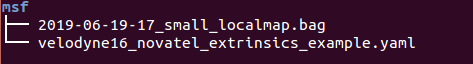
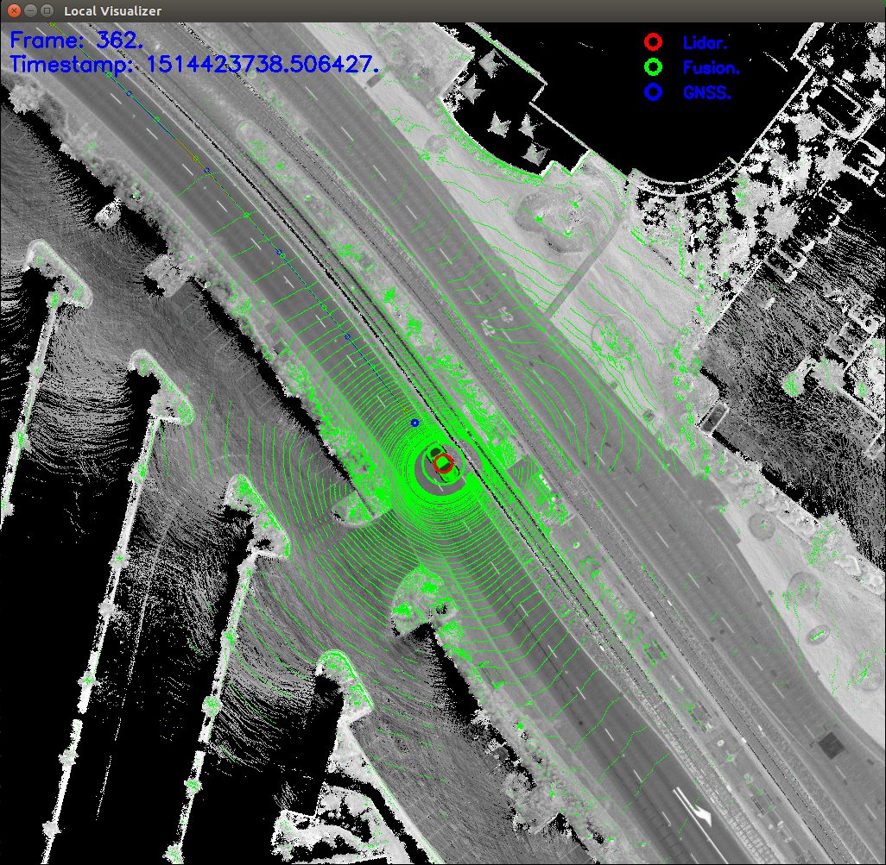

# 封闭园区自动驾驶搭建--定位地图制作
多传感器融合定位(msf)，结合了RTK和激光雷达点云定位，可以提高定位精度，而激光雷达点云定位，则需要提前制作定位地图(local_map),本文将说明开发者套件的定位地图制作方法。
## 注意
   进行定位地图制作前，应首先确保`modules/localization/conf/localization.conf`文件中的`enable_lidar_localization`设置为`false`，待地图制作完成后，再修改为true。
## 录制制作定位地图的bag包

 - 制作定位地图，首先沿着高精地图轨迹录制包含所需数据的bag包，bag需要包含的`topic`如下表所示：

|序号 | topic | 
|---|---|
|1|/apollo/localization/pose | 
|2|/apollo/sensor/gnss/odometry|
|3|/apollo/sensor/gnss/ins_stat|
|4|/apollo/sensor/velodyne16/compensator/PointCloud2|

 - 由于GNSS设备的限制，`/apollo/sensor/gnss/odometry`、`/apollo/sensor/gnss/ins_stat`这两个`topic`不能由GNSS设备直接给出，需要借助`/apollo/modules/tools/sensor_calibration/`下的两个脚本工具。在`localization`模块正常启动且输出`/apollo/localization/pose`数据时，在不同终端分别执行`python modules/tools/sensor_calibration/ins_stat_publisher.py`、`python modules/tools/sensor_calibration/odom_publisher.py`两个命令，便可以分别产生`/apollo/sensor/gnss/ins_stat`、`/apollo/sensor/gnss/odometry`这两个`topic`。
 - 注意，在执行`sensor_calibration/ins_stat_publisher.py`脚本前，请务必检查`/apollo/sensor/gnss/best_pose`中GPS信号质量，确保GPS信号质量为`NARROW_INT`时，才可以使用`ins_stat_publisher.py`脚本。

## 生成定位地图
 - 在apollo根目录下创建文件夹(这里以`msf`)为例，将上文中制作完成的bag包，标定后的lidar外参文件放置到该文件夹中，文件结构如下图所示：

	

 - 执行`msf_simple_map_creator.sh`脚本，输入参数分别为bag包绝对路径、lidar外参文件、当地utm-zone、lidar型号。例如：

```
budaoshi@in_dev_docker:/apollo$ bash scripts/msf_simple_map_creator.sh /apoll
o/msf/ /apollo/msf/velodyne16_novatel_extrinsics_example.yaml 50 16
```

 - 注意，执行该脚本时，需要给绝对路径，utm-zone需要根据当地所处位置给定，北京地区为50，16代表lidar_type为16线激光雷达，如果不给定lidar_type参数，则会使用默认值64。
 - 定位地图制作成功后，会在创建的`msf`文件夹中生成`lossy_map`文件夹，将该目录复制到高精地图目录，并重命名为`local_map`，至此，定位地图制作完成。

## 可视化定位（定位地图验证）
 - 前提：车辆处在上文制作的定位地图范围内，`GPS`、`Localization`模块正常启动，`lidar`正常启动。
 - 执行`localization_online_visualizer.sh`脚本，会生成一个可视化界面，检查是否有灰度地图信息，右上角是否有`Lidar`，`Fusion`、`GNSS`信息，并检查激光雷达点云是否与灰度地图重合。正确的结果如下图所示：

	

 - 打印 `/apollo/localization/msf_status`，topic中的参数满足如下状态表示msf定位正常。

	|参数 | 状态 |   
	|---|---|
	| `fusion_status`| VALID |
	|`gnss_status`|OK|
	|`lidar_status`|OK|

## 常见问题
 
 -  在运行可视化工具`localization_online_visualizer.sh`时出现卡顿，可使用如下命令重新编译可视化工具

	```
	cd /apollo
	bazel build -c opt //modules/localization/msf/local_tool/local_visualization/online_visual:online_local_visualizer
	```

 - 执行可视化工具后，不显示灰度地图(上文制作的定位地图)。
使用`build_opt`命令重新编译工程：
	```
	cd /apollo
	bash apollo.sh clean
	bash apollo.sh build_opt
	```
 - 点云信息与灰度地图不重合
检查`modules/calibration/data/ch`目录下的外参文件是否正确，以及`global_flagfile.txt`文件中的外参文件是否配置正确。

 