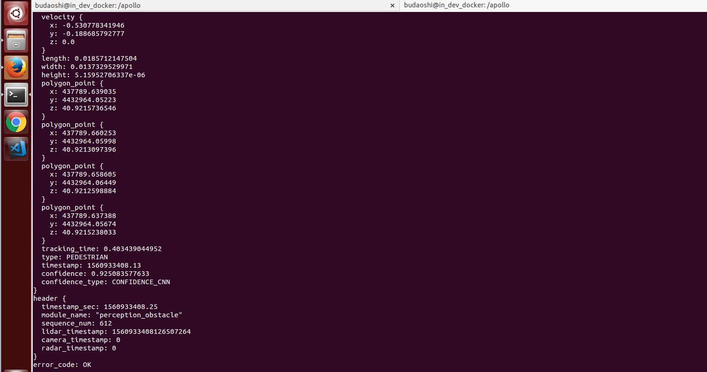

# 封闭园区自动驾驶搭建--感知适配
## 前提条件

 1. 正确配置了gnss、imu，GPS、Localization模块能正常启动。
 2. 正确的按照文档完成了感知设备的集成和标定。
 3. 存在高精地图
## 配置文件的修改
|修改文件名称 | 修改内容 | 对应的gflag参数 | 作用 | 
|---|---|---|---|
| `global_flagfile.txt`|添加 `--lidar_extrinsics_file=modules/localization/msf/params/velodyne_params/velodyne16_novatel_extrinsics_example.yaml`| `localization_gflags.cc`：`lidar_extrinsics_file`|定义lidar外参文件 |
|`global_flagfile.txt` |添加`--lidar_height_file=modules/localization/msf/params/velodyne_params/velodyne16_height.yaml` |`localization_gflags.cc`：`lidar_height_file` | 定义lidar到地面高度文件|
|`global_flagfile.txt`  |添加`--half_vehicle_width=0.43` | `config_gflags.cc`：`half_vehicle_width` | 修改车辆的宽度信息|

 注意：这些配置重新启动DV即可生效，无需重新编译。
## 感知训练模型文件的设置
 1. 将`/modules/perception/model`目录下的`hdmap_roi_filter_config.pb.txt`文件的`range`选项修改为30。
 2. 将`/modules/perception/model`目录下的`probabilistic_fusion_config.pb.txt`文件的`publish_sensor`修改为 `velodyne_16`。
 3. 将`/modules/perception/conf`目录下的`dag_streaming.config`文件中的`Lidar64ProcessSubnode`替换为`Lidar16ProcessSubnode`，`device_id:velodyne64`替换为`device_id:velodyne16`。

注意：这些设置文件改动后需要重新用gpu方式编译，才可生效
## 感知开环验证及测试
把车辆开到户外，手动控制车辆，看感知是否有数据。
1. 进入docker环境，用gpu编译项目，编译项目，启动Dreamview 

```
    cd apollo
    bash docker/scripts/dev_start.sh
    bash docker/scripts/dev_into.sh
    bash apollo.sh build_gpu
    bash scripts/bootstrap.sh
```

2. 在浏览器中打开(http://localhost:8888), 选择车辆相应配置（ch）并选择相应高精地图，在module Controller标签页启动gps、localization、Radar模块。
3. 用以下命令启动激光雷达 

```
    bash scripts/velodyne_16.sh
```

4. 适当的动一下小车，并用以下命令查看topic 

```
    rostopic echo /apollo/localization/pose
    #如果有正常输出就查看下一条topic 
    rostopic echo /tf_static #确保里面child_frame_id是velodyne16
    rostopic echo /apollo/sensor/velodyne16/compensator/PointCloud2 #确保有点云输出
```

5. 在DreamView上启动perception模块，打印障碍物topic，并在dreamview上查看障碍物信息

```
    rostopic echo /apollo/perception/obstacles
```

查看车前方10米处运动的人或者自行车（自行车上要有人），在DreamView上查看障碍物颜色以及位置速度信息（自行车青蓝色，人黄色），如下图所示

打印出的topic信息如下图所示

如果在dreamview上能看到障碍物并且obstacles topic有障碍物信息，则开环测试通过。