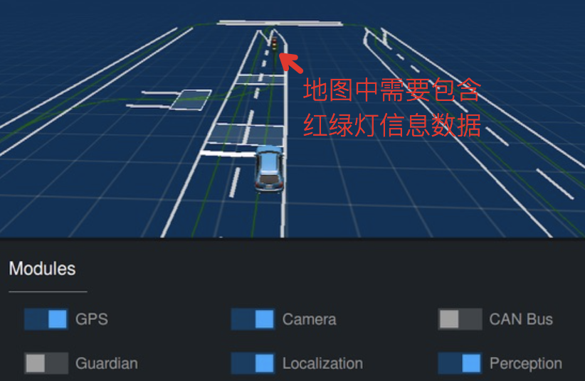
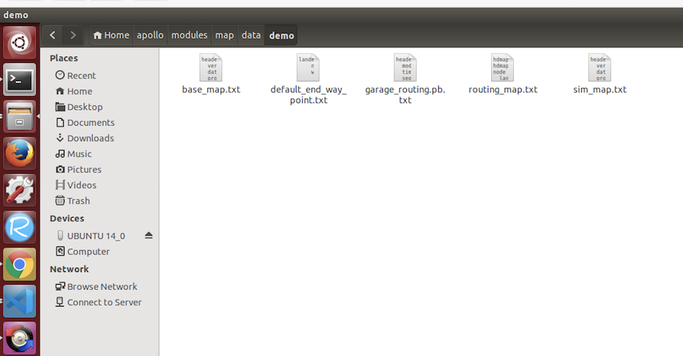
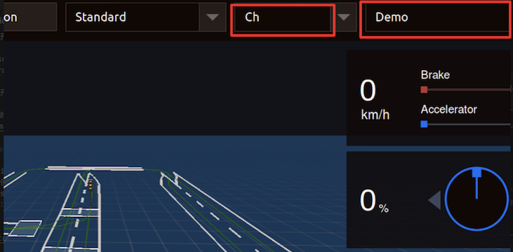
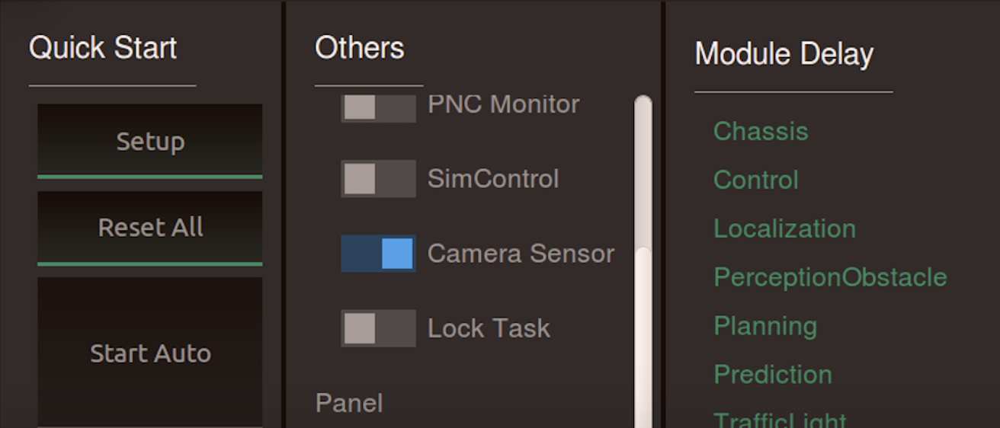
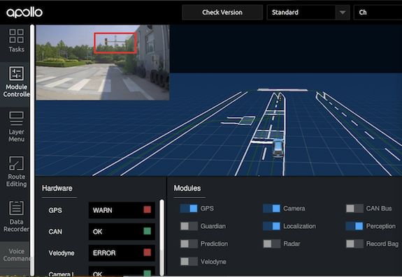
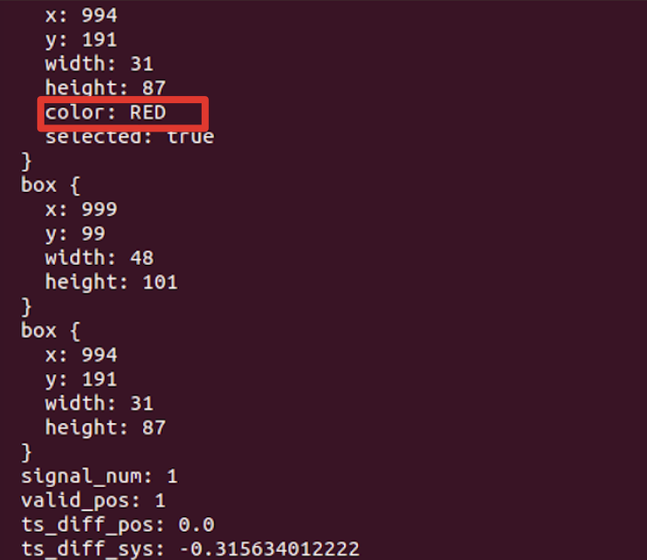
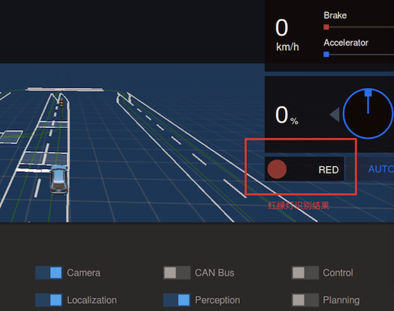

# 封闭园区自动驾驶搭建--红绿灯感知适配

## 前提条件

### 硬件准备：
  
   1 开发套件

   2 摄像头（6mm, 12mm)、GPS-IMU、工控机等硬件、CAN卡等

   3 空旷安全的红绿灯道路口测试场地
       
### 软件准备：

   1 包含待适配的红绿灯路口相关信息的高精度地图，参见下图（如果没有高精度地图，需要制作，可以联系百度商务。）

   

   2 摄像头内外参标定已经完成，摄像头可以正常输出数据。


## 操作步骤

### 拷贝高精地图文件
  
在/apollo/modules/map/data/目录下新建一个文件夹（该文件夹名称即为我们要使用的地图名称）, 例如我们本次地图叫做Demo。拷贝我们的地图数据文件到该目录下，如下图所示。


### 进入apollo docker环境

进入apollo目录，执行以下命令，进入docker，
```
bash docker/scripts/dev_start.sh
bash docker/scripts/dev_into.sh
```


### 打开dreamview,并选择车型和地图

执行以下命令打开dreamview
```
cd /apollo/scripts
bash bootstrap.sh
```
在浏览器中，打开dreaview，选择车型（例如Ch)并选择使用的地图，
例如我们实验中的地图叫Demo


### 打开摄像头模块

点击选择dreaview页面里左侧的Tasks，在页面里的Others 点击SimControl，使Simcontrol变成蓝色，然后点击Camera Sensor使Camera Sensor也变成蓝色，然后再点击Simcontrol关掉它，最后的结果如下图：




只需要保证上图中Camera Sensor打开（前面按钮变为蓝色）就可以了，左上角如果暂时没有出现摄像头的画面也没有关系，继续往下操作

点击选择左侧的Module Controller，在页面中点击Camera, 等几秒钟，左上角就应该有摄像头拍摄到的画面，如下图所示：


为确保摄像头数据无误，我们也可以在命令行中输入以下命令查看：
```
rostopic echo /apollo/sensor/camera/front_6mm/image
rostopic echo /apollo/sensor/camera/front_12mm/image

```
当摄像头模块数据正确时，将会有大量数据输出并刷屏，按Ctrl + C结束观看。

### 打开定位模块

在dreamview界面中点击选择左侧的Module Controller，在页面中打开GPS, Localization。此时界面中的GPS和Localization模块按钮会变成蓝色，为了确保定位数据已经准备好，我们还需要在命令行中查看两个topic的数据：
输入以下命令：
```
rostopic echo /apollo/sensor/gnss/best_pose
```
其中的sol_type为NARROW_INT表示GPS信号良好。
输入以下命令：
```
rostopic echo /apollo/localization/pose
```
会输出很多带有z,y,z坐标的数据，不断更新刷屏，如果还没有，说明定位信号还没有准备好，请耐心等待2分钟。


### 打开感知模块

在dreamview界面中点击选择左侧的Module Controller，在页面中打开Perception。此时界面中的Perception模块按钮会变成蓝色


### 验证红绿灯感知结果

用遥控器把车辆开到红绿灯路口前方，让摄像头对准红绿灯。
在命令行中输入以下命令
```
rostopic echo /apollo/perception/traffic_light
```
其中有color一行显示了检测到的当前交通灯颜色，如下图所示




在dreamview界面中右侧部分，也用图像标示出了识别到的交通灯颜色，如下图所示。观察一段时间，当实际红绿灯变化时，验证红绿灯感知识别的准确性。



