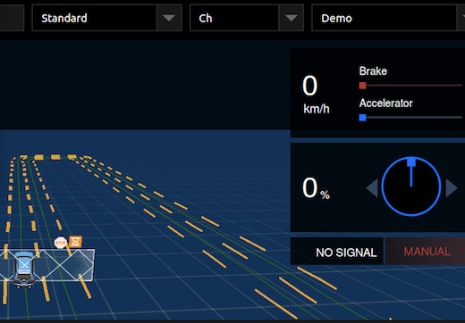
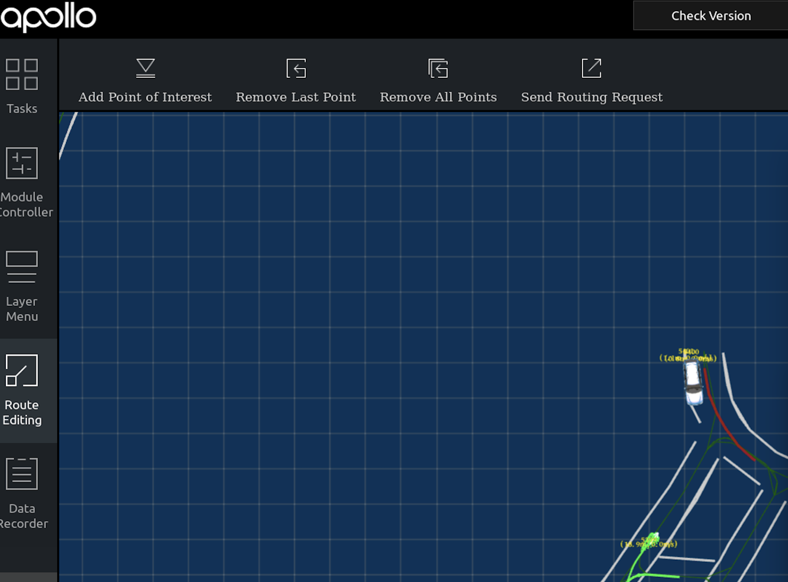
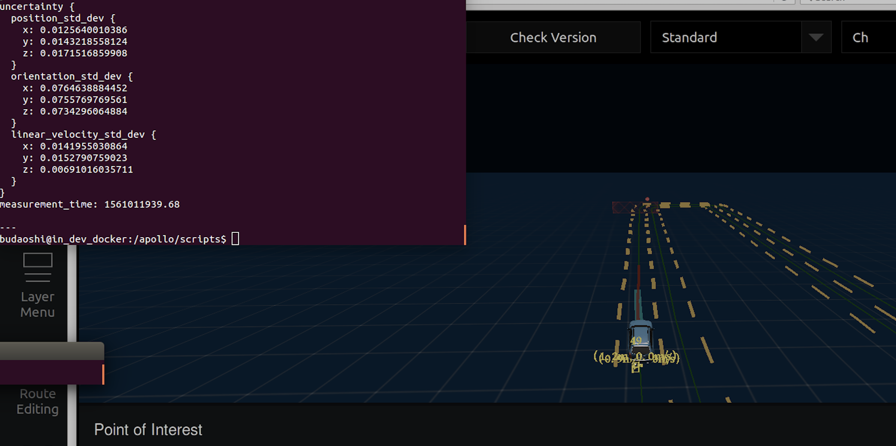

# 封闭园区自动驾驶搭建--如何制作虚拟车道线

## 概述
本文主要介绍制作可供开发套件使用的虚拟车道线进行封闭园区自动驾驶演示。注意这里的虚拟车道线并非高精地图，如需要使用根据真实道路信息制作的高精地图，请联系百度商务

## 前提条件
在制作虚拟车道线之前必须保证环境已经准备好，即Ubuntu已经装好kernel，docker，canbus，gps, 硬件和传感器已经连接好。

1 软件模块： GPS,  canbus, localization

2 硬件环境：搭载apollo系统的开发套件,  米尺

3 场地：相对平直的道路，车道规范，4G信号良好，GPS信号良好

4 参考文档：
/apollo/modules/map/data/README.md

## 虚拟车道线的制作步骤

### 如何生产base_map

1 录制bag包

进入apollo doecker 环境，打开GPS、canbus、localization模块（dreamview中和命令行都可以启动），信号正常后
输入以下命令：
```
cd /apollo/scripts
bash record_bag.sh start
```
遥控器开始开车，让车沿着要生成虚拟车道线的路线匀速缓慢前进，到达既定地方后，停下来。

命令行中输入以下命令：
```
bash record_bag.sh stop
```

此时会在/apollo/data/bag下生成用时间戳命名的.bag文件（以下以bag_file为例）

2 提取轨迹坐标信息

把bag_file复制到/apollo/modules/tools/map_gen目录下，
输入以下命令:

```
python extract_path.py output_file.txt bag_file 
```

其中output_file必须是.txt结尾，不带.txt后续步骤会报错。bag_file可以是多个文件，文件之间空格分开。
这个命令主要完成了从bag包中提取轨迹坐标（ x, y坐标集合 ）放到output_file.txt中，供下一步流程使用。


3 生成base_map
命令: 
```
python map_gen.py  input_file.txt 
```
其中input_file.txt是从extract_path.py生成出来的output_file.txt文件。输出的结果是以map_开头的.txt格式的虚拟车道线数据文件,这就是我们要的base_map文件。

map_gen.py是生成三个车道的虚拟车道线数据文件，要想生成1个车道和两个车道，请使用map_gen_single_lane.py和map_gen_two_lanes_right_ext.py，方法类似。微小差别如下：

map_gen_two_lanes_right_ext.py ：
       需多加一个参数：生成文件名称， .txt结尾

map_gen_single_lane.py ：
       后面还需要多加2个参数：生成文件名（.txt结尾）， 一个数值（代表extra_roi_extention路肩宽度）  

得到输出的.txt文件后，我们还需要其他格式的虚拟车道线数据文件，他们都是从这个文件去转换生成。

### 如何生成sim_map
根据/apollo/modules/map/data/README.md里面的内容，为了需要在dreamview中显示虚拟车道线，我们需要把base_map转换成sim_map。

把前文提到的map_gen生成的map_开头的.txt虚拟车道线数据文件重命名为base_map.txt，放到某个目录，例如 /apollo/modules/map/data/xishan
然后执行./apollo/bazel-bin/modules/map/tools/sim_map_generator –map_dir=/apollo/modules/map/data/xishan --output_dir=/apollo/modules/map/data/xishan

这样在目录/apollo/modules/map/data/xishan下就会生成sim_map.txt和sim_map.bin文件。
### 如何生成routing_map
routing_map用于routing模块，如果没有事先生成routing_map，那么无法正常使用routing模块。

把base_map.txt放到某个目录，例如 /apollo/modules/map/data/xishan
然后执行./scripts/generate_routing_topo_graph.sh  --map_dir
  /apollo/modules/map/data/xishan 

这样在目录/apollo/modules/map/data/xishan下就会生成routing_map.txt和routing_map.bin文件。

## 如何使用虚拟车道线实现自动驾驶
### 拷贝虚拟车道线数据文件
首先要在目录/apollo/modules/map/data/目录下新建一个目录，以新建目录xishan为例,然后把上文中生成的base_map, sim_map,routing_map文件都拷贝到所新建的目录/apollo/modules/map/data/xishan下面。

### 进入apollo并打开相关模块
按标准方法进入apollo docker后,运行如下命令
```
bash bootstrap.sh
```
浏览器中打开dreamview，选择地图(以xishan为例)，选择车辆和模式( 不能选择navigation 模式）, 打开canbus, gps, localization，等待localization信号稳定，把车辆开到虚拟车道线录制路段，就会看到dreamview上面有黄色虚线构成的车道线出现。


### 设置自动驾驶目的地
选择左侧的Route Editing, 在弹出的右侧界面上，有缩小版的地图，上部有一些操作按钮。
点击add point of interest, 然后在虚拟车道线上车辆的前方道路上点击选择一个点。
点击sending routing request, 就会出来一条从车辆到达选择目的点的黄线。如下图所示：


点击左侧的Tasks, 会看到页面中的地图出现一条蓝色的车辆规划线，如下图所示


### 启动自动驾驶
把遥控器的权限释放给车辆，做好接管和处理车辆运行异常的准备（一定确保周围空旷无其他运行车辆行人，保证安全）， 点击start auto，车辆开始自动驾驶。
小心跟随，防止车辆驾驶控制异常，到达既定地点后，遥控接管，结束自动驾驶。

## 结语
这里介绍的是虚拟车道线的制作，但是其功能有限仅能用于演示封闭园区自动驾驶搭建。如果要用基于真实道路信息的高精地图实现复杂的感知能力，如路口红绿灯识别，请联系百度商务咨询高精地图制作服务
