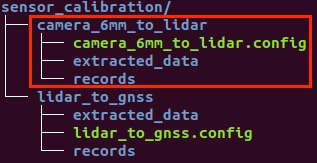

# 摄像头感知设备标定

## 前提条件
 
 - 完成了[循迹自动驾驶演示](Waypoint_Following--Operation_And_Questions_cn.md)
 
 - 完成了[摄像头感知设备集成](Camera_Based_Auto_Driving--Sensor_Integration_cn.md)
 
## 主要步骤
  
- Camera-Lidar标定初始外参测量和内参标定

- Camera-Lidar标定数据包录制

- Camera-Lidar标定数据预处理

- 使用标定云服务生成外参文件

## 修改配置文件
|修改文件名称 | 修改内容 | 
|---|---|
| `modules/localization/conf/localization.conf`|`enable_lidar_localization`为`false`| 
 


**注意**：所有传感器标定完成后，如果用户要使用msf定位，则需要再改为`true`。

## Camera-Lidar标定初始外参测量和内参标定

### 各传感器坐标系的定义及初始化外参文件的配置

#### 1. Lidar、Camera的坐标系定义如下图所示：

 
 
#### 2. Camera坐标系原点在传感器的位置

Camera坐标系原点在下图所示平面的中心点：


#### 3. Lidar坐标系原点在传感器的位置

见[激光雷达感知设备标定](Lidar_Based_Auto_Driving--Sensor_Calibration_cn.md)文档

#### 4. 手动测量Camera-Lidar的初始化外参文件

这里默认用户按照感知设备集成文档的要求正确安装了传感器，即传感器坐标系的定义与上文中的定义相同，且安装误差满足文档中的要求。

 - rotation:在传感器的安装满足感知设备集成文档要求的情况下，用户无需测量该值，可直接使用如下的默认值即可
```
  rotation:
    w: 0.5
    x: -0.5
    y: 0.5
    z: -0.5
```
 - translation:用户需要手动测量以IMU坐标系为基坐标系，以Velodyne16坐标系为目标坐标系的位移变换，一个IMU-Velodyne16的位移变换的示例如下所示：
```
  translation:
    x: 0.67
    y: -0.1
    z: -0.64
```
### 传感器内参标定

内参包含相机的焦距、主点和畸变系数等信息，可以通过一些成熟的相机标定工具来获得，例如 [ROS Camera Calibration Tools](http://wiki.ros.org/camera_calibration/Tutorials/MonocularCalibration) 和 [Camera Calibration Toolbox for Matlab](http://www.vision.caltech.edu/bouguetj/calib_doc/)。

## Camera-Lidar标定数据包录制

开发套件的摄像头有6mm和12mm两种规格，以下步骤以6mm标定为例说明。

#### 1. 准备所需channel

进行Camera-Lidar的标定，需要录制包含传感器信息的数据包作为数据输入，所需的`channel`及`channel频率`如下表所示：

| 模块       | Topic名称                                 |Topic发送频率（Hz）|
| ------------ | ----------------------------------------- | ----------------- |
| 6mm camera | /apollo/sensor/camera/front_6mm/image | 15                 |
| VLP-16    |  /apollo/sensor/lidar16/PointCloud2   | 10            |
| Localization       | /apollo/localization/pose             | 100           |


为获取上述`channel`，需要启动`GPS`、`Localization`、`Camera`三个模块，`GPS`、`Localization`模块的启动请参考[定位模块配置](Waypoint_following--Localization_configuration_cn.md)文档，`Camera`模块的启动请参考[摄像头感知设备集成](Camera_Based_Auto_Driving--Sensor_Integration_cn.md)文档。在正式开始录制前，务必确保以上channel能正常输出数据。

#### 2. 录制数据包

待channel数据正常输出后，可以开始录制数据包。在录制数据的时候，遥控车辆直线慢速行驶行驶，行驶10秒再停止5秒，如此反复5次。

**注意**：需要光照条件好时进行标定，场地需要是直线道路，路侧两边需要有静态参照物，如建筑物、车辆，避免过多动态障碍物，避免大逆光。

## Camera-Lidar标定数据预处理

该步骤将通过提取工具将record数据包中的点云、定位数据和相机数据进行预处理，以方便通过云服务进行在线标定。开发套件的摄像头有6mm和12mm两种规格，以下步骤以6mm标定为例说明。

#### 1. 按照目录结构放置好Camera-Lidar标定数据包

下载[配置样例目录包](sensor_calibration.zip)并放置于apollo根目录下（如在Lidar-GNSS标定中已经下载，可跳过），其目录结构如下：


 
本小节重点关注红色框线中的camera_6mm_to_lidar目录，把前面录制的Camera-Lidar标定数据包放置于`sensor_calibration/camera_6mm_to_lidar/records`目录中。

#### 2. 修改抽取工具配置文件 camera_to_lidar.config

根据实际情况，修改配置文件`camera_to_lidar.config`中预处理数据产出目录（output_path）和待处理数据包目录（record_path）。参考下图：


**注意**：以上目录需要指定绝对路径。

#### 3. 运行数据抽取工具

进入docker环境，执行如下命令：

```
budaoshi@in_dev_docker:/apollo$ cd /apollo/modules/tools/sensor_calibration
budaoshi@in_dev_docker:/apollo/modules/tools/sensor_calibration$ python extract_data.py --config /apollo/sensor_calibration/camera_6mm_to_lidar/camera_6mm_to_lidar.config
```

**注意**：--config参数指定了配置文件路径，必须为绝对路径，用户实际根据情况自行修改。

 等待终端中显示`Data extraction is completed successfully!`的提示代表数据提取成功，提取出的数据被存储到配置文件中指定的`output_path`路径下。运行数据抽取工具后的目录如下图红框所示：
 

 
#### 4. 修改配置文件 sample_config.yaml

修改数据抽取工具生成的sample_config.yaml文件。把`beams`字段取值修改为`16`。

#### 5. 修改初始外参文件extrinsics.yaml

修改数据抽取工具生成的init_params/extrinsics.yaml文件。把前面步骤手动测量的Camera-Lidar标定初始外参信息填入，仅需要填写`translation`字段。

#### 6. 修改初始外参文件intrinsics.yaml

修改数据抽取工具生成的init_params/intrinsics.yaml文件。把内参标定的Camera内参信息填入，仅需要填写`R`、`K`、`D`字段。

修改完之后把`camera_front_6mm_to_lidar16_calibration`目录准备后续待用。

## 使用标定云服务生成外参文件

#### 1. 准备百度云对象存储BOS服务

在使用云标定服务前，需要准备[百度云对象存储BOS服务](https://cloud.baidu.com/product/bos.html)用于存放标定预处理后的数据。

#### 2. 和Apollo开发套件商务联系开通云标定服务账号

#### 3. 上传预处理后的数据至BOS

在BOS bucket中新建目录sensor_calibration，作为后续云标定服务读取数据的`Input Data Path`，把前面预处理生成的数据拷贝至该目录。目录结构如下：


#### 4. 提交云标定任务

打开Apollo云服务页面，如下图：


在New Job下拉框中选择Sensor Calibration选项，根据实际情况填写Partner ID（请与商务联系）、Access Key（按BOS账号实际情况填写）、Secret Key（按BOS账号实际情况填写）、Input Data Path（在本例中为"sensor_calibration"），最后点击Submit Job按钮提交。

#### 5. 获取标定结果验证及标定外参文件

云标定任务完成后，将在注册的邮箱（请与商务联系）中收到一封标定结果邮件。如果标定任务成功，将包含标定结果验证图及标定外参文件。

 **Camera-Lidar标定结果验证**：
 邮件中附带标定结果验证图片。在产生的点云投影图像内，可寻找其中具有明显边缘的物体和标志物，查看其边缘轮廓对齐情况。如果50米以内的目标，点云边缘和图像边缘能够重合，则可以证明标定结果的精度很高。反之，若出现错位现象，则说明标定结果存在误差。当误差大于一定范围时（范围依据实际使用情况而定），该外参不可用。如下图所示，图1为准确外参的点云投影效果，图2为有偏差外参的点云投影效果。
 
 


 **Camera-Lidar标定外参文件**：

确认邮件得到的外参文件合理后，进行如下操作： 

 -  将邮件得到的内参文件重命名为`front_6mm_intrinsics.yaml`，并替换`modules/calibration/data/dev_kit/camera_para/`目录下的文件，将邮件发送的外参文件的`rotation`、`translation`的值替换掉`modules/calibration/data/dev_kit/camera_params/front_6mm_extrinsics.yaml`中对应的`rotation`、`translation`值。注意不要修改`frame_id`。

 - 如标定12mm摄像头，则需要修改`modules/calibration/data/dev_kit/camera_para`目录下`front_12mm_intrinsics.yaml`、`front_12mm_extrinsics.yaml`两个文件。
 
 - 默认使用1个6mm、1个12mm摄像头，用户如需要使用第二个6mm摄像头时，需要自行指定文件名，并进行相应修改。
