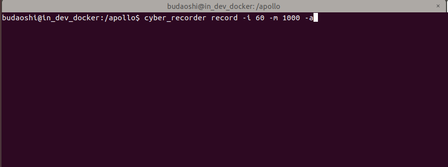
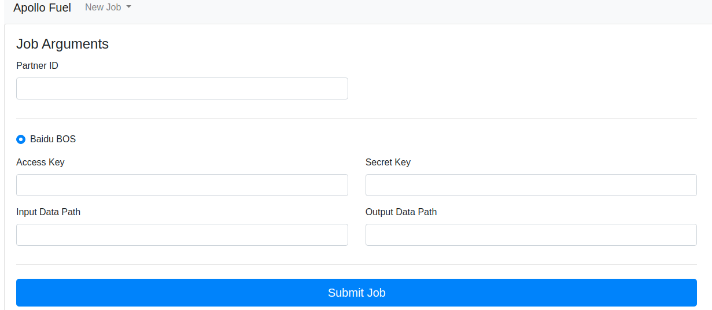

# 激光雷达感知设备标定

## 前提条件
 
 - 完成了[循迹自动驾驶演示](Waypoint_Following--Operation_And_Questions_cn.md)
 
 - 完成了[激光雷达感知设备集成](Lidar_Based_Auto_Driving--Sensor_Integration_cn.md)
 
## 主要步骤
  
- Lidar-GNSS标定初始外参测量

- Lidar-GNSS标定数据包录制

- Lidar-GNSS标定数据预处理

- 使用标定云服务生成外参文件

## 修改配置文件

|修改文件名称 | 修改内容 | 
|---|---|
| `modules/localization/conf/localization.conf`|`enable_lidar_localization`为`false`| 


**注意**：所有传感器标定完成后，如果用户要使用msf定位，则需要再改为`true`。

## Lidar-GNSS标定初始外参测量

### 各传感器坐标系的定义及初始化外参文件的配置

####  1.  IMU、Lidar的坐标系定义如下图所示：

 

#### 2. Lidar坐标系原点在传感器的位置

Lidar坐标系原点位于Lidar底部向上37.7mm的平面所在的中心点，如下图所示 (注意：下图仅为表示坐标系圆点，坐标系的定义以上图中的定义为准)


#### 3. IMU坐标系原点在传感器的位置

IMU坐标系原点位于IMU的几何中心上(中心点在Z轴方向上的位置为IMU高度的一半，在XY轴上的位置已在IMU上标出，如下图所示)

 
 
#### 4. 手动测量Lidar-GNSS的初始化外参文件

这里默认用户按照感知设备集成文档的要求正确安装了传感器，即传感器坐标系的定义与上文中的定义相同，且安装误差满足文档中的要求。 

 - rotation:在传感器的安装满足感知设备集成文档要求的情况下，用户无需测量该值，可直接使用如下的默认值即可
 
```
  rotation:
    w: 0.7071
    x: 0.0
    y: 0.0
    z: 0.7071
```

 - translation:用户需要手动测量以IMU坐标系为基坐标系，以Velodyne16坐标系为目标坐标系的位移变换，一个IMU-Velodyne16位移变换的示例如下所示：
 
```
  translation:
    x: 0.0
    y: 0.38
    z: 1.33
```

## Lidar-GNSS标定数据包录制

#### 1. 准备标定所需channel

 进行Lidar-GNSS的标定，需要录制包含传感器信息的数据包作为数据输入，所需的`channel`及`channel频率`如下表所示：

| 模块       | Topic名称                                  | Topic发送频率（Hz） |
| --------- | ---------------------------------------- | ------------- |
| VLP-16    |  /apollo/sensor/lidar16/PointCloud2   | 10            |
| Localization       | /apollo/localization/pose             | 100           |

为获取上述`channel`，需要启动`GPS`、`Localization`、`Velodyne`三个模块，`GPS`、`Localization`模块的启动请参考[定位模块配置](Waypoint_Following--Localization_Configuration_cn.md)文档，Velodyne`模块的启动请参考[激光雷达感知设备集成](Lidar_Based_Auto_Driving--Sensor_Integration_cn.md)文档。

**注意**：在正式开始录制前，务必确保以上channel能正常输出数据。

#### 2. 使用Apollo录制数据包的方法

 - 确保相关模块正常启动，想要录制的channel数据能正常输出
 
 - 打开新的终端，并使用如下命令进入docker环境
 
 ``` 
 budaoshi@budaoshi:~/apollo$ bash docker/scripts/dev_into.sh
 ```
 
 - 在上一步新打开的终端中，输入如下命令，开始录制数据包
 


其中， `-i 60`表示每60秒分割一次数据包，`-m 1000`代表每1000M分割一次数据包，`-a`代表录制所有channel，具体数值用户可自行指定，更多信息可使用`cyber_recorder record -h`命令查看：


 - 录制完成后，使用`Ctrl + C`停止录制，在Apollo代码根目录下会生成数据包。 

#### 3. 录制数据包

待channel数据正常输出后，可以开始录制数据包。录制期间，需要控制车辆以8字形轨迹缓慢行驶，并使转弯半径尽量小 ，至少包含5圈完整的8字轨迹数据。


**注意**：场地周围需要有静态参照物，如电线杆、建筑物、车辆，避免过多动态障碍物。

## Lidar-GNSS标定数据预处理

该步骤将通过提取工具将record数据包中的点云和定位数据进行预处理，以方便通过云服务进行在线标定。

#### 1. 按照目录结构放置好Lidar-GNSS标定数据包

下载[配置样例目录包](sensor_calibration.zip)并放置于apollo根目录下，其目录结构如下：

 
 
本小节重点关注红色框线中的lidar_to_gnss目录，把前面录制的Lidar-GNSS标定数据包放置于`sensor_calibration/lidar_to_gnss/records`目录中。

#### 2. 修改抽取工具配置文件 lidar_to_gnss.config

根据实际情况，修改配置文件`lidar_to_gnss.config`中预处理数据产出目录（output_path）和待处理数据包目录（record_path），参考下图：


**注意**：以上目录需要指定绝对路径。

#### 3. 运行数据抽取工具

**进入docker环境**，执行如下命令：

```
budaoshi@in_dev_docker:/apollo$ cd /apollo/modules/tools/sensor_calibration
budaoshi@in_dev_docker:/apollo/modules/tools/sensor_calibration$ python extract_data.py --config /apollo/sensor_calibration/lidar_to_gnss/lidar_to_gnss.config
```

**注意**：--config参数指定了配置文件路径，必须为绝对路径，用户根据情况自行修改。

 等待终端中显示`Data extraction is completed successfully!`的提示代表数据提取成功，提取出的数据被存储到配置文件中指定的`output_path`路径下。运行数据抽取工具后的目录如下图红框所示：
 
 
 
#### 4. 修改云标定配置文件 sample_config.yaml

修改数据抽取工具生成的sample_config.yaml文件。把前面步骤手动测量的Lidar-GNSS标定初始外参信息填入，仅需要填写`translation`字段。修改完之后把`lidar16_to_gnss_calibration`目录准备后续待用。

##使用标定云服务生成外参文件

#### 1. 准备百度云对象存储BOS服务

在使用云标定服务前，需要准备[百度云对象存储BOS服务](https://cloud.baidu.com/product/bos.html)用于存放标定预处理后的数据。

#### 2. 和Apollo开发套件商务联系开通云标定服务账号

#### 3. 上传预处理后的数据至BOS

在BOS bucket中新建目录sensor_calibration，作为后续云标定服务读取数据的`Input Data Path`，把前面预处理生成的数据拷贝至该目录。目录结构如下：


#### 4. 提交云标定任务

打开Apollo云服务页面，如下图：



在New Job下拉框中选择Sensor Calibration选项，根据实际情况填写Partner ID（请与商务联系）、Access Key（按BOS账号实际情况填写）、Secret Key（按BOS账号实际情况填写）、Input Data Path（在本例中为"sensor_calibration"），最后点击Submit Job按钮提交。

#### 5. 获取标定结果验证及标定外参文件

云标定任务完成后，将在注册的邮箱（请与商务联系）中收到一封标定结果邮件。如果标定任务成功，将包含标定结果验证图及标定外参文件。

 **Lidar-GNSS标定结果验证**：

 - 邮件中附带标定结果验证。邮件中包含了后缀名为.pcd的点云文件，使用点云查看工具检查pcd文件，如果点云文件中周围障碍物清晰、锐利，边缘整齐表示标定结果准确，否则请重新标定。 
 

 
 - 在ubuntu系统下，可以使用`pcl-tools`工具查看点云文件
	
	sudo apt-get update
	sudo apt-get install pcl-tools
	pcl_viewer xxx.pcd

 **Lidar-GNSS标定外参文件**：
 
确认邮件得到的外参文件合理后，将邮件发送的外参文件的`rotation`、`translation`的值替换掉`modules/calibration/data/ch/velodyne_params/velodyne16_novatel_extrinsics.yaml`中对应的`rotation`、`translation`值。注意不要修改`frame_id`。