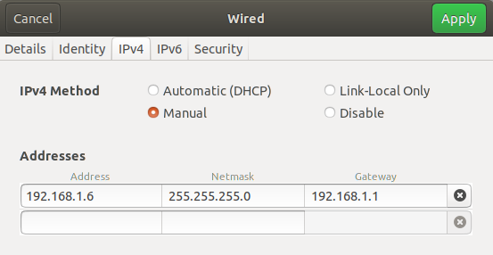
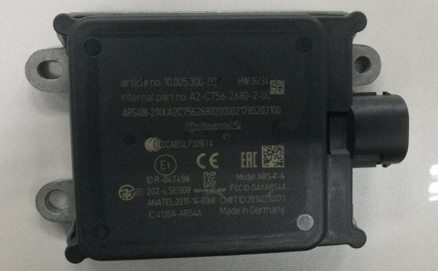
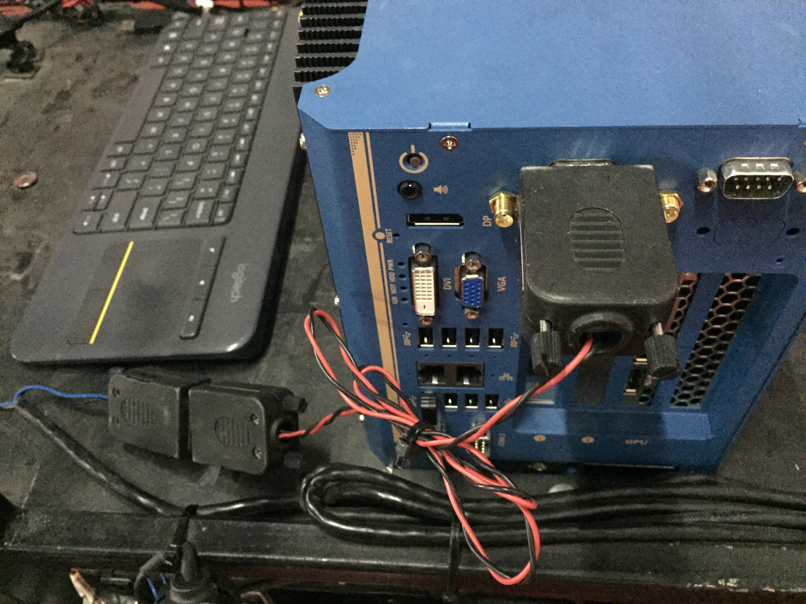

# 激光雷达感知设备集成

## 前提条件

 - 完成了[循迹自动驾驶演示](Waypoint_Following--Operation_And_Questions_cn.md)
 
## 主要步骤

 - 激光雷达安装配置与数据验证
 
 - 毫米波雷达安装配置与数据验证
 
## 激光雷达安装与数据验证

 - 激光雷达型号：80-VLP-16（velodyne 16线激光雷达）
 
 - 更多详细参数可参考：[https://velodynelidar.com/vlp-16.html](https://velodynelidar.com/vlp-16.html)
 


### 激光雷达的安装固定
 
 - 16线激光雷达要牢靠固定安装在车顶部，建议激光雷达对地高度1.5～1.8米，水平放置，精度在2度以内。安装位置如下图：
 


 - 安装激光雷达时线缆方向朝向车辆的正后方。

### 激光雷达与车辆的接线

请按照以下步骤进行激光雷达一拖三线缆的安装。

#### 1.线缆端口及定义


|端口号 | 端口名称 | 
|---|---|
|端口1 | 8pin公头 | 
|端口2 | 授时接口  | 
|端口3 | 网线接口| 
|端口4 | 12V+接口 | 
|端口5 | GND接口 | 

#### 2.确保整车断电

#### 3.将端口1(8pin公头)与激光雷达本体上的8pin母头连接

连接完成后，效果如下图所示：


#### 4.将激光雷达电源接口(端口4、端口5)接入车上的12V接线盒

 - 注意：电源接反会烧毁激光雷达
 
 - 将端口4(12V+)接入车上12V电源接线盒的12V+
 
 - 将端口5(GND)接入车上12V电源接线盒的GND


#### 5.将端口2(授时)与IMU的授时端口相连

 - 端口具有防反插功能，请确认正反后再进行连接

#### 6.将端口3(网线接口)通过网线与工控机相连

 - 通过网线，将工控机上的Ethernet接口与端口3连接
 
 - 工控机有两个Ethernet接口，一个用于给工控机上网，一个用于连接激光雷达，用户自行指定即可

#### 7.再次确认上述安装步骤

 - 请务必再次确认正确执行了上述安装步骤，电源线接反会烧毁激光雷达，确认无误后才可以上电，至此激光雷达线束接线完成

### 激光雷达的配置及启动
 
#### 1.修改工控机IP地址

 - 激光雷达的默认IP地址是192.168.1.201，通过网线与工控机Ethernet接口连接，将该Ehternet接口的IP修改为固定IP，且与激光雷达IP处在同一网段，即`192.168.1.xx`，一个示例配置如下图所示：
 


 - 激光雷达的相关参数配置：在浏览器中输入激光雷达ip地址，打开激光雷达配置界面， 将`Host IP Address`修改为`255.255.255.255`，将`Data Port`修改为2369，将`Telemetry Port`修改为8309，点击`set` 按键、`Save Configuration`按键保存配置。 
 


#### 2.修改`modules/transform/conf/static_transform_conf.pb.txt`文件

使用`modules/calibration/data/dev_kit/Config_files/static_transform_conf.pb.txt`替换`modules/transform/conf/static_transform_conf.pb.txt`文件。


### 激光雷达数据的验证

 在完成上述配置后，可以使用以下方法验证激光雷达能否正常工作：
 
 - 在室外，GPS信号良好的场地，启动`GPS`、`Localization`、`Transform`模块
 
 - 使用如下命令启动激光雷达
 
```
budaoshi@in_dev_docker:/apollo$ cyber_launch start modules/drivers/velodyne/launch/velodyne16.launch 
```

 - 打开新的终端，并使用`bash docker/scripts/dev_into.sh`命令进入docker环境，在新终端中输入`cyber_monitor`命令，查看是否有`/apollo/sensor/lidar16/PointCloud2`、`/apollo/sensor/lidar16/Scan`、`/apollo/sensor/lidar16/compensator/PointCloud2`三个channel，并使用上下方向键选择channel，使用右方向键查看channel详细数据，数据无异常则说明激光雷达适配成功
 


## 毫米波雷达安装与数据验证

 - 毫米波雷达型号：continental AS 408-21
 
 - continental AS 408-21简介：ARS408-21 是大陆 40X 毫米波雷达传感器系列中最新推出的高端产品，可以适用于不同的应用场景。ARS 408-21 很好的处理了测量性能与高安全性之间的矛盾，可实时检测目标的距离并根据当前车速判断是否存在碰撞风险可靠；具有自动故障检测功能，可识别传感器问题，并自动输出故障码鲁棒、轻量化设计；通过使用相对简单的雷达测量技术，以及在汽车行业的深度研发和批量生产基础，可以保证产品鲁棒和轻量化性能。
 


### 毫米波雷达接口及线序

 - continental AS 408-21传感器采用12V直流供电，使用CAN通信接口。使用时，通过如下图所示的连接线缆将传感器CAN通信接口与Apollo的CAN1口连接，电源接口接入12V直流电源(车辆上提供12V电源接线盒)，注意正负极。
 
 
 
 - 传感器接口及定义如下图所示：其中，端口1接12V直流电源；端口8接GND；端口4接CAN_L；端口7接CAN_H。
 
 
 
 
 
 - 毫米波雷达CAN接口与工控机的CAN1接口连接，如下图所示：
 
  
  
### 毫米波雷达的安装固定

 - 传感器应安装在车前方中心处，当人正向面对车辆正前方时，传感器的正面朝向人，传感器的连接口朝向人的右手边，如下图所示：
 
 
 
 
 
  - 毫米波雷达要牢靠固定在车身上，连接到毫米波雷达的接头要牢靠接插。离地面高0.5米，不能向下倾斜，向上仰0-2度以内，高度误差±0.2米，俯仰角误差0-2度（向上仰小于2度，不能向下倾斜），翻滚角误差±2度（radar左右两侧的平齐程度），航向角误差±2度（radar是否正对前方）。
  
### 毫米波雷达的配置及启动

 - 传感器参数的配置：该传感器配置文件位于`/apollo/modules/drivers/radar/conti_radar/conf/`目录下，需要根据实际情况进行配置。 
 
 - 由于使用的是socket can， 并且只安装了前向毫米波雷达，所以在radar_front_conf.pb.txt和contiar_conf.pb.txt中，我们需要如下配置：
 
```
  can_card_parameter {
    brand:SOCKET_CAN_RAW
    type: PCI_CARD
    channel_id: CHANNEL_ID_ONE
  }
```

另外，我们还需要在配置文件les/drivers/radar/contiradar/dag/conti_radar.dag删除后向毫米波雷达（rear components）的相关配置，否则，由于后向毫米波雷达使用的can 2，而我们的socket can没有can 2将会导致canbus无法正常启动。

- 正确启动Apollo及DreamView，选择车辆型号及运行模式，并打开`radar`模块开关，如下图所示：


- 输入`cyber_monitor`命令，应显示`/apollo/sensor/conti_radar`话题，如下图所示：

> **图片是ros操作命令，非Cyber**


- 按键盘上下键选择该话题并按回车键，显示该话题，如下图所示：


 - 主要参数的含义如下表所示：
 
	|参数 | 含义 | 
	|---|---|
	|`longitude_dist`   | 距目标的纵向距离 | 
	| `lateral_dist`   | 距目标的横向距离 | 
	|`longitude_vel`   | 目标的纵向速度   | 
	| `lateral_vel`   |  目标的横向速度  | 
	
### 毫米波雷达数据的验证

 - 纵向距离(`longitude_dist`)/横向距离(`lateral_dist`)的验证：该传感器默认使用`长距离`模式，检测距离为0.2~250m，在车辆正前方检测距离范围内，分别放置障碍物，查看`/apollo/sensor/conti_radar`话题中的`longitute_dist`、`lateral_dist`数据是否正常(单位m)。下图中红色部分为长距离模式下传感器检测范围，误差在+/-0.4m内为正常。
 


 - 纵向速度(`longitude_vel`)/横向速度(`lateral_vel`)的验证：使得目标物体以固定速度在检测范围内运动，检测数据是否在误差允许有范围内。
 
 - 该传感器各项参数的测量范围及分辨率如下图所示：
 
 	