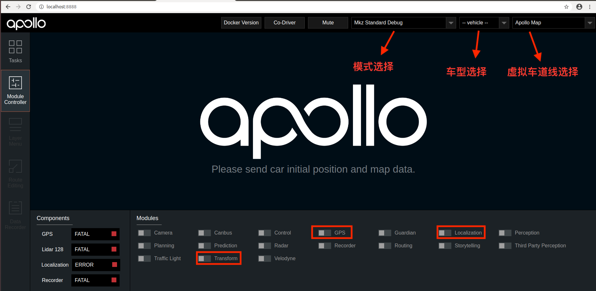
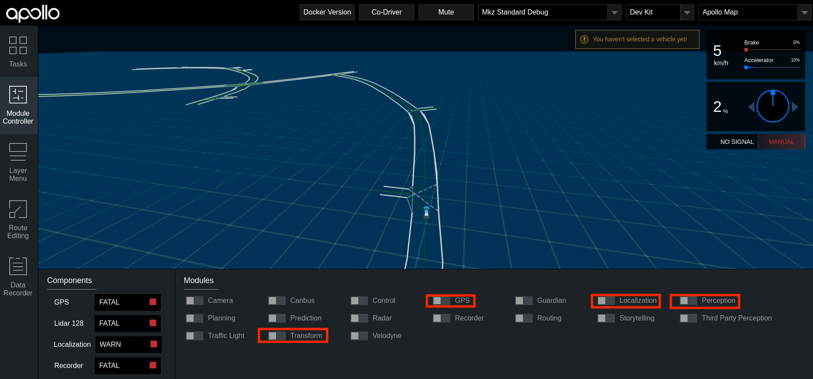
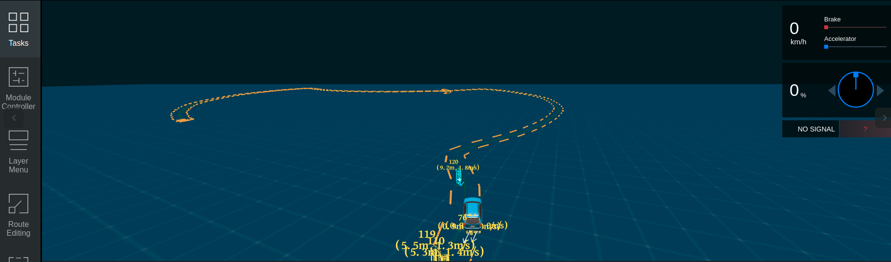

# 基于激光雷达的封闭园区自动驾驶搭建--感知适配

- [基于激光雷达的封闭园区自动驾驶搭建--感知适配](#基于激光雷达的封闭园区自动驾驶搭建--感知适配)
  - [概览](#概览)
  - [前提条件](#前提条件)
  - [配置文件的修改](#配置文件的修改)
  - [启动Lidar感知](#启动lidar感知)
      - [1. 编译项目，启动Dreamview](#1-编译项目启动dreamview)
      - [2. 启动所需模块](#2-启动所需模块)
      - [3. 检查各模块channel是否正确](#3-检查各模块channel是否正确)
      - [4. 启动Lidar感知](#4-启动lidar感知)
  - [验证Lidar感知效果](#验证lidar感知效果)
  - [NEXT](#next)
  - [常见问题](#常见问题)
      - [1. 感知的输出帧率达不到10帧](#1-感知的输出帧率达不到10帧)
      - [2. 感知的障碍物位置与实际障碍物误差较大](#2-感知的障碍物位置与实际障碍物误差较大)
## 概览
该用户手册旨在帮助用户完成激光雷达感知适配，实现Lidar感知

## 前提条件

 1. 正确完成了[循迹搭建--车辆循迹演示](../Waypoint_Following/Start_Waypoint_Following_cn.md)

 2. 正确完成了[基于激光雷达的封闭园区自动驾驶搭建--感知设备集成](Sensor_Integration_cn.md)
 
 3. 正确完成了[基于激光雷达的封闭园区自动驾驶搭建--感知设备标定](Sensor_Calibration_cn.md)

## 配置文件的修改

|序号 | 待修改文件 | 修改内容 | 
|---|---|---|
|  1 | `modules/common/data/global_flagfile.txt` |  添加`--half_vehicle_width=0.43` |
|  2 | `modules/perception/production/launch/dev_kit_perception.launch` |重命名为`perception.launch` 并替换原`perception.launch`文件  |
|  3 | `modules/perception/production/dag/dev_kit_dag_streaming_perception.dag` | 重命名为`dag_streaming_perception.dag` 并替换原`dag_streaming_perception.dag`文件|

## 启动Lidar感知

把车辆开到户外，手动控制车辆，看感知是否有数据。

#### 1. 编译项目，启动Dreamview
进入docker环境，用gpu编译项目，启动Dreamview 

    cd apollo
    bash docker/scripts/dev_start.sh
    bash docker/scripts/dev_into.sh
    bash apollo.sh build_opt_gpu
    bash scripts/bootstrap.sh

#### 2. 启动所需模块
在浏览器中打开`(http://localhost:8888)`，选择模式为`Mkz Standard Debug`， 选择车型为`dev_kit`并选择相应高精地图，在Module Controller标签页启动GPS、Localization、Transform模块。

使用如下命令启动16线激光雷达

    budaoshi@in_dev_docker:/apollo$ cyber_launch start modules/drivers/velodyne/launch/velodyne16.launch

#### 3. 检查各模块channel是否正确
在docker环境内打开新的终端并输入`cyber_monitor`命令启动`cyber_monitro`工具，并检查各模块的channel是否正常（使用`上下方向键`选择channel，使用`右方向键`查看channel详细信息）：
	
|channel_name | 检查项目 | 
|---|---|
| `/apollo/localization/pose`| 确保能正常输出数据 | 
|`/apollo/sensor/gnss/best_pose` | 确保能正常输出数据、`sol_type:` 选项显示为`NARROW_INT`   |
|`/apollo/sensor/lidar16/PointCloud2` | 确保能正常输出数据|
|`/apollo/sensor/lidar16/Scan`| 确保能正常输出数据|
| `/apollo/sensor/lidar16/compensator/PointCloud2`  | 确保能正常输出数据 |
|`/tf`|确保能正常输出数据|
|`/tf_static`|确保能正常输出数据|

#### 4. 启动Lidar感知
确认各模块正常启动且channel输出正常后，在DreamView上启动Lidar感知模块(Perception模块)，使用`cyber_monitor`查看`/apollo/perception/obstacles`是否正常输出

## 验证Lidar感知效果

查看车前方10米处运动的人或者自行车（自行车上要有人），在DreamView上查看障碍物颜色以及位置速度信息（自行车青蓝色，行人黄色，车辆绿色），如下图所示：

`/apollo/perception/obstacles`的数据如下图所示：

如果在dreamview上能看到障碍物并且`/apollo/perception/obstacles`有障碍物信息，则开环测试通过。

## NEXT
现在，您已经完成激光雷达感知适配，接下来可以开始[封闭园区自动驾驶搭建--规划适配](Planning_Configuration_cn.md)

## 常见问题
#### 1. 感知的输出帧率达不到10帧
* 建议使用 `bash apollo.sh build_opt_gpu` 编译Apollo工程

#### 2. 感知的障碍物位置与实际障碍物误差较大
* 确认localization信号状态，保证`/apollo/sensor/gnss/best_pose`中`sol_type` 选项显示为`NARROW_INT`
* 保证各个传感器外参文件准确
