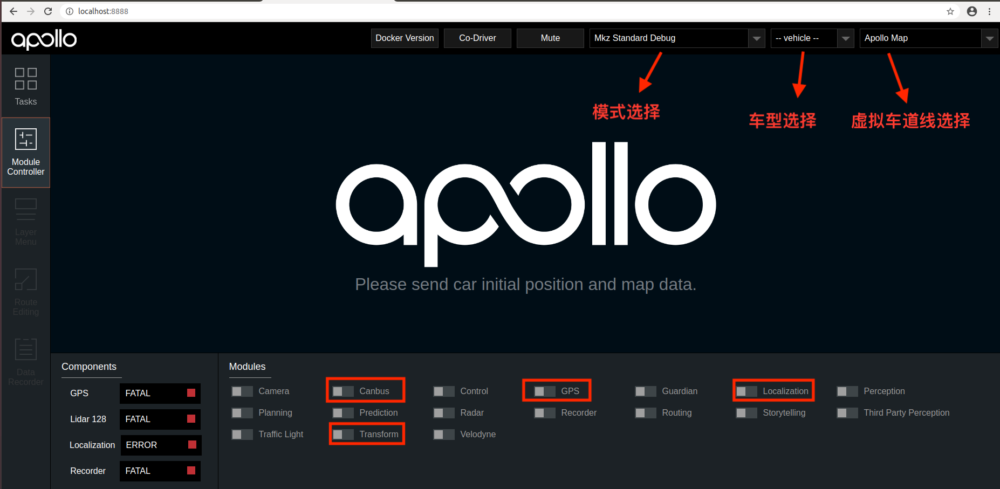
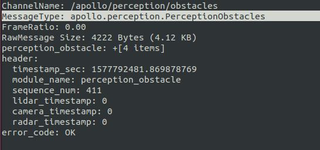
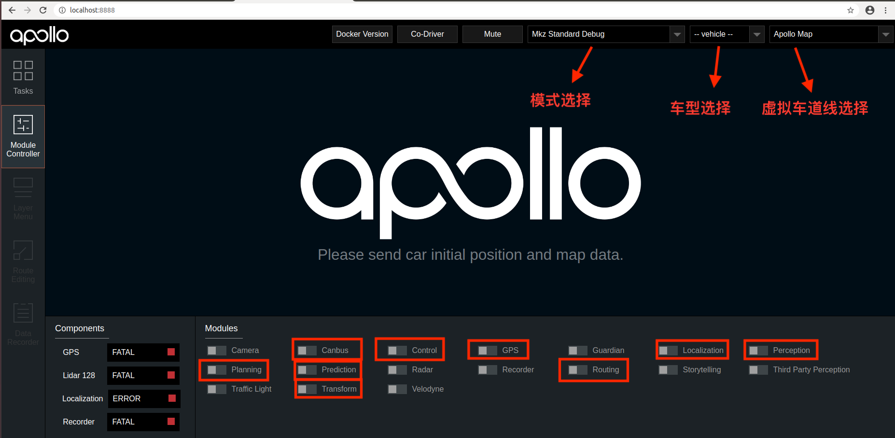
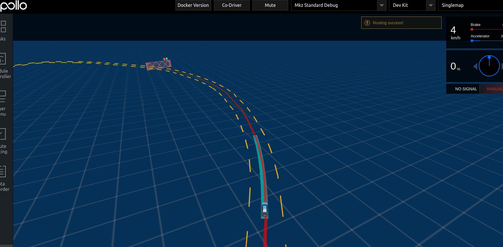

# 封闭园区自动驾驶搭建--规划适配

- [封闭园区自动驾驶搭建--规划适配](#封闭园区自动驾驶搭建--规划适配)
  - [概览](#概览)
  - [前提条件](#前提条件)
  - [配置文件的修改](#配置文件的修改)
  - [启动流程](#启动流程)
      - [1. 拍下车辆尾部的急停开关](#1-拍下车辆尾部的急停开关)
      - [2. 启动can卡](#2-启动can卡)
      - [3. 编译项目，启动Dreamview](#3-编译项目启动dreamview)
      - [4. 启动所需模块](#4-启动所需模块)
      - [5. 检查各模块channel是否正确](#5-检查各模块channel是否正确)
      - [6. 启动Lidar感知](#6-启动lidar感知)
      - [7. 验证Lidar感知](#7-验证lidar感知)
      - [8. 启动 Planning、Prediction、Routing、Control模块](#8-启动-planningpredictionroutingcontrol模块)
      - [9. 验证Planning、Prediction、Routing、Control模块是否启动成功](#9-验证planningpredictionroutingcontrol模块是否启动成功)
  - [NEXT](#next)
## 概览
该用户手册旨在帮助用户完成规划模块的配置和开环验证
## 前提条件

  - 完成了[基于激光雷达的封闭园区自动驾驶搭建--感知适配](Perception_Configuration_cn.md)

## 配置文件的修改

|修改文件名称 | 修改内容 | 对应的gflag参数 | 作用 | 
|---|---|---|---|
|`planning.conf` | 修改`defaut_cruise_speed`数值| 比如1.5 | 默认巡航速度|
|`planning.conf` | 修改`planning_upper_speed_limit`数值| 比如1.5 |车planning最大速度 |
|`planning.conf` | 修改`planning_lower_speed_limit`数值| 比如0.5 |车planning最小速度 |
|`planning.conf` |添加`speed_upper_bound`数值| 比如1.5 | 车最大速度|
|`planning.conf` |添加`max_stop_distance_obstacle`数值| 比如10 | 障碍物最大停止距离|
|`planning.conf` |修改`min_stop_distance_obstacle`数值| 比如5 | 障碍物最小停止距离|
|`planning.conf` |添加`destination_check_distance`数值| 比如1.0 | 认为车已经到达目的地时，车与目的地距离|
|`planning.conf` |添加`lon_collision_buffer`数值| 比如0.3 | 车与障碍物的默认碰撞距离|
|`planning.conf` |添加`noenable_scenario_park_and_go`配置项|  | 使起步停车场景失效|
|`planning_config.pb.txt` |修改`total_time`数值| 比如15.0 | planning规划多长时间的路线|
|`planning_config.pb.txt` |修改`max_acceleration`数值| 比如1.0 | 车辆最大加速度|
|`planning_config.pb.txt` |修改`lowest_speed`数值| 比如0.5 | planning时车的最低速度|
|`planning_config.pb.txt` |修改`max_speed_forward`数值| 比如1.5 | 车前进的最大速度|
|`planning_config.pb.txt` |修改`max_acceleration_forward`数值| 比如1.0 | 车前进的最大加速度|

**注意**：这些配置重新启动planning模块即可生效。为了安全起见，车planning速度一定要设置得比较小，建议按照上面的给出的值来设置相应的配置参数。

## 启动流程

把车辆开到户外，手动控制车辆，在感知有障碍物信息显示的情况下添加routing点并查看是否有planning轨迹线信息。

#### 1. 拍下车辆尾部的急停开关
本文档目的是进行规划的适配，并完规划模块的开环验证，不需要车辆行驶，为了安全起见，将车开到室外调试场后，请全程确保急停开关处于按下状态
#### 2. 启动can卡
进入can卡目录启动can卡，用以下命令启动

    cd ~/SocketCan/
    bash start.sh

####  3. 编译项目，启动Dreamview
进入docker环境，用gpu编译项目，启动DreamView 

    cd /apollo
    bash docker/scripts/dev_start.sh
    bash docker/scripts/dev_into.sh
    bash apollo.sh build_opt_gpu
    bash scripts/bootstrap.sh

####  4. 启动所需模块

在浏览器中打开(http://localhost:8888),选择模式为`Mkz Standard Debug`， 选择车型为`dev_kit`并选择相应高精地图，在Module Controller标签页启动Canbus、GPS、Localization、Transform模块。

使用如下命令启动16线激光雷达

    budaoshi@in_dev_docker:/apollo$ cyber_launch start modules/drivers/velodyne/launch/velodyne16.launch

####  5. 检查各模块channel是否正确

在docker中输入`cyber_monitor`命令并检查以下channel（使用`上下方向键`选择channel，使用`右方向键`查看channel详细信息）：
	
|channel_name | 检查项目 | 
|---|---|
| `/apollo/localization/pose`| 确保能正常输出数据 | 
|`/apollo/sensor/gnss/best_pose` | 确保能正常输出数据、`sol_type:` 选项显示为`NARROW_INT`   |
|`/apollo/sensor/lidar16/PointCloud2` | 确保能正常输出数据|
|`/apollo/sensor/lidar16/Scan`| 确保能正常输出数据|
| `/apollo/sensor/lidar16/compensator/PointCloud2`  | 确保能正常输出数据 |
|`/tf`|确保能正常输出数据|
|`/tf_static`|确保能正常输出数据|
|`/apollo/canbus/chassis`|确保能正常输出数据|
|`/apollo/canbus/chassis_detail`|确保能正常输出数据|

#### 6. 启动Lidar感知
确认各模块正常启动且channel输出正常后，在DreamView上启动Lidar感知模块(Perception模块)，使用`cyber_monitor`查看`/apollo/perception/obstacles`是否正常输出，并在dreamview上查看障碍物信息：

#### 7. 验证Lidar感知
在DreamView上启动Perception模块，使用`cyber_monitor`查看`/apollo/perception/obstacles`是否正常输出，查看车前方10米处运动的人或者自行车（自行车上要有人），在DreamView上查看障碍物颜色以及位置速度信息（自行车青蓝色，行人黄色，车辆绿色），如下图所示：

`/apollo/perception/obstacles`的数据如下图所示：

确保在DreamView上能看到障碍物且`/apollo/perception/obstacles`有障碍物信息。

#### 8. 启动 Planning、Prediction、Routing、Control模块
在Module Controller标签页启动Planning、Prediction、Routing、Control模块。

在Routing Editor标签中点击Add Point of Interest按钮添加一个point, 然后选择Send Routing Request按钮发送添加的routing点

####  9. 验证Planning、Prediction、Routing、Control模块是否启动成功
从DreamView中查看会出现一个蓝色的线 以及一个红色的stop标志。如下图所示：

在车前方存在人或者自行车（车上有人）时，在task标签页查看planning轨迹线，如下图所示：

在docker环境中输入命令`cyber_monitor`并查看planning channel信息： 

 

如果出现上图所示轨迹线和topic信息，表示规划模块适配和开环测试通过，否则继续查看log信息进行调试。

## NEXT
现在，您已经完成规划适配，接下来可以开始[封闭园区自动驾驶搭建--自动驾驶演示](Start_Auto_Driving_cn.md)
