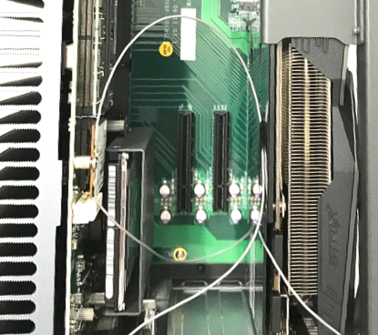
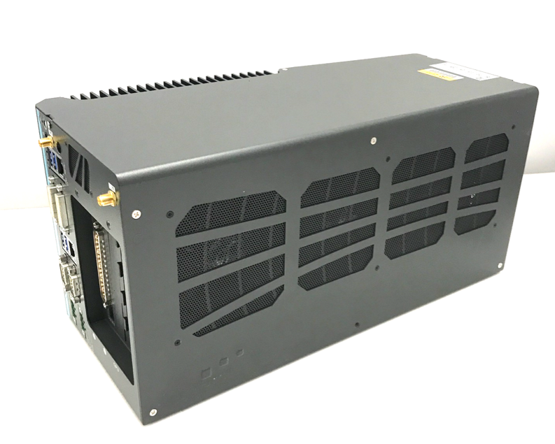
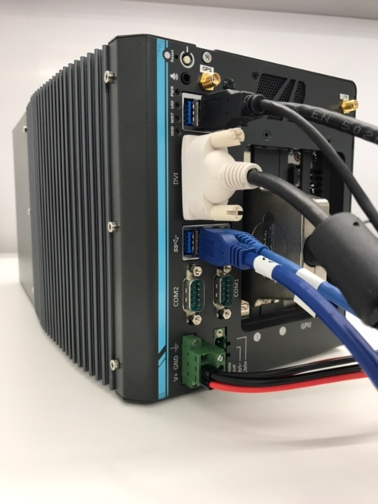

Apollo系统安装
===================

# 目录
      
 - [概览](#概览)
 - [工控机系统安装](#工控机系统安装)
     - [工控机硬件安装](#工控机硬件安装)
     - [工控机软件系统安装](#工控机软件系统安装)

# 概览

该用户手册旨在帮助用户在开发套件上安装、配置软硬件，并启动使用Apollo自动驾驶平台。

# 工控机系统安装

在集成车辆之前，首先需要完成工控机的硬件安装，如CAN卡安装；之后需要完成工控机的软件安装，包括Ubuntu Linux安装、Apollo软件系统安装等。

## 工控机硬件安装

工控机硬件安装包括CAN卡的安装和相关线缆的连接，以及BIOS相关的设置。

### IPC配置

参考下述IPC配置：

- Nuvo-6108GC-RTX2060s-E3-1275

- DDR4-32GB-ECC

- 三星 SSD 256G

- EMUC-B202 CAN

- PA-280W-OW

  
  
### 准备IPC

参考下述步骤：

#### 准备好CAN卡并进行安装
在Nuvo-6108GC中，RTX2060s显卡被预先安装在一个PCI插槽中。如果我们收到的是EMUC-B202 CAN，它已被预装在IPC内，则CAN卡安装这一步，可以跳过。如果我们收到的是ESDCan，我们需要将CAN卡安装在另外一个PCI插槽中，步骤如下：

   a. 找到并拧下机器边上的8个螺丝（显示在棕色方框内或棕色箭头指向的区域）

   

   b. 移除机器盖板

   

   在机箱底部将能看到固定着的3个PCI插槽（其中一个已经被显卡占据）
   
  
  
   c. 设置CAN卡的终端跳线：将4个红色的跳线帽从原位置移除并放置在终端位置，如下图所示：

   

   **WARNING**：如果终端跳线没有被正确设置，CAN卡将不能正确工作。

   d. 将CAN卡插入到一个PCI插槽中

   

   e. 安装IPC的盖板
    
   

#### 配置IPC加电组件

   a. 将电源线接入到为IPC配置的电源连接器（接线板）
   
   **WARNING**：确保电源线的正极（标记为 **R** 表示红色）和负极（标记为 **B** 表示黑色）接入到了IPC接线板的正确接口，如下图所示：

   
   
   b. 将显示器、以太网线、键盘和鼠标接入IPC
   
   
  
#### 启动计算机

如果系统接入了一个或多个外部插入卡，建议通过BIOS设置风扇的转速

```
- 计算机启动时按F2进入BIOS设置菜单
- 进入 [Advanced] => [Smart Fan Setting]
- 设置 [Fan Max. Trip Temp] 为 50
- 设置 [Fan Start Trip Temp] 为 20
```

建议使用者使用数字视频接口（DVI）连接器连接显卡和显示器。设置投影到主板的DVI接口，参考下述的设置步骤：

```
- 计算机启动时按F2进入BIOS设置菜单
- 进入 [Advanced]=>[System Agent (SA) Configuration]=>[Graphics Configuration]=>[Primary Display]=> 设置为 "PEG"
```

建议设置IPC的运行状态为一直以最佳性能状态运行：

```
- 计算机启动时按F2进入BIOS设置菜单
- 进入 [Power] => [SKU POWER CONFIG] => 设置为 "MAX TDP"
```

#### 连接电源




## 工控机软件系统安装

工控机软件系统安装包括计算机操作系统的安装，硬件驱动的安装，应用软件的安装和Apollo软件系统的安装。

### 安装Ubuntu Linux
Apollo软件系统依赖于Linux操作系统而运行，而Linux操作系统种类繁多，且又分为服务器版本和桌面版本，这里我们选择当下比较流行的Ubuntu桌面操作系统的64位版本。安装Ubuntu Linux的操作系统的步骤如下：
#### 创建引导盘
创建一个可以引导启动的Ubuntu Linux USB闪存驱动器，下载Ubuntu，并按照在线说明创建可引导启动的USB闪存驱动器。

 推荐使用 **Ubuntu 18.04.3**.

开机按F2进入BIOS设置菜单，建议禁用BIOS中的快速启动和静默启动，以便捕捉引导启动过程中的问题。建议您在BIOS中禁用“快速启动”和“静默启动”，以便了解启动过程中遇到的问题。

获取更多Ubuntu信息，可访问: 
Ubuntu桌面站点:

[https://www.ubuntu.com/desktop](https://www.ubuntu.com/desktop)

#### 安装 Ubuntu Linux

a.将Ubuntu安装驱动器插入USB端口并启动IPC。

b.按照屏幕上的说明安装Linux。

#### 执行软件更新与安装

**WARNING**：在整个Apollo系统的安装和操作的过程中，全程禁用root账户，皆用普通账户进行操作，切记！

a.安装完成，重启进入Linux。

b.在终端执行以下命令完成最新软件包的更新：

```
sudo apt-get update
```

IPC必须接入网络以便更新与安装软件，所以请确认网线插入并连接，如果连接网络没有使用动态分配（DHCP），需要更改网络配置。

#### 安装并降级GCC和G++

执行以下两条命令安装4.8.5版本的gcc和g++，命令如下：
```
sudo apt-get install g++-4.8 g++-4.8-multilib gcc-4.8 gcc-4.8-multilib
sudo /usr/bin/update-alternatives --install /usr/bin/gcc gcc /usr/bin/gcc-4.8 99 --slave /usr/bin/g++ g++ /usr/bin/g++-4.8
```
安装完成后，使用以下命令检查是否安装成功：
```
gcc --version
g++ --version
```

### 安装Apollo内核

车上运行Apollo需要[Apollo Kernel](https://github.com/ApolloAuto/apollo-kernel)。你可以依照如下步骤获取、安装预编译的内核：

a.从releases文件夹下载发布的包

```
https://github.com/ApolloAuto/apollo-kernel/releases
```
b.安装包下载完成后，解压后安装:

```
tar zxvf linux-4.4.32-apollo-1.5.5.tar.gz
cd install
sudo bash install_kernel.sh
```
c.在终端输入`sudo gedit /etc/default/grub`打开配置文件。把`grub_timeout_style=hidden`注释掉，把`grub timeout=0`中的0修改为10，把`grub_cmdline_linux_default=”quiet splash”`中的“quiet splash”修改为”text”，修改完成后保存退出。在终端中执行 `sudo update-grub`更新grub配置。 使用`reboot`命令重新启动计算机。

d.重启ubuntu系统进入grub引导界面，在引导界面选择高级选项，在高级选项里选择倒数第二项的apollo-kernel来引导系统。进入系统后，在终端中输入`uname -r`，若输出“4.4.32-apollo-2-RT”字样，则表示此时系统是以apollo-kernel引导的。 注意：从此以后，每次开机都需要以apollo-kernel来引导系统。

### 安装GPU驱动

下载apollo-kernel官网上的脚本[install-nvidia.sh](https://github.com/ApolloAuto/apollo-kernel/blob/master/linux/install-nvidia.sh)至当前用户的`home`目录下，输入以下命令完成显卡驱动内核模块的安装：

```
cd ~    
sudo apt install make    
sudo bash install-nvidia.sh    
```

完成显卡驱动内核模块的安装后，在当前用户的`home`目录下会出现一个名为`NVIDIA-Linux-x86_64-430.50.run`的文件，执行以下命令完成显卡驱动用户库的安装：

```
cd ~    
sudo bash ./NVIDIA-Linux-x86_64-430.50.run --no-x-check -a -s --no-kernel-module    
```

完成显卡驱动用户库的安装后，重新启动工控机。    
在终端中输入以下命令来检查显卡驱动内核模块是否安装成功：

```
cat /proc/driver/nvidia/version
```

若输出的内容中包含”430.50”字样，则表示显卡驱动内核模块安装成功；若不是，请重新安装显卡驱动内核模块。    
在终端中输入以下命令来检查显卡驱动用户库是否安装成功：

```
sudo dpkg --list | grep nvidia*
```

若输出的内容中显示显卡的用户库的版本是430.50的，则表示显卡驱动用户库安装成功；若不是，请重新安装显卡驱动用户库。    

在终端中输入`nvidia-smi`，能看到显卡的信息且最下面没有出现No running processes found的相关字样，输入`nvidia-settings`能调出显卡的配置界面，则表示显卡驱动安装成功。 

### 安装Can驱动
- 在Nuvo-6108GC中，若系统搭配的是ESDCan卡，其驱动安装步骤如下所示：

a.从CAN卡供应商那里或者ESDCan卡的包装袋里拿到CAN卡的驱动安装包，名字形如esdcan-pcie4.2-linux-2.6.x-x86_64-3.10.3.tgz。

ｂ.解压此安装包，cd到解压后的文件夹里。

c.编译安装CAN卡驱动，在终端执行以下命令：
```
cd src/
make -C /lib/modules/`uname -r`/build M=`pwd`
sudo make -C /lib/modules/`uname -r`/build M=`pwd` modules_install
```
d.CAN卡驱动esdcan-pcie402.ko可以在/lib/modules/4.4.32-apollo-2-RT/extra/文件夹下找到。

- 在Nuvo-6108GC中，系统搭配的是EmucCan卡，其驱动安装步骤如下所示：

a.安装EmucCan并添加rules文件

在终端中输入以下命令来查看设备的端口号：
```
ls -l /sys/class/tty/ttyACM*
```
记下形如`1-10:1.0`的一串数字；在系统`/etc/udev/rules.d/`目录下执行`sudo touch 99-kernel-rename-emuc.rules`命令新建一个文件`99-kernel-rename-emuc.rules`,执行`sudo vim 99-kernel-rename-emuc.rules`命令添加文件内容：
 ACTION=="add",SUBSYSTEM=="tty",MODE=="0777",KERNELS=="1-10:1.0",SYMLINK+="ttyACM10"

其中的`1-10:1.0`就是上面记下的一串数字，根据实际情况进行替换即可；然后先按`ESC`键然后再按`:wq`保存文件内容退出，并重启系统。重启系统后执行`cd /dev`命令，用`ls -l ttyACM*`命令查看设备，要确保`ttyACM10`存在。

b.下载emuc-B202驱动包

下载地址[emuc-B202 Driver](https://www.innodisk.com/Download_file?D7856A02AF20333811EBF83A6E6FDFE31262BBEB35FDA8E63B4FCD36B5C237175D714D7286AF87B5)

将EMUC-B202文件下的Linux下的驱动安装包解压出来放到当前用户的home目录下并将文件夹重命名为SocketCan，将当前目录设置到这个文件夹下，并执行`make`命令：
```
cd SocketCan/
make
```
生成的文件如下图所示 ：


c.启动can卡

将`start.sh`中`sudo ./emuc_64 -s9 ttyACM0 can0 can1`修改为`sudo ./emuc_64 -s7 ttyACM10 can0 can1`，其中-s表示波特率，-s9表示为1k，-s7表示为500，apollo中采用500。在当前目录下执行`bash start.sh`命令，如下图所示：


d.测试can卡发送接收

将can卡can1和can2口用Can线连接起来。从 https://github.com/linux-can/can-utils 上下载测试代码到home下，将当前目录设置到can-utils下并执行`make`，如下图所示

然后执行命令`./cansend can0 1FF#1122334455667788`，在另开一个终端执行以下命令：
```
cd can-utils/
./candump can0
```
循环发送cansend命令，能够在candump中收到发送的数据，如下图所示 ：

则表示Can驱动安装成功。
d.注意事项：
在后续启动apollo的canbus模块时，需要先在docker外运行start.sh脚本。

### 安装Docker

使用apollo官网上的[install_nvidia_docker.sh](https://github.com/ApolloAuto/apollo/blob/master/docker/setup_host/install_nvidia_docker.sh)来安装docker。工控机在联网情况下在终端中输入以下命令来完成安装：
```
sudo apt update
sudo apt install curl
sudo bash install_nvidia_docker.sh
```

完成安装后，在终端中输入以下命令来验证docker是否安装成功：
```
sudo docker run hello-world
```
若能看到helloworld的相关信息，则表示docker安装成功。


### 编译Apollo源代码

**WARNING**：在本模块及以下的操作中，如非本文档或操作系统要求，禁用一切`sudo`操作，切记！

a.获取Apollo源代码
可以在github上下载，在终端中输入以下命令：
```
cd ~
sudo apt update
sudo apt install git -y
git init
git clone https://github.com/ApolloAuto/apollo.git
```
代码下载的时间视网速的快慢而有所区别，请耐心等待；
下载完成后的代码在~/apollo目录下，然后执行`git checkout -b r5.5.0 origin/r5.5.0`将代码切换到我们所需要的工作分支r5.5.0上。

b.设置环境变量，在终端输入以下命令：

```
cd ~
echo "export APOLLO_HOME=$(pwd)" >> ~/.bashrc && source ~/.bashrc
source ~/.bashrc
```

c.将当前账户加入docker账户组中并赋予其相应权限，在终端输入以下命令：

```
sudo gpasswd -a $USER docker  
sudo usermod -aG docker $USER  
sudo chmod 777 /var/run/docker.sock
```

命令执行完成后，重新启动一下计算机。

d.启动并进入docker容器，在终端输入以下命令：

```
cd ~/apollo
bash docker/scripts/dev_start.sh
```

第一次进入docker时或者image镜像有更新时会自动下载apollo所需的image镜像文件，下载镜像文件的过程会很长，请耐心等待；这个过程完成后，请输入以下命令以进入docker环境中：
```
bash docker/scripts/dev_into.sh
```

e.编译apollo，在终端输入以下命令，等待编译完成，整个编译过程大约耗时25分钟：

```
bash apollo.sh build
```

### 运行DreamView

a.启动apollo
在终端输入以下命令：

```
bash scripts/bootstrap.sh
```

如果启动成功，在终端会输出以下信息：

```
nohup: appending output to 'nohup.out'
Launched module monitor.
nohup: appending output to 'nohup.out'
Launched module dreamview.
Dreamview is running at http://localhost:8888
```

在浏览器中输入以下地址： 

```
http://localhost:8888
```

可以访问DreamView。

b.回放数据包
在终端输入以下命令下载数据包：

```
python docs/demo_guide/rosbag_helper.py demo_3.5.record
```

输入以下命令可以回放数据包，在浏览器DreamView中可以看到回放画面。

```
cyber_recorder play -l -f demo_3.5.record
```