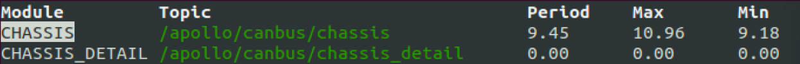
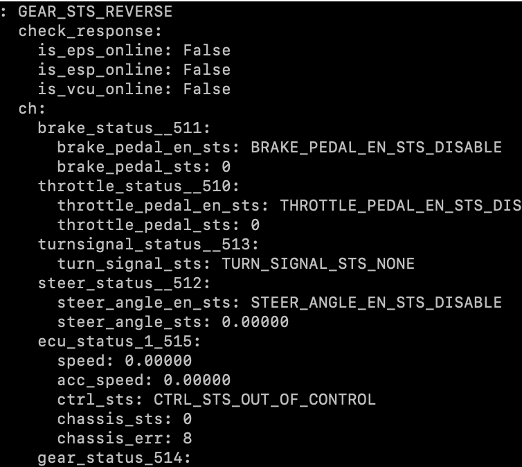
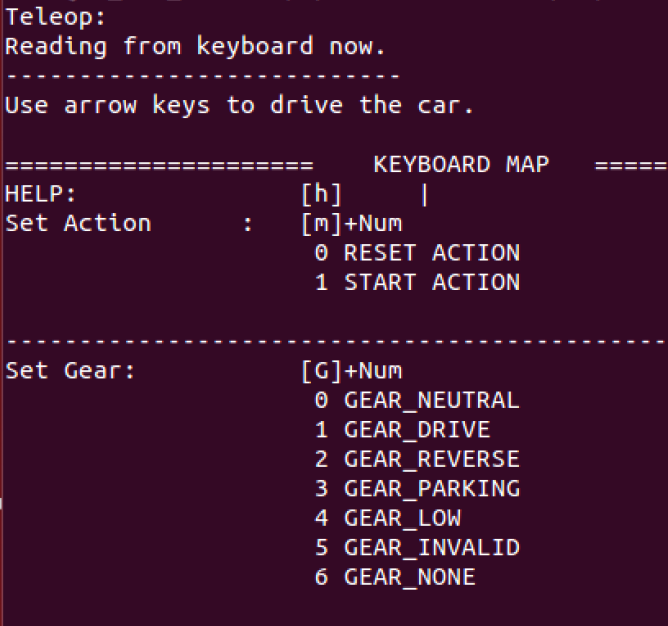
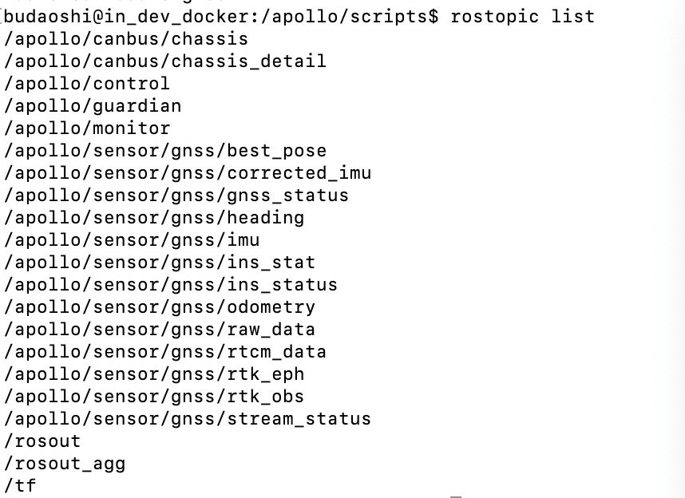
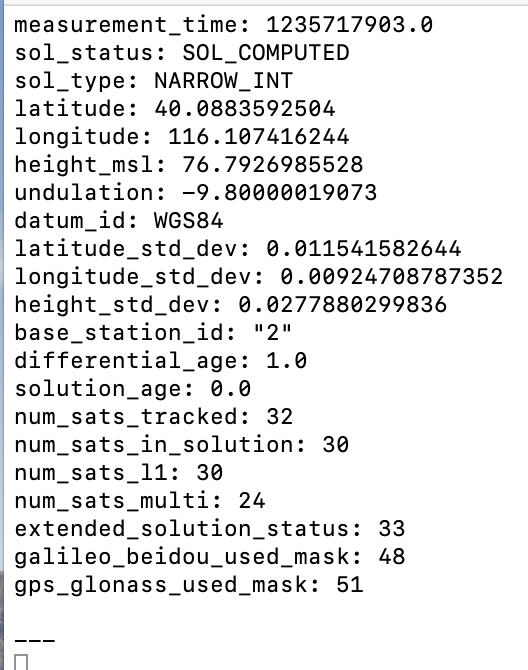
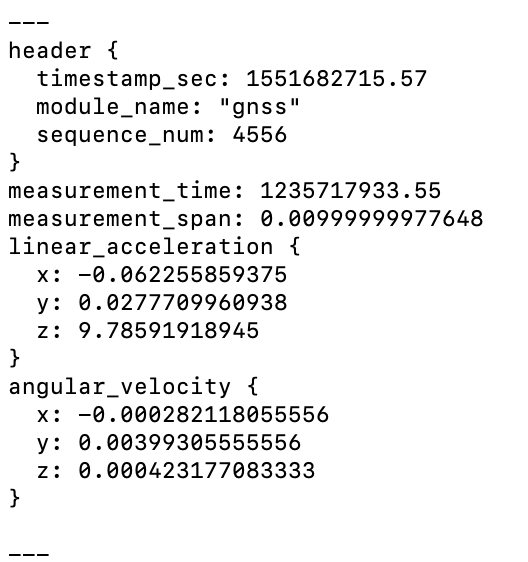
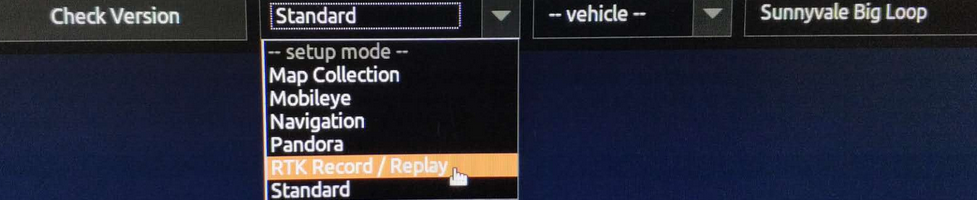
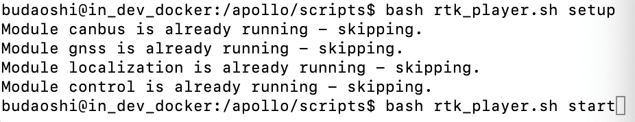
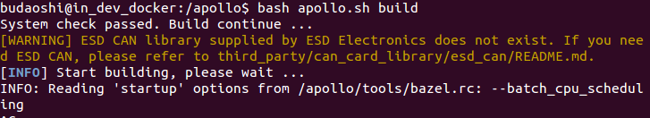

车辆循迹演示及常见问题
===================

## 目录
      
 - [概览](#概览)

 - [启动循迹](#启动循迹)
    - [系统文件配置](#系统文件配置)
	 
    - [循迹操作说明](#循迹操作说明)
    
 - [调试与常见问题](#调试与常见问题)


## 概览

该用户手册旨在帮助用户在开发套件上实现循迹功能。

## 启动循迹

在完成以上软硬件安装，标定以及系统文件配置后，用户可以通过Dreamview界面录制车辆轨迹并回放，完成第一个循迹演示。
注意：车辆启动循迹之前一定要先完成标定！
本部分主要分为系统文件配置和循迹操作说明两个方面。

### 系统文件配置

系统文件配置主要以车辆配置为主，其具体操作如下所示。

#### 车辆配置
所有的车辆配置都是以车型为单位的，一个车型的车辆相关的所有配置都放在一个以车型命名的文件夹里面。Apollo支持的所有的车型都在`/apollo/modules/calibration/data/`目录下。我们以开发套件为例，其在Apollo中的简称为dev-kit，dev-kit文件夹的内容如下：

- cancard_params目录
- gnss_conf目录
- gnss_params目录
- vehicle_params目录
- velodyne_conf目录
- velodyne_params目录
- control_conf.pb.txt文件
- novatel_localization_extrinsics.yaml文件
- README.md文件
- vehicle_info.pb.txt文件
- vehicle_params.pb.txt文件

`cancard_params`目录是CAN卡相关的配置和参数。
`gnss_conf`目录主要是关于gps基站相关配置和参数，其中`gnss_conf.pb.txt`是关于基站的配置，其中内容在gps配置部分已经作了说明，必须保证信息正确。
`gnss_params`目录主要是关于IMU的相关配置和参数。
`vehicle_params`目录下是关于车辆`translation`和`rotation`相关设置，不用修改。
`velodyne_conf`目录是激光雷达的相关配置。
`velodyne_params`目录是激光雷达的相关参数。

因此如果只做循迹方案，只需要`gnss_conf目录`，`gnss_params`目录，`vehicle_params`目录，`vehicle_info.pb.txt`文件和`control_conf.pb.txt`文件，其他文件并不需要。
保证这些文件正确，重新编译，启动`bootstrap`, 就可以在`dreamview`下选择酷黑小车`dev-kit`车辆，进行下面的循迹操作了。

除了车辆相关配置外，还需要注意canbus和control模块的配置。分别介绍如下:

1. `modules/calibration/data/dev-kit/cancard_params/canbus_conf.pb.txt` 修改如下：
```
enable_debug_mode:true
enable_receiver_log:true
enable_sender_log: true
```
这三行用于打开debug信息。

2. `modules/canbus/conf/canbus.conf` 修改如下:
```
--enable_chassis_detail_pub
--noreceive_guardian
```
第一行打开/apollo/canbus/chassis_detail消息，第二行关闭guardian模块。


### 循迹操作说明

当gps安装配置好以后，就可以进行循迹测试，所谓的循迹测试是对车辆底盘线控改造的一个综合测试（ 对油门刹车档位等的控制 ），以及对apollo控制算法和传感器集成的综合测试。下面按时间先后对循迹测试的步骤做说明。以下所说的操作都是在apollo docker内部。

#### 循迹前检查和准备

在命令行中执行
```
bash bootstrap.sh
```
启动`dreamview`,浏览器中输入`ｈttp://localhost:8888`进入`dreamview`界面，在`dreamview`顶部下拉菜单中选择`dev-kit`车辆（表示选择酷黑车型）, `rtk_record_play`表示选择循迹。点击左侧的`task`标签，点击页面中的`reset all` ，接着点击`setup`，将会启动apollo中相应的模块。点击页面左侧的`modules controllers`，然后在右侧查看各个模块的打开情况，蓝色表示处于开启状态，灰色表示模块处于关闭状态，确保`GPS`，`CAN Bus`， `Control`，`Localization`模块是开启的，其他的`Gardian`和`Record Bag`处于关闭状态。
运行`cyber_monitor`命令，通过以下channel查看`gps`，` imu`，`localization`信号和状态：
```
/apollo/sensor/gnss/best_pose
/apollo/sensor/gnss/imu
/apollo/localization/pose
```
都正常，就可以开始进行循迹测试( 有时候`localization`信号没有，可能需要等待一会儿，如果还是没有那么可以尝试让车辆跑一下 )。

#### 录制循迹数据包
车辆开到循迹起始点，保持N档，线控开启，输入以下命令：
```
cd /apollo/scripts
bash rtk_recorder.sh setup    
bash rtk_recorder.sh start （ 命令输入后，开始开车走一段轨迹 ）
bash rtk_recorder.sh stop( 如果无法输入就按Ctrl + C结束 )
```
`Ctrl + C`结束后，apollo将会录制一个轨迹数据包garage.csv，放在`data/log/`下（主要记录了位置、刹车、油门、方向、速度等信息）。

#### 回放数据包
N档，线控开启，输入以下命令：
```
bash scripts/rtk_player.sh setup    
bash scripts/rtk_player.sh start （ 这个命令敲完，车还不会反应 ）
```
发现命令行中record数据被重放，log不停刷屏，`dreamview`会显示大致轨迹，清浏览轨迹是否大致相符，如果相差很大，比如本来录制的时候是直行，而轨迹显示大幅度转弯，请小心测试，谨防危险。
点击`start auto`，这时候车子会出现反应，并且是大反应（司机注意接管）。`bash scripts/rtk_player.sh start` 这一步只是把record数据重新放出来，或者对路径进行规划，即完成planning的过程。

注意事项：一定要在宽阔的场地进行测试，确保周围没有人，循迹测试之前做好应急接管准备，有问题随时遥控器接管。不要轻易尝试速度大于20km/h（ 6m/s ）的循迹。

#### 结束播放

输入以下命令来结束播放：

`bash rtk_player.sh stop`

如果无法输入就按`Ctrl + C`或者`Ctrl + D` 结束。

## 调试与常见问题

本小节讲述小车Apollo 循迹过程的实际调试方法和操作，在此之前必须保证环境已经准备好，即Ubuntu 18.04已经装好apollo-kernel，docker，canbus，硬件和传感器已经连接好。 
 
### 底盘连接是否正常 
 
硬件连接：确保CAN硬件连接线CAN0和车辆线控底盘连接正常，线控底盘开关处于打开状态，进入Ubuntu Docker环境，输入以下命令：

```
cd /apollo/scripts 
bash bootstrap.sh
bash canbus.sh  启动canbus模块 
cyber_monitor
```

在cyber_monitor界面中应该能看到如下的模块：



用键盘上下箭头移动光标选择CHASSIS或者CHASSIS_DETAIL，选中后按右箭头可以进入查看详细信息，这些信息即是车辆底盘信息， CHASSIS消息如下： 

 

Chassis detail消息如下： 

 

如果这些信息得到正确显示，说明CANBUS模块工作正常。如果不能显示底盘信息，很大可能是CANBUS有问题，或者底盘有问题，没有向上反馈底盘数据。 
保证CANBUS的连接正确性，才能确定工控机计算单元可以控制车辆底盘，才能继续其它部分的调试。 
 
#### canbus_teleop的使用 
 
CANBUS能够连接底盘后，我们可以尝试控制底盘的运动。如果控制正常，则说明工控机计算单元下发命令后得到正确执行。 进入Ubuntu Docker环境，输入以下命令：

```
cd /apollo/scripts 
bash canbus_teleop.sh 
```

弹出界面如下： 

 
 
a 根据提示按M0重置系统，按 M1是开始控制底盘。
b 按几次A或者D，看看车轮是否转动。 
c 按G1，挂前进档，按几次W，看车辆是否前进，按几次S看车辆是否停下来。 
请小心测试，不要轻易长时间连续按键，以防车辆突然高速动作发生事故。

#### 提示警告Nvidia GPU Driver未安装 

下载apollo-kernel官网上的脚本[install-nvidia.sh](https://github.com/ApolloAuto/apollo-kernel/blob/master/linux/install-nvidia.sh)至当前用户的`home`目录下，输入以下命令完成显卡驱动内核模块的安装：

```
cd ~    
sudo apt install make    
sudo bash install-nvidia.sh    
```

完成显卡驱动内核模块的安装后，在当前用户的`home`目录下会出现一个名为`NVIDIA-Linux-x86_64-430.50.run`的文件，执行以下命令完成显卡驱动用户库的安装：

```
cd ~    
sudo bash ./NVIDIA-Linux-x86_64-430.50.run --no-x-check -a -s --no-kernel-module    
```

完成显卡驱动用户库的安装后，重新启动工控机。    
在终端中输入以下命令来检查显卡驱动内核模块是否安装成功：

```
cat /proc/driver/nvidia/version
```

若输出的内容中包含”430.50”字样，则表示显卡驱动内核模块安装成功；若不是，请重新安装显卡驱动内核模块。    
在终端中输入以下命令来检查显卡驱动用户库是否安装成功：

```
sudo dpkg --list | grep nvidia*
```

若输出的内容中显示显卡的用户库的版本是430.50的，则表示显卡驱动用户库安装成功；若不是，请重新安装显卡驱动用户库。    

在终端中输入`nvidia-smi`，能看到显卡的信息且最下面没有出现No running processes found的相关字样，输入`nvidia-settings`能调出显卡的配置界面，则表示显卡驱动安装成功。 
 
#### 星网宇达M2 GPS调试 
 
##### M2硬件设备的配置 
 
M2 GPS首先需要保证M2硬件设备配置好，默认出厂的M2已经配置好，可以给百度apollo系统使用，只需要小部分改动，例如杆臂值的配置。 关于杆臂值的配置，请参考上文。
硬件连接：需要把M2的串口线连接到工控机的串口，M2的USB口连接到工控机的USB口，M2接上电源并上电。 
软件部分：Ubuntu 18.04 系统安装串口调试工具cutecom，安装命令为：`sudo apt-get install cutecom`。
安装好以后应该可以在/dev/下看到ttyACM0的设备，这就是我们的M2设备名。

##### apollo GPS模块相关配置
根据上文，修改/apollo/modules/drivers/gnss/conf文件夹下面的配置文件。
 
##### M2 GPS状态查看 

输入以下命令来查看M2 GPS设备的状态：

```
cd /apollo/scripts 
bash bootstrap.sh
bash gps.sh                启动gps 
bash localization.sh       启动localization 
```

 运行cyber_monitor列出topic，应该可以得出以下结果：

 
 
我们在双天线M2 GPS方案中，主要用到如下两个topic：best_pose和imu。cyber_monitor中检查以下channel：

```
/apollo/sensor/gnss/best_pose 
``` 

 
 
cyber_monitor中检查以下channel：

```
/apollo/sensor/gnss/imu 
```

 

接下来我们通常需要打开localization模块，鉴于后续我们都会用到dreamview模块，所以我们先打开dreamview，然后在dreamview界面中打开localization模块。 
输入命令:
```
 bash bootstrap.sh start 
```
然后在网页中输入`http://IP_ADDRESS:8888`(如果在本地机器可以用`http://localhost:8888` )即可以打开dreamview界面，该界面可以控制和监测车辆自动驾驶动作和效果。选择左侧的modules conttroller，可以出现很多模块，我们点击localization使它变成蓝色即可以打开localization模块，接着在命令行，就可以用命令`cyber_monitor`进入监视界面，进入`/apollo/localization/pose`观察localization的效果，dreamview和localization channel的效果如下图所示：


 
在GPS定位方案中，localization模块和GPS模块相关，如果GPS模块没有打开并正常工作那么localization模块也无法正常工作。
 
如果无法得出以上结果，请到/apollo/data/log/下查看日志gnss.INFO，并根据报错做相应的排查。Apollo所有的日志都在/apollo/data/log/下，要多看这些log才能知道问题和运行过程，更快地完成调试。 
 
 
#### rtk循迹测试的调试 
 
##### 配置dreamview 
 
在dreamview界面中确保选择自己的车型和RTK_Record/Replay,如下2幅图所示：

 

 
 
 
##### 打开传感器 
 
确保canbus，control，gps，localization这几个模块是打开的，如下图：


 
##### 录制轨迹包 
 
车辆保持N档，线控权限交给apollo，然后在命令行中，输入如下命令：

```
bash rtk_recorder.sh setup     
bash rtk_recorder.sh start ( 输入这条命令后，命令行界面会看到消息不停刷屏，记录车辆运动轨迹，开始用遥控控制车辆走一段距离 ，让车辆停止后，在命令行中ctrl + c按钮结束数据录制 ) 
```

这些数据会记录到/apollo/data/log/garage.csv文件夹中，如下图所示：


##### 回放数据包 
 
Dreamview界面要准备好，需要命令行和dreamview界面配合操作，在命令行界面中输入如下命令：


```
bash rtk_player.sh setup 
bash rtk_player.sh start 
```


如下图所示：



这时候会有很多关于轨迹的数据播放并刷屏，dreamview界面中也会看到有一条浅蓝色的线，代表车辆即将要走的轨迹。接下来需要在dreamview 界面中点击Start Auto，如下图所示，车辆开始运动，观察其循迹效果：

 
 
### 常见问题

调试过程中，常见的问题及解决办法总结如下：

#### 网络断开或者网络太差无法进入docker
报错如下：


主要是因为网络没有连接上，或者网络太慢，请检查网路。

#### 找不到CANBUS相关报错log
调试过程中，一定要反复看/apollo/data/log/下的报错文件，这些文件对调试apollo和理解apollo系统执行非常有帮助，例如CAN相关的有：
CANBUS.error，
CANBUS.waring，
CANBUS.info，
如果打开过canbus.sh等，没有看到这些log信息，说明没有打开相关log记录功能，解决办法：
打开/apollo/module/canbus/conf/canbus_conf.pb.txt把如下三行的false改成true。

```
enable_debug_mode: false
enable_receiver_log: false
enable_sender_log: false
```

#### docker进不去, no matching entries in passwd file
 安装好ubuntu Linux，apollo-kernel，docker后，执行
 
 ```
 bash docker/scripts/dev_start.sh
 bash docker/scripts/dev_into.sh
 ```
 
 遇到报错如下：
 unable to find user xxx : no matching entries in passwd file.
 主要是由于用户权限没有加进docker去导致。执行如下两行命令：
 
 `sudo gpasswd -a $USER docker`
 `sudo usermod -aG docker $USER` 

 其中$USER是登陆用户名，执行成功后logout，然后重新登陆ubuntu。
 如果没有解决，那么有可能是/apollo/scripts/docker_adduser.sh没有权限，需要`sudo chmod a+rx /apollo/scripts/docker_adduser.sh`增加权限。（ 我们曾遇到一种情况就是/apollo/scripts/目录下有一个docker_adduser.sh~文件，导致报错，所以需要检查是否存在副本文件或者交换文件之类的，需要删除掉 ）。
如果还是不行，可以试试`sudo chmod 777 /var/run/docker.sock docker/scripts`。

#### 编译的时候CAN警告

若您的CAN卡是EMUC-CAN卡，请直接忽略；若您的CAN卡是ESD-CAN卡，请接着往下看。    
编译的时候，刚开始就报出几行黄色的提示找不到ESD CAN的报错，原因是CAN驱动没有安装好，参见下图：



首先要下载ESD CAN安装包，按照<https://github.com/ApolloAuto/apollo-kernel/blob/master/linux/ESDCAN-README.md>进行CAN驱动安装。其次需要从安装包中拷贝头文件和库文件到指定目录。具体操作如下：
检查apollo/apollo.sh脚本中的check_esd_files()函数，我这里看到1.0.0版本会检查3个文件：
libntcan.so，
libntcan.so.4，
libntcan.so.4.0.1，
所以对应应该建立的软链接是：
```
ln -s libntcan.so.4.0.1 libntcan.so.4
ln -s libntcan.so.4.0.1 libntcan.so.4.0
```
请看apollo.sh的check_esd_files()函数：
```
function check_esd_files() {
  if [ -f ./third_party/can_card_library/esd_can/include/ntcan.h \
      -a -f ./third_party/can_card_library/esd_can/lib/libntcan.so \
      -a -f ./third_party/can_card_library/esd_can/lib/libntcan.so.4 \
      -a -f ./third_party/can_card_library/esd_can/lib/libntcan.so.4.0.1 ]; then
      USE_ESD_CAN=true
  else
      warning "${YELLOW}ESD CAN library supplied by ESD Electronics does not exit.${NO_COLOR}"
      warning "${YELLOW}If you need ESD CAN, please refer to third_party/can_card_library/esd_can/README.md${NO_COLOR}"
      USE_ESD_CAN=false
  fi
}
```
不同的apollo版本可能对检查的库文件名称的要求不同，可根据实际情况建立软连接。

#### 无法控制汽车底盘和读取底盘信号
具体表现是车辆下发油门转向等信号，底盘不执行，也读不到底盘的相关信息，这时候的原因应该是CAN不通。解决方法如下：
（1） ESD CAN卡安装的时候跳线帽是否正确设置。跳线不正确，CAN不通。
（2）如果（1）已经正确问题仍然存在，有可能是车辆底盘没有正确接收处理CAN信号，尝试整车断电重启。
（3）如果（2）尝试了，仍然没有解决，用CAN调试工具，看底盘是否有信号上报，以及apollo执行的时候，是否有命令下发。

#### Teleop进入不了自动驾驶模式 
 打开canbus.sh后，执行canbus_teleop.sh始终无法进入自动驾驶模式，CAN调试工具测量底盘信号是通的。这种情况，有可能是guidian模块打开造成，guidian模块是一种安全保护机制，开发者调试阶段，可以根据需要关掉。
 打开/apollo/module/canbus/conf/canbus.conf
 修改`--receive_guardian`为`--noreceive_guardian`。

#### chassis_detail信息量很少
CANBUS正确配置接通的情况下，前述提到可以cyber_monitor中查看 /apollo/canbus/chassis_detail来查看底盘详细信息，但是如果执行后，看到的信息量很少，那么有可能是chassis_detail没有被打开。
编辑/apollo/module/canbus/conf/canbus.conf
修改其中`--noenable_chassis_detail_pub`为`--enable_chassis_detail_pub`。

#### apollo系统第一次搭建完毕，测试发转角车辆实际转角不对

例如下发转向角10%，但是转动角度远超过转向最大角度的10%。可以在cyber_monitor中查看 /apollo/canbus/chassis及时观察底盘信号，apollo默认是Lincoln车型，如果使用者第一次搭建好apollo，还没有选择车型那么默认会按照lincoln车的最大转向角乘以百分比去执行。解决方法如下：检查modules/canbus/conf/canbus_conf.pb.txt中的配置，brand设置为正确的车型（例如D-kit），重启canbus，再尝试。如何仍然未解决，请运行bootstrap.sh脚本，在dreamview中选择对应的车型，例如D-kit开发套件。然后点击界面上的reset all，再点击setup。 


#### gps.sh打开后不正常，log提示Unable to load gnss conf file

原因是gps配置文档不正确，检查每一行，是否有错误，尤其如下几行的#要去掉：
```
    #address: "111.111.111.11"
    #port: 0000
    #mount_point: "yourport"
    #user: "username"
    #password: "password"
```
另外，在程序运行的过程中，有可能会把modules/calibration/data/vehicle_name/gnss_params/gnss_conf.pb.txt拷贝到modules/drivers/gnss/conf/gnss_conf.pb.txt，那么我们也需要修改modules/calibration/data/vehicle_name/gnss_params/gnss_conf.pb.txt里面的基站配置信息和+zone=50才能保证gnss配置正确。

#### GPS打开后，发现best_pose, imu, localization/pose 信号没有收到

运行bash gps.sh后，可以cyber_monitor中观察以下几个信号
```
/apollo/sensor/gnss/best_pose
/apollo/sensor/gnss/imu
/apollo/localization/pose
```
如果best_pose和imu没有，请检查gps和imu的配置。
如果best_pose和imu有了，但是没有localization/pose没有信号，请等待2分钟，如果还是没有，请让车开动几分钟。

#### 循迹bash rtk_player.sh开始后，车辆不动

很可能是标定没有做好，尤其低速油门没有做好。

#### 循迹刹车地点不准确，或者刹车停不下来

很可能是标定没有做好，标定刹车部分没有做好，急刹缓刹都要考虑。

#### 循迹效果不佳

纵向效果不好，请考虑标定和PID参数调整以及车辆本身的信号（例如油门和刹车下发和上报是否一致），横向误差大，主要考虑LQR参数调整和车辆转向信号（下发和上报是否一致）。
