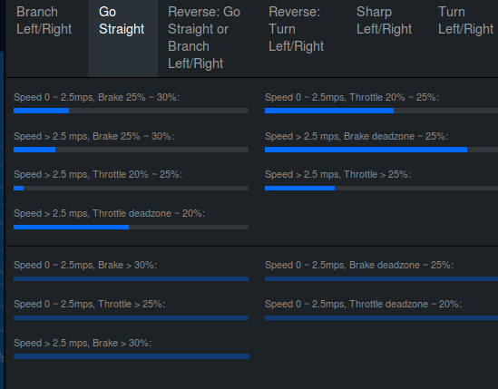
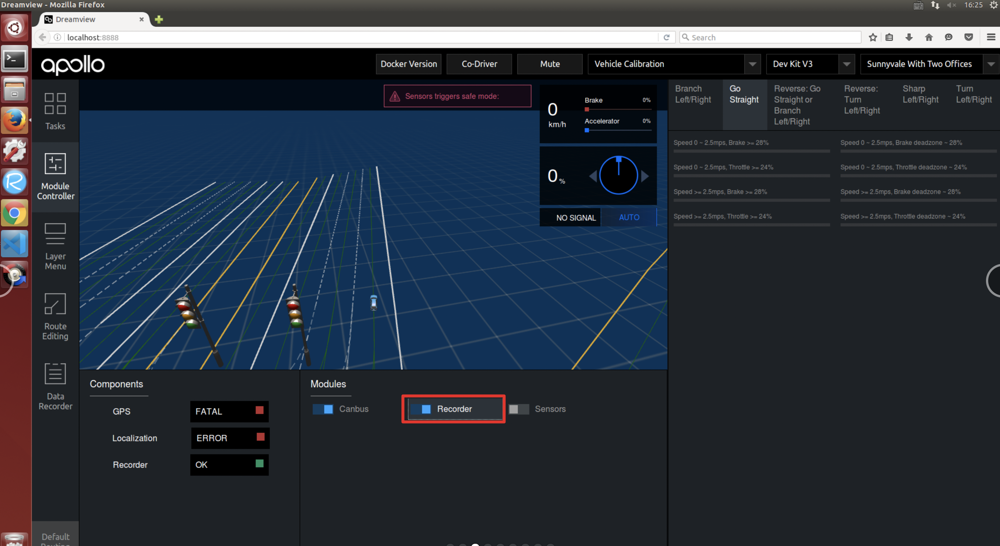
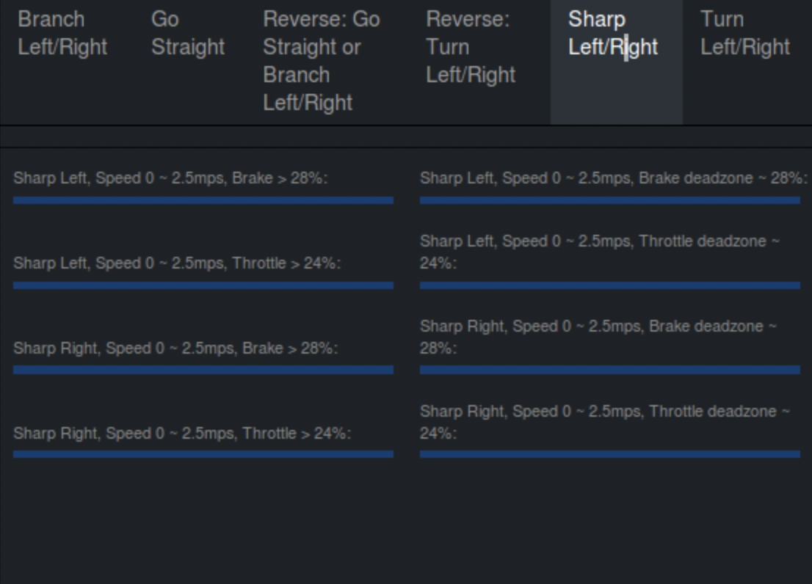
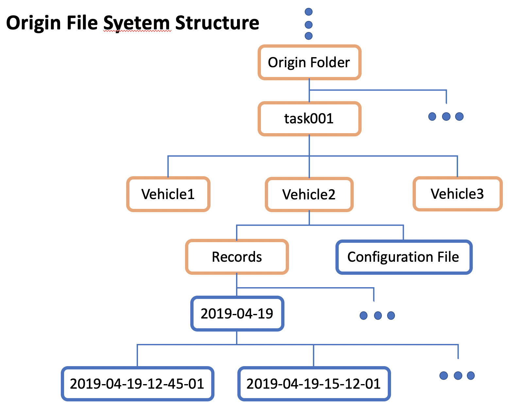
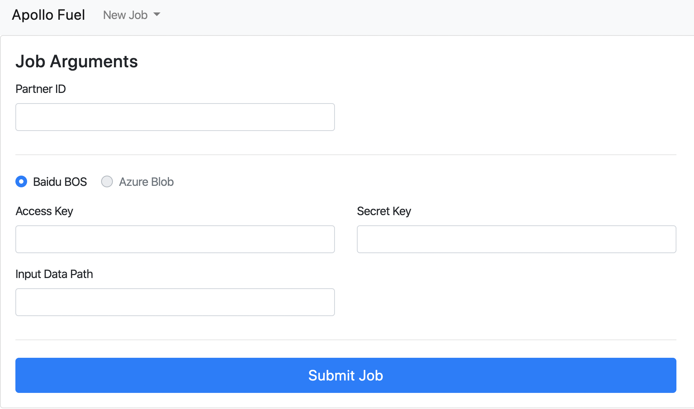
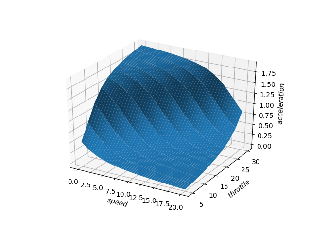
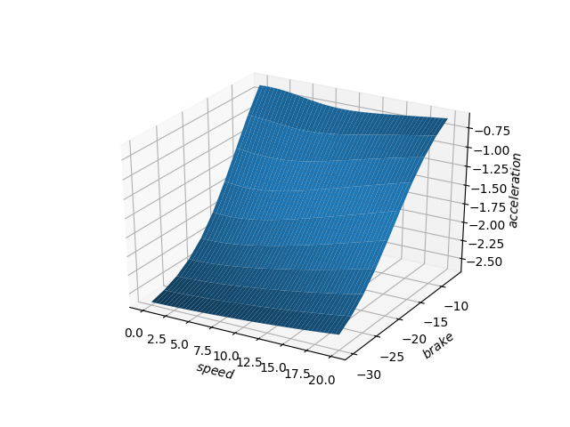

# 车辆云标定

车辆云标定是通过采集车辆底盘油门踏板量、刹车踏板量、车辆速度、加速度，通过机器学习的方式，生成相应车辆的踏板标定表，生成的标定表数据量大，精度高，提高车辆的控制精度。车辆踏板标定系统主要包括三个部分：

- 在`DreamView`数据采集监视器内采集标定数据；

- 标定数据上传至BOS云盘，提交标定任务；

- 生成用于性能评估的可视化标定结果。

## 前提条件

- [车辆集成](Waypoint_Following--Vehicle_Integration_cn.md)

- [定位模块配置](Waypoint_Following--Localization_Configuration_cn.md)

- [Apollo系统安装](Waypoint_Following--Apollo_Software_Installation_cn.md)

## 主要步骤

- 修改标定配置文件

- 标定数据采集

- 标定任务提交

- 可视化结果分析

## 前言

在`DreamView`中，提供了一个踏板标定数据采集的监视器，用于监视采集标定数据的过程。通过配置文件设定标定条件（case），每个数据帧代表一种标定条件，已采集的数据帧数量显示为进度条。

## 修改标定配置文件

在开始标定前，需要根据实际车辆的参数配置，进行车辆标定文件的配置。目前车辆踏板标定默认支持的是MKZ乘用车，而对于教学小车，我们需要根据其最大速度、速度、油门、刹车踏板的限制，针对性的修改标定文件，以适配小车的踏板标定。需要修改标定配置文件，在目录`apollo/modules/dreamview/conf/data_collection_table.pb.txt`，设计小车的标定条件如下：

- 车辆前进模型

- 速度条件

低速 0 ～ 2.5m/s
高速 >= 2.5m/s

- 油门条件

小油门 Throttle deadzone ~ 24%
大油门 Throttle >= 24%

- 刹车条件

缓刹车 Brake deadzone ~ 28%
急刹车 Brake >= 28%

根据如上标定条件，即可匹配出车辆的所有标定条件，共8种条件，分别为：
低速小油门、低速大油门、高速小油门、高速大油门、
低速缓刹车、低速急刹车、高速缓刹车、高速急刹车。

请将`apollo/modules/dreamview/conf/data_collection_table.pb.txt` 中`Go Straight`部分配置进行修改，其它部分配置代码无需修改，无需删除，具体修改代码如下：

    frame_threshold: 20 //设置数据帧周期，当前为20ms
    total_frames: 4000  //设置每一个标定case数据帧总量当前为4000帧
    scenario {
      key: "Go Straight"
      value {
        feature {
          name: "Forward"
          range {
            criterion {
              field: "gear_location"
              comparison_operator: EQUAL
              value: 1
            }
          }
        }
        feature {
          name: "Steering Angle"
          range {
            name: "Straight"
            criterion {
              field: "steering_percentage"
              comparison_operator: GREATER_THAN_OR_EQUAL
              value: -1
            }
            criterion {
              field: "steering_percentage"
              comparison_operator: LESS_THAN
              value: 1
            }
          }
        }
        feature {
          name: "Speed"
          range {
            name: "Speed 0 ~ 2.5mps"
            criterion {
              field: "speed_mps"
              comparison_operator: GREATER_THAN_OR_EQUAL
              value: 0.2
            }
            criterion {
              field: "speed_mps"
              comparison_operator: LESS_THAN
              value: 2.5
            }
          }
          range {
            name: "Speed >= 2.5mps"
            criterion {
              field: "speed_mps"
              comparison_operator: GREATER_THAN_OR_EQUAL
              value: 2.5
            }
          }
        }
        feature {
          name: "Accelerator (Decelerator)"
          range {
            name: "Throttle deadzone ~ 24%"
            criterion {
              field: "throttle_percentage"
              comparison_operator: GREATER_THAN_OR_EQUAL
              vehicle_config: "throttle_deadzone"
            }
            criterion {
              field: "throttle_percentage"
              comparison_operator: LESS_THAN
              value: 24
            }
          }
          range {
            name: "Throttle >= 24%"
            criterion {
              field: "throttle_percentage"
              comparison_operator: GREATER_THAN_OR_EQUAL
              value: 24
            }
          }
          range {
            name: "Brake deadzone ~ 28%"
            criterion {
              field: "brake_percentage"
              comparison_operator: GREATER_THAN_OR_EQUAL
              vehicle_config: "brake_deadzone"
            }
            criterion {
              field: "brake_percentage"
              comparison_operator: LESS_THAN
              value: 28
            }
          }
          range {
            name: "Brake >= 28%"
            criterion {
              field: "brake_percentage"
              comparison_operator: GREATER_THAN_OR_EQUAL
              value: 28
            }
          }
        }
      }
    }

## 标定数据采集

### 准备

完成配置文件修改后，将车辆移动至适合标定的场地后，启动apollo，并执行以下命令：

    bash apollo.sh build
    bash scripts/bootstrap.sh

在浏览器打开`DreamView`，进行下述步骤：

1、在`--setup mode--`内，选择`vehicle calibration`（车辆标定）选项，在`--vehicle--`选择`Dev_Kit`；

2、在`Others`按钮区，选择`Data Collection Monitor`（数据采集监视器），选择`Go Straight`按钮。
如下图所示，为标定数据才采集面板。

### 开始采集

在命令提示行内启动车辆`canbus`模块，`localization`（定位）模块，并检查相关数据反馈正常。

    bash scripts/canbus.sh
    bash scripts/localization.sh

在`DreamView`界面点击左侧边栏，选择`Module Controller`，可以看到`Canbus`开关已经打开，这时开始点击`Recorder`开关，**（请务必切记先打开<Recorder>开关，再进行标定数据采集操作，实际情况常常会因未打开<Recorder>开关造成数据未记录保存，影响效率）**，这时Apollo系统就开始录制记录`canbus` 和`localization` 数据了。

这时，我们使用车辆遥控器，根据右侧数据采集监视器，采集相应标定条件的车辆数据，直到采集监视器内各标定条件进度条（**蓝色**）全部集满后，再次点击`Recorder`开关，关闭数据记录，结束车辆标定。

所有采集的标定数据都保存在`apollo/data/bag/`目录下，找到以`年-月-日-时-分-秒_s`命名的文件夹，根据时间找到属于车辆标定采集的数据。我们可以分批采集数据，即每一次可以采集一部分数据，这样数据会记录在不同的`年-月-日-时-分-秒_s`文件夹，也可以一次全部采集，这样所有的数据都记录在同一个文件夹内，通常完成上述标定条件的车辆标定需要20分钟左右。

## 标定任务提交

### 文件夹结构要求

#### 1. 准备百度云对象存储BOS服务

在使用云标定服务前，需要准备[百度云对象存储BOS服务](https://cloud.baidu.com/product/bos.html)用于存放标定预处理后的数据。

#### 2. 和Apollo开发套件商务联系开通云标定服务账号

#### 3. 上传预处理后的数据至BOS

在上传数据之前，请注意以下几点：

1）请将标定数据按照如下文件夹结构进行放置：

2）`Origin Folder`可以是BOS的根目录或者其他自建目录；

3）`task001、task002...`代表一次车辆标定任务文件夹，即每次标定任务提交时，会训练一个`task文件夹`内的车辆数据；`task文件夹`上一层（`Origin Folder`）可以是BOS根目录或其他目录；

3） `Vehicle1、Vehicle2...`代表标定的车辆文件夹，可以根据实际情况，按照车辆名称+编号的形式命名，如`ch01`、`ch02`等。一个task文件夹下内可以包含多个Vehicle车辆文件夹，在一次任务提交中标定多个车辆；

4）`Records`文件内导入采集的车辆标定数据，车辆的录制数据在`apollo/data/bag/`目录下；
**需要注意：**`Records`文件夹下需要有2层子文件夹，第一层为大时间（年月任）文件夹结构需要图上图保持一致；

5） `Configuration File`即为`vehicle_param.pb.txt`（车辆配置文件），该文件在`apollo/modules/calition/data/dev_kit`文件夹内，将该文件夹下的`vehicle_param.pb.txt`拷贝至BOS对应的车辆标定文件夹下，如上图`Vehicle2`内；
 
6）总结上述文件夹结构：

    BOS根目录或其他目录 -> Task Folder ->Vehicle Folder -> Records + vehicle_param.pb.txt

#### 4. 提交标定任务据至BOS

打开Apollo云服务页面，如下图：

在New Job下拉框中选择Vehicle Calibration选项，根据实际情况填写Partner ID（请与商务联系）、Access Key（按BOS账号实际情况填写）、Secret Key（按BOS账号实际情况填写）、Input Data Path填写到根目录（在本例中填写为"task001"，因为“task001”在BOS的根目录），最后点击Submit Job按钮提交。

#### 5. 获取标定结果及标定表

云标定任务完成后，将在注册的邮箱（请与商务联系）中收到一封标定结果邮件。如果标定任务成功，将包含标定表及标定结果图片。

## 结果显示

标定表和结果，以邮件的形式，发送至与BOS存储绑定的电子邮箱中。

- 油门踏板标定结果

- 刹车踏板标定结果

生成的标定表以 `车型_calibration_table.pb.txt`命名，将标定表内的标定数据拷贝至`apollo/modules/calibration/data/dev_kit/control_conf.pb.txt`相应字段内。