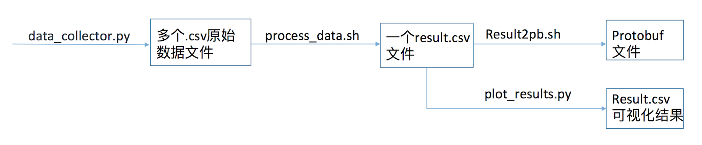
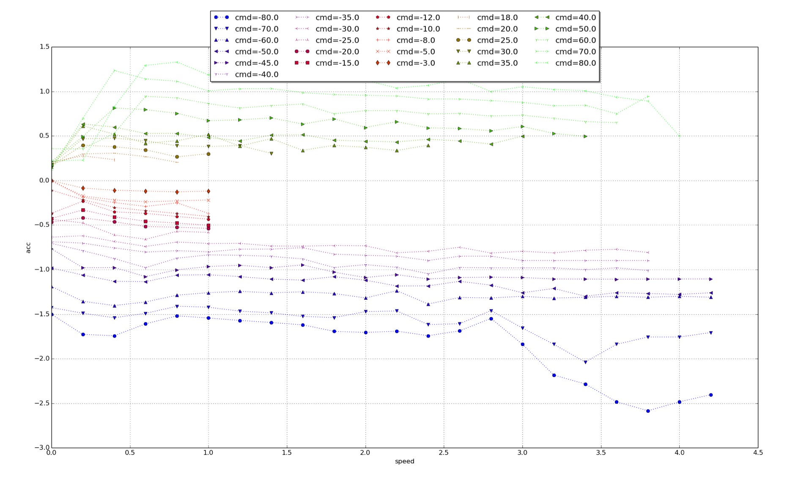

车辆动力学标定
===================

## 目录
      
 - [概览](#概览)
	     
 - [油门刹车标定](#油门刹车标定)
    - [标定原理介绍](#标定原理介绍)
	 
    - [标定流程说明](#标定流程说明)

## 概览

该用户手册旨在帮助用户在开发套件上进行动力学标定。

## 油门刹车标定

油门刹车标定是车辆纵向精准控制的前提。用户可以使用系统预先标定好的参数，也可以按照手册说明重新进行标定。
注意：完成本标定后，才可以启动循迹！

### 标定原理介绍
在Apollo系统中，控制模块会请求加速度量值。通过车辆标定表，控制模块便能找到准确产生所需加速度量值对应的油门、刹车踏板开合度控制命令，之后下发给车辆底盘。车辆标定表提供一个描述车辆速度、油门／刹车踏板开合度、加速度量之间关系的映射表。油门刹车标定过程便是生成车辆标定表的过程。

Apollo系统为开发套件提供了一份默认的标定表。如用户期望自己重新标定车辆，可以参考以下车辆标定流程说明。

### 标定流程说明

按如下顺序完成准备工作:

- 改变驾驶模式
- 选择测试地点

#### 改变驾驶模式
  在`modules/canbus/conf/canbus_conf.pb.txt`中，设置驾驶模式为 `AUTO_SPEED_ONLY`。

#### 选择测试地点
  理想的测试地点是平坦的长直路，且两边没有高大的建筑物遮挡。

以上准备工作完成后, 在`modules/tools/calibration`中按顺序完成如下工作：

- 采集数据
- 处理数据
- 绘制结果
- 转换结果为`Protobuf`格式





#### 采集数据

1. 在采集数据之前，请先进入docker在终端中打开canbus模块，gps模块和localization模块，命令如下：
```
bash /scripts/canbus.sh
bash /scripts/gps.sh
bash /scripts/localization.sh
```
在依次输入完以上三个命令后，可用遥控器开着车走一小段距离，过两分钟之后，在diagnostic中可以看到以上三者都有信号时，便可以进行下面的操作了。 

2. 运行 modules/tools/calibration/  下的 `python data_collector.py`, 之后输入参数x y z, x 代表加速踏板开合度（百分比正值）, y 代表了速度限值(米／秒), z 代表刹车踏板开合度（百分比负值）。输入参数后，车辆即开始以x加速踏板值加速至y速度限值，之后再以z刹车踏板值减速直至车辆停止。 

3. 产生对应x y z 参数的csv文件。 比如输出指令 `15 5.2 -10`，将会生成名为`t15b-10r0_recorded.csv`的文件。 

4. 根据车辆反应情况选取合适的x y z 参数，如加速踏板过小不能启动或者刹车踏板过小不能停车，需要相应调整命令参数。


x y z取值建议： 
x: 过低可能无法启动，通常20以上。通过实验，获取能启动车辆的最小值供后续设置使用。最大取值取决于应用场景要求。在小加速踏板区间建议取值间隔粒度小，以获取更丰富数据。 
y: 单位米/秒，根据车型和实际应用场景确定​。 
z: 刹车踏板，-35已经是急刹车。通过实验，获取能制动车辆的最小值供后续设置使用。取值范围取决于应用场景要求，同时，建议采集急刹车数据。在小减速踏板区间建议取值间隔粒度小，以获取更丰富数据。 

x y z参数组合取值建议： 
一般先固定加速踏板命令 x ，之后再选择该加速踏板命令所能达到的最大速度或车型限速，最后尝试采集能让车辆停下来的最小减速命令z： 
（21 5 -8）
之后再逐一更改加速踏板命令 x ，直到期望采集的 x 取值都已经覆盖​ 
（22 5.3 -8） （23 5.4 -9） （24 5.6 -9）（25 5.6 -9）​ 
（26 5.6 -9） （27 5.7 -10） （28 5.7 -10）（29 5.8 -10） 
（30 5.8 -10）（33 5.9 -10）（38 6.1 -12）（43 6.1 -12）
之后再看期望采集的减速指令 z 取值是否都已经覆盖，如未覆盖再增加测试组合丰富 z 取值，对应 y 取值要尝试能让车辆停下来的最大速度（38 6 -11）。

#### 处理数据
运行`process_data.sh {dir}`，其中dir为类似`t15b-10r0_recorded.csv`文件所在的目录。每个数据日志被处理成类似`t15b-10r0_recorded.csv.result`的文件。同时，会生成一个名为result.csv的文件。

#### 绘制结果
运行`python plot_results.py {dir}/result.csv`, 其中dir为result.csv所在目录，得到可视化最终结果，检查是否有异常，示例如下：



#### 转换结果为`Protobuf`格式
如果一切正常，运行`result2pb.sh {dir}/result.csv`, 其中dir为result.csv所在目录，把校准结果result.csv转换成控制模块定义的`Protobuf`格式。运行命令后生成control_conf_pb.txt文件。该文件里面的lon_controller_conf字段下面的calibration_table段落是我们需要的，我们将该calibration_table段替换放到文件/modules/calibration/data/dev_kit/control_conf.pb.txt下对应的lon_controller_conf字段下面的calibration_table段。

最后，把前面实验获取的启动车辆的最小 x 值和能制动车辆的最小 z 值替换 /modules/calibration/data/dev_kit/vehicle_param.pb.txt 文件里的throttle_deadzone、brake_deadzone 字段。

注：Calibration_table 片段示例

    calibration_table {
	    calibration {
	      speed: 0.0
	      acceleration: -1.43
	      command: -35.0
	    }
	    calibration {
	      speed: 0.0
	      acceleration: -1.28
	      command: -27.0
	    }
	    calibration {
	      speed: 0.0
	      acceleration: -1.17
	      command: -25.0
	    }
	    calibration {
	      speed: 0.0
	      acceleration: -1.02
	      command: -30.0
	    }
	 }

