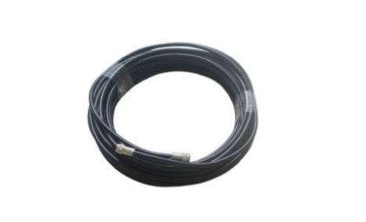
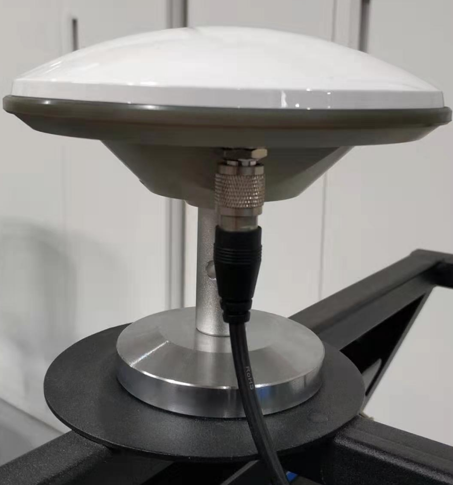
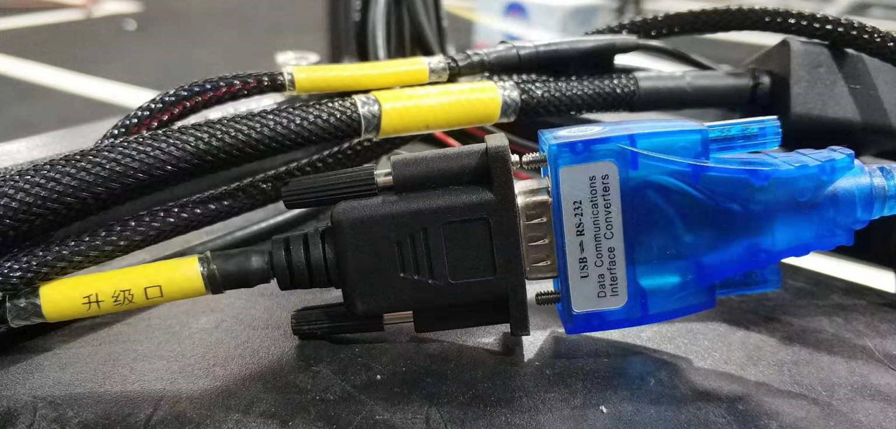
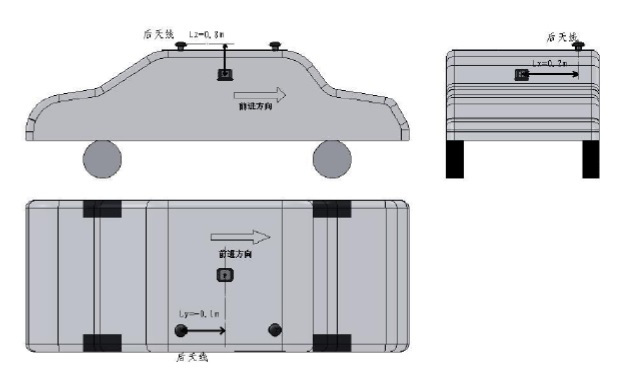

车辆集成
===================

## 目录
      
 - [概览](#概览)
 - [工控机安装](#工控机安装)
 - [导航设备安装](#导航设备安装)

## 概览

该手册旨在帮助用户在自动驾驶开发套件上安装和配置IPC和GPS导航等相关设备。设备集成后的硬件连接图如下所示：

## 工控机安装

工控机的安装包括工控机主机的安装、显示器的安装、CAN线的安装、路由器的安装和无线键盘的安装，分别介绍如下：

- 先将工控机的两个安装底座套上八个黑色的圆形橡胶垫片，然后用银色的螺丝钉将两个底座和工控机安装在一起；再将工控机主机安装在小车的底板的中心位置的四个固定的安装小孔上，使用银色的螺丝钉固定使其与小车的底板固连，将工控机的主板接口朝向小车的尾部以便于我们连接显示器等其它设备。工控机的电源接口接小车上的24V的直流电源。
- 将显示器安装在小车的车架预留的安装位置并用卡扣将显示器固定好。用HDMI数据线将显示器和工控机的显卡连接起来。显示器的电源线接小车上的12V的直流电源。
- 将CAN线的一端接在工控机的CAN卡的上面一个接口上，为防脱落，请拧紧螺丝固定好CAN线，将CAN线的另一端和小车的车身CAN线连接在一起。
- 将路由器安装固定在小车的底板上，可用强力双面胶粘住以防脱落。路由器的电源接口接小车上的12V的直流电源。路由器的sim卡插口插入我们平时使用的手机sim卡即可。注意sim卡插入时可能需要卡托，请选用尺寸大小合适的卡托将sim卡插入插口并注意正反面不要插反。用网线将路由器的LAN口和工控机的网口连接起来，以使路由器可以给工控机提供网路服务。
- 将无线键盘的信号接收器插入工控机的USB接口上，装入电池并打开无线键盘的开关。

## 导航设备安装

星网宇达Newton-M2是一款支持静态双天线初始化的GPS导航设备，其在Apollo系统中的安装配置主要包括硬件设置和软件配置两个部分，下面介绍硬件设置部分：

### 安装主机和天线
本安装指南描述了挂载、连接和为主机与天线量取和设置杆臂值尺寸的步骤：

#### 安装需要的组件

- Newton-M2主机（1个）

- 卫星天线（2个）：测量型卫星天线，信号接口为TNC母口

- 射频连接线（2根）：射频线两端分别为TNC公头和SMA母头

- 数据/电源线缆（1根）：一端是和主机相连的接口，另一端含有一个串口母头，一根RJ-45网线母头，一根电源接口和一个USB接口

#### 挂载
使用者可以将主机安装在载体上的任何位置，但我们强烈建议使用者采用下述的建议方案：

- 将M2主机安装在小车的后轴的中心位置上，使主机铭牌上标示的坐标系XOY面尽量与载体坐标系平行并保持各轴向一致，将Y轴的正向保持与载体的前进方向一致，M2主机单元必须与被测载体固连，可用强力双面胶进行粘贴。
- GNSS双天线应尽量与载体坐标系Y轴平行并且前天线（Secondary）应在Y轴正方向上，GNSS天线要尽可能的将其安置于测试载体的最高处以保证能够接收到良好的GNSS信号。将天线分别安装在小车的车架头尾预留的小圆片上。

#### 配线
执行如下步骤将主机和天线连接到Apollo系统：

- 将两根射频线的TNC公头连接上卫星天线的TNC母口。

- 将射频线的SMA母口连接上IMU主机的SMA公口，车尾天线为主天线，将其连接在IMU的Primary接口上。

- 将数据/电源线缆的公口和IMU主机的母口连接。

- 将数据/电源线缆的串口母头连接上工控机的串口公口COM1，此线若过短，请使用串口延长线。注意：此线在完全配置完IMU之后就不需要再连接在IPC上了。

- 将数据/电源线缆的网线母头和路由器LAN口接出来的有线网的水晶头相连接。

- 将数据/电源线缆的USB接口连接上IPC的USB接口。

- 将数据/电源线缆的电源线接口和小车的12V电源接口连接起来。

#### 量取杆臂值

在后面配置IMU的参数时，我们会用到主天线的杆臂值，这里我们先量取并记录下它留作后用。杆臂值的量取参考下述步骤：

- 当主机和天线处在正确位置时量取天线到主机的距离。主机的中点和天线的中点标记在设备的外部。
- 距离被测量并记录为X轴偏移、Y轴偏移和Z轴偏移。坐标轴由主机的位置确定。偏移量的误差应该被控制在一厘米以内以获取高精度的定位信息。杆臂是指后天线（Primary）的几何中心位置相对于主机几何中心在直角坐标系内x,y,z三方向的位置差。通过如下指令进行补偿设置：`$cmd,set,leverarm,gnss,x_offset,y_offset,z_offset*ff`。x_offset:X方向的杆臂误差，单位为米，以此类推。注：上述坐标XYZ为设备坐标轴配置后的实际坐标，一般应与载体坐标系一致，注意补偿的是后天线（Primary）杆臂值。当进行导航模式配置后必须对设备进行重新上电启动。举例如下：

如上图所示：后天线在M2主机X轴的正向0.2m处，则X轴偏移x_offset的值为0.2；后天线在M2主机Y轴的负向0.1m处，则Y轴偏移y_offset的值为-0.1；后天线在M2主机Z轴的正向0.8m处，则Z轴偏移z_offset的值为0.8，则杆臂值为(0.2,-0.1,0.8)。
