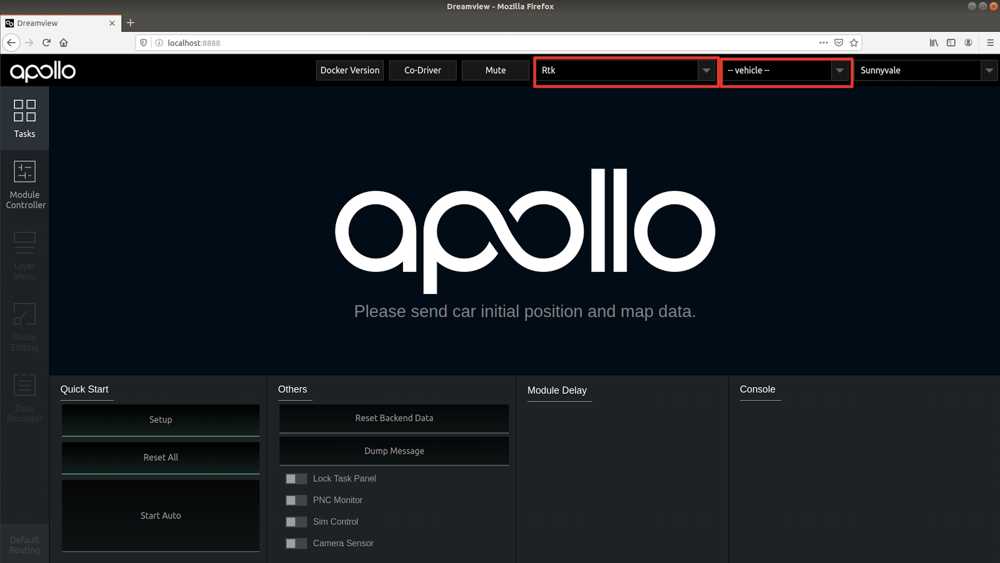
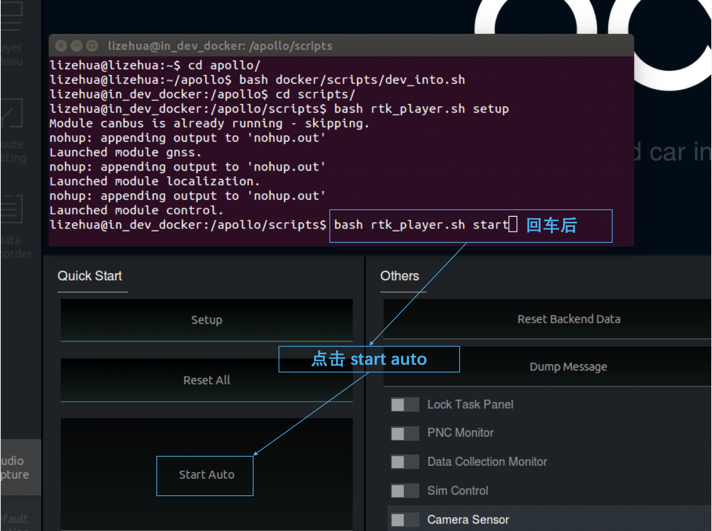

# 循迹搭建--车辆循迹演示

- [循迹搭建--车辆循迹演示](#循迹搭建--车辆循迹演示)
    - [概览](#概览)
    - [车辆配置文件准备](#车辆配置文件准备)
    - [循迹启动](#循迹启动)
        - [1. 启动can卡](#1-启动can卡)
        - [2. 编译项目，启动Dreamview](#2-编译项目启动dreamview)
        - [3. 启动所需模块](#3-启动所需模块)
        - [4. 检查各模块数据是否正确](#4-检查各模块数据是否正确)
        - [5. 循迹录制](#5-循迹录制)
        - [6. 循迹回放](#6-循迹回放)
    - [调试](#调试)
        - [1. 底盘连接是否正常](#1-底盘连接是否正常)
        - [2. canbus_teleop的使用](#2-canbus_teleop的使用)
    - [常见问题](#常见问题)
        - [1. 网络断开或者网络太差无法进入docker](#1-网络断开或者网络太差无法进入docker)
        - [2. 无法控制汽车底盘和读取底盘信号](#2-无法控制汽车底盘和读取底盘信号)
        - [3. Teleop进入不了自动驾驶模式](#3-teleop进入不了自动驾驶模式)
        - [4. chassis_detail不显示](#4-chassis_detail不显示)
        - [5. apollo系统第一次搭建完毕，测试发转角车辆实际转角不对](#5-apollo系统第一次搭建完毕测试发转角车辆实际转角不对)
        - [6.循迹bash rtk_player.sh开始后，车辆不动](#6循迹bash-rtk_playersh开始后车辆不动)
        - [7.循迹刹车地点不准确，或者刹车停不下来](#7循迹刹车地点不准确或者刹车停不下来)
        - [8.循迹效果不佳](#8循迹效果不佳)


## 概览

该用户手册旨在帮助用户在开发套件上实现循迹功能。

## 前提条件

1. 在进行车辆循迹前，需要完成以下前提工作：

- [循迹搭建--车辆集成](Vehicle_Integration_cn.md)
- [循迹搭建--Apollo系统安装](Apollo_Installation_cn.md)
- [循迹搭建--定位模块配置](Localization_Configuration_cn.md)
- [循迹搭建--车辆动力学云标定](Vehicle_Calibration_Online_cn.md)

2. 确保在开阔场地、车少人少等相对安全的情况下实验。

3. 确保至少两人操作，一人操作工控机，一人操作遥控器，做好随时接管准备。

## 车辆配置文件准备

在`/apollo/modules/calibration/data/`目录下Apollo支持车型的配置参数，开发套件的配置参数在`/apollo/modules/calibration/data/dev-kit`文件夹下，可以看到如下配置信息：


- `camera_conf`时相机的配置文件。
- `camera_params`目录是相机的标定参数。
- `cancard_params`目录是CAN卡的相关配置文件。
- `gnss_conf`目录主要是关于GPS相关配置文件，包含的文件`gnss_conf.pb.txt`是关于基站配置，具体内容在定位配置部分已经作了说明，必须保证信息正确。
- `gnss_params`目录主要是关于IMU的杆臂值的配置参数。
- `radar_conf`目录是毫米波雷达的相关配置文件。
- `radar_params`目录时毫米波雷达的标定参数。
- `vehicle_params`目录下是关于车辆`translation`和`rotation`相关设置，不用修改。
- `velodyne_conf`目录是激光雷达的相关配置文件。
- `velodyne_params`目录是激光雷达的标定参数。
- `control_conf.pb.txt`文件是控制配置文件，包含了全部的控制参数，需要调整开发套件控制参数时，请调整此文件内容。
- `vehicle_param.pb.txt`是关于车辆的基本参数。

在循迹开始前，需要对`gnss_conf`，`gnss_params`，`control_conf.pb.txt`，`vehicle_param.pb.txt`内参数进行确认，车辆基本参数选择默认即可。

除了车辆相关配置外，还需要注意canbus模块的配置:

1. `modules/calibration/data/dev-kit/cancard_params/canbus_conf.pb.txt` 修改如下：
```
enable_debug_mode:true
enable_receiver_log:true
enable_sender_log: true
```
这三行用于打开debug信息。

2. `modules/canbus/conf/canbus.conf` 修改如下:
```
--enable_chassis_detail_pub
--noreceive_guardian
```
第一行打开/apollo/canbus/chassis_detail消息，第二行关闭guardian模块。


## 循迹启动

### 1. 启动can卡

进入can卡目录启动can卡，用以下命令启动

    cd ~/SocketCan/
    bash start.sh

### 2. 编译项目，启动Dreamview
进入docker环境，用gpu编译项目，启动DreamView

    cd /apollo
    bash docker/scripts/dev_start.sh
    bash docker/scripts/dev_into.sh
    bash apollo.sh build_opt_gpu
    bash scripts/bootstrap.sh

### 3. 启动所需模块

在浏览器中打开`(http://localhost:8888)`，在`--setup mode--`内，选择模式为`Rtk`， 在`--vehicle--`选择车型`Dev_Kit`。



在docker内启动Canbus模块、GPS模块、Localization模块：

    bash scripts/canbus.sh
    bash scripts/gps.sh
    bash scripts/localization.sh

### 4. 检查各模块数据是否正确

在docker中输入`cyber_monitor`命令并检查以下channel（使用`上下方向键`选择channel，使用`右方向键`查看channel详细信息）：

|channel_name | 检查项目 |
|---|---|
|`/apollo/canbus/chassis`|确保能正常输出数据|
|`/apollo/canbus/chassis_detail`|确保能正常输出数据|
|`/apollo/sensor/gnss/best_pose` | 确保能正常输出数据、`sol_type:` 选项显示为`NARROW_INT`|
|`/apollo/localization/pose`| 确保能正常输出数据 |

### 5. 循迹录制

1）在空旷场地内，将车辆遥控至循迹起点，记录此时车辆车头方向和所在位置。

**注:** 可以在车辆左前轮处画一个十字符号，记录车辆的起点。


2）启动`rtk_recorder`脚本录制循迹数据，在`docker`内输入以下命令：

- 进入`apollo/script`目录，如当前目录已经是，请忽略此步

    cd /apollo/scripts

- 重置

    bash rtk_recorder.sh setup

- 开始录制

    bash rtk_recorder.sh start

执行此命令后，可以看到`docker`内有大量显式log在刷屏，这时使用**遥控器**，遥控车辆**前进**一段轨迹，到达期望的终点，让车辆停止后，在`docker`内按`Ctrl + c`结束循迹录制。

- 结束录制

    Ctrl + c


结束录制循迹轨迹后，docker内会提示录制的循迹数据在`apollo/data/log/garage.csv`中，文件内包含了车辆的轨迹、速度、加速度、曲率、档位、油门、刹车、转向等信息。

### 6. 循迹回放

1）将车辆开回至之前循迹录制时标记的起点，注意车辆的**起点位置**和**车头朝向**都尽量与循迹录制时起点保持一致，**遥控器放权**。


2）启动`rtk_player`脚本进行循迹回放，在`docker`内输入以下命令：

- 进入`apollo/script`目录，如当前目录已经是，请忽略此步骤。

    cd /apollo/scripts

- 重置

    bash rtk_player.sh setup

- 开始回放

    bash rtk_player.sh start

**这个命令敲完回车后，车还不会进入自动驾驶**，这一步只是把循迹数据放出来，如果车辆没有前进，则会不断`replan`，此时命令行中会有log不停刷屏，第一次尝试循迹时，先检查`dreamview`是否有清晰无毛刺的蓝色规划轨迹，请确认轨迹是否与期望的大致相符，如果相差很大，比如本来录制的是直行，而蓝色轨迹显示的大幅度转弯，此时要小心测试，谨防危险。

3）然后在`Dreamview`中点击`start auto`，这时候车辆开始启动，可能开始起步比较猛，多注意接管。


4）车辆循迹自动驾驶至终点后，车辆停止，这时命令行内还在不断刷屏打印显式log信息，按`Ctrl + c`结束循迹回放脚本。

- 结束回放

    Ctrl + c

注意事项：一定要在宽阔的场地进行测试，确保周围没有人，循迹测试之前做好应急接管准备，有问题随时遥控器接管。不要轻易尝试速度大于4m/s(16km/h）的循迹。


## 调试

### 1. 底盘连接是否正常
 
硬件连接：确保CAN硬件连接线CAN0和车辆线控底盘连接正常，线控底盘开关处于打开状态，进入Ubuntu Docker环境，输入以下命令：

```
cd /apollo/scripts
bash bootstrap.sh
bash canbus.sh  //启动canbus模块
cyber_monitor
```

在cyber_monitor界面中应该能看到如下的模块：


用键盘上下箭头移动光标选择`chassis`或者`chassis_detail`，选中后按右箭头可以进入查看详细信息，这些信息即是车辆底盘信息，`chassis`消息如下： 

 

Chassis detail消息如下： 

 

如果这些信息得到正确显示，说明CANBUS模块工作正常。如果不能显示底盘信息，很大可能是CANBUS有问题，或者底盘有问题，没有向上反馈底盘数据。 
保证CANBUS的连接正确性，才能确定工控机计算单元可以控制车辆底盘，才能继续其它部分的调试。 
 
### 2. canbus_teleop的使用 
 
CANBUS能够连接底盘后，我们可以尝试控制底盘的运动。如果控制正常，则说明工控机计算单元下发命令后得到正确执行。 进入Ubuntu Docker环境，输入以下命令：

```
cd /apollo/scripts 
bash canbus_teleop.sh 
```

弹出界面如下： 

 
 
a 根据提示按`m0`重置系统，按`m1`是开始控制底盘。
b 按几次`a`或者`d`，看看车轮是否转动。 
c 按`g1`，挂前进档，按几次`w`，看车辆是否前进，按几次`s`看车辆是否停下来。 
请小心测试，不要轻易长时间连续按键，以防车辆突然高速动作发生事故。


 
## 常见问题

调试过程中，常见的问题及解决办法总结如下：

### 1. 网络断开或者网络太差无法进入docker
报错如下：


主要是因为网络没有连接上，或者网络太慢，请检查网路。

可以执行`bash docker/scripts/dev_start.sh -n`，`-n`参数表示不联网下载`docker image`更新，直接使用本地镜像。

### 2. 无法控制汽车底盘和读取底盘信号

具体表现是车辆下发油门转向等信号，底盘不执行，也读不到底盘的相关信息，这时候的原因应该是CAN不通。解决方法如下：

1） ESD CAN卡安装的时候跳线帽是否正确设置。跳线不正确，CAN不通。

2）如果（1）已经正确问题仍然存在，有可能是车辆底盘没有正确接收处理CAN信号，尝试整车断电重启。

3）如果（2）尝试了，仍然没有解决，用CAN调试工具，看底盘是否有信号上报，以及apollo执行的时候，是否有命令下发。

### 3. Teleop进入不了自动驾驶模式 

 打开`canbus.sh`后，执行`canbus_teleop.sh`始终无法进入自动驾驶模式，CAN调试工具测量底盘信号是通的。这种情况，有可能是guidian模块打开造成，guidian模块是一种安全保护机制，开发者调试阶段，可以根据需要关掉。
 打开`/apollo/module/canbus/conf/canbus.conf`：
 修改`--receive_guardian`为`--noreceive_guardian`。

### 4. chassis_detail不显示

1）查看`dreamview`内否选择了`Dev_Kit`车型，如果不确认可以先选择其它车型后，重新选择`Dev_Kit`；

2）查看canbus配置文件`/apollo/module/canbus/conf/canbus.conf`内是否打开chassis_detail，如没有打开，把`--noenable_chassis_detail_pub`修改为`enable_chassis_detail_pub`，重启`canbus`后生效。

3）查看硬件CAN线接口有没有松动。

### 5. apollo系统第一次搭建完毕，测试发转角车辆实际转角不对

例如下发转向角10%，但是转动角度远超过转向最大角度的10%，可以在cyber_monitor中查看 /apollo/canbus/chassis及时观察底盘信号，apollo默认是Lincoln车型，如果使用者第一次搭建好apollo，还没有选择车型那么默认会按照lincoln车的最大转向角乘以百分比去执行。解决方法如下：检查modules/canbus/conf/canbus_conf.pb.txt中的配置，brand设置为正确的车型（例如Dev-Kit），重启canbus，再尝试。如何仍然未解决，请运行bootstrap.sh脚本，在dreamview中选择对应的车型，例如D-kit开发套件。然后点击界面上的reset all，再点击setup。

### 6.循迹`bash rtk_player.sh`开始后，车辆不动

1）查看遥控器是否放权


### 7.循迹刹车地点不准确，或者刹车停不下来

很可能是标定没有做好，标定刹车部分没有做好，急刹缓刹都要考虑。

### 8.循迹效果不佳

纵向效果不好，请考虑标定表和PID参数调整以及车辆本身的信号（例如油门和刹车下发和上报是否一致），横向误差大，主要考虑LQR参数调整和车辆转向信号（下发和上报是否一致）。
