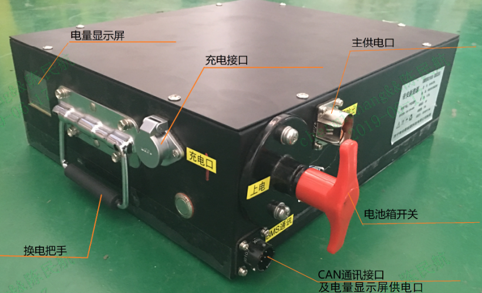
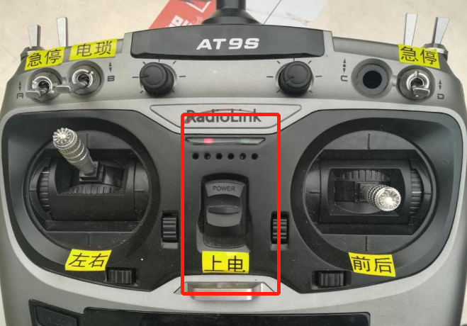
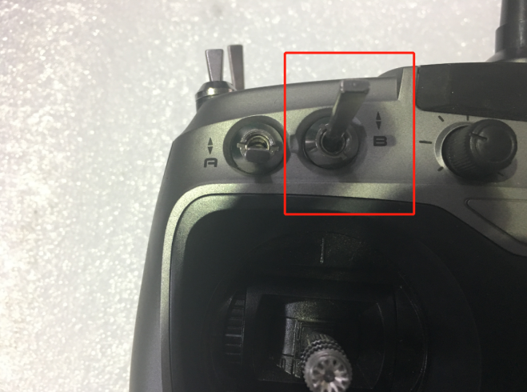
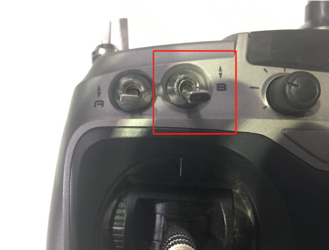

# **目    录**

# **快速介绍**
欢迎您选择百度Apollo联合酷黑科技推出的自动驾驶套件，一款为开发者而生的自动驾驶开发软硬件平台。该套件采用纯线控底盘+高扩展硬件结构平台的方式，搭载多传感器套件，参照多冗余安全机制设计并可提供持续的开发资源，帮助您轻松实现硬件集成，降低自动驾驶门槛，加速您的自动驾驶研发进程。此quick start旨在帮助您快速了解Apollo套件的组成和使用注意事项，确保安全同时延长套件的使用寿命。

**1. 车体整体结构简介**

本产品主要由两部分组成，分别为底盘部分以及车体部分，如下图：
 

整车右后视图  ①车体部分 ②底盘

其中底盘包含如下部件，其结构图如下：

上装车体的结构如下图所示：

车体整体安装实物如下：

 

注意：下图所示为底盘CAN线和底盘升级口，细的一根线是底盘CAN线，与IPC CAN0连接。粗的一根线是底层软件升级口，不常用，后续面临版本升级时会开放使用；接线时请注意不要接错。  

             

 

**2. 电池**

**简介**

本产品采用的是模块化锂电池组，电池组有正面和侧面两个操作面。其布置如图所示：

电池箱开关横置时为开启状态，竖立时为关闭状态。

**取放方式**

电池组安装在底盘右侧的检修口内部，安装方式如下：
1）确保车辆停放在安全位置，全车处于断电状态，同时电池开关位于关闭位置；

 

2）拆卸下图中红框所示的两个螺栓，移除电池固定板，将电池组放入检修口内；

 

3）将电缆与相应的高压放电插口和低压通讯插口连接妥当；

  

4）重新安装两个螺栓，确保电池固定板没有晃动的情况。

 

 如果需要拆卸电池组，步骤相似。

* 警告：在确保全车断电且电池开关处于关闭状态下进行操作。
* 警告：请勿擅自使用其他型号或品牌的电池组，否则可能出现安全风险。
* 警告：请不要在电池出现破损或是故障后继续使用。否则可能导致电池损坏或人员伤亡。
* 警告：电池出现故障或报废后，请合理处置电池，遵守当地法规，否则可能导致严重环境污染。

**充电方式及注意事项**   

请按照如下操作流程对电池进行充电：

1）请先按照本手册3.2的操作顺序将电池从底盘上拆卸下来；

2）确保电池开关位于关闭状态；

3）将电源线与电池组连接，将电源线插入插座中；

4）将电池开关置于开启位置，开始充电，充电指示灯亮起；

5）充电结束后，将电池开关置于关闭位置，然后拆卸电源线。

       注：电池充电器有两种不同的型号，这两种型号的充电器的性能和充电效率是完全一样的，充满电都会有绿灯提示；两种充电器随机发货。
* 警告：充电时，严禁触碰电池组输出端口！
* 警告：本产品严禁在电池组进行供电时进行充电操作！
* 警告：确保只使用原装适配的充电器对电池进行充电，否则有损坏或起火的危险！
* 警告：为保证运行安全及电池寿命，ECU设定的截止放电量为10% SOC，电量低于10%时请不要继续使用。一般测试建议电量低于20%时就断电进行充电操作。
* 警告：电池需按照3.2电池取放方式拆卸后方可进行充电，禁止在车上直接给电池充电。

**上电及断电**

在上电/断电之前，先确保车辆停放在安全位置，并将急停开关拍下。

**1）上电**

按照3-2中的指示将电池组装入底盘检修口；
将电池开关置于开启位置；

将底盘左侧面上的总电闸拉起，就可以为全车上电。

**2）断电**

将底盘左侧面上的总电闸拉下

将电池开关置于关闭位置，即可完成全车断电。

**3. 遥控器及注意事项**

**遥控器介绍**

此遥控器采用8节5号电池进行供电，此外具有以下控制单元：

* 电源控制开关——power
* 左右控制摇杆
* 前后控制摇杆——前进档/后退档
* 电锁开关——B
* 急停开关——A/D
* 缓刹开关——H
* 调试开关——G，正常使用默认位于最下位置，拨起会使遥控器进入调试模式，影响您的正常使用。

注意：C/E/F目前处于空值状态，G为调试通道开关，操作遥控时默认开关C/E/F/G处于朝下（关闭状态）。
* 警告：出于安全考虑，在遥控器开启电源前请确保所有开关均处于关闭状态。
* 警告：进行电池更换操作前请关闭遥控器电源开关，以免出现危险情况。
* 警告：操作前后控制摇杆时，虽然相反的方向拨动摇杆会刹车，但是也会切换档位（D/R），容易造成车辆向相反方向行进，正常测试或者采集数据时请稳定控制好拨杆，并使用缓刹开关进行刹车，危险情况下请打开遥控器A/D急停。
* 警告：遥控器电池长期不用建议取出，更换电池对接插针时请仔细识别正负。除8节5号电池外，您也可自行适配12V的可充电电池。
* 警告：遥控器电量不足时，会表现出遥控器上屏幕时暗时亮，在这种情况下，遥控会出现迟滞、不响应等情况，请及时更换电池。

**开启和关闭**

开启：

1）开启遥控器电源

 

2）开启电锁开关 

  

关闭：

1）先关闭电锁开关

 

2）关闭遥控器电源

 
* 提示：此底盘具有检测遥控器信号是否失联的自动保护功能，当底盘发现遥控器在没有关闭电锁的情况下失去信号，底盘会自动刹车；如果关闭遥控器电源先于关闭电锁，会让底盘误以为是遥控器信号失联，也会触发自动刹车保护。
* 警告：为了延长油压碟刹的寿命，长期停车时候避免处于制动状态。

**电锁**

电锁为遥控器的第二级开关，只有当电锁开关打开时，底盘才能够接受遥控器的控制，同理，如果车辆运行在自动驾驶模式下，想要使用遥控器接管车辆控制权必须首先打开电锁开关，否则无法接管成功。

**急停**

车辆急停由两个串列的急停开关控制，在电锁开关打开的状态下，开启这两个急停开关中的任意一个都将触发急停。
提示：当触发急停时，底盘前进后退控制无效。只有当两个急停开关同时处于关闭状态时，刹车才会释放，使操作人员可以控制车辆。

**转向及行进**

车辆的转向及行进由位于控制器中部的两个摇杆控制，在电锁开关打开的状态下，左侧摇杆控制车辆转向方向，右侧摇杆控制车辆前进和后退。
提示：摇杆带有自动回位功能，松开方向摇杆，底盘方向会自动回正；松开前进后退摇杆，底盘会停止运动。

* 警告：出于安全考虑，在人工接管驾驶时，请不要来回拨动遥控杆，避免突然刹车、突然转向等可能导致危险情况的出现。

**遥控器安全机制**

为了您的安全，在进入自动驾驶模式前，请务必提前熟悉遥控器的各项操作，尤其关于急停功能的使用，请在每次进入自动驾驶模式前进行遥控操作确认。为了您的安全，我们已在工控机与底层ECU协议层定义了遥控器的绝对优先权，即平台移动的任何状态下（请在每次运行前确保遥控器电量充足），只要遥控器上电且电锁推起，平台即进入人工接管模式，为您的安全测试保驾护航。
* 警告：出于安全考虑，任何人在进行遥控器的操作前都应该仔细阅读相关说明和注意事项，请不要将遥控器交给不熟悉相关操作的人员使用，以免发生危险。
* 
**4. 硬件软件安装与调试**

在了解了第3、4节的内容后，您已经可以使用遥控器完成非自动驾驶模式下的各项移动操作。由于与自动驾驶相关的硬件与软件的安装与调试过程较为复杂，相关的指引请参照其它文档。
您可以直接在电脑端打开如下链接查看：[开发套件使用手册](https://github.com/ApolloAuto/apollo/blob/r3.0.0/docs/specs/apollo_3.0_development_kits_user_manual_cn.md)
https://github.com/ApolloAuto/apollo/blob/r3.0.0/docs/specs/apollo_3.0_development_kits_user_manual_cn.md

**5. 使用场景限制**

请参考产品手册。

**6. 车辆安全机制**

**限速保护**

无论自动驾驶模式或是遥控驾驶模式，ECU会将车速限制在一个比较安全的范围。小车的最高速度被限制为前进20km/h，后退10km/h，以防止严重的碰撞事故（为了实验安全，遥控或线控超出该速度范围会直接触发急停予以警告）。正常测试使用建议车速在~10km/h。
注意：安全起见，遥控驾驶车辆时建议最好将车速控制在10km/h左右，并时刻注意危险情况，随时做好接管准备，正常测试建议遥控器专人负责。

**遥控接管优先级定义**

当车辆处于自动驾驶模式时，如果出现偏离航向、车速过快或者有碰撞风险时，可以直接使用遥控器接管车辆的控制，遥控器所发出的控制指令的优先级永远高于自动驾驶系统所给出的控制指令，详细操作见4-1。

**急停开关**

急停开关位于车辆后方左下方，其实际位置如下图红框所示：

 

​                            图6.1 急停开关实际位置图
当车辆在自动驾驶模式中有碰撞风险且无法使用遥控器时，随车人员可以根据实际情况选择拍下急停开关来实现全车制动，有效规避风险。

* 提示：急停开关被拍下后，车轮将会抱死，遥控器的指令也将无法对车辆进行操控，必须要在旋开急停开关以后，才能继续进行操作。

**碰撞保护**

车辆前后分别有一条防撞条，能够感应防撞条与车体间的压力从而判断是否发生了碰撞。当发生轻微碰撞时，碰撞保护触点开关感受到压力就会立即解除动力，并会出发刹车，待车停稳后自动复位，以防进一步伤害。此外，防撞条本身也能形成有效的隔离，一定程度上保护车辆和被撞物体。
 

**7. 常见问题及解决方法**

**Q：车辆不启动怎么办？**

A：首先请检测电池组是否为有电，电池组安装是否正确（包括接线是否正确），之后检查车辆是否正确上电。如经过上述操作仍无法启动，请在Apollo开发套件QA微信群反馈，会有相关技术人员为您跟进。

**Q：控制器长鸣是什么问题？**

A：出现控制器上电后长鸣现象，请确认急停开关是否开启，如急停开关已打开，依然长鸣一般为制动管路有泄露导致制动油压压力不足，控制器无法通过初始化安全自检，不能进入工作状态，可更换刹车油重启尝试。如确认制动管路正常且控制器依然长鸣，请在Apollo开发套件QA微信群反馈，会有相关技术人员为您跟进。

**Q：车辆不响应遥控指令怎么办？**

A：首先检查遥控器的两个急停开关是否处在关闭位置，然后检查遥控器电源开关是否处于开启位置，检查遥控器是否有电以及电锁开关是否处在开启位置。如上述操作后仍不能解决问题，请在Apollo开发套件QA微信群反馈，会有相关技术人员为您跟进。

**8. 日常保养和维护**

**清洁和存储**

1）底盘及车架如有灰尘或是污渍，可以用湿布进行擦拭；其它上装传感器器件也可以用同样的方式进行清洁，但是需要在擦拭过后用干布擦去表面的水分；工控机由于内部零件较为敏感且容易积攒灰尘，需要打开进行清洁。
2）摄像头在不使用时需要确保盖上相机盖，以免灰尘影响图像质量。
3）请勿随意使用酒精、汽油、煤油或其他具有腐蚀性、挥发性的溶剂对各个部位进行清洁。这些物质可能会损坏车体结构或是内部部件。
4）在进行清洁前，请确保车辆已经正确断电，否则可能导致漏电、触电的后果。
5）不使用时，请将车辆放在阴凉、干燥的位置，并用防尘罩进行遮蔽。请不要将车长时间存放在户外，过冷和过热都会对器件的寿命产生影响。

**电池**

1）不要将电池组放置在超过 50℃的高温或低于 -20℃的低温环境中（例如，请勿将其电池组放在夏天曝晒下的汽车中）。
2）避免电量完全耗尽再充电，尽量即充即用，这样可大大延长电池的使用寿命。另外，在常温下使用，电池组可发挥较高的续航里程和性能。
3）为了避免电池过放，每隔1个月对电池进行充电和放电。如长时间存放，将电池拆卸，并保持间隔1个月的充放电操作。
提示：非专业人员禁止随意拆卸电池组，否则可能因电击或短路导致严重安全事故！

**车体部件**

1）建议每隔1年更换一次制动液。并定期向底盘车轴、轮轴等位置补加润滑油。
2）每隔一段时间，请对轮胎胎压进行检查，如果胎压过低，请及时打气或是更换轮胎。
3）请不要在胎压过低甚至轮胎漏气的情况下启动车辆进行任何作业，以免产生不必要的危险。

**9. 免责声明**

1）. 本手册在印刷时已尽可能的包含各项功能介绍和使用说明。但由于产品功能不断完善、设计变更等，仍可能与您购买的产品有不符之处。由于产品更新，本手册与实际产品在颜色、外观等方面可能有所偏差，请以实际产品为准。  
2）. 为保护用户的合法权益，请您在使用本产品前务必仔细阅读我们随附本产品提供的说明书。套件提供商保留对上述文档进行更新的权利。请您务必按照说明书和安全须知操作本产品。  
3）. 本产品不适合未满18周岁及其他不具备完全民事行为能力的人士使用，请您避免上述人士接触本产品，在有上述人士出现的场合操作时请您格外注意。  
4）. 一旦开始使用本产品，即视为您已阅读、理解、认可和接受本产品的说明书、免责声明的全部条款和内容。使用者承诺对自已的行为及因此而产生的所有后果负责。  
5）. 在使用本产品的过程中，请您务必严格遵守并执行包括但不限于说明书里的要求。对于违反说明书所提示的使用行为或不可抗因素导致的一切人身伤害、事故、财产损失、法律纠纷，及其他一切造成利益冲突的不利事件，均由用户自己承担相关责任和损失，套件提供商将不承担任何责任。  
6）. 用户使用本产品直接或间接发生的任何违反法律规定的行为，套件提供商将不承担任何责任。

