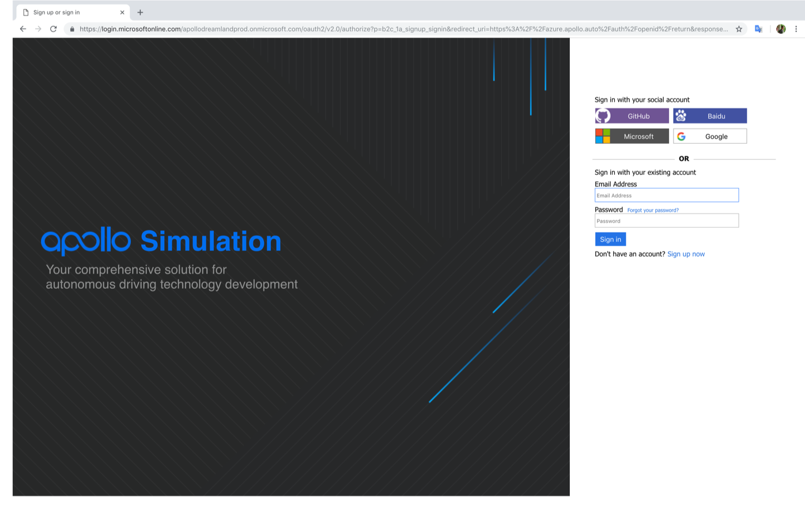
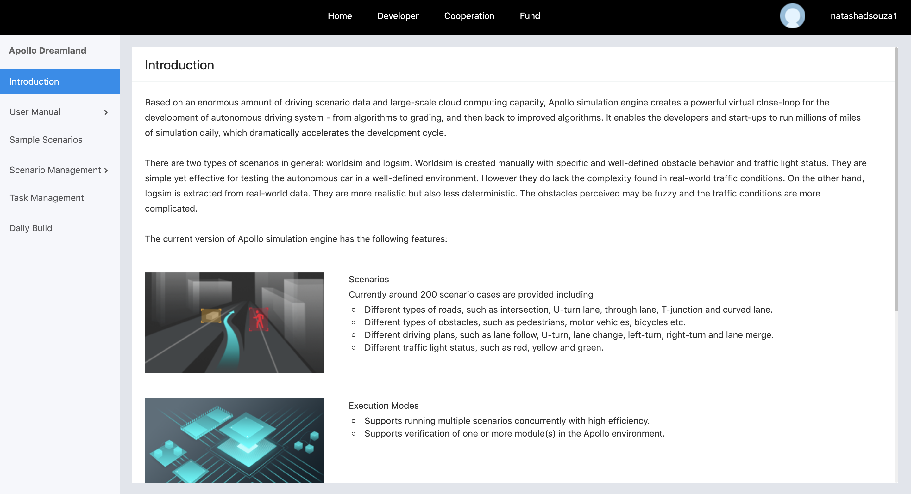
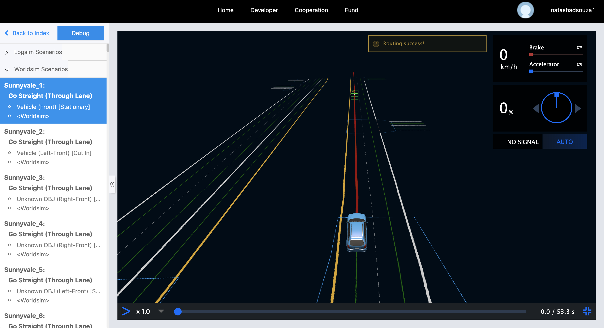
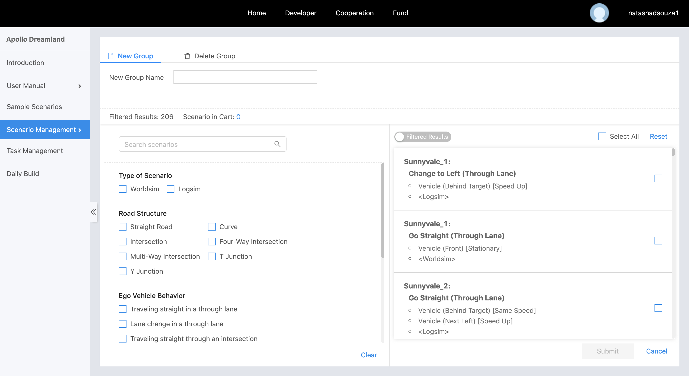
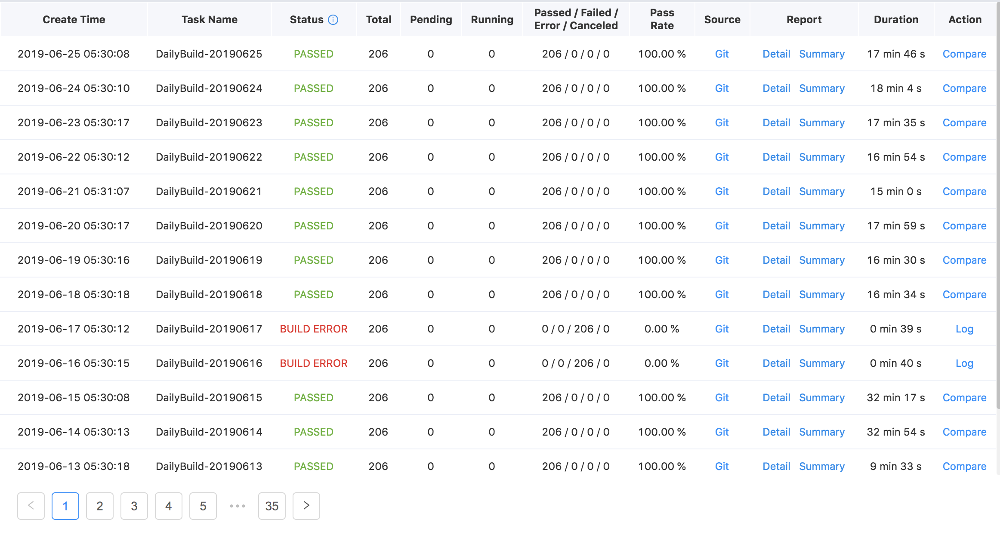

# Dreamland

## Introduction
Dreamland is Apollo's web-based simulation platform. Based on an enormous amount of driving scenario data and large-scale cloud computing capacity, Apollo simulation engine creates a powerful testing environment for the development of an autonomous driving system, from algorithms to grading, and then back to improved algorithms. It enables the developers and start-ups to run millions of miles of simulation daily, which dramatically accelerates the development cycle.

To access Dreamland, please visit [our Simulation website](http://apollo.auto/platform/simulation.html)

## Overview

1. **An Array of Scenarios:**
The simulation platform allows users to choose different road types, obstacles, driving plans, and traffic light states. There are currently around 200 scenario cases provided including:
    - Different types of roads, such as intersection, U-turn lane, through lane, T-junction and curved lane.
    - Different types of obstacles, such as pedestrians, motor vehicles, bicycles etc.
    - Different driving plans, such as lane follow, U-turn, lane change, left-turn, right-turn and lane merge.
    - Different traffic light status, such as red, yellow and green.

2. **Execution Modes:**
The simulation platform gives users a complete setup to run multiple scenarios parallelly in the cloud and verify modules in the Apollo environment.

3. **Automatic Grading System:**
The current Automatic Grading System tests via 12 metrics: 
    - Collision detection
    - Red-light violation detection
    - Speeding detection
    - Off-road detection
    - Arrival test
    - Hard braking detection
    - Acceleration test
    - Routing test
    - Lane-change in junction detection
    - Yield to pedestrians at crosswalks
    - Brake Taps
    - Stop at stop-signs

    These grading metrics test different aspects of autonomous driving, ranging from traffic and road safety to the rider's comfort. The Apollo team is committed to safety while providing excellent user experience during the drive hence these metrics are tailored to ensure a rigorous testing environment before the car is even put on the road.

4. **3D Visualization:**
3D Visualization illustrates real-time road conditions and helps to visualize the output from different modules. It also displays the status of the autonomous vehicle, such as velocity, heading etc. It also helps in visualizing the output of modules, such as routing, obstacles and planned trajectory.

## Scenarios
Through Dreamland, you could run millions of scenarios on the Apollo platform, but broadly speaking, there are two types of scenarios:

1. **Worldsim:**
Worldsim is synthetic data created manually with specific and well-defined obstacle behavior and traffic light status. They are simple yet effective for testing the autonomous car in a well-defined environment. They do however lack the complexity found in real-world traffic conditions. 

2. **Logsim:**
Logsim is extracted from real world data using our sensors. They are more realistic but also less deterministic. The obstacles perceived may be fuzzy and the traffic conditions are more complicated.

## Key Features

1. **Web Based:** Dreamland does not require you to download large packages or heavy software, it is a web based tool that can be accessed from any browser-friendly device
2. **Highly Customizable Scenarios:** With a comprehensive list of traffic elements you can fine tune Dreamland to suit your niche development. 

3. **Rigorous Grading Metrics:** The grading metrics include:
- Collision detection - Checks whether there is a collision (any distance between objects less than 0.1m is considered a collision)
- Red-light violation detection - Checks whether the autonomous car runs a red light
- Speeding detection - Checks whether the speed of the autonomous car exceeds the current speed limit
- Off-road detection - Checks whether the autonomous car stays on the road
- Arrival test - Checks whether the autonomous car arrives at its destination
- Hard braking detection - Checks whether the autonomous car is braking too hard (deceleration is greater than 4m/s^2)
- Acceleration test - Check whether the autonomous car is speeding up too fast (acceleration is greater than 4m/s^2)
- Routing test - Checks whether a routing response is present
- Lane-change in junction detection - Checks whether the planning trajectory makes a lane-change in a traffic junction
- Yield to pedestrians at crosswalks - Checks whether the planning trajectory yields to pedestrians at crosswalks
- Brake Taps - Checks whether the autonomous car has quick brake taps.
- Stop at stop-signs - Checks whether the autonomous car stops at stop-signs

3. **Instant Verification on the Cloud:** Dreamland offers you the unique opportunity to instantly verify your Apollo build on the cloud and test your code against a vast and diverse set of scenarios that can run with the push of a button.

## Dreamland Tool

1. To access Dreamland, please visit [our Dreamland Homepage](https://azure.apollo.auto/)
2. You will then be redirected to a login screen. You could use either your existing accounts (Baidu, Google, Github, Microsoft) or create your own Dreamland account.

3. Upon successful logging in, you will be redirected to the Dreamland Introduction page which includes a basic introduction and offerings

Dreamland platform offers a number of features that you could explore to help you accelerate your autonomous driving testing and deployment. 
1. **User Manual** - This section includes documentation to help you get up and running with Dreamland. 
    - [Quickstart](https://azure.apollo.auto/user-manual/quick-start): This section will walk you through testing your build using our APIs and also how to manage and edit existing scenarios.
    - [Scenario Editor](): The scenario editor is a new feature to be launched in Apollo 5.0 which enables our developers to create their own scenarios to test niche aspects of their algorithm. In order to use this feature, please send an email to our BD team at `idg-apollo@baidu.com`. Once activated, you can access it by clicking on `User Manual`. Stay Tuned!
    - [FAQ](https://azure.apollo.auto/user-manual/faq):
    This section will answer frequently encountered issues or questions to help make using Dreamland simpler. For any additional questions or issues you may face, feel free to reach out to the team on [Apollo's Github issues](https://github.com/ApolloAuto/apollo/issues)

2. **Sample Scenarios:** A large number of existing worldsim and logsim scenarios that you can later use to test your build and algorithms. It is always good to acclimate yourself to the existing scenario list to help you decide which scenarios will benefit which aspects of your development.

3. **Scenario Management:** Scenario management helps you filter, search through and group scenarios together. You can then view your existing groups. This is especially helpful when running tasks in `Task Management` that does not require you to re-select from the scenario list and simply choose the existing group.

4. **Task Management:** Like Scenario Editor, Task Management is also a service offering currently in beta testing and open only to selective partners. Please send an email to our BD team at `idg-apollo@baidu.com` using your company email address to activate your service.
The Task Management tab is extremely useful when testing any one particular type of scenario like side pass or U-turns. It helps test your algorithms against very specific test cases.

Within the Task Management page, you can run a `New Task` to test your personal Apollo github repository against a list of scenarios. You will receive a summary of the task which highlights if the build passed or not, along with the passing rate of both worldsim and logsim scenarios and finally the total miles tested virtually. You can also view the number of failed scenarios along with a description detailing the failed timestamp and the grading metric which failed. Finally, you can run the comparison tool to check how your build performed versus previous builds. 

5. **Daily Build:** The Daily Build shows how well the current Apollo official Github repository runs against all the scenarios. It is run once every morning Pacific Time.

