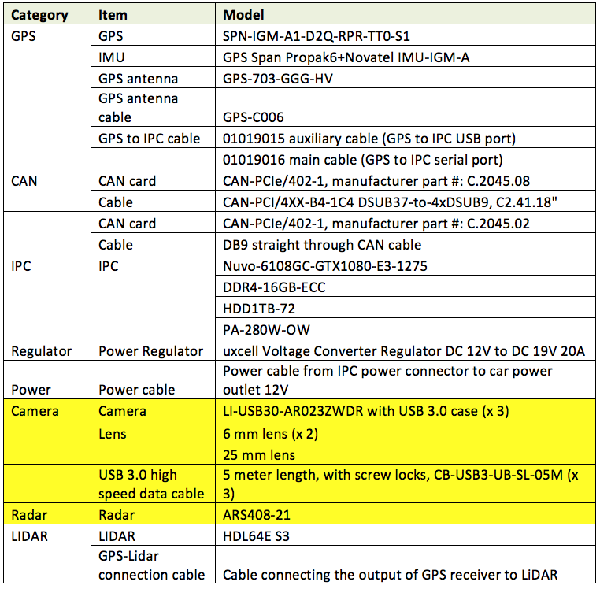
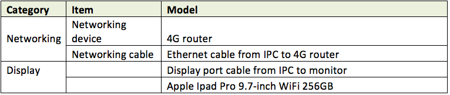
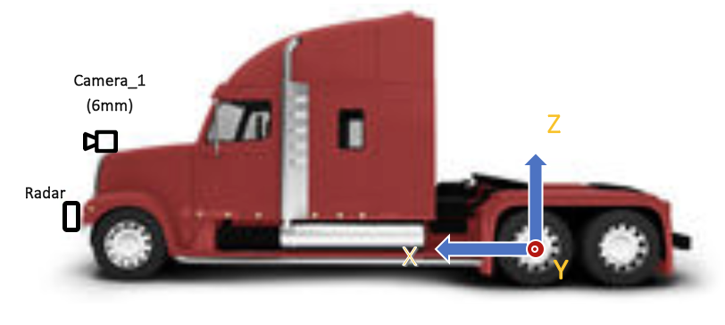

# Apollo 3.0传感器安装指南

## 需要的硬件



外部设备



## 坐标系

单位：毫米（mm）

原点：车辆后轮轴中心


**Figure 1. 原点和坐标系**



**Figure 2. 卡车坐标系和安装摄像机与雷达的示意图**

## 传感器安装指南
###	IMU/GPS
IMU/GPS需要安装在靠近后车轮毂的位置。GPS天线需要安装在车辆顶部。
###	Radar
远程雷达需要安装在车辆前保险杠上，请参考Figure 1 and Figure 2展示的信息。
###	Camera
一个6mm镜头的摄像机应该面向车辆的前方。前向摄像机应当安装在车辆前部的中心位置，离地面高度为1600mm到2000mm（Camera 1），或者安装在车辆挡风玻璃上（Camera 2）。


**Figure 3. 安装摄像机的示例图**

摄像机安装完成后，摄像机w、r、t的物理坐标x、y、z应该被记录在校准文件里。

#### 安装摄像机后的检验

三个摄像机的方位应当全部设置为0。摄像机安装后，需要车辆在公路以直线开动一段距离并记录一个rosbag，通过rosbag的回放，摄像机的方位需要重新调整以设置间距、偏航角并将角度转置为0度。如果摄像机被正确的安装，地平线应该在画面高度方向上的正中间并且不倾斜。灭点同样应该在画面的正中间。请参考下述图片以将摄像机设置为最佳状态：


**Figure 4. 摄像机安装后的画面示例。地平线应该在画面高度方向上的正中间并且不倾斜。灭点同样应该在画面的正中间。 红色线段显示了画面高度和宽度方向上的中点。**

估测的平移参数的示例如下所示：
```
header:
    seq: 0
    stamp:
        secs: 0
        nsecs: 0
    frame_id: white_mkz
child_frame_id: onsemi_obstacle
transform:
    rotation:
        x:  0.5
        y: -0.5
        z:  0.5
        w: -0.5
    translation:	
        x: 1.895
        y: -0.235
        z: 1.256 
```
如果角度不为0，则上述数据需要重新校准并在四元数中表示（参考上例中的transform->rotation	）
