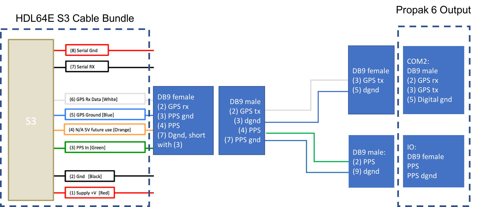
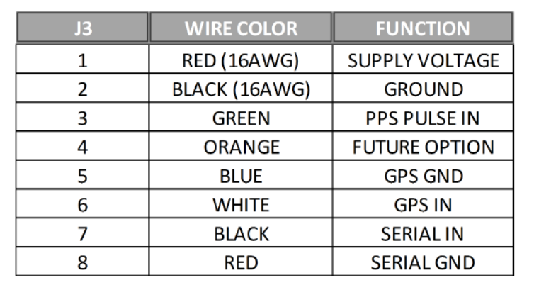
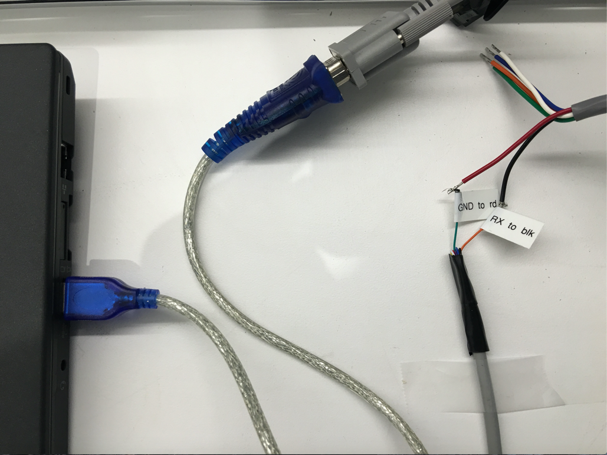

## Installation guide of Velodyne HDL64E-S3

Apollo uses the 64 line LiDar system **HDL-64E S3** from Velodyne LiDAR, Inc.


### Key Features:

- 64 Channels
- 120m range
- 2.2 Million Points per Second
- 360° Horizontal FOV
- 26.9° Vertical FOV
- 0.08° angular resolution (azimuth)
- <2cm accuracy
- ~0.4° Vertical Resolution
- User selectable frame rate
- Rugged DesignLidar/Velodyne/HDL64E-S3/

#### Mounting

A customized mounting structure is required to successfully mount an HDL64E S3 LiDAR on top of a vehicle. This structure must provide rigid support to the LiDAR system while raising the LiDAR to a certain height above the ground under driving conditions. This mounted height should prevent the laser beams from the LiDAR being blocked by the front and/or rear of the vehicle. The actual height needed for the LiDAR depends on the design of the vehicle and the mounting point of the LiDAR is relative to the vehicle being used. The vertical tilt angle of the lasers normally ranges from **+2~-24.8 degrees relative to the horizon**. 
For a standard Lincoln MKZ, it is recommended that you mount the LiDAR at a minimum height of 1.8 meters (from ground to the base of the LiDAR), to use the angle range for detection effectively.

```
If for some reason, the LiDAR beam has to be blocked by the vehicle, it might be necessary to apply a filter to remove these points while processing the data received.
```

#### Wiring

Each HDL-64E S3 LiDAR includes a cable bundle to connect the LiDAR to the power supply, the GPS timesync source and the computer (Ethernet for data transfer and a serial port for LiDAR configuration). 


* **Connecting the LiDAR**

   Connect the power and signal cable to the matching ports on the LiDAR

   

* **Connecting the Power Source**

   Two AWG 16 wires are used to power the HDL-64E S3 LiDAR. It requires about 3A at 12V. To connect the power source, make full contact with the wires and tighten the screws. 

   

* **Connecting the IPC**

   The connection to the IPC is through an ethernet cable. Plug the ethernet connector in the cable bundle, to an ethernet port on the IPC. 

* **Connecting the GPS**:

   The HDL64E S3 LiDAR requires the recommended minimum specific GPS/Transit data (GPRMC) and pulse per second (PPS) signal to synchronize to the GPS time. A customized connection is needed to establish the communication between the GPS receiver and the LiDAR, as follows:

   - **SPAN-IGM-A1**

      If you configured the SPAN-IGM-A1 as specified in [Configuring the GPS and IMU](#configuring-the-gps-and-imu), the GPRMC signal is sent from the GPS receiver via the "User Port" cable from the "Main" port. The PPS signal is sent through the wire cables labeled as “PPS” and “PPS dgnd” from the AUX port. The dash-line boxes in the figure below show the available connections that come with the HDL64E S3 LiDAR and the SPAN-IGM-A1 GPS receiver. The remaining connections must be made by the user.

      

   - **Propak 6 and IMU-IGM-A1**

       If you configured the Propak 6 as specified in [Configuring the GPS and IMU](#configuring-the-gps-and-imu), the GPRMC signal is sent from the GPS receiver via COM2 port. The PPS signal is sent through the IO port. The dash-line boxes in the figure below are available connections that comes with the HDL-64E S3 LiDAR and the Propak 6 GPS receiver. The remaining connections need to be made by the user. 

      

* **Connection with a computer through serial port for LiDAR configuration**

   You can configure some of the low-level parameters through the serial port. Within the cable bundle provided by Velodyne LiDAR, Inc., there are two pairs of red/black cables as shown in the pinout table below. The thicker pair (AWG 16) is used to power the LiDAR system. The thinner pair is used for serial connection. Connect the black wire (Serial In) to RX, the red wire to the Ground wire of a serial cable. Connect the serial cable with a USB-serial adapter to your selected computer. 

   

#### Configuration

By default, the HDL-64E S3 has the network IP address of 192.168.0.1. However, when you are setting up Apollo, change the network IP address to **192.168.20.13**. You can use the terminal application with Termite3.2 for this purpose. The IP address of the HDL-64E S3 can be configured using the following steps:

* Connect one side of the serial cable to your laptop
* Connect the other side of the serial cable to HDL-64E S3’s serial wires
* Use the following default COM port settings:

      - Baudrate: 9600

      - Parity: None

      - Data bits: 8

      - Stop bits: 1

* Use the COM port application: Download Termite3.2 from the link below and install it on your laptop (Windows) - [Installation link](http://www.compuphase.com/software_termite.htm)

* Use the serial cable connection for the COM port between the HDL-64E S3 and the laptop:



* Launch **Termite 3.2** from your laptop 

* Issue a serial command for setting up the HDL-64E S3’s IP addresses over serial port "\#HDLIPA192168020013192168020255"

* The unit must be power cycled to adopt the new IP addresses


#### References

For additional information on Velodyne HDL-64E S3, please refer to their 
[website here](http://velodynelidar.com/hdl-64e.html).

## Disclaimer

This device is `Apollo Platform Supported`
      
