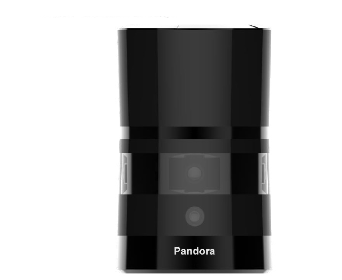

## Installation guide of Pandora

Pandora is an all-in-one sensor kit for environmental sensing for self-driving cars. It integrates cameras, LiDAR and data processing ability into the same module, with synchronization and calibration solutions.



#### Mounting

A customized mounting structure is required to successfully mount a Pandora kit on top of a vehicle. This structure must provide rigid support to the LiDAR system while raising the LiDAR to a certain height above the ground under driving conditions. This height should prevent the laser beams from the LiDAR being blocked by the front and/or rear of the vehicle. The actual height needed for the LiDAR depends on the design of the vehicle and the mounting point of the LiDAR relative to the vehicle. While planning the mounting height and angle, please read through the manual for additional details.

```
If for some reason, the LiDAR beam has to be blocked by the vehicle, it might be necessary to apply a filter to remove these points while processing the data received.
```

#### Wiring

Each Pandora includes a cable connection box and a corresponding cable bundle to connect to the power supply, the computer (ethernet) and the GPS timesync source.


* **Connection to the Power Source**

   Please connect the power cable to a proper power source. Typically, a **9~32VDC**, **40W** power supply should be sufficient to power the LiDAR

2. **Connection to the IPC**

    Connect the interface box to the IPC using the ethernet cable provided in the cable bundle.

3. **Connection to the GPS**

   The Pandora kit requires the recommended minimum specific GPS/Transit data (GPRMC) and pulse per second (PPS) signal to synchronize to GPS time. A customized connection is needed to establish the communication between the GPS receiver and the LiDAR. Please read your GPS manual for information on how to collect the output of those signals.

   On the interface box, a GPS port (SM06B-SRSS-TB) is provided to send the GPS signals as an input to the LiDAR. The detailed pinout is shown in the image below.

   | Pin # | Input/output | Comment                                         |
   | ----- | ------------ | ----------------------------------------------- |
   | 1     | Input        | PPS signal (3.3V)                               |
   | 2     | Output       | 5V power supply to power the GPS Unit if needed |
   | 3     | Output       | GND for external GPS unit                       |
   | 4     | Input        | RX serial port for GPRMC signal (RS232)         |
   | 5     | Output       | GND for external GPS unit                       |
   | 6     | Output       | TX serial port for external GPS unit            |

#### Configuration

The detailed configuration steps can be found in the manual provided on Hesai Technologies official website.

* [Chinese version](https://hsdown.blob.core.chinacloudapi.cn/upload/Pandar40%2040%E7%BA%BF%E6%9C%BA%E6%A2%B0%E5%BC%8F%E6%BF%80%E5%85%89%E9%9B%B7%E8%BE%BE%20%E4%BD%BF%E7%94%A8%E8%AF%B4%E6%98%8E%E4%B9%A6.pdf)

* [English version ](https://drive.google.com/file/d/1THtxhlrzmyVpV_IZufRsYUBudmHTd8Ge/view)

#### References

* A Detailed Specification sheet on Pandora can be found at the following [website link](http://www.hesaitech.com/en/pandora.html)

* Additional information about Pandora - Hesai can be found [here](https://drive.google.com/file/d/1THtxhlrzmyVpV_IZufRsYUBudmHTd8Ge/view)

## Disclaimer

This device is `Apollo Platform Supported`
