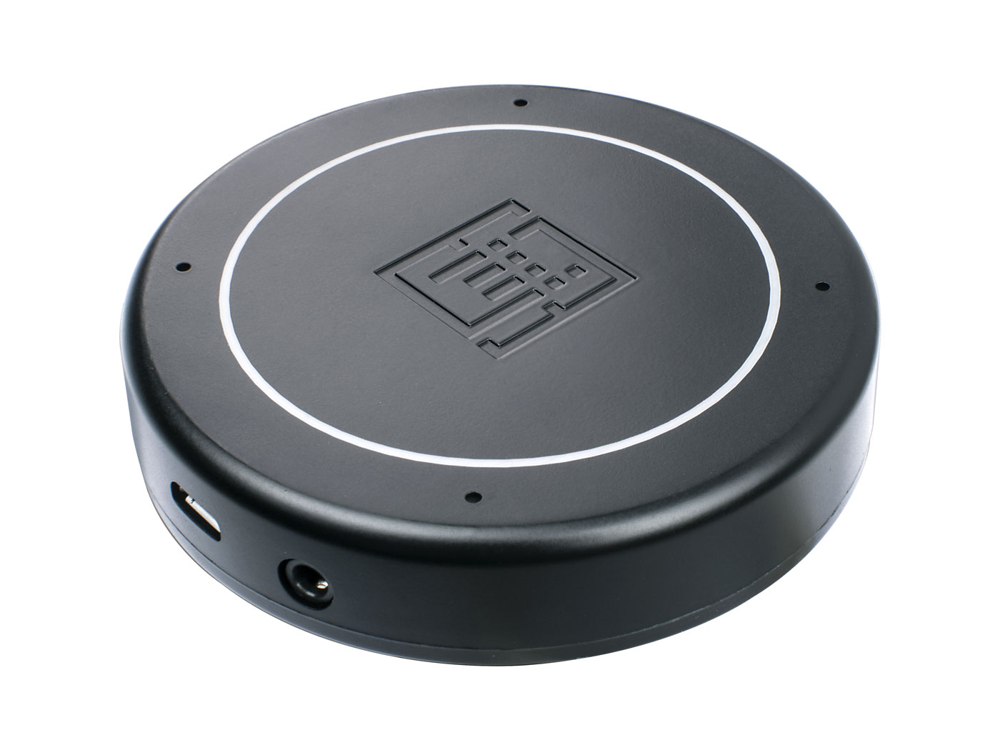

# Apollo 6.0 Microphone Installation

### Supported Devices

The Re-Speaker USB Mic Array
https://wiki.seeedstudio.com/ReSpeaker-USB-Mic-Array/

### Connection
Use the provided USB cable and connect the microphone to a USB port on the machine which is running Apollo. A USB extension cable may be needed depending on the application.

### Setup
Follow the instructions provided [here](https://wiki.seeedstudio.com/ReSpeaker-USB-Mic-Array/#update-firmware) to update the firmware on the ReSpeaker to `48k_6_channels_firmware.bin`
