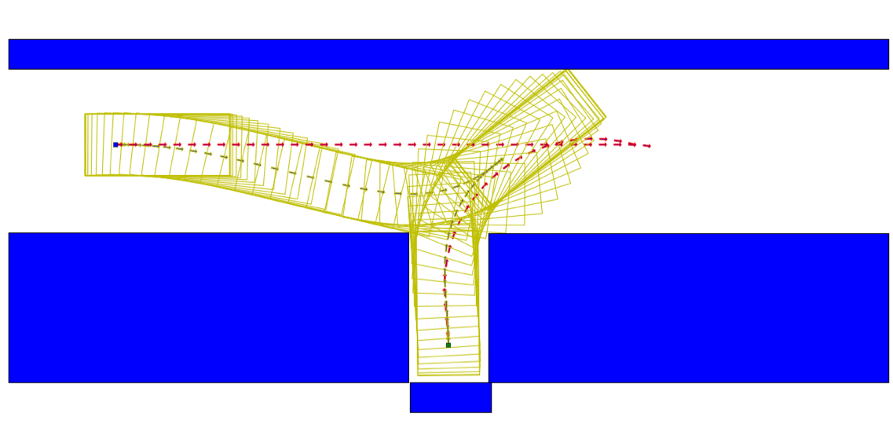
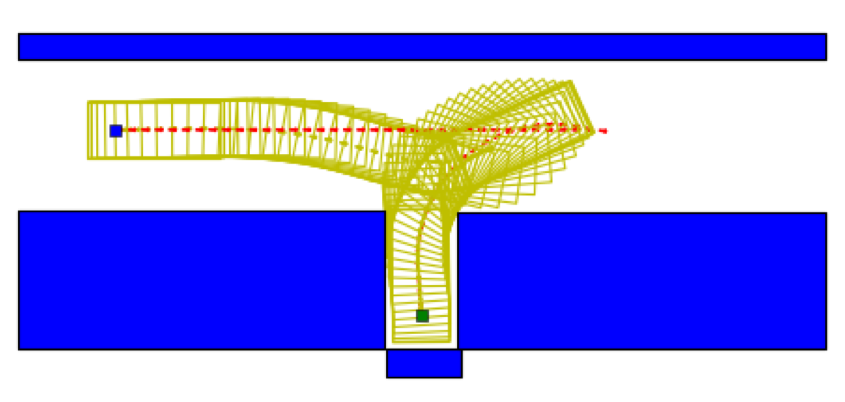

# Open Space Planner Algorithm

## Introduction

As the Planning module introduced a major change with the launch of Scenario-based planning, we realized the need to have scenario specific algorithms that can be fine-tuned to enhance the trajectory of the ego-car for that particular scenario. The Open Space Planner is one such algorithm in development targeted towards reverse parking and sharp U-turns.
This algorithm was initially inspired by several papers<cite>[1]</cite><cite>[2]</cite><cite>[3]</cite>.

## Algorithm Flow

This algorithm takes in input from two different sources:
- Perception data which includes but is not limited to obstacles
- The Region of Interest (ROI) which is obtained via HD Map

Once the data is in place, Open Space planner is triggered as seen in the image above. The algorithm itself is comprised of two stages:

### Searching - Based Planning

In step 1, a raw trajectory is generated for the ego-car. This stage applies vehicle kinemetic model in algorithm to create the raw trajectory with a series of distance equidistant points as seen in the image below.
The red line represents the raw trajectory output from Hybrid A*, which is sent to the next step, Optimization to calculate the green smoothened line.

### Optimization

This step involves two major tasks,
- Smooth the trajectory to get better riding comfort experience and to make it easier for the control module to track
- Ensure collision avoidance

The received raw trajectory is taken as an initial guess for optimization to iterate on. The generated result is a set of points that are not distributed evenly but are closer to eachother near the turning while those on a linear path are more spread-out.
This not only ensures better turns, but as time/space is fixed, the nearer the points, the slower the speed of the ego-car. Which also means that velocity tracking in this step is possible but more reasonable acceleration, braking and steering.

Once this stage is complete, the output is directly sent to the Control module to have it sent to the ego-car.

## Use Cases 

Currently Open Space Planner is used for 2 parking scenarios in the planning stage namely:

### Valet

This scenario is designed to park the ego car in a designated parking spot using a zig-zag trajectory.

### Pull Over

This scenario is designed to park the ego car along the curb, either normally or requiring parallel parking.

To learn more about the existing planning scenarios, please refer to the [Planning README](https://github.com/ApolloAuto/apollo/tree/master/modules/planning)

## Future Applications

As the algorithm is currently in development, it is currently used for reverse and/or parallel parking, but can also be implemented in scenarios that involve tight U-turns or for curb-side parking when an emergency vehicle passes by. The main aim of scenario-based planning is to ensure efficient planning of the car's trajectory using targeted algorithms for individual scenarios just like with Open Space Planning for reverse parking.

## References

[1]:  Dolgov, Dmitri, et al. "Path Planning for Autonomous Vehicles in Unknown Semi-Structured Environments." The International Journal of Robotics Research, vol. 29, no. 5, 2010, pp. 485-501., doi:10.1177/0278364909359210.

[2]: Prodan, Ionela, et al. "Mixed-integer representations in control design: Mathematical foundations and applications."" Springer, 2015.

[3]:  Xiaojing Zhang, et al. "Optimization-Based Collision Avoidance" (arXiv:1711.03449).
