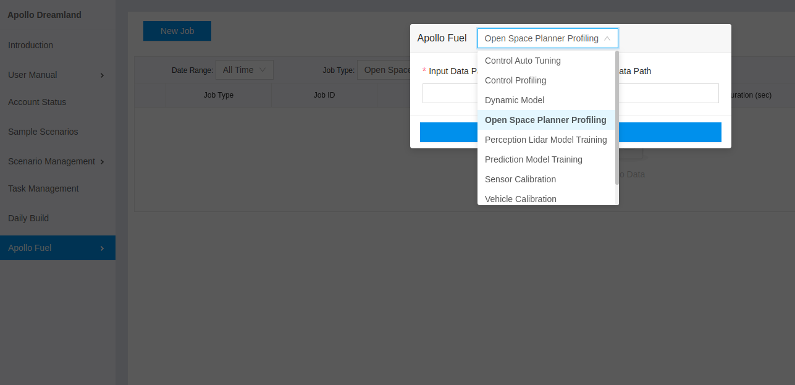

# Open Space Profiling Service


- [Open Space Profiling Service](#Open Space Profiling Service)
  - [Overview ](##Overview)
  - [Prerequisites](##Prerequisites)
  - [Main Steps](##Main-Steps)
  - [Data Collection](##Data-Collection)
    - [Data Recording](###Data-Recording)
    - [Data Sanity Check](###Data-Sanity-Check)
  - [Job Submission](##Job-Submission)
    - [Upload Data to BOS](###Upload-data-to-BOS)
    - [Submit Job Requests in Dreamview](###Submit-job-requests-in-Dreamview)
    - [Get Profiling Results](###Get-profiling-results)


## Overview

Open Space Profiling Service is a cloud based service to evaluate the open space planner trajectories from road test or simulation records.

## Prerequisites


- [Apollo](https://github.com/ApolloAuto/apollo) 6.0 or higher version.

- Cloud and simulation services registered according to [Apollo_Fuel](Localization_Configuration_cn.md) and [Apollo Dreamland](http://bce.apollo.auto/)

## Main Steps

- Data collection

- Job submit

- Results analysis

## Data Collection

### Data Recording

Finish one or multiple autonomous driving with open space scenarios, e.g. Valet Parking, PullOver, Park and Go.

### Data Sanity Check


- **make sure following channels are included in records before submitting them to cloud service**：

    | Modules | channel | items |
    |---|---|---|
    | Canbus | `/apollo/canbus/chassis` | exits without error message |
    | Control | `/apollo/control` | exits without error message |
    | Planning | `/apollo/planning` | - |
    | Localization | `/apollo/localization/pose` | - |
    | GPS | `apollo/sensor/gnss/best_pose` | `sol_type` to `NARROW_INT` |

-  you can check with `cyber_recorder`：

```
    cyber_recorder info xxxxxx.record.xxxxx
```


## Job Submission


### Upload data to BOS

1）Here is the folder structure requirements for job submission：


2）`Origin Folder` is **BOS root folder**，for users；

3）`task001、task002...` meaning different tasks, limited one task per submission in cloud service； note that if `task001` is under BOS root foder, then you can input relative path to individual tasks`task001`； otherwise please input the absolute path: `xxx/task001`；

4） `Vehicle1、Vehicle2...` meaning different vehicles, like `devkit01`、`mkz02` or `lexus03`, you can submit profiling requests for different vehicles in one task.


5） `Configuration File` includes `vehicle_param.pb.txt`, there is a sample file under `apollo/modules/common/data/vehicle_param.pb.txt`.


#### Submit job requests in Dreamview

Goto [Apollo Dreamland](http://bce.apollo.auto/login), login with **Baidu** account, choose `Apollo Fuel--> task`，`new task`, `open space profiling`，and input correct path as in [Upload data to BOS](###Upload-data-to-BOS) section：




#### Get profiling results

- After job is done, you should be expecting emails including `Grading results` and `Visualization results`.


