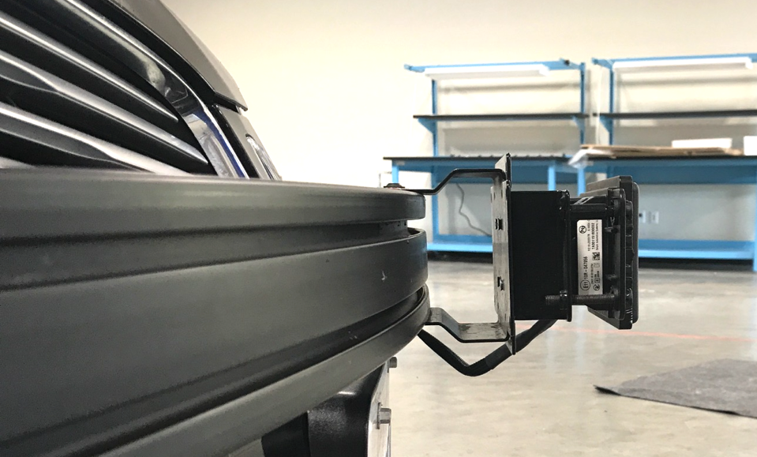

## Installation Guide of Delphi ESR 2.5 Radar

```
Delphi's technologically advanced ESR uses proven solid state technology plus class-leading performance, 
packaging and durability to offer customers game-changing forward radar detection. 
The quality of data provided by Delphi's system enables powerful functionality including 
adaptive cruise control, forward collision warning, brake support and headway alert. 

----Delphi official website
```


### Installation

1. A mechanical mount needs to be designed to mount the Radar to the desired position. The mount should be able to hold the Radar in a way that the scanning plane is parallel to the bottom of the car, so that the scanning radar wave would not be blocked by the road surface causing it to create ghost objects. If a stationary mount cannot satisfy such requirement, please consider adding adjustment in vertical and horizontal directions to the mount

   

2. When you receive the Radar package, a set of connection cables should be included. Connect the water-proof connector to the Radar, and guide the cable through/under the car into the trunk. Secure the cable to the body of the car if necessary

3. Connect the power cable to **24VDC** power supply. Add a voltage converter if 24VDC is not available.

4. Connect the CAN output to the CAN interface of the IPC.

5. You should be able to receive the CAN messages through the CAN port once the Radar is powered.

### References

1. Additional information can be found on the [product page](https://autonomoustuff.com/product/delphi-esr-2-5-24v/ )

2. For additional information on the detailed working principle or data interpretation, please contact Delphi or AutonomouStuff directly.

     

     