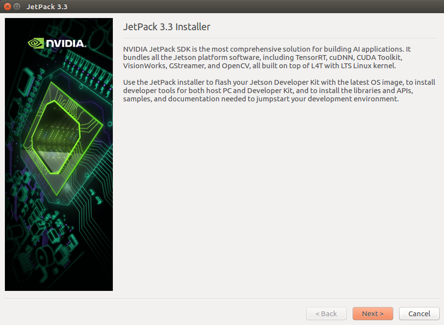
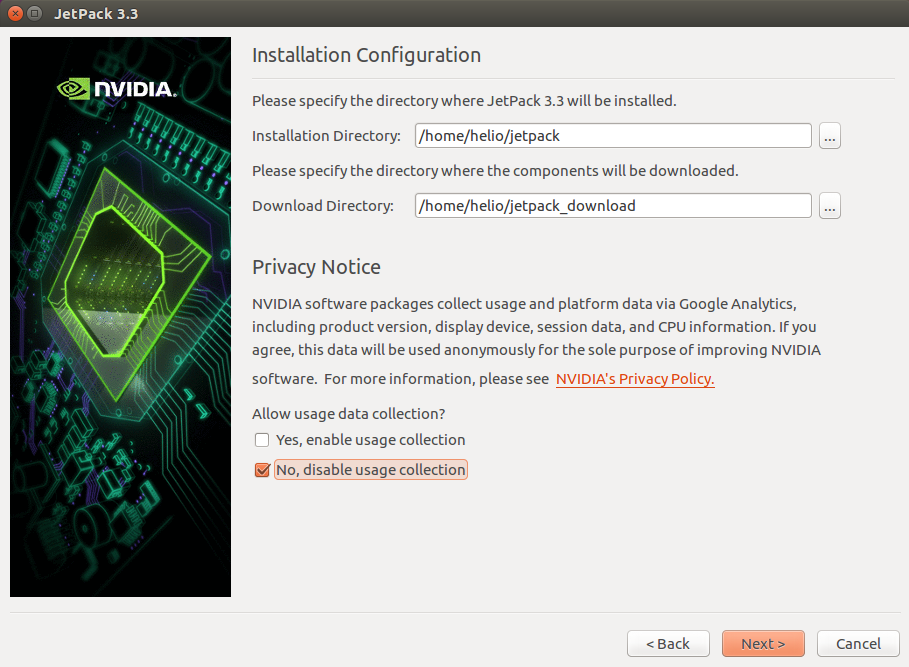
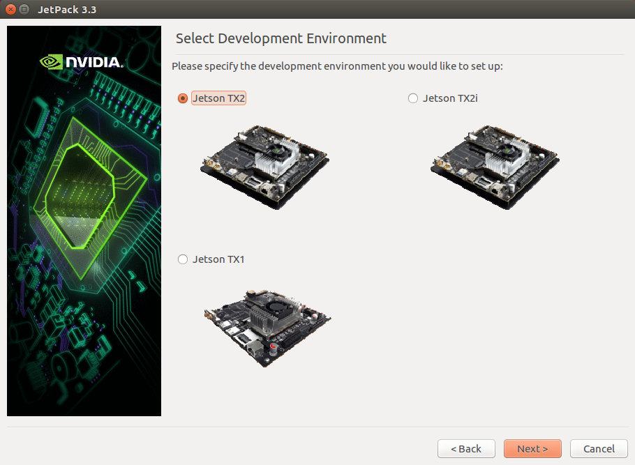
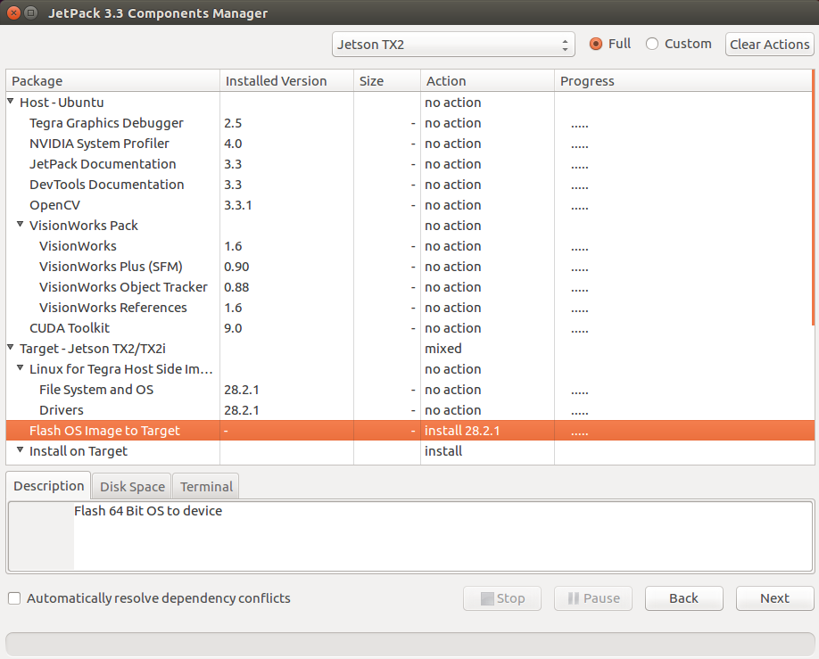
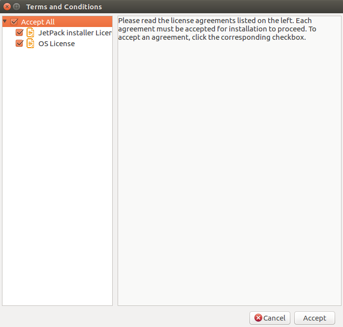
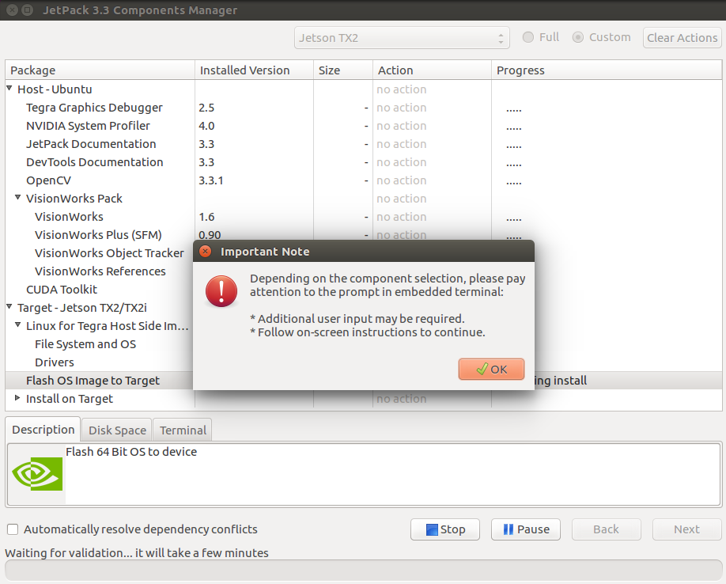
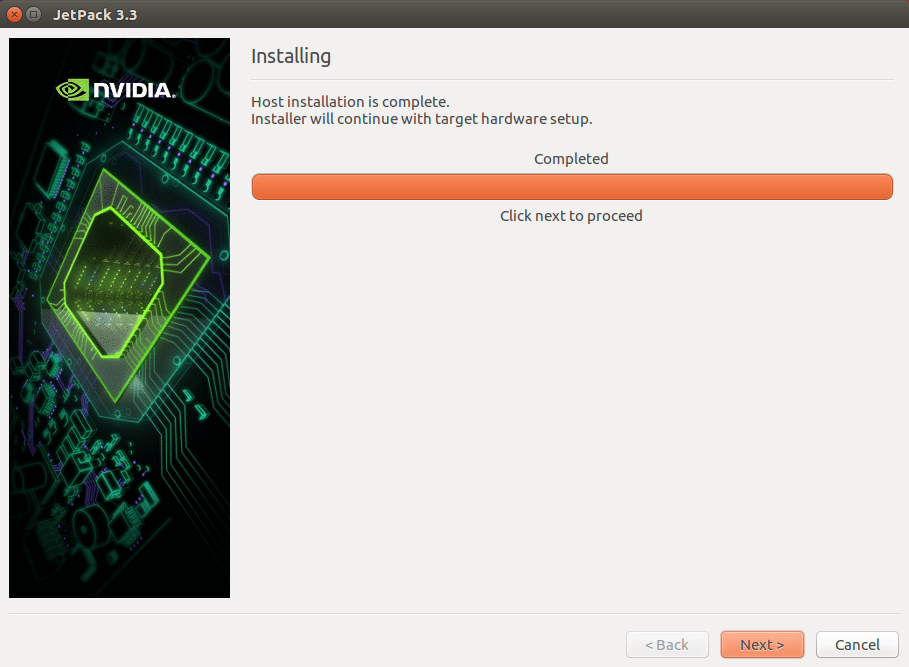
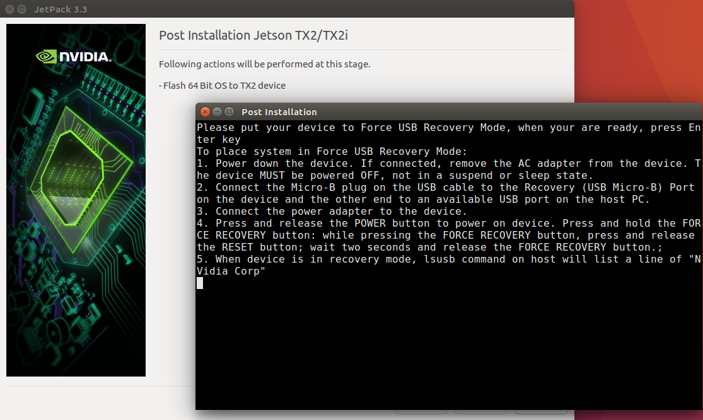

# Docker环境配置

Apollo官方推荐的Ubuntu版本是14.04，而NVIDIA Jetson TX2自带的操作系统为Ubuntu16.04，所以需要通过安装Docker环境在Ubuntu16.06上运行Ubuntu14.04。本文档会介绍在Ubuntu16.04上安装Docker环境的步骤、可能遇到的问题及解决办法。

本文档基于的Apollo版本为最新发布的3.0，并专注于介绍软件的安装步骤，且会严格遵循Apollo官方提供的安装步骤进行操作。

本文档中介绍的安装步骤全部基于NVIDIA Jetson TX2进行测试。准备Docker环境需要依次执行以下两个步骤：

1. 安装与配置Docker
2. 创建Docker镜像

******

## 安装与配置Docker

由于NVIDIA Jetson TX2自带的Ubuntu 16.04系统缺少Docker所需的内核特性，所以需要更新Ubuntu系统，目前有两种方案可以更新Linux内核：
- 安装新版本JetPack进行刷机
- 重新编译内核和相应的内核模块  

> ***两种方案执行其中一种即可成功安装Docker***

### 安装Docker

#### 安装JetPack3.3

从[NVIDIA官方网站](https://developer.nvidia.com/embedded/jetpack)下载
更新到最新的 JetPack L4T，并自动安装最新的驱动、CUDA Toolkit、cuDNN、TensorRT

> 下载之前需要登录Nvidia开发者账号

由于JetPack需要在64位的Linux环境中执行，此处选择在虚拟机上安装Ubuntu 16.04 64 位操作系统。
> 虚拟机的网络选择NAT或桥接网络，因为JetPack安装过程中需要联网下载相关组件。    

首先在Ubuntu系统的终端中给文件添加可执行属性
```shell
chmod +x ./JetPack-L4T-3.3-linux-x64_b39.run
```
运行下载的文件
```shell
./JetPack-L4T-3.3-linux-x64_b39.run
```


在安装向导首页点击Next按钮，进入下一页



选择JetPack安装位置

选择开发环境Jetson TX2



进入组件管理页面

> 进入组件管理页面可能会出现提示**The manifest file is broken.**  
> 这主要是由于JetPack联网下载组件清单文件失败导致的，此时可以退出JetPack安装程序，再重新执行JetPack-L4T-3.3-linux-x64_b39.run，一般情况下重试2~3次即可正常安装   



在**Target - Jetson TX2/TX2i**->**Flash OS image to Target**栏目中**Action**选**install 28.2.1**，其他栏目的**Action**都选成**no action**；点击Next按钮出现许可协议对话框



点击Accept按钮继续，开始下载内核和根文件系统，下载完成后出现提示信息



直接点击OK按钮



安装完成后，点击Next按钮开始准备刷机



根据提示将设备置于强制USB恢复模式，主要操作如下：
- 断开电源，保证TX2开发板处于断电关机状态
- 用Micro USB线把TX2开发板连到电脑上
- 接通AC电源，按下Power键，开机
- 开机后长按Recovery键不松开，然后按下Reset键，2秒以后松开Reset键，再松开Recovery键   

此时开发板处于强制恢复模式。完成以上步骤后，检查开发板有没有和电脑正确连接，打开一个终端输入lsusb 命令，看到列表有Nvidia Corp就说明连接正确。

以上步骤确认无误后，在刚才Post installation终端中敲一下Enter，开始刷机过程


刷机过程大约需要半个小时，最终在终端上可以看到刷机成功的提示，此时Jetson TX2开发板会自动重启，重启后以nvidia用户直接进入桌面系统，用户可以开始执行[配置Docker](#配置Docker)相关操作。

#### 更新Linux内核安装Docker

重新编译内核参见github上[Tegra-Docker](https://github.com/Technica-Corporation/Tegra-Docker)

### 配置Docker

- 更新安装包仓库信息
```shell
sudo apt-get update
```

- 安装依赖库
```shell
sudo apt-get install apt-transport-https ca-certificates curl software-properties-common
```
> *说明：如果出现无法安装的情况，请执行`sudo apt-get update`*

- 获取Docker的GPG key
```shell
curl -fsSL https://download.docker.com/linux/ubuntu/gpg | sudo apt-key add -
```
> *说明：如果以上命令长时间不返回，可以中断执行，手动下载gpg文件，然后执行`sudo apt-key add gpg`*

- 添加Docker仓库的地址
```shell
sudo apt-add-repository "deb [arch=arm64] https://download.docker.com/linux/ubuntu $(lsb_release -cs) stable"
```
> *lsb_release输出系统发布版本信息，例如trusty或者xenial等*

- 再次更新安装包仓库信息
```shell
sudo apt-get update
```

- 添加Docker用户组
```shell
sudo groupadd docker
sudo usermod -aG docker $USER
sudo gpasswd -a $USER docker
newgrp docker
```

> *通过安装JetPack刷机后系统中已经存在docker组，此时可以不用执行groupadd操作*

- 重启Docker服务
```shell
sudo systemctl restart docker.service
```

- 验证Docker
```shell
docker run arm64v8/hello-world
```

出现如下输出表明Docker配置成功！  

```txt
Unable to find image 'arm64v8/hello-world:latest' locally
latest: Pulling from arm64v8/hello-world
e610d22537c5: Pull complete 
Digest: sha256:5434cbbe22849a8e008c3d0228436f846f3c0bf3f7754c7ddecbfae203e712a2
Status: Downloaded newer image for arm64v8/hello-world:latest

Hello from Docker!
This message shows that your installation appears to be working correctly.

To generate this message, Docker took the following steps:
 1. The Docker client contacted the Docker daemon.
 2. The Docker daemon pulled the "hello-world" image from the Docker Hub.
    (arm64v8)
 3. The Docker daemon created a new container from that image which runs the
    executable that produces the output you are currently reading.
 4. The Docker daemon streamed that output to the Docker client, which sent it
    to your terminal.

To try something more ambitious, you can run an Ubuntu container with:
 $ docker run -it ubuntu bash

Share images, automate workflows, and more with a free Docker ID:
 https://hub.docker.com/

For more examples and ideas, visit:
 https://docs.docker.com/get-started/

```

+ **常见问题及解决办法**

|问题现象|解决方案|
|--------------------------------|--------------------------------|
|docker: Error response from daemon: open /etc/resolv.conf: no such file or directory.|<p>`sudo vi /etc/resolv.conf`</p>追加<p>nameserver 127.0.1.1</p>|
|docker: Got permission denied while trying to connect to the Docker daemon socket|<p>检查当前用户是否加入docker组中</p>|

## 创建Docker镜像

鉴于后期编译和运行Apollo项目所需的磁盘空间比较大，而Jetson TX2开发板板载的Flash存储器刷机完之后大约只有23GB的空闲空间，所以此处建议通过Jetson TX2上的SATA接口外接一块SSD固态硬盘，将Docker的镜像都保存在外接的固态硬盘上，后期的Apollo项目源码也存放到固态硬盘中，编译和运行时将Apollo的目录映射到Docker容器中。

> *此处也可以不外接固态硬盘，将Docker镜像直接存放在板载的Flash存储器中，那么请跳过后续挂载硬盘、移动Docker镜像位置的步骤，直接到[创建Dockerfile](#创建Dockerfile)*

- 首先将外接硬盘分区，然后格式化成ext4文件系统：

```shell
sudo fdisk /dev/sda
```

> *在硬盘上新建一个大于80GB的分区*

```shell
sudo mkfs.ext4 /dev/sda1
```

> */dev/sda1需要根据实际情况修改，此处是由于硬盘分区时只新建了一个分区，具体可以查看`ls /dev/sd*`*

- 挂载新硬盘

> *这里将/dev/sda1挂载到nvidia用户主目录下的work目录下，也可以挂载到其他目录下，后面执行的操作均是以挂载到/home/nvidia/work为例，实际操作中如果更改了挂载点，请注意修改命令和配置文件中的路径*

```shell
mkdir /home/nvidia/work
sudo mount /dev/sda1 /home/nvidia/work
sudo chown nvidia:nvidia /home/nvidia/work
sudo vi /etc/fstab
```

在fstab文件末尾追加一行

```txt
/dev/sda1       /home/nvidia/work       ext4    defaults        0       0
```

然后重启系统

```shell
sudo reboot
```

- 移动Docker镜像位置

> *需要继续在Nvidia Jetson TX2开发板的系统终端上执行以下操作*

```shell
sudo su - root                    #切换到root用户
systemctl stop docker.service     #停止Docker服务
systemctl status docker           #查看Docker服务是否已经停止
cd /var/lib
sudo cp -r -v docker/ /home/nvidia/work/   #将docker目录拷贝到外接硬盘上
sudo mv docker docker2                     #重命名docker目录，否则无法创建软链接
sudo ln -s /home/nvidia/work/docker docker #创建软链接
sudo reboot                                
```

> *重启系统后再查看Docker服务是否成功启动*

### 创建Dockerfile

**Apollo3.0项目提供了自动构建Docker开发运行环境的脚本！**

> *在docker/build目录下已经存在为ARM64平台编写的Dockerfile，文件名为`dev.aarch64.dockerfile`；切换到docker/build目录下执行`./build_dev.sh ./dev.aarch64.dockerfile`就会自动构建完整的Docker环境，本文档后续的操作均不用执行，[构建Docke Dev镜像](how_to_build_docker_dev_env_CN.md)文档中的操作也不需要执行。如果希望手动构建Docker的开发运行环境，请按照本文档后续描述继续操作。*

在/home/nvidia/work/目录下新建ApolloAuto/images/目录，Dockerfile将存放在此目录下

```shell
cd /home/nvidia/work/ApolloAuto/images/
vi Dockerfile
```

文件内容如下：

```txt
# 基础镜像
FROM arm64v8/ubuntu:14.04  
# 维护者信息
MAINTAINER Apollo Apollo@Apollo.Auto
# 环境变量
ENV LD_LIBRARY_PATH=/usr/lib/aarch64-linux-gnu/tegra  
# 镜像操作指令
RUN    echo "deb http://ppa.launchpad.net/keithw/glfw3/ubuntu trusty main" >> /etc/apt/sources.list.d/fillwave_ext.list \
    && echo "deb-src http://ppa.launchpad.net/keithw/glfw3/ubuntu trusty main" >> /etc/apt/sources.list.d/fillwave_ext.list \
    && echo "deb http://packages.ros.org/ros/ubuntu $(lsb_release -sc) main" > /etc/apt/sources.list.d/ros-latest.list \
    && apt-key adv --keyserver hkp://ha.pool.sks-keyservers.net:80  --recv-key 421C365BD9FF1F717815A3895523BAEEB01FA116 \
    && apt-key adv --keyserver keyserver.ubuntu.com --recv-keys 3EB9326A7BF6DFCD \
    && apt-get update -y
RUN    apt-get install -y bc \
            cppcheck \
            debconf-utils \
            doxygen \
            graphviz \
            gdb \
            git \
            subversion \
            lcov \
            libblas-dev \
            libboost-all-dev \
            libcurl4-openssl-dev \
            libfreetype6-dev \
            liblapack-dev \
            libpcap-dev \
            locate \
            lsof \
            realpath \
            shellcheck \
            vim \
            v4l-utils \
            nfs-common \
            zip \
            apt-transport-https \
            build-essential \
            cmake \
            curl \
            software-properties-common \
            wget \
            unzip \
            zip \
            python \
            autoconf \
            automake \
            libtool \
            libmagic-dev \
            libatlas-base-dev \
            libflann-dev \
            libhdf5-serial-dev \
            libicu-dev \
            liblmdb-dev \
            libopencv-dev \
            libqhull-dev \
            libsnappy-dev \
            libvtk5-dev \
            libvtk5-qt4-dev \
            mpi-default-dev \
            libunwind8-dev \
            libblas-dev \
            liblapack-dev \
            gfortran \
            libgeos-dev \
            libleveldb-dev \
            python-matplotlib \
            python-pip \
            python-psutil \
            python-scipy \
            python-software-properties \
            python3-psutil \
            python-vtk \
            python-pyaudio \
            python3-pyaudio \
            python-nose \
            sox \
            libvtk-java \
            libeigen3-dev \
            libflann-dev \
            libusb-1.0-0-dev \
            libudev-dev \
            freeglut3-dev \
            libpng12-dev \
            libgtest-dev \
            libxmu-dev \
            libbz2-dev \
            libconsole-bridge-dev \
            libeigen3-dev \
            libgstreamer-plugins-base0.10-dev \
            libgstreamer0.10-dev \
            liblog4cxx10-dev \
            liblz4-dev \
            libpoco-dev \
            libproj-dev \
            libtinyxml-dev \
            libyaml-cpp-dev \
            sip-dev \
            uuid-dev \
            zlib1g-dev \
            supervisor \
            libpcre3 \
            libpcre3-dev \
            swig \
            libhdf5-dev \
            libtheora-dev

RUN curl -sS https://dl.yarnpkg.com/debian/pubkey.gpg | apt-key add - \
    && echo "deb https://dl.yarnpkg.com/debian/ stable main" > /etc/apt/sources.list.d/yarn.list \
    && add-apt-repository -y ppa:gluster/glusterfs-3.10 \
    && apt-get update -y \
    && apt-get install -y yarn glusterfs-client \
    && apt-get install -y --force-yes libxcursor-dev libxinerama-dev libxrandr-dev libxi-dev libglfw-dev freeglut3-dev \
    && apt-cache rdepends python-empy \
    && apt-get install python-empy \
    && echo_supervisord_conf > /etc/supervisord.conf \
    && pip install netifaces

RUN echo '%sudo ALL=(ALL:ALL) NOPASSWD:ALL' >> /etc/sudoers && chown root:root /usr/bin/sudo && chmod 755 /usr/bin/sudo

# 设置工作目录
WORKDIR /apollo

# 容器启动执行命令
CMD /bin/bash
```

### 创建Docker镜像

```shell
docker build -t apolloauto/dev /home/nvidia/work/ApolloAuto/images/
```

出现类似如下信息表明Docker镜像创建成功

```txt
Sending build context to Docker daemon 2.048 kB
Step 1/9 : FROM arm64v8/ubuntu:14.04
14.04: Pulling from arm64v8/ubuntu
009b23c943b3: Pull complete 
f161208cb4cc: Pull complete 
59560fd8b5f8: Pull complete 
ece9289805c4: Pull complete 
ca7819f58e72: Pull complete 
Digest: sha256:c378d1a95cad6f91f399c1d12d6040ed66ac5a72c2088f95001e8e79e9c8120a
Status: Downloaded newer image for arm64v8/ubuntu:14.04
......此处输出较多暂且省略
Removing intermediate container 056d656f49c0
Successfully built 74741db9b249
```

查看Docker镜像列表

```shell
docker images
```

命令的反馈结果至少应该包含以下的仓库名称：

```txt
REPOSITORY            TAG                                            IMAGE ID            CREATED              SIZE
apolloauto/dev        latest                                         74741db9b249                             1.8 GB
arm64v8/hello-world   latest                                         173e7eecd5dc                             4.75 kB
arm64v8/ubuntu        14.04                                          907b00620e3e                             1.8 GB
```
