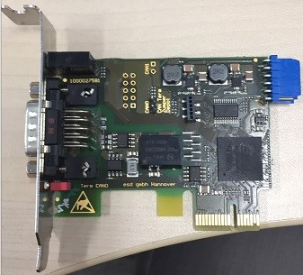
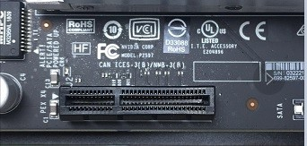
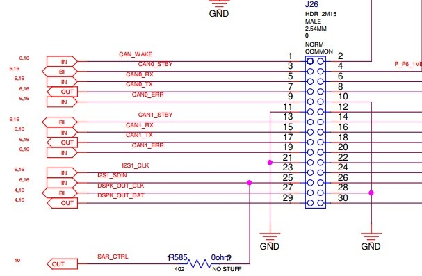
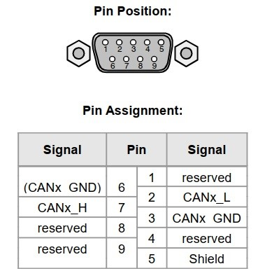
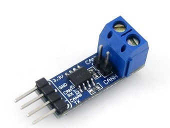
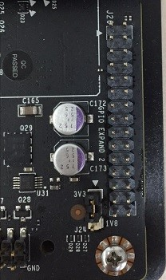
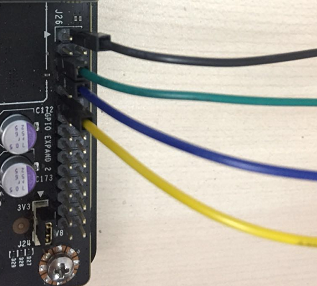
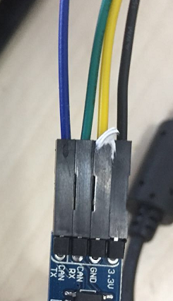
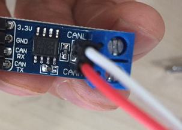
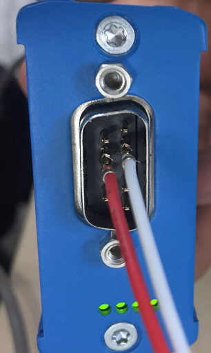

# ESD CAN调试

Apollo官方推荐的CAN卡为[ESD CAN-PCIe/402](https://esd.eu/en/products/can-pci402)  
在NVIDIA Jetson TX2（以下简称为TX2）上试用的CAN卡型号为ESD CAN-PCIe/402-1-LP，如下图所示
 


该型号通过PCIe插槽和TX2通讯，TX2上的PCIe插槽的展示图为：

 

经过验证，该型号的CAN卡的驱动并不支持ARM64，所以无法使用该型号的CAN卡作为TX2和CAN Bus通讯的接口。

TX2已经验证的CAN通讯方法的硬件接入方案请参考TX2的[Techinical Reference Manual(TRM)](https://developer.nvidia.com/embedded/downloads#?tx=$product,jetson_tx2)章节35中对CAN控制器的介绍，TX2默认支持2个CAN控制器，分别标记为CAN0和CAN1；并且TX2需要外接CAN接收器才能和CAN Bus进行通讯。

TX2提供了6个pins用于输入输出信号，其中CAN_RX和CAN_TX分别用于输入和输出can信号。

关于CAN_RX和CAN_TX，我们需要在TX2裸露的板子上找到对应的引脚。
根据TX2官方提供的TX2技术文档[Jetson TX1-TX2 Developer Kit Carrier Board Design Files](https://developer.nvidia.com/embedded/downloads#?tx=$product,jetson_tx2)，
其中文档P2597_C02_OrCAD_schematics.pdf第16页中有对CAN_RX和CAN_TX引脚的标注，该引脚隐藏在标号为J26的排序中：
 


从上图中可知，引脚5,7分别对应于CAN_RX和CAN_TX。

既然已经找到了CAN_RX和CAN_TX的引脚，我们需要再考虑如何将信号发送到CAN Bus上。

根据ESD CAN技术文档对CAN Bus接口的描述：
 
 

引脚2和7分别对应于L和H信号。而将CAN_RX和CAN_TX转换为L和H信号的任务将由can接收器来完成。

下图展示了在TX2社区中已经验证的CAN接收器SN65HVD230：
 


可以看到，CAN接收器的一端接CAN_RX和CAN_TX，另外一端接H和L。那么使用[杜邦线](https://baike.baidu.com/item/%E6%9D%9C%E9%82%A6%E7%BA%BF)将TX2、CAN接收器和CAN Bus接口连接在一起就可以实现TX2和CAN Bus的通讯了。

关于J26排线在TX2的具体展示，及引脚的编号，我们在下图中看一看：
 
 

根据确认（猜测），其中箭头指向的是编号0。

首先我们需要将TX2和can接收器连接。
在TX2一端：
 
 

对比TX2技术文档提供的J26引脚介绍和上图可知，黑线连接了3V3电源线，绿色连接了CAN_RX，蓝色连接了CAN_TX，黄色连接了GND地线。

在CAN接收器一端：
 
 

黑线连接了3V3电源线，绿色连接了CAN_RX，蓝色连接了CAN_TX，黄色连接了GND地线。

在CAN接收器的另一端：
 
 
 
可以看到，白色连接了L，红色连接了H。

在CAN连接线一端的接口：

 ](./images/接口连接.png)
 
 
上图我们连接的是ESD CAN-USB/2的接口，连接任意的一个CAN连接线的接口都是一样的。从上图可知白线连接了L，红线连接了H。

# TX2上CAN设备的设定
使用Jetpack3.2刷机的设备已经默认支持了mttcan协议，所以我们不需要重新编译内核开启mttcan协议。但是仍然需要几个简单的操作不能才能激活CAN。
前面已经说明，TX2支持2个CAN控制器，分别为CAN0和CAN1。我们只用到CAN0，所以下面的命令都是针对CAN0的操作。

```shell
$ sudo modprobe can
$ sudo modprobe can_raw
$ sudo modprobe mttcan
```

执行指令ifconfig -a能够看到can0和can1设备信息。此时can0和can1还是不能使用的，因为还没设置波特率和启动设备。在dev_start.sh脚本中有对can0设置波特率和启动设备的指令，可以参考一下。用如下指令设置：

```shell
$ sudo ip link set can0 type can bitrate 500000
$ sudo ip link set up can0
```

上述指令设置can0的波特率为500K，并且启动设备。可以使用如下指令查看can0的状态：

```shell
$ ip –details link show can0
```

状态应该显示为ERROR-ACTIVE。可以尝试测试一下can0能否发送数据了。

- 安装can-utils

    ```shell
    $ sudo apt-get install can-utils
    ```

- 通过can0发送一个数据

    ```shell
    $ cansend can0 123#abcd
    ```

- 检测can0发送的数据

    将ESD CAN-USB/2通过USB接口连接到Windows，安装官方提供的SDK，提供有一个软件为canreal，启动canreal后就可以检测该设备上接收到的数据。正常情况下，canreal上能够显示刚刚can0发送的数据。这表示can0的通讯是OK的。

> *备注：通过任意其他的CAN-USB设备，比如PEAK CAN也可以进行测试。*

- 测试apollo的canbus模块

    在上述介绍的步骤都完成后，可以进入Docker环境，并启动Dreamview。此时Dreamview会显示CAN Bus的状态为OK，启动CAN Bus（一定要为SOCKET_CAN_RAW模式）；同样，在canreal上会不断的显示出canbus发送的数据（值都为0）。

> *和车辆的测试和通讯后续再补充。。。*
