开发套件使用手册
===================

# 目录
      
 - [概览](#概览)
 - [工控机系统安装](#工控机系统安装)
    - [工控机硬件安装](#工控机硬件安装)

    - [工控机软件系统安装](#工控机软件系统安装)
	 
 - [感知硬件集成](#感知硬件集成)
    - [概览](#概览)
	
    - [GPS导航设备安装](#GPS导航设备安装)
	 
    - [摄像头安装配置与数据验证](#摄像头安装配置与数据验证)
	 
    - [毫米波雷达安装配置与数据验证](#毫米波雷达安装配置与数据验证)
	 
    - [激光雷达安装与数据验证](#激光雷达安装与数据验证)

	     
 - [油门刹车标定](#油门刹车标定)
    - [标定原理介绍](#标定原理介绍)
	 
    - [标定流程说明](#标定流程说明)

 - [启动循迹](#启动循迹)
    - [系统文件配置](#系统文件配置)
	 
    - [循迹操作说明](#循迹操作说明)
    
 - [调试与常见问题](#调试与常见问题)


# 概览

该用户手册旨在帮助用户在教学小车上安装、配置软硬件，并启动使用Apollo自动驾驶平台。

## 内容
- [工控机系统安装](#工控机系统安装)
- [感知硬件集成](#感知硬件集成)
- [油门刹车标定](#油门刹车标定)
- [启动循迹](#启动循迹)
- [调试与常见问题](#调试与常见问题)

# 工控机系统安装

在集成车辆之前，首先需要完成工控机的硬件安装，如CAN卡安装；之后需要完成工控机的软件安装，包括Ubuntu Linux安装、Apollo软件系统安装等。

## 工控机硬件安装

工控机硬件安装包括CAN卡的安装和相关线缆的连接，以及BIOS相关的设置。

### IPC配置

参考下述IPC配置：

- 华硕 GTX1080 GPU-A8G-Gaming 显卡

- 32GB DDR4 内存

- PO-280W-OW 280W AC/DC 电源适配器

- 2.5" SATA磁盘 1TB 7200转/秒

  
  
### 准备IPC

参考下述步骤：

#### 准备好CAN卡并进行安装
在Neousys Nuvo-6108GC中，华硕GTX1080 GPU-A8G-Gaming显卡被预先安装在一个PCI插槽中，我们需要将CAN卡安装在另外一个PCI插槽中。

   a. 找到并拧下机器边上的8个螺丝（显示在棕色方框内或棕色箭头指向的区域）

   

   b. 移除机器盖板

   

   在机箱底部将能看到固定着的3个PCI插槽（其中一个已经被显卡占据）
   
  
  
   c. 【可选】设置CAN卡的终端跳线：将红色的跳线帽从原位置移除（下图所示）并放置在终端位置

   

   **WARNING**：如果终端跳线没有被正确设置，CAN卡将不能正确工作。

   d. 【可选】将CAN卡插入到一个PCI插槽中

   

   e. 安装IPC的盖板
    
   

#### 配置IPC加电组件

   a. 将电源线接入到为IPC配置的电源连接器（接线板）
   
   **WARNING**：确保电源线的正极（标记为 **R** 表示红色）和负极（标记为  **B** 表示黑色）接入到了IPC接线板的正确接口，如下图所示：

   
   
   b. 将显示器、以太网线、键盘和鼠标接入IPC
   
   
  
#### 启动计算机

如果系统接入了一个或多个外部插入卡，建议通过BIOS设置风扇的转速

```
- 计算机启动时按F2进入BIOS设置菜单
- 进入 [Advanced] => [Smart Fan Setting]
- 设置 [Fan Max. Trip Temp] 为 50
- 设置 [Fan Start Trip Temp] 为 20
```

建议使用者使用数字视频接口（DVI）连接器连接显卡和显示器。设置投影到主板的DVI接口，参考下述的设置步骤：

```
- 计算机启动时按F2进入BIOS设置菜单
- 进入 [Advanced]=>[System Agent (SA) Configuration]=>[Graphics Configuration]=>[Primary Display]=> 设置为 "PEG"
```

建议设置IPC的运行状态为一直以最佳性能状态运行：

```
- 计算机启动时按F2进入BIOS设置菜单
- 进入 [Power] => [SKU POWER CONFIG] => 设置为 "MAX TDP"
```

#### 连接电源


## 工控机软件系统安装

工控机软件系统安装包括计算机操作系统的安装，硬件驱动的安装，应用软件的安装和Apollo软件系统的安装。

### 安装Ubuntu Linux
Apollo软件系统依赖于Linux操作系统而运行，而Linux操作系统种类繁多，且又分为服务器版本和桌面版本，这里我们选择当下比较流行的Ubuntu桌面操作系统的64位版本。安装Ubuntu Linux的操作系统的步骤如下：
#### 创建引导盘
创建一个可以引导启动的Ubantu Linux USB闪存驱动器，下载Ubuntu（或Xubuntu等分支版本），并按照在线说明创建可引导启动的USB闪存驱动器。

 推荐使用 **Ubuntu 14.04.3**.

开机按 F2 进入 BIOS 设置菜单，建议禁用BIOS中的快速启动和静默启动，以便捕捉引导启动过程中的问题。 建议您在BIOS中禁用“快速启动”和“安静启动”，以便了解启动过程中遇到的问题。

获取更多Ubuntu信息，可访问: 
 Ubuntu 桌面站点:

[https://www.ubuntu.com/desktop](https://www.ubuntu.com/desktop)

#### 安装 Ubuntu Linux

a.将Ubuntu安装驱动器插入USB端口并启动IPC。

b.按照屏幕上的说明安装Linux。

#### 执行软件更新与安装

a.安装完成，重启进入Linux。

b.执行软件更新器（Software Updater）更新最新软件包，或在终端执行以下命令完成更新。

```
sudo apt-get update
sudo apt-get upgrade
```
    
c.打开终端，输入以下命令，安装Linux 4.4 内核：

```
sudo apt-get install linux-generic-lts-xenial
```
IPC必须接入网络以便更新与安装软件，所以请确认网线插入并连接，如果连接网络没有使用动态分配（DHCP），需要更改网络配置。

### 安装Apollo内核

车上运行Apollo需要 [Apollo Kernel](https://github.com/ApolloAuto/apollo-kernel). 你可以依照如下步骤获取、安装预编译的内核：

a.从realease文件夹下载发布的包

```
https://github.com/ApolloAuto/apollo-kernel/releases
```

b.安装包下载完成后，解压后安装:

```
tar zxvf linux-4.4.32-apollo-1.0.0.tar.gz
cd install
sudo bash install_kernel.sh
```

c.使用 `reboot`命令重新启动计算机；


### 安装GPU驱动

a.下载Nvidia GPU驱动

可以在终端中输入以下命令进行下载：

```
wget http://us.download.nvidia.com/XFree86/Linux-x86_64/375.39/NVIDIA-Linux-x86_64-375.39.run
```

下载成功后安装包会放在终端当前的目录中。

b.安装Nvidia GPU驱动

在终端运行以下命令进行安装：

```
sudo bash ./NVIDIA-Linux-x86_64-375.39.run --no-x-check -a -s --no-kernel-module
```

### 安装Can驱动

a.从CAN卡供应商那里拿到CAN卡的驱动安装包esdcan-pcie4.2-linux-2.6.x-x86_64-3.10.3.tgz。

ｂ.解压此安装包，cd到解压后的文件夹里。

c.编译安装CAN卡驱动，在终端执行以下命令：
```
cd src/
make -C /lib/modules/`uname -r`/build M=`pwd`
sudo make -C /lib/modules/`uname -r`/build M=`pwd` modules_install
```
d.CAN卡驱动esdcan-pcie402.ko可以在/lib/modules/4.4.32-apollo-2-RT/extra/文件夹下找到。

### 安装Docker

在docker的官网下载deb安装包，双击deb安装包，在Software Center进行安装后，然后重新启动计算机即可。

### 编译Apollo源代码

a.获取Apollo源代码
可以在github上下载，在终端中输入以下命令：

```
cd ~
git clone https://github.com/ApolloAuto/apollo.git
```

下载完成后的代码在～/apollo目录下

b.设置环境变量
在终端输入以下命令：

```
echo "export APOLLO_HOME=$(pwd)" >> ~/.bashrc && source ~/.bashrc
source ~/.bashrc
```

c.加载Apollo Docker镜像文件

可以在线下载image，但因为image镜像较大，10G左右，建议在网速好的时候下载，然后cd到镜像所在的目录，一一Load所有镜像。
Load镜像在终端输入以下命令：

```
docker load -i xxx.tar
```

d.启动并进入docker容器
在终端输入以下命令：

```
cd ~/apollo
bash docker/scripts/dev_start.sh -C
bash docker/scripts/dev_into.sh
```

e.编译apollo
在终端输入以下命令，等待编译完成。

```
bash apollo.sh build
```


### 运行DreamView

a.启动apollo
在终端输入以下命令：

```
bash scripts/bootstrap.sh
```

如果启动成功，在终端会输出以下信息：

```
Start roscore...
Launched module monitor.
Launched module dreamview.
Dreamview is running at http://localhost:8888
```

在浏览器中输入以下地址： 

```
http://localhost:8888
```

可以访问DreamView。

b.回放数据包
在终端输入以下命令下载数据包：

```
bash docs/demo_guide/rosbag_helper.sh download
```

输入以下命令可以回放数据包，在浏览器DreamView中可以看到回放画面。

```
rosbag play -l docs/demo_guide/demo_2.5.bag
```


# 感知硬件集成

在车辆集成环节，将完成导航设备、摄像头、毫米波雷达、激光雷达的安装与配置。硬件集成的概览图如下所示：


## GPS导航设备安装

星网宇达Newton-M2是一款支持静态双天线初始化的GPS导航设备，其在Apollo系统中的安装配置主要包括以下硬件设置和软件配置两个部分：

### 安装主机和天线
本安装指南描述了挂载、连接和为主机与天线量取和设置杆臂值尺寸的步骤

#### 安装需要的组件

- Newton-M2主机（1个）


- 卫星天线（2个）：测量型卫星天线，信号接口为TNC母口


- 射频连接线（2根）：射频线两端分别为TNC公头和SMA母头


- 数据/电源线缆（1根）：一端是和主机相连的接口，另一端含有一个串口母头，一根RJ-45网线母头，一根电源接口和一个USB接口

#### 挂载
使用者可以将主机安装在载体上的任何位置，但我们强烈建议使用者采用下述的建议方案：

- 将M2主机安装在载体的后轴的中心位置上，使主机铭牌上标示的坐标系XOY面尽量与载体坐标系平行并保持各轴向一致，建议将Y轴的正向保持与载体的前进方向一致，M2主机单元必须与被测载体固连。
- GNSS双天线应尽量与载体坐标系Y轴平行并且前天线（Secondary）应在Y轴正方向上，GNSS天线要尽可能的将其安置于测试载体的最高处以保证能够接收到良好的GNSS信号。

#### 配线
执行如下步骤将主机和天线连接到Apollo系统：

- 将两根射频线的TNC公头连接上卫星天线的TNC母口
- 将射频线的SMA母口连接上主机的SMA公口
- 将数据/电源线缆的公口和主机的母口连接
- 将数据/电源线缆的串口母头连接上IPC的串口公口
- 将数据/电源线缆的网线母头和有线网的水晶头相连接
- 将数据/电源线缆的USB接口连接上IPC的USB接口
- 将数据/电源线缆的电源线接口和载体的电源接口连接起来

请参考下述图片：

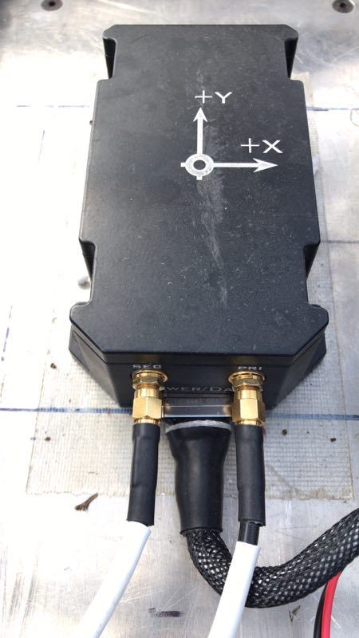

#### 量取杆臂值

参考下述步骤：

- 当主机和天线处在正确位置时量取天线到主机的距离。主机的中点和天线的中点标记在设备的外部。
- 距离被测量并记录为X轴偏移、Y轴偏移和Z轴偏移。坐标轴由主机的位置确定。偏移量的误差应该被控制在一厘米以内以获取高精度的定位信息。杆臂是指后天线（Primary）的几何中心位置相对于主机几何中心在直角坐标系内x,y,z三方向的位置差。通过如下指令进行补偿设置：`$cmd,set,leverarm,gnss,x_offset,y_offset,z_offset*ff`。x_offset:X方向的杆臂误差，单位为米，以此类推。注：上述坐标XYZ为设备坐标轴配置后的实际坐标，一般应与载体坐标系一致，注意补偿的是后天线（Primary）杆臂值。当进行导航模式配置后必须对设备进行重新上电启动。举例如下：


如上图所示：后天线在M2主机X轴的正向0.2m处，则X轴偏移x_offset的值为0.2；后天线在M2主机Y轴的负向0.1m处，则Y轴偏移y_offset的值为-0.1；后天线在M2主机Z轴的正向0.8m处，则Z轴偏移z_offset的值为0.8。

### 配置GPS和主机
下面展现了配置GPS和主机的方法。当设备正确接入系统后，在/dev/下面有名为ttyACM0的设备，即表示M2已经被正确的加载了。配置设备时，需要将设备的串口线连接上电脑的串口才可以对设备进行配置，也就是说，用来配置设备的电脑主机需要拥有串口。Windows下可以通过串口助手、串口猎人或者COMCenter等工具进行配置，Linux下可以通过Minicom、Cutecom等工具进行配置。

#### 杆臂配置
车尾天线（后天线，通常是主天线，也就是Primary）杆臂配置：

`$cmd,set,leverarm,gnss,x_offset,y_offset,z_offset*ff`

杆臂值请以自己使用的实际情况为主。

#### GNSS航向配置
天线车头车尾前后安装

`$cmd,set,headoffset,0*ff`

#### 导航模式配置
```
$cmd,set,navmode,FineAlign,off*ff
$cmd,set,navmode,coarsealign,off*ff
$cmd,set,navmode,dynamicalign,on*ff
$cmd,set,navmode,gnss,double*ff
$cmd,set,navmode,carmode,on*ff
$cmd,set,navmode,zupt,on*ff
$cmd,set,navmode,firmwareindex,0*ff
```

#### USB接口输出设置
```
$cmd,output,usb0,rawimub,0.010*ff
$cmd,output,usb0,inspvab,0.010*ff
$cmd,through,usb0,bestposb,1.000*ff
$cmd,through,usb0,rangeb,1.000*ff
$cmd,through,usb0,gpsephemb,1.000*ff
$cmd,through,usb0,gloephemerisb,1.000*ff
$cmd,through,usb0,bdsephemerisb,1.000*ff
$cmd,through,usb0,headingb,1.000*ff
```
#### 网口配置
```
$cmd,set,localip,192,168,1,2*ff
$cmd,set,localmask,255,255,255,0*ff
$cmd,set,localgate,192,168,1,1*ff
$cmd,set,netipport,111,112,113,114,8000*ff
$cmd,set,netuser,username:password*ff
$cmd,set,mountpoint,XMJL*ff
```
这里我们假设您所使用的无线路由器的IP地址为192.168.1.1,那么我们将主机的IP地址设置为192.168.1.2，子网掩码为255.255.255.0，网关为192.168.1.1，netipport设置的是RTK基站的IP地址和端口，netuser设置的是RTK基站的用户名和密码，mountpoint是RTK基站的挂载点。网络配置请依据自己所使用的路由器的实际情况自行更改为相应的配置，RTK基站信息请以自己的实际情况为准。

#### PPS授时接口输出
```
ppscontrol enable positive 1.0 10000
log com3 gprmc ontime 1 0.25
```

将所有配置逐条或一起发送给设备，得到设备返回`$cmd,config,ok*ff`字段，说明配置成功，配置成功后要进行配置保存，发送`$cmd,save,config*ff`指令，然后将该设备断电后重新上电加载后即可使用。


## 摄像头安装配置与数据验证

 - 摄像头型号：LI-USB30-AR023ZWDR（leopard 摄像头）。
 - 摄像头LI-USB30-AR023ZWDR采用标准USB 3.0接口，由Leopard Imaging Inc.制造。该系列产品基于AZ023Z 1080P传感器和安森美半导体的AP0202 ISP。它支持外部触发和软件触发。
 - 建议使用两个带 6mm镜头的摄像头和一个带 25mm镜头的摄像头，以达到所需的性能。
 - 更多详细参数可参考：[leopard数据手册](https://leopardimaging.com/product/li-usb30-ar023zwdrb/)。
 
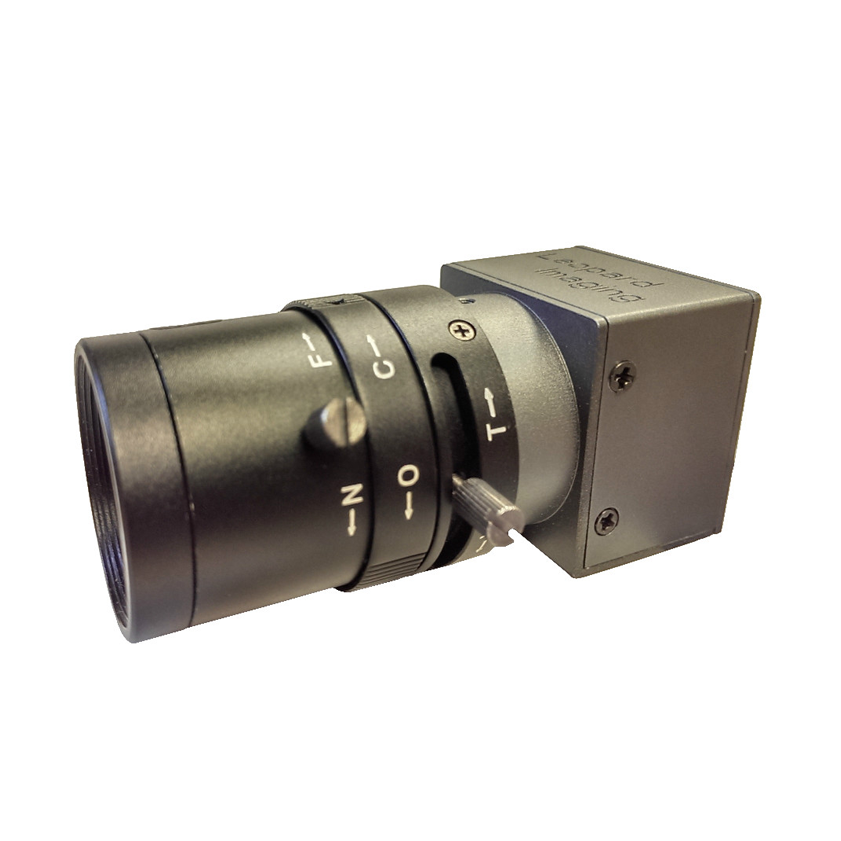

### 摄像头的安装固定
 - 牢固安装在小车结构架前端横梁处，水平安装，俯仰角向下0-2度（向下倾斜小于2度，不能上仰），翻滚角误差±1度（左右两侧的平齐程度），航向角误差±2度，镜头保持清洁，避免影响图像采集。安装位置如下图所示：
 


 - 注意摄像头不要装反(usb接口应该在下方)，正确的放置方向如下图所示：
 


### 摄像头与工控机连接
 - 直接用数据线将设备连接在IPC的USB3.0接口。两个6mm摄像头分别插在工控机USB扩展板的第一个、第二个USB接口上，25mm摄像头接在扩展板的第三个接口上，USB扩展板的端口号顺序及数据线与摄像头的连接方式如下图所示：
 
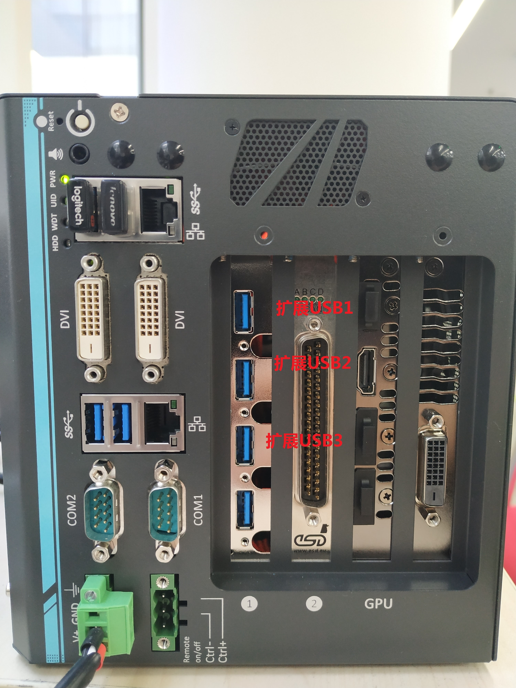


### 摄像头的配置及启动
 - 在摄像头与工控机正常连接的基础上，执行`ls /dev/video*`指令，查看摄像头是否被识别，
 如果摄像头设备已经被识别，则会显示以`video`开头的设备名称，否则的话，请检查与工控机的连线。
 - 检查`/dev/camera/`文件夹下是否有`obstacle`、`trafficlights`、`lanemark`三个软链接文件的存在。如果不存在，请检查`/etc/udev/rules.d`文件夹下规则的配置。
 - 启动docker环境。
 - 在docker环境下编译usbcam
 `bash /apollo/apollo.sh build_usbcam`
 - 启动dreamview
 `bash /apollo/scripts/bootstrap.sh`
 - 在`Tasks`标签栏下打开`SimControl`和`Camera Sensor`开关，选择`Standard`模式，如下图所示：
 
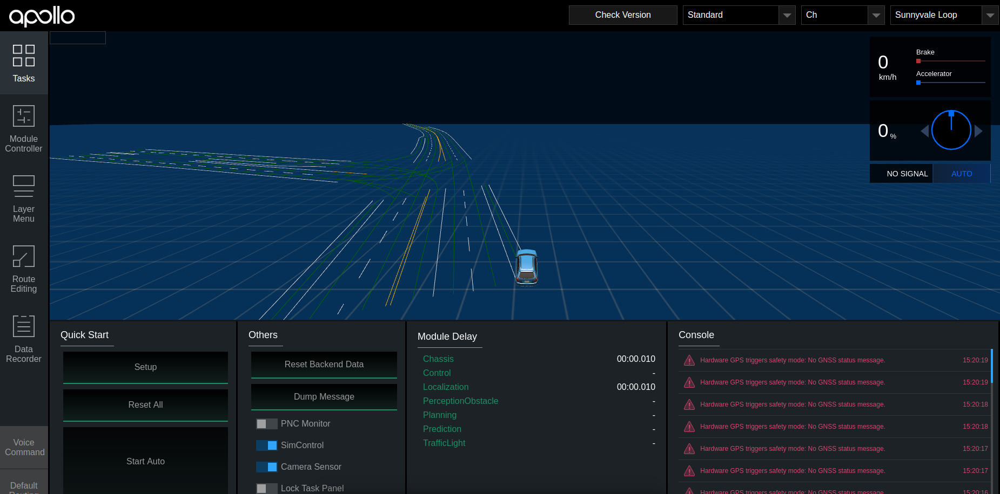

 - 在`Module Controller`标签栏下，打开`Camera`开关，如下图所示：
 
 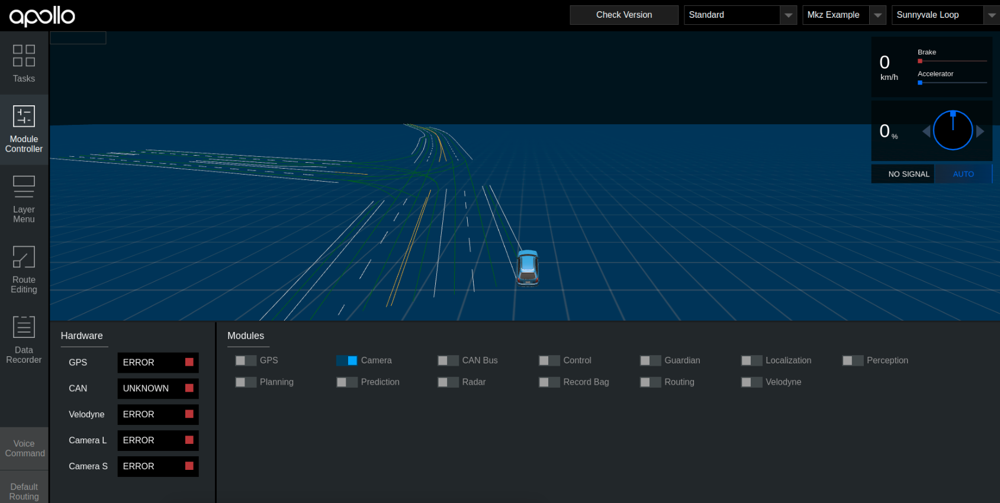
 
 - 如果一切正常，则会在`dreamview`左上角出现摄像头采集的图像，如下图所示：
 
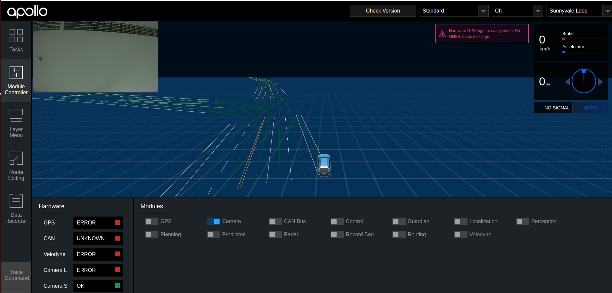

### 摄像头数据的验证
 - 在正确完成上述步骤后，在`docker`环境内执行查看`topic`指令 `rostopic list`，结果如下图所示：
 


 - 分别执行如下指令，确认以下的`topic`都能正常输出数据：
 
```
rostopic echo /apollo/sensor/camera/obstacle/front_6mm
rostopic echo /apollo/sensor/camera/traffic/image_long
rostopic echo /apollo/sensor/camera/traffic/image_short
```

## 毫米波雷达安装配置与数据验证

 - 毫米波雷达型号：continental AS 408-21
 - continental AS 408-21简介：ARS408-21 是大陆 40X 毫米波雷达传感器系列中最新推出的高端产品，可以适用于不同的应用场景。ARS 408-21 很好的处理了测量性能与高安全性之间的矛盾，可实时检测目标的距离并根据当前车速判断是否存在碰撞风险可靠；具有自动故障检测功能，可识别传感器问题，并自动输出故障码鲁棒、轻量化设计；通过使用相对简单的雷达测量技术，以及在汽车行业的深度研发和批量生产基础，可以保证产品鲁棒和轻量化性能。
 


### 毫米波雷达接口及线序
 - continental AS 408-21传感器采用12V直流供电，使用CAN通信接口。使用时，通过如下图所示的连接线缆将传感器CAN通信接口与Apollo的CAN1口连接，电源接口接入12V直流电源，注意正负极。
 


 - 传感器接口及定义如下图所示：其中，端口1接12V直流电源；端口8接GND；端口4接CAN_L；端口7接CAN_H。
 


### 毫米波雷达的安装固定
 - 传感器应安装在车前方中心处，当人正向面对车辆正前方时，传感器的正面朝向人，传感器的连接口朝向人的右手边，如下图所示：
 
 
 
 - 毫米波雷达要牢靠固定在车身上，连接到毫米波雷达的接头要牢靠接插。离地面高0.5米，不能向下倾斜，向上仰`0~2`度以内，高度误差±0.2米，俯仰角误差`0~2`度（向上仰小于2度，不能向下倾斜），翻滚角误差±2度（radar左右两侧的平齐程度），航向角误差±2度（radar是否正对前方）。
 
### 毫米波雷达的配置及启动

 - 传感器参数的配置：该传感器配置文件位于`/apollo/modules/drivers/radar/conti_radar_conf/`目录下的`conti_radar.conf`和`conti_radar_conf.pb.txt`文件中，可根据实际情况进行配置。
 
 - 正确启动Apollo及DreamView，选择车辆型号及运行模式，并打开`Radar`模块开关，如下图所示：
 


 - 输入`rostopic list`命令，应显示`/apollo/senson/conti_radar`话题，如下图所示：
 


 - 输入`rostopic echo /apollo/sensor/conti_radar` 命令，打印该话题，如下图所示：
 
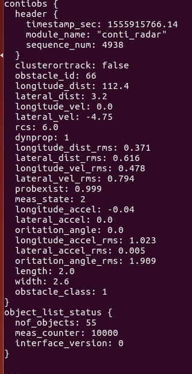

 - 主要参数的含义如下表所示：
 
 
	| 参数 | 含义 | 
	|---|---|
	|`longitude_dist`   | 距目标的纵向距离 | 
	| `lateral_dist`       | 距目标的横向距离 | 
	|`longitude_vel`    | 目标的纵向速度    | 
	| `lateral_vel`        |  目标的横向速度   | 


### 毫米波雷达数据的验证

 - 纵向距离(`longitude_dist`)/横向距离(`lateral_dist`)的验证：该传感器默认使用`长距离`模式，检测距离为`0.2~250m`，在车辆正前方检测距离范围内，分别放置障碍物，查看`/apollo/sensor/conti_radar`话题中的`longitute_dist`、`lateral_dist`数据是否正常(单位m)。下图中红色部分为长距离模式下传感器检测范围，误差在+/-0.4m内为正常。
 


 - 纵向速度(`longitude_vel`)/横向速度(`lateral_vel`)的验证：使得目标物体以固定速度在检测范围内运动，检测数据是否在误差允许有范围内。
 - 该传感器各项参数的测量范围及分辨率如下图所示：
 

	

## 激光雷达安装与数据验证
 - 激光雷达型号：80-VLP-16（velodyne 16线激光雷达）
 - 更多详细参数可参考：[https://velodynelidar.com/vlp-16.html](https://velodynelidar.com/vlp-16.html)
 


### 激光雷达的安装固定
 - 16线激光雷达及接口盒要牢靠固定在车身上，连接到接口盒上的接头要牢靠接插。水平安装在车顶部，对地高度1.5米，水平放置，精度在2度以内。连接线缆带屏蔽，接口镀金， 网线两头需贴上标签注明设备名称。安装位置如下图：
 


 - 安装激光雷达时线缆方向朝向车辆的后方。

### 激光雷达与车辆的接线

 - 配套的激光雷达线束为1拖3线缆。其中一端有三个接口，分别为数据口(网线接口)、12V电源接口、GPS授时接口，如下图所示：
 


 - 数据口：通过以太网线缆与IPC连接。
 - 12V电源接口：与12V电源接口连接，接口具备防反插功能。
 - GPS授时接口：与GPS的授时接口连接，接口具备防反插功能。
线缆的另一端为航插接头，与激光雷达连接，如下图所示： 
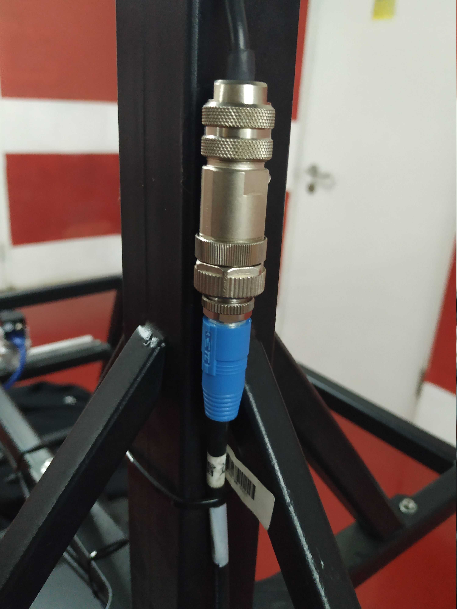
### 激光雷达的配置及启动
 - 激光雷达的相关参数配置：雷达出厂默认ip地址为192.168.1.201，在浏览器中输入激光雷达ip地址，打开配置界面，将激光雷达的ip地址修改为与IPC的ip地址处于相同号段， 将`NetWork(Sensor)`选项卡下的`Data Port`修改为2369，将`Telemetry Port`修改为8309，点击`set` 按键、`Save Configuration`按键使配置生效。
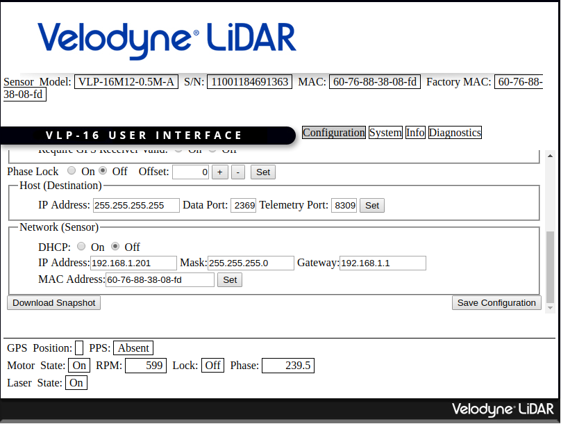

### 激光雷达数据的验证

 在完成上述配置后，可以使用以下方法验证激光雷达能否正常工作：
 
 - 查看雷达是否接收到GPS设备的PPS信号：在浏览器中输入雷达ip地址，打开配置界面，如果`GPS`选项卡中的`Position`有数据且`PPS`显示为`Locked`，则代表雷达收到了PPS信号。
 - 查看是否能ping通激光雷达：在正确进行配置后，可以使用`ping`指令，查看是否能与激光雷达通信，正确结果如下图所示，如果不能ping通，请检查激光雷达及IPC的ip地址设置。
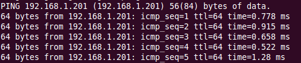

 - 使用VeloView查看点云数据：使用Velodyne官网提供的VeloView软件，在线查看点云数据，点击软件的`Sensor Stream`按钮，选择传感器型号为`VLP-16`，`LIDAR Port`为2369，`GPS Port`为8309，如果一切正常，则可以显示点云信息，如下图所示：
 
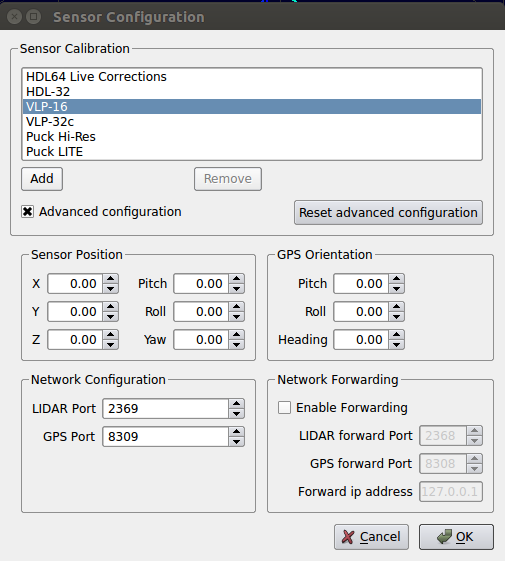

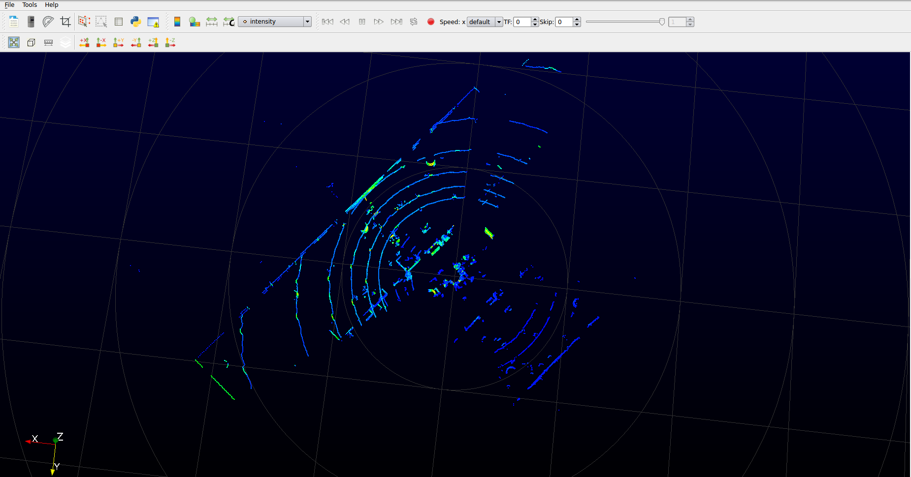

 - 在Apollo启动后，在`docker`环境内，启动`dreamview`后，执行`bash /apollo/scripts/velodyne_16.sh`，出现如下图所示的`topic`，如下图所示，打印这三个`topic`，如果数据能正常输出，则代表激光雷达运行正常。
 
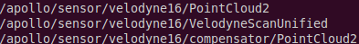


# 油门刹车标定


油门刹车标定是车辆纵向精准控制的前提。用户可以使用系统预先标定好的参数，也可以按照手册说明重新进行标定。

## 标定原理介绍
在Apollo系统中，控制模块会请求加速度量值。通过车辆标定表，控制模块便能找到准确产生所需加速度量值对应的油门、刹车踏板开合度控制命令，之后下发给车辆底盘。车辆标定表提供一个描述车辆速度、油门／刹车踏板开合度、加速度量之间关系的映射表。油门刹车标定过程便是生成车辆标定表的过程。

Apollo系统为教学小车提供了一份默认的标定表。如用户期望自己重新标定车辆，可以参考以下车辆标定流程说明。

## 标定流程说明

按如下顺序完成准备工作:

- 改变驾驶模式
- 选择测试地点

### 改变驾驶模式
  在`modules/canbus/conf/canbus_conf.pb.txt`中，设置驾驶模式为 `AUTO_SPEED_ONLY`。

### 选择测试地点
  理想的测试地点是平坦的长直路。

以上准备工作完成后, 在`modules/tools/calibration`中按顺序完成如下工作：

- 采集数据
- 处理数据
- 绘制结果
- 转换结果为`Protobuf`格式


### 采集数据
1. 运行 modules/tools/calibration/  下的 `python data_collector.py`, 之后输入参数x y z, x 代表加速踏板开合度（百分比正值）, y 代表了速度限值(米／秒), z 代表刹车踏板开合度（百分比负值）。输入参数后，车辆即开始以x加速踏板值加速至y速度限值，之后再以z刹车踏板值减速直至车辆停止。
2. 产生对应x y z 参数的csv文件。 比如输出指令 `15 5.2 -10`,将会生成名为`t15b-10r0_recorded.csv`的文件。
3. 根据车辆反应情况选取合适的x y z 参数，如加速踏板过小不能启动或者刹车踏板过小不能停车，需要相应调整命令参数。


x y z取值建议： 
x: 过低可能无法启动，通常20以上。通过实验，获取能启动车辆的最小值供后续设置使用。最大取值取决于应用场景要求。在小加速踏板区间建议取值间隔粒度小，以获取更丰富数据。 
y: 单位米/秒，根据车型和实际应用场景确定​。 
z: 刹车踏板，-35已经是急刹车。通过实验，获取能制动车辆的最小值供后续设置使用。取值范围取决于应用场景要求，同时，建议采集急刹车数据。在小减速踏板区间建议取值间隔粒度小，以获取更丰富数据。 

x y z参数组合取值建议： 
一般先固定加速踏板命令 x ，之后再选择该加速踏板命令所能达到的最大速度或车型限速，最后尝试采集能让车辆停下来的最小减速命令z： 
（21 5 -8）
之后再逐一更改加速踏板命令 x ，直到期望采集的 x 取值都已经覆盖​ 
（22 5.3 -8） （23 5.4 -9） （24 5.6 -9）（25 5.6 -9）​ 
（26 5.6 -9） （27 5.7 -10） （28 5.7 -10）（29 5.8 -10） 
（30 5.8 -10）（33 5.9 -10）（38 6.1 -12）（43 6.1 -12）
之后再看期望采集的减速指令 z 取值是否都已经覆盖，如未覆盖再增加测试组合丰富 z 取值，对应 y 取值要尝试能让车辆停下来的最大速度（38 6 -11）。

### 处理数据
运行`process_data.sh {dir}`，其中dir为类似`t15b-10r0_recorded.csv`文件所在的目录。每个数据日志被处理成类似`t15b-10r0_recorded.csv.result`的文件。同时，会生成一个名为result.csv的文件。

### 绘制结果
运行`python plot_results.py {dir}/result.csv`, 其中dir为result.csv所在目录，得到可视化最终结果，检查是否有异常，示例如下：


### 转换结果为`Protobuf`格式
如果一切正常，运行`result2pb.sh {dir}/result.csv`, 其中dir为result.csv所在目录，把校准结果result.csv转换成控制模块定义的`Protobuf`格式。运行命令后生成control_conf_pb.txt文件。该文件里面的calibration_table段落是我们需要的，我们将该calibration_table段替换放到文件/modules/control/conf/lincoln.pb.txt下对应的calibration_table段。

最后，把前面实验获取的启动车辆的最小 x 值和能制动车辆的最小 z 值替换 /modules/control/conf/lincoln.pb.txt 文件里的 throttle_deadzone、brake_deadzone 字段。

注：Calibration_table 片段示例

    calibration_table {
	    calibration {
	      speed: 0.0
	      acceleration: -1.43
	      command: -35.0
	    }
	    calibration {
	      speed: 0.0
	      acceleration: -1.28
	      command: -27.0
	    }
	    calibration {
	      speed: 0.0
	      acceleration: -1.17
	      command: -25.0
	    }
	    calibration {
	      speed: 0.0
	      acceleration: -1.02
	      command: -30.0
	    }
	 }

# 启动循迹

在完成以上软硬件安装，标定以及系统文件配置后，用户可以通过Dreamview界面录制车辆轨迹并回放，完成第一个循迹演示。本部分主要分为系统文件配置和循迹操作说明两个方面。

## 系统文件配置

系统文档配置主要包括两个部分，GNSS配置和车辆配置。

### GNSS配置

此配置过程是基于Apollo的r3.0.0分支的代码进行的，将其clone至本地后编译通过即可。

#### 修改配置
修改`/apollo/modules/drivers/gnss/conf`文件夹下面的配置文件`gnss_conf.pb.txt`，将`gnss_conf_newton.pb.txt`的内容全部拷贝覆盖`gnss_conf.pb.txt`的内容即可。修改如下内容配置基站信息：
```
rtk_from {
    format: RTCM_V3
    ntrip {
        address: "IP"
        port: 8000
        mount_point: "MOUNTPOINT"
        user: "USERNAME"
        password: "PASSWORD"
        timeout_s: 5
    }
    push_location: true
}

```
这是RTK基站信息相关的配置，请依据自己的实际情况进行配置。在程序运行的过程中，有可能会把`modules/calibration/data/vehicle_name/gnss_params/gnss_conf.pb.txt`拷贝到`modules/drivers/gnss/conf/gnss_conf.pb.txt`，那么我们也需要修改`modules/calibration/data/vehicle_name/gnss_params/gnss_conf.pb.txt`里面的基站配置信息才能保证`gnss`配置正确。

#### 关闭雷达

在`apollo/modules/localization/conf/localization.conf`文件中将：`--enable_lidar_localization=true`修改为：`--enable_lidar_localization=false`。

#### 修改定位模式

在`apollo/modules/localization/conf/localization_config.pb.txt`文件中这个配置应为`localization_type:MSF`，M2不支持`RTK`模式。

#### 常见问题
系统无法生成驱动设备`ttyACM0`，在`/apollo/data/log/gnss.ERROR`里面会有类似报错提示：

```
open device /dev/ttyACM0 failed， error: no such file or directory
gnss driver connect failed, stream init failed
```

docker内和docker外的/dev/下都没有`ttyACM0`设备，先退出docker，然后关闭docker，再执行如下命令：
```
cd /apollo/docker/setup_host
bash setup_host.sh
```
重启工控机，然后在/docker/外，/dev/下，就有`ttyACM0`，再进docker，再试gps，可以了。


### 车辆配置
所有的车辆配置都是以车型为单位的，一个车型的车辆相关的所有配置都放在一个以车型命名的文件夹里面。Apollo支持的所有的车型都在`/apollo/modules/calibration/data/`目录下。我们以酷黑小车为例，其在Apollo中的简称为ch，ch文件夹的内容如下：

- camera_params 目录
- gnss_params 目录
- init_params目录
- radar_params 目录
- vehicle_params目录
- velodyne_params目录
- calibration_table.pb.txt 文件
- navigation_ch.pb.txt 文件
- start_velodyne.launch 文件
- vehicle_info.pb.txt 文件
- vehicle_params.pb.txt 文件

`gnss_params`目录主要是关于gps基站和IMU的相关配置，其中`gnss_conf.pb.txt`是关于基站的配置，其中内容在gps配置部分已经作了说明，必须保证信息正确。
`vehicle_params`目录下是关于车辆`translation`和`rotation`相关设置，不用修改，
`vehicle_info.pb.txt`是车辆型号配置，根据新车型作相应修改。

因此如果只做循迹方案，只需要`gnss_params`目录，`vehicle_params`目录，`vehicle_info.pb.txt`文件，其他文件并不需要。
保证这些文件正确，重新编译，启动`bootstrap`, 就可以在`dreamview`下选择酷黑小车`ch`车辆，进行下面的循迹操作了。

除了车辆相关配置外，还需要注意canbus和control模块的配置。分别介绍如下:

1. `modules/canbus/conf/canbus_conf.pb.txt` 修改如下：
```
brand:CH
enable_debug_mode:true
enable_receiver_log:true
enable_sender_log: true
```
第一行将默认的LINCOLN_MKZ改为CH，后三行用于打开debug信息。

2. `modules/canbus/conf/canbus.conf` 修改如下:
```
enable_chassis_detail_pub
noreceive_guardian
```
第一行打开/apollo/canbus/chassis_detail消息，第二行关闭guardian模块。


## 循迹操作说明

当gps安装配置好以后，就可以进行循迹测试，所谓的循迹测试是对车辆底盘线控改造的一个综合测试（ 对油门刹车档位等的控制 ），以及对apollo控制算法和传感器集成的综合测试。下面按时间先后对循迹测试的步骤做说明。以下所说的操作都是在apollo docker内部。

### 循迹前检查和准备

在命令行中执行
```
bash bootstrap.sh
```
启动`dreamview`,浏览器中输入`ｈttp://localhost：8888`进入`dreamview`界面，在`dreamview`顶部下拉菜单中选择`ch`车辆（表示选择酷黑车型）, `rtk_record_play`表示选择循迹。点击左侧的`task`标签，点击页面中的`reset all` ，接着点击`setup`，将会启动apollo中相应的模块。点击页面左侧的`modules controllers`，然后在右侧查看各个模块的打开情况，蓝色表示处于开启状态，灰色表示模块处于关闭状态，确保`GPS`，`CAN Bus`， `Control`，`Localization`模块是开启的，其他的`Gardian`和`Record Bag`处于关闭状态。
执行如下三个命令可以看到`gps`，` imu`，`localization`信号和状态：
```
rostopic echo /apollo/sensor/gnss/best_pose
rostopic echo /apollo/sensor/gnss/imu
rostopic echo /apollo/localization/pose
```
都正常，就可以开始进行循迹测试( 有时候`localization`信号没有，可能需要等待一会儿，如果还是没有那么可以尝试让车辆跑一下 )。

### 录制循迹数据包
车辆开到循迹起始点，保持N档，线控开启，输入以下命令：
```
cd /apollo/scripts
bash rtk_record.sh setup
bash rtk_record.sh start （ 命令输入后，开始开车走一段轨迹 ）
bash rtk_record.sh stop( 如果无法输入就按Ctrl + C结束 )
```
`Ctrl + C`结束后，apollo将会录制一个轨迹数据包garage.csv，放在`data/log/`下（主要记录了位置、刹车、油门、方向、速度等信息）。

### 回放数据包
N档，线控开启，输入以下命令：
```
bash scripts/rtk_player.sh setup
bash scripts/rtk_player.sh start （ 这个命令敲完，车还不会反应 ）
```
发现命令行中record数据被重放，log不停刷屏，`dreamview`会显示大致轨迹，清浏览轨迹是否大致相符，如果相差很大，比如本来录制的时候是直行，而轨迹显示大幅度转弯，请小心测试，谨防危险。
点击`start auto`，这时候车子会出现反应，并且是大反应（司机注意接管）。`bash scripts/rtk_player.sh start` 这一步只是把record数据重新放出来，或者对路径进行规划，即完成planning的过程。

注意事项：一定要在宽阔的场地进行测试，确保周围没有人，循迹测试之前做好应急接管准备，有问题随时遥控器接管。不要轻易尝试速度大于20km/h（ 6m/s ）的循迹。

### 结束播放

输入以下命令来结束播放：

`bash rtk_player.sh stop`

如果无法输入就按`Ctrl + C`或者`Ctrl + D` 结束。

### 循迹回放时录制数据包

为了能观察循迹效果，可以在循迹回放的时候录制数据包，命令如下：
```
bash record_bag.sh start && bash rtk_player.sh start （车辆开始启动并开始录）
Ctrl + C （车辆循迹到终点时输入 Ctrl + C结束循迹）
bash record_bag.sh stop （停止录制）
```
该数据包都放在`/apollo/data/bag/`下，并以时间命名。该数据包可以用来循环回放。
录制数据包也可以用`dreamview`界面中的按钮来完成，有兴趣的开发者可以尝试。


# 调试与常见问题

本小节讲述小车Apollo 循迹过程的实际调试方法和操作，在此之前必须保证环境已经准备好，即Ubuntu 14.4已经装好kernel，docker，canbus，硬件和传感器已经连接好。 
 
## 底盘连接是否正常 
 
硬件连接：确保CAN硬件连接线CAN0和车辆线控底盘连接正常，CAN卡跳线帽设置正确，线控底盘开关处于打开状态 
进入Ubuntu Docker环境，输入以下命令：

```
cd /apollo/scripts 
bash roscore.sh  启动ros 
bash canbus.sh  启动canbus模块 
bash diagnostics.sh 启动diagnostics工具 
```

在diagnostics界面中应该能看到如下的模块：


用键盘上下箭头移动光标选择CHASSIS或者CHASSIS_DETAIL，选中后按右箭头可以进入查看详细信息，这些信息即是车辆底盘信息， CHASSIS消息如下： 

 

Chassis detail消息如下： 

 

如果这些信息得到正确显示，说明CANBUS模块工作正常。如果不能显示底盘信息，很大可能是CANBUS有问题，或者底盘有问题，没有向上反馈底盘数据。 
保证CANBUS的连接正确性，才能确定工控机计算单元可以控制车辆底盘，才能继续其它部分的调试。 
 
### canbus_teleop的使用 
 
CANBUS能够连接底盘后，我们可以尝试控制底盘的运动。如果控制正常，则说明工控机计算单元下发命令后得到正确执行。 进入Ubuntu Docker环境，输入以下命令：

```
cd /apollo/scripts 
bash canbus_teleop.sh 
```

弹出界面如下： 

 
 
a 根据提示按M0重置系统，按 M1是开始控制底盘。
b 按几次A或者D，看看车轮是否转动。 
c 按G1，挂前进档，按几次W，看车辆是否前进，按几次S看车辆是否停下来。 
请小心测试，不要轻易长时间连续按键，以防车辆突然高速动作发生事故。

### 提示警告Nvidia GPU Driver未安装 
下载Nvidia GPU驱动： 
可以在终端中输入以下命令进行下载： 

`wget http://us.download.nvidia.com/XFree86/Linux-x86_64/375.39/NVIDIA-Linux-x86_64-375.39.run`

下载成功后安装包会放在终端当前的目录中。 
安装GPU驱动 ：
在终端运行以下命令进行安装： 

`sudo bash ./NVIDIA-Linux-x86_64-375.39.run --no-x-check -a -s --no-kernel-module`

参考文献： 
https://github.com/ApolloAuto/apollo/blob/c8e7d53e8e364315727d535b66b2f76dda33bf2b/docs/specs/Software_and_Kernel_Installation_guide.md
 
### 星网宇达M2 GPS调试 
 
#### M2硬件设备的配置 
 
M2 GPS首先需要保证M2硬件设备配置好，默认出厂的M2已经配置好，可以给百度apollo系统使用，只需要小部分改动，例如杆臂值的配置。 关于杆臂值的配置，请参考上文。
硬件连接：需要把M2的串口线连接到工控机的串口，M2的USB口连接到工控机的USB口，M2接上电源并上电。 
软件部分：Ubuntu 14.4 系统安装串口调试工具cutecom，安装命令为：`sudo apt-get install cutecom`。
安装好以后应该可以在/dev/下看到ttyACM0的设备，这就是我们的M2设备名。

#### apollo GPS模块相关配置
根据上文，修改/apollo/modules/drivers/gnss/conf文件夹下面的配置文件。
 
#### M2 GPS状态查看 

输入以下命令来查看Ｍ２ GPS设备的状态：

```
cd /apollo/scripts 
bash roscore.sh            启动ros
bash gps.sh                启动gps 
bash localization.sh       启动localization 
```

rostopic list   列出topic，应该可以得出以下结果：

 
 
我们在双天线M2 GPS方案中，主要用到如下两个topic：best_pose和imu。 输入命令：

```
rostopic echo /apollo/sensor/gnss/best_pose 
``` 

 
 
输入命令：

```
rostopic echo /apollo/sensor/gnss/imu 
```

 

接下来我们通常需要打开localization模块，鉴于后续我们都会用到dreamview模块，所以我们先打开dreamview，然后在dreamview界面中打开localization模块。 
输入命令:
```
 bash bootstrap.sh start 
```
然后在网页中输入http://IP_ADDRESS:8888(如果在本地机器可以用http://localhost:8888 )即可以打开dreamview界面，该界面可以控制和监测车辆自动驾驶动作和效果。选择左侧的modules conttroller，可以出现很多模块，我们点击localization使它变成蓝色即可以打开localization模块，接着在命令行，就可以用命令rostopic echo /apollo/localization/pose观察localization的效果，dreamview和localization topic的效果如下图所示：


 
在GPS定位方案中，localization模块和GPS模块相关，如果GPS模块没有打开并正常工作那么localization模块也无法正常工作。
 
如果无法得出以上结果，请到/apollo/data/log/下查看日志gnss.ERROR，并根据报错做相应的排查。Apollo所有的日志都在/apollo/data/log/下，要多看这些log才能知道问题和运行过程，更快地完成调试。 
 
 
### rtk循迹测试的调试 
 
#### 配置dreamview 
 
在dreamview界面中确保选择自己的车型和RTK_Record/Replay,如下2幅图所示：

 

 
 
 
#### 打开传感器 
 
确保canbus,roscore,control,gps,localization这几个模块是打开的，如下图：


 
#### 录制轨迹包 
 
车辆保持N档，线控权限交给apollo，然后在命令行中，输入如下命令：
bash rtk_recorder.sh setup 
bash rtk_recorder.sh start ( 输入这条命令后，命令行界面会看到消息不停刷屏，记录车辆运动轨迹，开始用遥控控制车辆走一段距离 ，让车辆停止后，在命令行中ctrl + c按钮结束数据录制 ) 
这些数据会记录到/apollo/data/log/garage.csv文件夹中，如下图所示：


#### 回放数据包 
 
Dreamview界面要准备好，需要命令行和dreamview界面配合操作，在命令行界面中输入如下命令：


```
bash rtk_player.sh setup 
bash rtk_player.sh start 
```


如下图所示：


这时候会有很多关于轨迹的数据播放并刷屏，dreamview界面中也会看到有一条浅蓝色的线，代表车辆即将要走的轨迹。接下来需要在dreamview 界面中点击Start Auto，如下图所示，车辆开始运动，观察其循迹效果：

 
 
## 常见问题

调试过程中，常见的问题及解决办法总结如下：

### 网络断开或者网络太差无法进入docker
报错如下：


主要是因为网络没有连接上，或者网络太慢，请检查网路。

### 找不到CANBUS相关报错log
调试过程中，一定要反复看/apollo/data/log/下的报错文件，这些文件对调试apollo和理解apollo系统执行非常有帮助，例如CAN相关的有：
CANBUS.error，
CANBUS.waring，
CANBUS.info，
如果打开过canbus.sh等，没有看到这些log信息，说明没有打开相关log记录功能，解决办法：
打开/apollo/module/canbus/conf/canbus_conf.pb.txt把如下三行的false改成true。

```
enable_debug_mode: false
enable_receiver_log: false
enable_sender_log: false
```

### docker进不去, no matching entries in passwd file
 安装好ubuntu Linux, kernel ，docker后，执行
 
 ```
 bash docker/scripts/dev_start.sh -C
 bash docker/scripts/dev_into.sh, 
 ```
 
 遇到报错如下：
 unable to find user xxx : no matching entries in passwd file.
 主要是由于用户权限没有加进docker去导致。执行如下两行命令：
 
 `sudo gpasswd -a `username` docker`
 `sudo usermod -aG docker $USER` 

 其中username是登陆用户名，执行成功后logout，然后重新登陆ubuntu。
 如果没有解决，那么有可能是/apollo/scripts/docker_adduser.sh没有权限，需要sudo chmod a+rx /apollo/scripts/docker_adduser.sh增加权限。（ 我们曾遇到一种情况就是/apollo/scripts/目录下有一个docker_adduser.sh~文件，导致报错，所以需要检查是否存在副本文件或者交换文件之类的，需要删除掉 ）。
如果还是不行，可以试试`sudo chmod 777 /var/run/docker.sock docker/scripts`。

### 编译的时候CAN警告

编译的时候，刚开始就报出几行黄色的提示找不到ESD CAN的报错，原因是CAN驱动没有安装好，参见下图：


首先要下载ESD CAN安装包，按照<https://github.com/ApolloAuto/apollo-kernel/blob/master/linux/ESDCAN-README.md>进行CAN驱动安装。其次需要从安装包中拷贝头文件和库文件到指定目录。具体操作如下：
检查apollo/apollo.sh脚本中的check_esd_files()函数，我这里看到1.0.0版本会检查3个文件：
libntcan.so，
libntcan.so.4，
libntcan.so.4.0.1，
所以对应应该建立的软链接是：
```
ln -s libntcan.so.4.0.1 libntcan.so.4
ln -s libntcan.so.4.0.1 libntcan.so.4.0
```
请看apollo.sh的check_esd_files()函数：
```
function check_esd_files() {
  if [ -f ./third_party/can_card_library/esd_can/include/ntcan.h \
      -a -f ./third_party/can_card_library/esd_can/lib/libntcan.so \
      -a -f ./third_party/can_card_library/esd_can/lib/libntcan.so.4 \
      -a -f ./third_party/can_card_library/esd_can/lib/libntcan.so.4.0.1 ]; then
      USE_ESD_CAN=true
  else
      warning "${YELLOW}ESD CAN library supplied by ESD Electronics does not exit.${NO_COLOR}"
      warning "${YELLOW}If you need ESD CAN, please refer to third_party/can_card_library/esd_can/README.md${NO_COLOR}"
      USE_ESD_CAN=false
  fi
}
```
不同的apollo版本可能对检查的库文件名称的要求不同，可根据实际情况建立软连接。

### 无法控制汽车底盘和读取底盘信号
具体表现是车辆下发油门转向等信号，底盘不执行，也读不到底盘的相关信息，这时候的原因应该是CAN不通。解决方法如下：
（1） ESD CAN卡安装的时候跳线帽是否正确设置。跳线不正确，CAN不通。
（2）如果（1）已经正确问题仍然存在，有可能是车辆底盘没有正确接收处理CAN信号，尝试整车断电重启。
（3）如果（2）尝试了，仍然没有解决，用CAN调试工具，看底盘是否有信号上报，以及apollo执行的时候，是否有命令下发。

### Teleop进入不了自动驾驶模式 
 打开canbus.sh后，执行canbus_teleop.sh始终无法进入自动驾驶模式，CAN调试工具测量底盘信号是通的。这种情况，有可能是guidian模块打开造成，guidian模块是一种安全保护机制，开发者调试阶段，可以根据需要关掉。
 打开/apollo/module/canbus/conf/canbus.conf
 修改`--receive_guardian`为`--noreceive_guardian`。

### chassis_detail信息量很少
CANBUS正确配置接通的情况下，前述提到可以执行rostopic echo /apollo/canbus/chassis_detail来查看底盘详细信息，但是如果执行后，看到的信息量很少，那么有可能是chassis_detail没有被打开。
编辑/apollo/module/canbus/conf/canbus.conf
修改其中`--noenable_chassis_detail_pub`为`--enable_chassis_detail_pub`。

### apollo系统第一次搭建完毕，Teleop测试发转角车辆实际转角不对

   例如下发转向角10%，但是转动角度远超过转向最大角度的10%。可以通过diagnostics.sh工具或者rostopic echo /apollo/canbus/chassis及时观察底盘信号，apollo默认是Lincoln车型，如果使用者第一次搭建好apollo，还没有选择车型那么默认会按照lincoln车的最大转向角乘以百分比去执行。解决方法如下：检查modules/canbus/conf/canbus_conf.pb.txt中的配置，brand设置为正确的车型（例如ch），重启canbus，再尝试。如何仍然未解决，请运行bootstrap.sh脚本，在dreamview中选择对应的车型，例如ch酷黑小车。然后点击界面上的reset all，再点击setup。 


### gps.sh打开后不正常，log提示Unable to load gnss conf file
原因是gps配置文档不正确，检查每一行，是否有错误，尤其如下几行的#要去掉：
```
    #address: "111.111.111.11"
    #port: 0000
    #mount_point: "yourport"
    #user: "username"
    #password: "password"

```
另外，在程序运行的过程中，有可能会把modules/calibration/data/vehicle_name/gnss_params/gnss_conf.pb.txt拷贝到modules/drivers/gnss/conf/gnss_conf.pb.txt，那么我们也需要修改modules/calibration/data/vehicle_name/gnss_params/gnss_conf.pb.txt里面的基站配置信息和+zone=50才能保证gnss配置正确。

### GPS打开后，发现best_pose, imu, localization/pose 信号没有收到
运行bash gps.sh后，可以用如下命令观察信号
```
rostopic echo /apollo/sensor/gnss/best_pose 查看gps卫星信号
rostopic echo /apollo/sensor/gnss/imu 查看imu信息
rostopic echo /apollo/localization/pose 查看点位信息
```
如果best_pose和imu没有，请检查gps和imu的配置。
如果best_pose和imu有了，但是没有localization/pose没有信号，请等待2分钟，如果还是没有，请让车开动几分钟。

### 循迹bash rtk_player.sh开始后，车辆不动
很可能是标定没有做好，尤其低速油门没有做好。

### 循迹刹车地点不准确，或者刹车停不下来
很可能是标定没有做好，标定刹车部分没有做好，急刹缓刹都要考虑。

### 循迹效果不佳
纵向效果不好，请考虑标定和PID参数调整以及车辆本身的信号（例如油门和刹车下发和上报是否一致），横向误差大，主要考虑LQR参数调整和车辆转向信号（下发和上报是否一致）。
