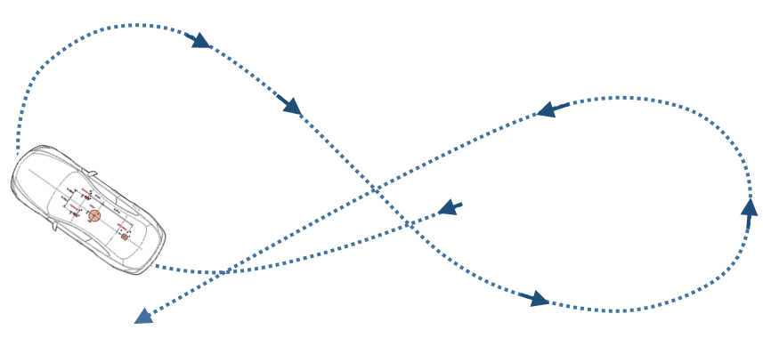
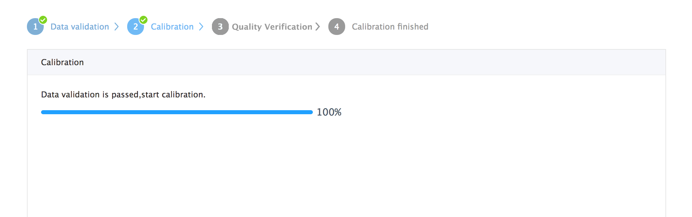

## Apollo LiDAR - IMU Calibration Service

```
Note:
This guide cannot be used for version Apollo 3.5
```

Welcome to the Apollo sensor calibration service. This document describes the process of the extrinsic calibration service between 64-beam Light Detection And Ranging (LiDAR) and Inertial Navigation System (INS).

## Apollo Sensor Calibration Catalog

- [Overview](#overview)
- [Preparing the Sensors](#preparing-the-sensors)
- [Recording calibration data](#recording-calibration-data)
- [Uploading Calibration Data and Creating a Calibration Service Task](#uploading-calibration-data-and-creating-a-calibration-service-task)
- [Obtaining calibration results](#obtaining-calibration-results)
- [Types of Errors encountered](#types-of-errors)

### Overview

The Apollo vehicle sensor calibration function provides the extrinsic calibration between Velodyne HDL-64ES3 and IMU. The calibration results can be used to transfer the obstacle location detected by LiDAR to the IMU coordinate system, and then to the world coordinate system. The results are provided in `.yaml` format files.

### Preparing the Sensors

In order to calibrate the sensors, it is important to prepare them first, using the following steps:

1. Install 64-beams LiDAR and INS supported by Apollo, and then deploy the Docker environment.

2. Start up the 64-beams LiDAR and INS. The INS must be aligned when it is powered on. At this point, the car should be driven straight, then turned left and turned right in an open area, until the initialization is completed.

3. Confirm that all sensor topics required by this service have the following output : [How to Check the Sensor Output?](https://github.com/ApolloAuto/apollo/blob/master/docs/FAQs/Calibration_FAQs.md)

The topics required by the calibration service are shown in the following Table 1:

Table 1. Sensor topics.

| Sensor    | Topic Name                               | Topic Feq. (Hz) |
| --------- | ---------------------------------------- | --------------- |
| HDL-64ES3 | /apollo/sensor/velodyne64/VelodyneScanUnified | 10              |
| INS       | /apollo/sensor/gnss/odometry             | 100             |
| INS       | /apollo/sensor/gnss/ins_stat             | 2               |


4. Confirm that the INS status is 56 when recording data. To learn how please go to : [How to Check INS Status?](https://github.com/ApolloAuto/apollo/blob/master/docs/FAQs/Calibration_FAQs.md)

5. Choose an appropriate calibration field.

```An ideal calibration field requires no tall buildings around the calibration area. If buildings are near, low-rising building facades are preferred. Finally, the ground should be smooth, not rough, and it should be easy to drive the car following the trajectory that looks like the  ∞ symbol as illustrated in Figure 1. An example of a good calibration field is shown in Figure 2.
```



<p align="center">Figure 1. The trajectory  for calibration.</p>


<p align="center">Figure 2. Calibration field.</p>

### Recording Calibration Data

After the preparation steps are completed, drive the vehicle to the calibration field to record the calibration data.

1. The recording script is `apollo/script/lidar_calibration.sh`.

2. Run the following command to record data:

```bash
  bash lidar_calibration.sh start_record
```

The recorded bag is under the directory `apollo/data/bag`.

3. Drive the car following a ∞ symbol path, using a controlled speed of 20-40km/h, and make the turning radius as small as possible. The total time length should within 3 minutes, but please make sure that your calibration drive contains at least one full ∞ symbol path.

4. After recording, run the following command to stop the data recording:

```bash
  bash lidar_calibration.sh stop_record
```

5. Then, the program will detect whether or not the recorded bag contains all the required topics. After passing the test, the bag will be packaged into file `lidar_calib_data.tar.gz`, including the recorded rosbag and the corresponding MD5 checksum file.

### Uploading Calibration Data and Creating a Calibration Service Task

After recording the calibration data, please login to the [calibration service page](https://console.bce.baidu.com/apollo/calibrator/index/list) to complete the calibration.

1. Enter the calibration service page and click the **New Task** button under the **Task Management** list to create a new calibration task.

2. After entering the New Task page, you need to fill in a simple description of this task. Then click the **Upload and create a task** button and select the upload calibration file to start uploading the calibration data.

3. After you start uploading the data, the page will display the Task Process View. The process figure is the upload progress page. The task will start to calibrate when the upload progress reaches 100%. Please keep the network unblocked during uploading.

4. When the data is uploaded, the Data Verification Process will begin, as shown in Figure 3. The validation process ensures data integrity and suitability. The validation list include:

  * Decompress test
  * MD5 checksum
  * Data format validation
  * ∞ symbol path validation
  * INS status validation

If validation fails, the corresponding error message is prompted as seen in the third Result of the Data Validation screen below in Figure 3.


<p align="center">Figure 3. Calibration data verification.</p>

6. After data validation, the calibration process begins, as shown in Figure 4.  A detailed calibration progress page is displayed to users. Depending on the size and quality of the data, the overall calibration time lasts about 10 - 30 minutes. You can check the progress at any time by opening the given page.

<p align="center">Figure 4. Calibration progress page.</p>

7. When calibration succeeds, click the **View detail** button to display a stitched point cloud. You can confirm the quality verification by checking the sharpness of the point cloud. If you are satisfied with the calibration quality, you can click **Confirm** to keep the result and download the calibration results by clicking **Download**. This fulfills the completion of the calibration process.

For additional information, see: [How to Check Point Cloud Quality?](https://github.com/ApolloAuto/apollo/blob/master/docs/FAQs/Calibration_FAQs.md)

### Obtaining Calibration Results

1. Before obtaining the calibration results, the service requires that you confirm the quality of the calibration results based on visualized point cloud.

2. After confirming the quality of the calibration result, you can click on the **Confirm** button to store the calibration result. After that, you can download the result on the Task page. The **Download** button will *NOT* appear on the task page if the result failed to pass quality verification.

3. Extrinsic file format instruction —  The extrinsic is returned to you in a `.yaml` format file. We can look an at example of the format of the extrinsic file below:

The field meanings shown in this example are defined in Table 2.

```bash
header:
  seq: 0
  stamp:
	 secs: 1504765807
	 nsecs: 0
  frame_id: novatel
child_frame_id: velodyne64
transform:
  rotation:
    x: 0.02883904659307384
	 y: -0.03212457531272153
	 z: 0.697030811535172
	 w: 0.7157404339725393
  translation:
	 x: 0.000908140840832566
	 y: 1.596564931858745
	 z: 1
```

Table 2. Definition of the keys in the yaml file

| Field            | Meaning                                  |
| ---------------- | ---------------------------------------- |
| `header`         | Header information, including timestamps. |
| `child_frame_id` | Source sensor ID in calibration. Will be HDL-64ES3 here. |
| `frame_id`       | Target sensor ID in calibration. Will be Novatel here. |
| `rotation`       | Rotation part of the extrinsic parameters. Represented by a quaternion. |
| `translation`    | Translation part of the extrinsic parameters. |

4. How to use extrinsic parameters?

Enter the following command to create the calibration file directory in the apollo directory:

```bash
mkdir -p modules/calibration/data/[CAR_ID]/
```

Here, **CAR\_ID** is the vehicle ID for calibrating vehicles. Then, copy the downloaded extrinsic yaml file to the corresponding **CAR\_ID** folder. Finally, after you start HMI, select the correct **CAR\_ID** to load the corresponding calibration yaml file.

### Types of Errors encountered

1. **Data unpacking error**: The uploaded data is not a valid `tar.gz` file
2. **MD5 checksum error**:  If the MD5 checksum of the uploaded data differs from the MD5 checksum computed by the server side, it could be caused by network transmission problems.
3. **Data format error**:  The uploaded data is not a rosbag, or necessary topics are missing or unexpected topics exist. The server-side calibration program failed to read it.
4. **No ∞ symbol path error**:  No ∞ symbol path was found in the uploaded data. Verify that the recorded data contains at least one ∞ symbol path.
5. **INS status error**:  In the uploaded data, the location does not meet the requirement. Ensure that the INS status is 56 during the data recording.
