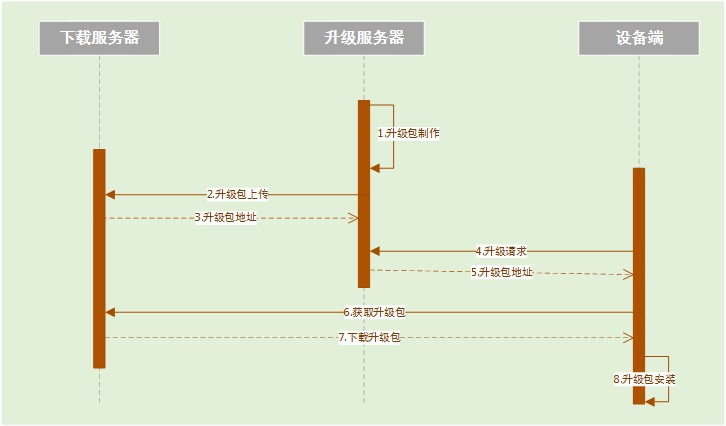
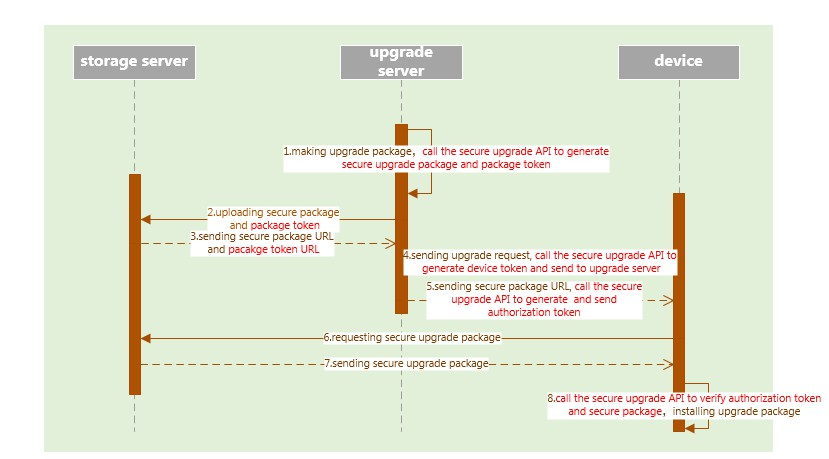

# Apollo Secure Upgrade SDK

Nowadays software upgrade is not securely protected. Therefore, devices are exposed to various security threats during the upgrade procedure. Apollo secure upgrade SDK provides secure upgrade capabilities, and can be easily integrated to make the upgrade more secure and robust.

## Features

1. Packages are encrypted and signature protected in storing and transmitting phases.
2. Server and device can authenticate each other.
3. Cryptographic resources are protected properly.
4. Multiple platforms (Ubuntu 14, Centos 6, Centos 7 and Andorid) are supported.

## Upgrade procedure
A typical upgrade procedure is shown below:



1. Upgrade server generates the upgrade package.
2. Packages are uploaded to the storage server.
3. Storage server sends the package URL to upgrade server.
4. Device sends the upgrade request to upgrade server.
5. Upgrade server replies package URL to the device.
6. Device requests package from the storage server.
7. Packages are downloaded to device.
8. Device installs the package.

After integrating secure upgrade SDK, the upgrade procedure is modified as follows:



1. Upgrade server generates the secure package and package token based on the original upgrade package.
2. Upgrade server uploads the secure package and package token to the storage server.
3. Storage server sends secure package and package token URLs to the upgrade server.
4. Device generates the device token, and sends it to the upgrade server with the upgrade request.
5. Upgrade server generates authorization token based on device token and package token, and sends it to the device with the secure package URL.
6. Device requests secure package from the storage sever.
7. The secure package is sent to device.
8. Device verifies the secure package with the authorization token, and generates the original package. Device installs the package.

## User Guide
### 1. SDK layout
SDK contains four directories:
1. python API: python interface.
2. config: SDK root configuration file, log file.
3. certificate: certificate file.
4. depend_lib: dependency libraries.

### 2. Interfaces
#### a) Initialize
This function should be called before using secure upgrade APIs.
```
init_secure_upgrade(root_config_path)
input para: 
  root_config_path  root configuration file path
```
#### b) Device token generation
This function is used to generate the device token.
```
sec_upgrade_get_device_token()
Ouput para:
  return code: true    generating device token successfully
               false    generating device token failed
  Device_token: device token (string format)
```
#### c) Package generation
This function is used to generate secure upgrade package and package token.
```
sec_upgrade_get_package(original_package_path,
                        secure_package_path,
                        package_token_path)
input para: 
    original_package_path    original upgrade package file path 
    secure_package_path    secure upgrade package file path
    package_token_path    secure package token file     
ouput para: 
    return code: 
        true    generating secure upgrade package successfully
        false    generating secure upgrade package failed
```
#### d) Authorization token generation
This function is used to generate a device’s authorization token based on device token and package token.
```
sec_upgrade_get_authorization_token(package_token_path,
                                    device_token_path)
input para: 
    package_token_path    secure package token file path
	device_token_path    device token file path
ouput_para:
    return code: 
        true    generating authorization token successfully
        false    generating authorization token failed
        authorization_token authorization token buffer(string formate)
```
#### e) Authorization token and package verification
This function is used to verify the downloaded secure package with the authorization token and generate the original package.
```
sec_upgrade_verify_package(authorization_token_buffer,
                           secure_package_path)
input para: 
    authorization_token_buffer    authorization token buffer(string format)
    secure_package_path    secure upgrade package file path
output para:
    original_package_path    original upgrade package file path
```
### 3. Notice
1. SDK uses standard PEM certificates.
2. Before using this SDK, users need to generate a root certificate, and use the same root certificate to sign the server and device certificates.
3. Root and server certificates are deployed to server and make sure the server certificate cannot sign other certificates.
4. Root and device certificates are deployed to device and make sure the device certificate cannot sign other certificates.
5. Root private key should not be deployed to server or devices.
6. Users need to be assigned the read and write permissions of `config` directory and the read permission of `certificate` directory.
