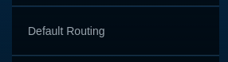
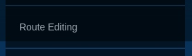

# Dreamview Usage Table

 

| Visual Element                           | Depiction Explanation                    |
| ---------------------------------------- | ---------------------------------------- |
|  | The autonomous car.                      |
|  | <ul><li>The wheel steering percentage.</li> <li>The status of left/right turn signals.</li></ul> |
|  | The traffic signal detected.             |
|  | The driving mode (AUTO/DISENGAGED/MANUAL/etc.). |
|  | <ul><li>The driving speed in km/h.</li> <li>The accelerator/brake percentage.</li></ul> |
|  | The time delay between two messages for each topic. |
|  | The monitor messages from the Apollo platform. |
|  | A  toggle menu for the types of visual elements displays. |
|  | Vehicle  obstacle.                       |
|  | Pedestrian  obstacle.                    |
|  | Bicycle  obstacle.                       |
|  | Unknown  obstacle.                       |
|  | The  velocity arrow shows the direction of the movement with the length  proportional to the magnitude. |
|  | The  white arrow shows the directional heading of the obstacle. |
|  | The  yellow text indicates: <ul><li>The tracking ID of the obstacle.</li><li>The distance from the autonomous car.</li></ul> |
|  | The  lines show the predicted movement of the obstacle with the same color as the  obstacle. |
|  | The  red thick line shows the routing suggestion. |
|  | **Stop** depicting the primary stopping reason. |
|  | **Stop** depicting the object stopping reason. |
|  | **Follow** object.                       |
|  | **Yield** object decision -- the dotted line connects with the respective object. |
|  | **Overtake** object decision -- the dotted line connects with the respective  object. |
|  | Nudge  object decision -- the orange zone indicates the area to avoid. |
|  | Stopping  reason: **Clear-zone in front.** |
|  | Stopping  reason: **Crosswalk in front.** |
|  | Stopping  reason: **Destination arrival.** |
|  | Stopping  reason: **Emergency.**         |
|  | Stopping  reason: **Auto mode is not ready.** |
|  | Stopping  reason: **Obstacle is blocking the route.** |
|  | Stopping  reason: **Pedestrian crossing in front.** |
|  | Stopping  reason: **Traffic light is yellow/red.** |
|  | Stopping  reason: **Vehicle in front.**  |
|  | Stopping  reason: **Stop sign in front.** |
|  | Stopping  reason: **Yield sign in front.** |
|  | The  green thick curvy band indicates the planned trajectory. |
|  | Point  of view: **Default.**             |
|  | Point  of view: **Near.**                |
|  | Point  of view: **Overhead.**            |
|  | Point  of view: Map.  **Zoom in/out:** mouse scroll or pinch with two fingers.  **Move around:** right-click and drag or swipe with three fingers. |
|  | Send a routing request with a default route. |
|  | Switch to a route-editing page where routing points can be added visually on the map. |

 

 

 
