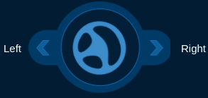
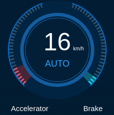

# Dreamview Usage Table

Dreamview is a web application that 
1. visualizes the current output of relevant autonomous driving modules, e.g. planning trajectory, car localization, chassis status, etc. 
2. provides human-machine interface for user to view hardware status, turn on/off of modules, and start the autonomous driving car.
3. provides debugging tools, such as PnC Monitor to efficiently track module issues.

## Layout and Features

The application layout divided into several regions: header, sidebar, main view, and tool view.

### Header
 

#### Setup Mode

Depends on the mode chosen from the mode selector, the corresponding modules and commands, defined in [hmi.conf](https://github.com/ApolloAuto/apollo/blob/master/modules/dreamview/conf/hmi.conf), will be presented in the **Module Controller**, and **Quick Start**, respectively.

Note: navigation mode is for the purpose of low-cost feature introduced in apollo 2.5. Under this mode, Baidu (or Google) Map presents absolute position of the ego-vehicle, while main view has all objects and map elements presented in relative positions to the ego-vehicle. 

### Sidebar and Tool View
 
Sidebar panel controls what is displayed in the tool view.

### Tasks

* Quick Start: commands supported from the selected mode. In general,

    **setup**: turns on all modules.

    **reset all**: turns off all modules.

    **start auto**: starts driving the vehicle autonomously.
* Others: switches and buttons for tools used frequently
* Module Delay: the time delay between two messages for each topic.
* Console: the monitor messages from the Apollo platform.
### Module Controller
 
A panel to view the hardware status and turn on/off modules.
### Layer Menu

 
A  toggle menu for visual elements displays.
### Route Editing

### Data Recorder
 

A panel to report issues to drive event topic ("/apollo/drive_event") to rosbag. 

### Default Routing

 

List of predefined routes or single points, known as point of interest (POI). 

If route editing is on, routing point(s) can be added visually on the map. 

If route editing is off, clicking a desired POI will send a routing request to the server. If the selected POI contains only a point, the start point of the routing request is current position of the autonomous car; otherwise, the start position is the first point from the desired route.

To edit POIs, see default_end_way_point.txt file under the directory of the map data. For example, if the map selected from the map selector is "Demo", then [default_end_way_point.txt](https://github.com/ApolloAuto/apollo/blob/master/modules/map/data/demo/default_end_way_point.txt) is located under modules/map/data/demo.

### Main view: 

 

Main view animated 3D computer graphics in a web browser. Elements in this view are listed in the table below:

| Visual Element                           | Depiction Explanation                    |
| ---------------------------------------- | ---------------------------------------- |
|  | The autonomous car.                      |
|  | <ul><li>The wheel steering percentage.</li> <li>The status of left/right turn signals.</li></ul> |
|  | The traffic signal detected.             |
|  | The driving mode (AUTO/DISENGAGED/MANUAL/etc.). |
|  | <ul><li>The driving speed in km/h.</li> <li>The accelerator/brake percentage.</li></ul> |
|  | The  red thick line shows the routing suggestion. |
|  | Nudge object decision -- the orange zone indicates the area to avoid. |
|  | The  green thick curvy band indicates the planned trajectory. |

 
#### Obstacles

| Visual Element                           | Depiction Explanation                    |
| ---------------------------------------- | ---------------------------------------- |
|  | Vehicle  obstacle.                       |
|  | Pedestrian  obstacle.                    |
|  | Bicycle  obstacle.                       |
|  | Unknown  obstacle.                       |
|  | The  velocity arrow shows the direction of the movement with the length  proportional to the magnitude. |
|  | The  white arrow shows the directional heading of the obstacle. |
|  | The  yellow text indicates: <ul><li>The tracking ID of the obstacle.</li><li>The distance from the autonomous car.</li></ul> |
|  | The  lines show the predicted movement of the obstacle with the same color as the  obstacle. |

#### Planning Decision
##### Decision Fence

Decision fences reflect the decisions made by planing module to ego-vehicle (main) and obstacles (objects). Each type of decision are presented in different color and icon as shown below:

| Visual Element                           | Depiction Explanation                    |
| ---------------------------------------- | ---------------------------------------- |
|  | **Stop** depicting the primary stopping reason. |
|  | **Stop** depicting the object stopping reason. |
|  | **Follow** object.                       |
|  | **Yield** object decision -- the dotted line connects with the respective object. |
|  | **Overtake** object decision -- the dotted line connects with the respective  object. |

Changing lane is a special decision that instead of having decision fence, a change lane icon shows on the autonomous car:

| Visual Element                           | Depiction Explanation                    |
| ---------------------------------------- | ---------------------------------------- |
|  | change to **Left**  lane. |
|  | change to **Right**  lane. |

##### Stop reasons

When a STOP decision fence is shown, the reason to stop is displayed on the right side of the stop icon. Possible reasons and the corresponding icons are: 
 
| Visual Element                           | Depiction Explanation                    |
| ---------------------------------------- | ---------------------------------------- |
|  | Stopping  reason: **Clear-zone in front.** |
|  | Stopping  reason: **Crosswalk in front.** |
|  | Stopping  reason: **Destination arrival.** |
|  | Stopping  reason: **Emergency.**         |
|  | Stopping  reason: **Auto mode is not ready.** |
|  | Stopping  reason: **Obstacle is blocking the route.** |
|  | Stopping  reason: **Pedestrian crossing in front.** |
|  | Stopping  reason: **Traffic light is yellow/red.** |
|  | Stopping  reason: **Vehicle in front.**  |
|  | Stopping  reason: **Stop sign in front.** |
|  | Stopping  reason: **Yield sign in front.** |

#### Point of View
Main view that reflects the point of view chosen from **Layer Menu**:

| Visual Element                           | Point of View                            |
| ---------------------------------------- | ---------------------------------------- |
|  | **Default**             |
|  | **Near**                |
|  | **Overhead**            |
|  | **Map** <ul><li> To zoom in/out: mouse scroll or pinch with two fingers. </li><li> To move around:right-click and drag or swipe with three fingers.</li></ul> |

