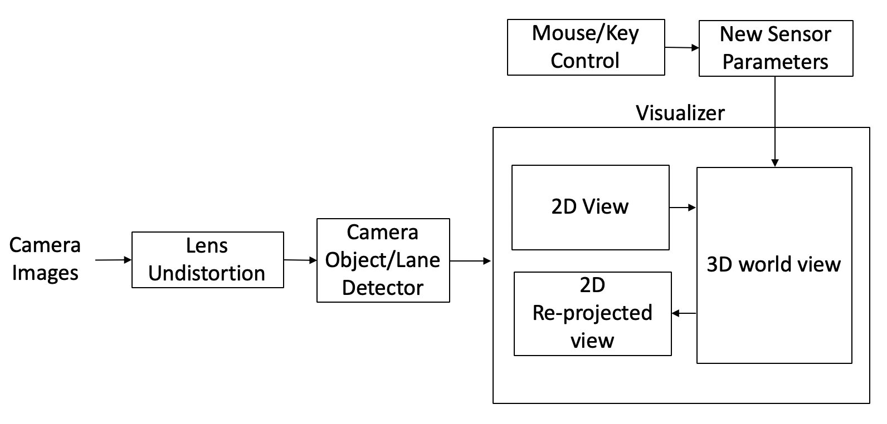
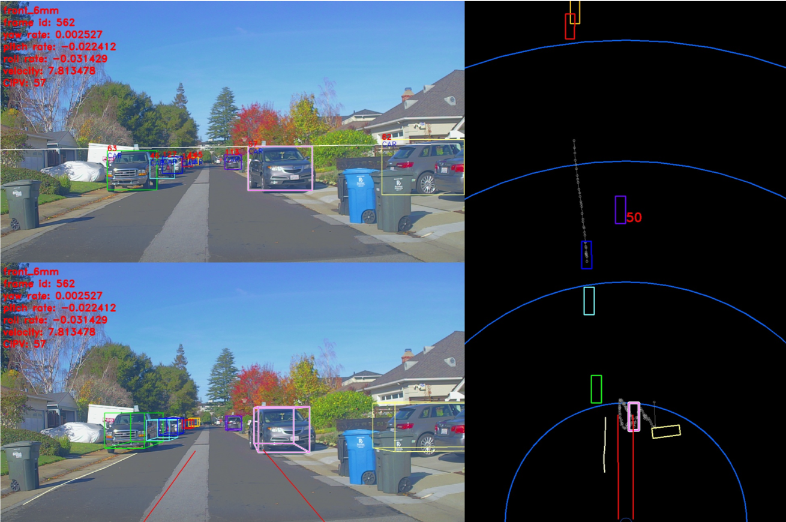

# Perception
Apollo 5.0
June 27, 2019

## Introduction

Apollo 5.0 Perception module introduced a few major features to provide diverse functionality, a more reliable platform and a more robust solution to enhance your AV performance. These include:

 * **Supports Caffe and PaddlePaddle**: [PaddlePaddle](https://github.com/PaddlePaddle/Paddle) (PArallel Distributed Deep LEarning) is an easy-to-use, efficient, flexible and scalable deep learning platform, which was originally developed by Baidu scientists and engineers for the purpose of applying deep learning to many products at Baidu.
 * **Online sensor calibration service**
 * **Manual camera calibration**
 * **Closest In-Path Object (CIPO) Detection**
 * **Vanishing Point Detection**

***Safety alert***

Apollo 5.0 *does not* support a high curvature road, roads without lane lines including local roads and intersections. The perception module is based on visual detection using a deep network with limited data. Therefore, before we release a better network, the driver should be careful while driving and always be ready to disengage the autonomous driving mode by intervening (hit the brakes or turn the steering wheel). While testing Apollo 3.0, please choose a path that has the necessary conditions mentioned above and be vigilant.

## Perception module
The flow chart of Apollo 5.0 Perception module:

To learn more about individual sub-modules, please visit [Perception - Apollo 3.0](perception_apollo_3.0.md)

### Supports PaddlePaddle

The Apollo platform's perception module actively depended on Caffe for its modelling, but will now support PaddlePaddle, an open source platform developed by Baidu to support its various deep learning projects. 
Some features include:
- **PCNNSeg**: Object detection from 128-channel lidar or a fusion of three 16-channel lidars using PaddlePaddle
- **PCameraDetector**: Object detection from a camera
- **PlaneDetector**: Lane line detection from a camera

### Online sensor calibration service

Apollo currently offers a robust calibration service to support your calibration requirements from LiDARs to IMU to Cameras. This service is currently being offered to select partners only. If you would like to learn more about the calibration service, please reach out to us via email: **apollopartner@baidu.com**

### Manual Camera Calibration

In Apollo 5.0, Perception launched a manual camera calibration tool for camera extrinsic parameters. This tool is simple, reliable and user-friendly. It comes equipped with a visualizer and the calibration can be performed using your keyboard. It helps to estimate the camera's orientation (pitch, yaw, roll). It provides a vanishing point, horizon, and top down view as guidelines. Users would need to change the 3 angles to align a horizon and make the lane lines parallel.

The process of manual calibration can be seen below:

### Closest In-Path Object (CIPO) Detection

The CIPO includes detection of key objects on the road for longitudinal control. It utilizes the object and ego-lane line detection output. It creates a virtual ego lane line using the vehicle's ego motion prediction. Any vehcile model including Sphere model, Bicycle model and 4-wheel tire model can be used for the ego motion prediction. Some examples of CIPO using Pseudo lane lines can be seen below:

1. CIPO used for curved roads

2. CIPO for a street with no lane lines

## Output of Perception
The input of Planning and Control modules will be quite different with that of the previous Lidar-based system for Apollo 3.0.

- Lane line output
	- Polyline and/or a polynomial curve
	- Lane type by position: L1(next left lane line), L0(left lane line), R0(right lane line), R1(next right lane line)

- Object output
	- 3D rectangular cuboid
	- Relative velocity and direction
	- Type: CIPV, PIHP, others
	- Classification type: car, truck, bike, pedestrian
	- Drops: trajectory of an object

The world coordinate systen is used as ego-coordinate in 3D where the rear center axle is an origin.

