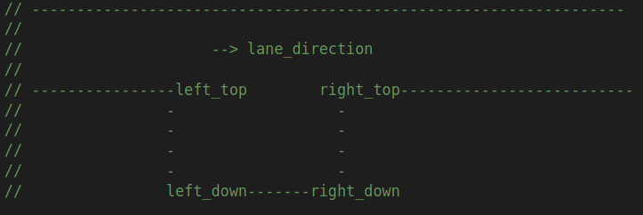

# OPEN SPACE DECIDER

_**Tip**: to read the equations in the document, you are recommended to use Chrome with [a plugin](https://chrome.google.com/webstore/detail/tex-all-the-things/cbimabofgmfdkicghcadidpemeenbffn) or copy the latex equation to [an online editor](http://www.hostmath.com/)_

# Introduction

Apollo planning is a scenario based planning method, each driving use case is treated as a different driving scenario.

open space decider is used to process related infomation and provide information for subsequent optimizers 

# Where is the code

Please refer [code](https://github.com/ApolloAuto/apollo/modules/planning/tasks/deciders/open_space_decider/open_space_roi_decider.cc)

# Code Reading

## Open space roi decider

1. Input : obstacles info \ vehicle info \ road info \ parking space info

2. IN PARKING STAGE (roi_type == OpenSpaceRoiDeciderConfig::PARKING)
  2-1 Check parking space id and parking space boundary,then get parking spot;
  
```cpp
    bool GetParkingSpot(Frame *const frame,
                        std::array<common::math::Vec2d, 4> *vertices,
                        hdmap::Path *nearby_path);
```

  2-2 Search target parking spot on path and check whether the distance between ADC and target parking spot is appropriate;
  
```cpp
    void SearchTargetParkingSpotOnPath(
        const hdmap::Path &nearby_path,
        hdmap::ParkingSpaceInfoConstPtr *target_parking_spot);
``` 

  2-3 Set ADC origin state,include ADC position and heading;
  
```cpp
    void SetOrigin(Frame *const frame,
                   const std::array<common::math::Vec2d, 4> &vertices);
```

  2-4 Get parking spot(left top \ left down \ right down \ right top) points info, convert parking spot points coordinates to vehicle coorinates, according to the relative position and parking direction(inward or outward) to set parking end pose;
  
    void SetParkingSpotEndPose(
        Frame *const frame, const std::array<common::math::Vec2d, 4> &vertices);

     
  
  2-5 Get parking boundary: convert parking spot points coordinates to vehicle coorinates and get points' projections on reference line;
    
```cpp
    bool GetParkingBoundary(Frame *const frame,
                            const std::array<common::math::Vec2d, 4> &vertices,
                            const hdmap::Path &nearby_path,
                            std::vector<std::vector<common::math::Vec2d>>
                            *const roi_parking_boundary);
```
  2-6 Get road boundary: it starts from parking space center line(center_line_s) and extends a distance(roi longitudinal range) to both side along the s direction to get start_s and end_s; search key points(the point on the left/right lane boundary is close to a curb corner) and anchor points(a start/end point or the point on path with large curvatures) in this roi range; those key points, anchor points is called boundary points and the line segements between those points is called roi parking boundary; 
    
```cpp
    void GetRoadBoundary(
        const hdmap::Path &nearby_path, const double center_line_s,
        const common::math::Vec2d &origin_point, const double origin_heading,
        std::vector<common::math::Vec2d> *left_lane_boundary,
        std::vector<common::math::Vec2d> *right_lane_boundary,
        std::vector<common::math::Vec2d> *center_lane_boundary_left,
        std::vector<common::math::Vec2d> *center_lane_boundary_right,
        std::vector<double> *center_lane_s_left,
        std::vector<double> *center_lane_s_right,
        std::vector<double> *left_lane_road_width,
        std::vector<double> *right_lane_road_width);
```
  
  
  2-7 Fuse line segements: remove repeat points of roi parking boundary to meet the requirements of open space algorithm

```cpp
    bool FuseLineSegments(
        std::vector<std::vector<common::math::Vec2d>> *line_segments_vec);
```

3. IN PULL OVER STAGE (roi_type == OpenSpaceRoiDeciderConfig::PULL_OVER) 
  
  The main process is same as parking stage, get pull over spot -> set origin -> set pull over spot end pose -> get pull over boundary 

```cpp 
    void SetPullOverSpotEndPose(Frame *const frame);
```

```cpp
    bool GetPullOverBoundary(Frame *const frame,
                             const std::array<common::math::Vec2d, 4> &vertices,
                             const hdmap::Path &nearby_path,
                             std::vector<std::vector<common::math::Vec2d>>
                             *const roi_parking_boundary);  
```                                                   

4. IN PARK AND GO STAGE (roi_type == OpenSpaceRoiDeciderConfig::PARK_AND_GO)

  The main process is same as parking stage, set orgin from adc -> set park and go end pose -> get park and go boundary 

```cpp
    void SetOriginFromADC(Frame *const frame, const hdmap::Path &nearby_path);
```

```cpp
    void SetParkAndGoEndPose(Frame *const frame);
```

```cpp
    bool GetParkAndGoBoundary(Frame *const frame, const hdmap::Path &nearby_path,
                              std::vector<std::vector<common::math::Vec2d>>
                              *const roi_parking_boundary);
```

5. By calling formulateboundaryconstraints function to gather vertice needed by warm start and distance approach, then transform vertices into the form of Ax > b;

```cpp
    bool FormulateBoundaryConstraints(
        const std::vector<std::vector<common::math::Vec2d>> &roi_parking_boundary,
        Frame *const frame);
```

6. Return process status;

7. Output: open space roi boundary and boundary constraints 

## Open space pre stop decider

1. Input: obstacles info \ vehicle info \ road info \ parking space info

2. IN PARKING STAGE (OpenSpacePreStopDeciderConfig::PARKING)
  2-1 Check parking space info(parking spot id and parking spot points), fill those info into target_parking_spot_ptr; take the s info of parking space center line as target_s;

```cpp
    bool CheckParkingSpotPreStop(Frame* const frame,
                                 ReferenceLineInfo* const reference_line_info,
                                 double* target_s);
```

  2-2 Base on ADC position, stop distance to target parking space and obstacle positon to set stop fence
    
```cpp
    void SetParkingSpotStopFence(const double target_s, Frame* const frame,
                                 ReferenceLineInfo* const reference_line_info);
```

3. IN PULL OVER STAGE (OpenSpacePreStopDeciderConfig::PULL_OVER)
  Same with parking stage, check pull over pre stop -> set pull over stop fence

```cpp
    bool CheckPullOverPreStop(Frame* const frame,
                              ReferenceLineInfo* const reference_line_info,
                              double* target_s);
```

```cpp
    void SetPullOverStopFence(const double target_s, Frame* const frame,
                              ReferenceLineInfo* const reference_line_info);
```

4. Return process status

5. Output: pre stop fence for open space planner

## Open space fallback decider 
1. Input: obstacles info \ vehicle info \ road info \ parking space info

2. Based on the prdicted trajectory of obstacles, the bounding box info of obstacles in each time interval is obtained,then add into predicted_bounding_rectangles

```cpp
    void BuildPredictedEnvironment(const std::vector<const Obstacle*>& obstacles,
                                   std::vector<std::vector<common::math::Box2d>>&
                                   predicted_bounding_rectangles);
```

3. Calling IsCollisonFreeTrajectory function to determine whether it will intersect with obstacles;

```cpp
    bool IsCollisionFreeTrajectory(
        const TrajGearPair& trajectory_pb,
        const std::vector<std::vector<common::math::Box2d>>&
        predicted_bounding_rectangles,
        size_t* current_idx, size_t* first_collision_idx);
```

4. If ADC trajectroy is collision free, the chosen partitioned trajectory can be used directly, else a fallback trajectroy base on current partition trajectroy will be gererated;
   The fallback trajectory leads ADC stop inside safety distance;

5. Return process status    

6. Output: fallback trajectory