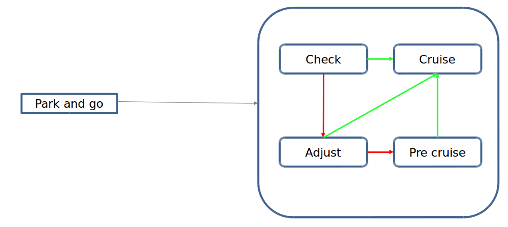
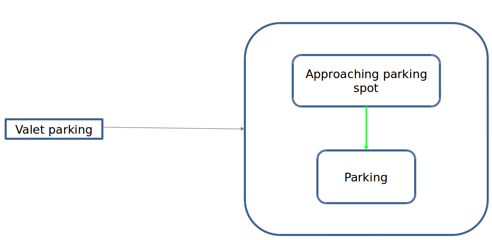

# PARKING SCENARIO

_**Tip**: to read the equations in the document, you are recommended to use Chrome with [a plugin](https://chrome.google.com/webstore/detail/tex-all-the-things/cbimabofgmfdkicghcadidpemeenbffn) or copy the latex equation to [an online editor](http://www.hostmath.com/)_

# Introduction

Apollo planning is a scenario based planning method, each driving use case is treated as a different driving scenario.

There are three scenairos, park and go, pull over and valet parking, which related to park planning.

1. park and go: the park and go scenario was designed to handle curb side parking, planning a new trajectory to the next destination and then driving along that trajectory. This scenario is extremely useful in situations like curb-side delivery or passenger pickup or drop-off. 

2. pull over: the pull over scenario was designed especially for maneuvering to the side of the road upon reaching your destination like for curb-side parallel parking. 

3. valet parking: the valet parking scenario was designed to safely park your ego car in a targeted parking spot.

# Where is the code

Please refer [park](https://github.com/ApolloAuto/apollo/modules/planning/scenarios/park/) & [park and go](https://github.com/ApolloAuto/apollo/modules/planning/scenarios/park_and_go/)

# Code Reading

All three scenarios contain specific stages, the function of scenarios are realized through the conversion of stages. Thus, figure out the process of stages conversion is the key to understand this code.  

## PARK AND GO SCENARIO
1. This scenario consists of four stages, check stage, adjust stage, pre cruise stage and cruise stage. 

2. check stage:
  1. In check stage, by calling checkadcreadytocruise function to check whether ADC's gear info, ADC's velocity, obstacle position, ADC's heading and ADC's lateral station meet the requirements;
    ```cpp
    bool CheckADCReadyToCruise(
        const common::VehicleStateProvider* vehicle_state_provider, Frame* frame,
        const ScenarioParkAndGoConfig& scenario_config);
    ```
  2. If ADC is ready to cruise, check stage finished and switching to cruise stage; else switch to adjust stage;

3. adjust stage:
  1. In adjust stage, we run open space planning algorithms to adjust ADC position;
    ```cpp
    bool ExecuteTaskOnOpenSpace(Frame* frame);
    ```
  2. Once position adjustment is done, we check whether ADC reaches the end of trajectory;

  3. Then check whether ADC is ready to cruise by call CheckADCReadyToCruise function;

  4. If ADC is ready to cruise and reaches the end of trajectory, adjust stage finished;

    1. If steering percentage within the threshold, switching to cruise stage;

    2. Else we reset init position of ADC and switch to pre cruise stage;
      ```cpp
      void ResetInitPostion();
      ```
  5. Else stay in adjust stage to adjust ADC position;

4. pre cruise stage:
  1. In pre cruise stage, we run open space planning algorithms to adjust ADC with the init position;

  2. Then we check whether the steering percentage within the threshold;

  3. If so, pre cruise stage finished and switching to cruise stage;

  4. Else stay in pre cruise stage;

5. cruise stage: 
  1. Running on lane planning algorithms to adjust ADC position;
    ```cpp
    bool ExecuteTaskOnReferenceLine(
        const common::TrajectoryPoint& planning_start_point, Frame* frame);         
    ```
  2. Then check whether ADC's lateral error with target line within the threshold;
    ```cpp
    ParkAndGoStatus CheckADCParkAndGoCruiseCompleted(
        const ReferenceLineInfo& reference_line_info);
    ```
  3. If so, cruise stage finished and quit park and go scenario;

  4. Else, stay in cruise stage until ADC cruises to a desired position;

  5. The conversion of stages can be seen in 
    .          

## PULL OVER SCENARIO
1. This scenario consists of three stages, approach stage, retry approach parking stage and retry parking stage.

2. approach stage:
  1. Running on lane planning algorithms to approach pull over target position; 

  2. At first, we check path points data to see whether the s, l and theta error between ADC position and the target path point within the threshold;
    ```cpp
    PullOverStatus CheckADCPullOverPathPoint(
        const ReferenceLineInfo& reference_line_info,
        const ScenarioPullOverConfig& scenario_config,
        const common::PathPoint& path_point,
        const PlanningContext* planning_context);
    ```
    1. If so, the pull over status will be set to PARK_COMPLETE;

    2. Else we add a stop fence for adc to pause at a better position;

    3. However, if we couldn't get a suitable new stop fence, approach stage will finish and switch to retry appoach parking stage. 

  3. Then we check whether adc parked properly;
    ```cpp
    PullOverStatus CheckADCPullOver(
        const common::VehicleStateProvider* vehicle_state_provider,
        const ReferenceLineInfo& reference_line_info,
        const ScenarioPullOverConfig& scenario_config,
        const PlanningContext* planning_context);
    ```
    1. If ADC pass the destination or park properly, approach stage finished and quit pull over scenario;

    2. Else if adc park failed, approach stage finished and switch to retry appoach parking stage.

3. retry approach parking stage:    
  1. Running on lane planning algorithms to reach the stop line of open space planner;

  2. Check whether ADC stop properly;
    ```cpp
    bool CheckADCStop(const Frame& frame);
    ```
  3. If so, retry approach parking stage finished and switch to retry parking stage;

4. retry parking stage:     
  1. Running open space planning algorithms to park;

  2. Check whether ADC park properly(check distance ahnd theta diff);
    ```cpp
    bool CheckADCPullOverOpenSpace();
    ```
  3. If so, retry parking stage finished and quit pull over scenario;
  
  4. Else stay in the stage until ADC park properly

  5. The conversion of stages can be seen in 
    .    

## VALET PARKING SCENARIO
1. This scenario consists of two stages, approach parking spot stage and parking stage;

2. approach parking spot stage:
  1. Running on lane planning algorithms to approach the designated parking spot;

  2. Cruise to a halt once it has found the right stopping point required in order to reverse into the parking spot;
    ```cpp
    bool CheckADCStop(const Frame& frame);
    ```
  3. If stop properly, approach parking spot stage finished and switch to parking stage;

  4. Else stay in the stage until ADC approaches to desired parking spot;

3. parking stage:
  1. Open Space Planner algorithm is used to generate a zig-zag trajectory which involves both forward and reverse driving (gear changes) in order to safely park the ego car.

  2. The conversion of stages can be seen in 
  .