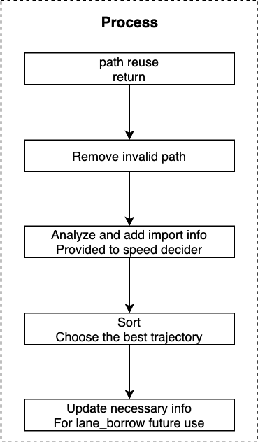

# Path Assessment Decider

### *Contents*

- [Introduction](#introduction)
- [Where is the code](#where-is-the-code)
- [Code Reading](#code-reading)
  + [Path reuse](#path-reuse)
  + [Remove invalid path](#remove-invalid-path)
  + [Analyze and add import info](#analyze-and-add-import-info)
  + [Sort and choose the best path](#sort-and-choose-the-best-path)
  + [Update necessary info](#update-necessary-info)
- [Algorithm Detail of Sorting](#algorithm-detail-of-sorting)

# Introduction

`Path assessment decider` is the task of planning module,belongs to `decider`.

The overall flow chart of the planning module:


The overall flow chart is illustrated with [lane follow](https://github.com/ApolloAuto/apollo/blob/r6.0.0/modules/planning/conf/scenario/lane_follow_config.pb.txt) scenario as an example.The main function of tasks is located in `Process` method.

The specific running process of Fig.1 can be referred to [path_bounds_decider]()。

# Where is the code

This section describes the code flow of path assessment decider.

Please refer to the codes [Apollo r6.0.0 path_assessment_decider](https://github.com/ApolloAuto/apollo/tree/r6.0.0/modules/planning/tasks/deciders/path_assessment_decider).

- Input

`Status PathAssessmentDecider::Process(Frame* const frame, ReferenceLineInfo* const reference_line_info)`

The input is `frame` and `reference_line_info`,specific information can refer to [path_bounds_decider]().

- Output

After sorting paths,choose the best one.Save results to `reference_line_info`.

# Code Reading

The main process of codes:



## Path reuse

```C++
  ... ...
  // skip if path is reusable
  if (FLAGS_enable_skip_path_tasks && reference_line_info->path_reusable()) {
    return Status::OK();
  ... ...
```

## Remove invalid path

```C++
  ... ...
  // 1.remove invalid paths.
  std::vector<PathData> valid_path_data;
  for (const auto& curr_path_data : candidate_path_data) {
    // RecordDebugInfo(curr_path_data, curr_path_data.path_label(),
    //                 reference_line_info);
    if (curr_path_data.path_label().find("fallback") != std::string::npos) {
      if (IsValidFallbackPath(*reference_line_info, curr_path_data)) {
        valid_path_data.push_back(curr_path_data);
      }
    } else {
      if (IsValidRegularPath(*reference_line_info, curr_path_data)) {
        valid_path_data.push_back(curr_path_data);
      }
    }
  }
  const auto& end_time1 = std::chrono::system_clock::now();
  std::chrono::duration<double> diff = end_time1 - end_time0;
  ADEBUG << "Time for path validity checking: " << diff.count() * 1000
         << " msec.";
  ... ...
```

The invalid path of fallback is the path that deviates from reference line and road.

The invalid path of regular is the path that deviates from the reference line,road,collides and stops in the adjacent reverse lane.

## Analyze and add import info

```C++
  ... ...
  // 2. Analyze and add import info to speed decider.
  size_t cnt = 0;
  const Obstacle* blocking_obstacle_on_selflane = nullptr;
  for (size_t i = 0; i != valid_path_data.size(); ++i) {
    auto& curr_path_data = valid_path_data[i];
    if (curr_path_data.path_label().find("fallback") != std::string::npos) {
      // remove empty path_data.
      if (!curr_path_data.Empty()) {
        if (cnt != i) {
          valid_path_data[cnt] = curr_path_data;
        }
        ++cnt;
      }
      continue;
    }
    SetPathInfo(*reference_line_info, &curr_path_data);
    // Trim all the bypass paths so that they end in lane.
    if (curr_path_data.path_label().find("pullover") == std::string::npos) {
      TrimTailingOutLanePoints(&curr_path_data);
    }

    // find blocking_obstacle_on_selflane,prepare for lane choosing.
    if (curr_path_data.path_label().find("self") != std::string::npos) {
      const auto blocking_obstacle_id = curr_path_data.blocking_obstacle_id();
      blocking_obstacle_on_selflane =
          reference_line_info->path_decision()->Find(blocking_obstacle_id);
    }

    // remove empty path.
    if (!curr_path_data.Empty()) {
      if (cnt != i) {
        valid_path_data[cnt] = curr_path_data;
      }
      ++cnt;
    }

    // RecordDebugInfo(curr_path_data, curr_path_data.path_label(),
    //                 reference_line_info);
    ADEBUG << "For " << curr_path_data.path_label() << ", "
           << "path length = " << curr_path_data.frenet_frame_path().size();
  }
  valid_path_data.resize(cnt);
  // if there is no valid path, return error code.
  if (valid_path_data.empty()) {
    const std::string msg = "Neither regular nor fallback path is valid.";
    AERROR << msg;
    return Status(ErrorCode::PLANNING_ERROR, msg);
  }
  ADEBUG << "There are " << valid_path_data.size() << " valid path data.";
  const auto& end_time2 = std::chrono::system_clock::now();
  diff = end_time2 - end_time1;
  ADEBUG << "Time for path info labeling: " << diff.count() * 1000 << " msec.";
  ... ...
```

The process of this step is:
1). Remove empty path
2). Trim lane borrow path from the end,search forward from the tail and cut out the following types of path_point:
&emsp; (1) OUT_ON_FORWARD_LANE
&emsp; (2) OUT_ON_REVERSE_LANE
&emsp; (3) UNKNOWN
3). Find the obstacle ID of self lane for lane selection
4). If there if no valid path,return error code

## Sort and choose the best path

Please refer to last section [Path sorting algorithm](#path-sorting-algorithm).

## Update necessary info

```C++
  // 4. Update necessary info for lane-borrow decider's future uses.
  // Update front static obstacle's info.
  auto* mutable_path_decider_status = injector_->planning_context()
                                          ->mutable_planning_status()
                                          ->mutable_path_decider();
  if (reference_line_info->GetBlockingObstacle() != nullptr) {
    int front_static_obstacle_cycle_counter =
        mutable_path_decider_status->front_static_obstacle_cycle_counter();
    mutable_path_decider_status->set_front_static_obstacle_cycle_counter(
        std::max(front_static_obstacle_cycle_counter, 0));
    mutable_path_decider_status->set_front_static_obstacle_cycle_counter(
        std::min(front_static_obstacle_cycle_counter + 1, 10));
    mutable_path_decider_status->set_front_static_obstacle_id(
        reference_line_info->GetBlockingObstacle()->Id());
  } else {
    int front_static_obstacle_cycle_counter =
        mutable_path_decider_status->front_static_obstacle_cycle_counter();
    mutable_path_decider_status->set_front_static_obstacle_cycle_counter(
        std::min(front_static_obstacle_cycle_counter, 0));
    mutable_path_decider_status->set_front_static_obstacle_cycle_counter(
        std::max(front_static_obstacle_cycle_counter - 1, -10));
  }

  // Update self-lane usage info.
  if (reference_line_info->path_data().path_label().find("self") !=
      std::string::npos) {
    // && std::get<1>(reference_line_info->path_data()
    //                 .path_point_decision_guide()
    //                 .front()) == PathData::PathPointType::IN_LANE)
    int able_to_use_self_lane_counter =
        mutable_path_decider_status->able_to_use_self_lane_counter();

    if (able_to_use_self_lane_counter < 0) {
      able_to_use_self_lane_counter = 0;
    }
    mutable_path_decider_status->set_able_to_use_self_lane_counter(
        std::min(able_to_use_self_lane_counter + 1, 10));
  } else {
    mutable_path_decider_status->set_able_to_use_self_lane_counter(0);
  }

  // Update side-pass direction.
  if (mutable_path_decider_status->is_in_path_lane_borrow_scenario()) {
    bool left_borrow = false;
    bool right_borrow = false;
    const auto& path_decider_status =
        injector_->planning_context()->planning_status().path_decider();
    for (const auto& lane_borrow_direction :
         path_decider_status.decided_side_pass_direction()) {
      if (lane_borrow_direction == PathDeciderStatus::LEFT_BORROW &&
          reference_line_info->path_data().path_label().find("left") !=
              std::string::npos) {
        left_borrow = true;
      }
      if (lane_borrow_direction == PathDeciderStatus::RIGHT_BORROW &&
          reference_line_info->path_data().path_label().find("right") !=
              std::string::npos) {
        right_borrow = true;
      }
    }

    mutable_path_decider_status->clear_decided_side_pass_direction();
    if (right_borrow) {
      mutable_path_decider_status->add_decided_side_pass_direction(
          PathDeciderStatus::RIGHT_BORROW);
    }
    if (left_borrow) {
      mutable_path_decider_status->add_decided_side_pass_direction(
          PathDeciderStatus::LEFT_BORROW);
    }
  }
  const auto& end_time4 = std::chrono::system_clock::now();
  diff = end_time4 - end_time3;
  ADEBUG << "Time for FSM state updating: " << diff.count() * 1000 << " msec.";

  // Plot the path in simulator for debug purpose.
  RecordDebugInfo(reference_line_info->path_data(), "Planning PathData",
                  reference_line_info);
  return Status::OK();
```

Update necessary information:

1.Update static obstacles info in front of adc.
2.Update self lane usage information.
3.Update the direction of the side lane
(1) According to `PathDeciderStatus` is RIGHT_BORROW or LEFT_BORROW,decide whether to borrow from the left or from the right.

# Algorithm Detail of Sorting

This section describes sorting algorithm.

```C++
  ... ...
  // 3. Pick the optimal path.
  std::sort(valid_path_data.begin(), valid_path_data.end(),
            std::bind(ComparePathData, std::placeholders::_1,
                      std::placeholders::_2, blocking_obstacle_on_selflane));

  ADEBUG << "Using '" << valid_path_data.front().path_label()
         << "' path out of " << valid_path_data.size() << " path(s)";
  if (valid_path_data.front().path_label().find("fallback") !=
      std::string::npos) {
    FLAGS_static_obstacle_nudge_l_buffer = 0.8;
  }
  *(reference_line_info->mutable_path_data()) = valid_path_data.front();
  reference_line_info->SetBlockingObstacle(
      valid_path_data.front().blocking_obstacle_id());
  const auto& end_time3 = std::chrono::system_clock::now();
  diff = end_time3 - end_time2;
  ADEBUG << "Time for optimal path selection: " << diff.count() * 1000
         << " msec.";

  reference_line_info->SetCandidatePathData(std::move(valid_path_data));
  ... ...
```
The flow of sorting algorigthm is as follow:

`ComparePathData(lhs, rhs, …)`

Path Sorting:（The quality of road can be obtained by sorting）
- 1.Empty paths are always behind
- 2.regular > fallback
- 3.If there is one self lane,choose that one.If both exist,choose the longer one.If the length is close,choose self lane.If self lane does not exist,choose a longer path
- 4.If the length of the paths is close to each other and they all need to borrow lane:
    - (1) If all have to borrow the reverse lane,choose the one with short distance;
    - (2) For the case with two borrowing directions:
      + with obstacle,choose proper direction, left or right
      + without obstacle,borrow lane according to adc's postion
    - (3) If the length of the path is the same,the adjacent lanes are all forward,choose the path that returns earlier to the self lane
    - (4) If the length of the path is the same and return time is the same,choose the path borrow from the left
- 5.If the two path are the same,lhs is not < rhl

After sorting: choose the first one.(the first path is the best path)
