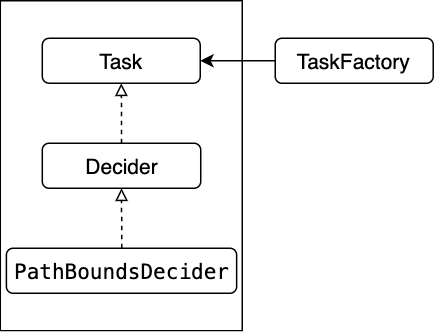
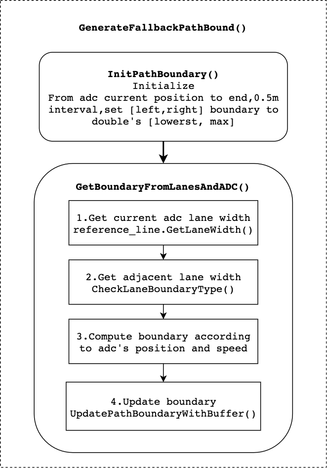
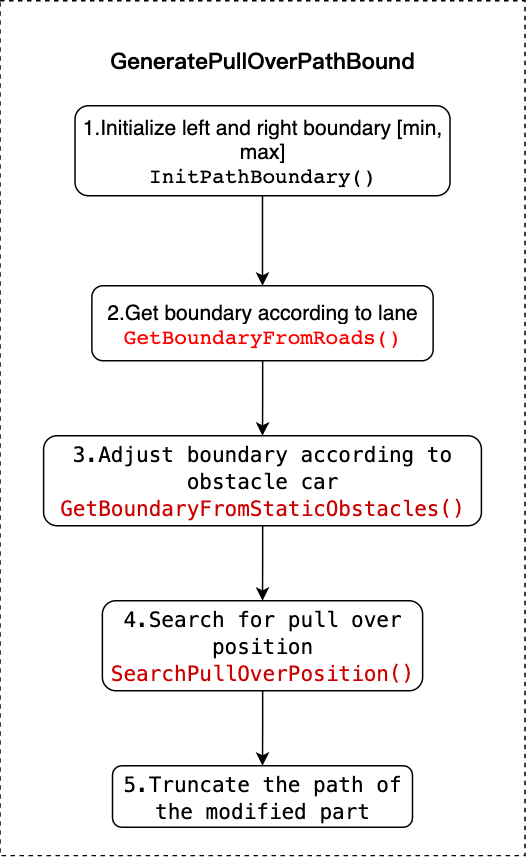
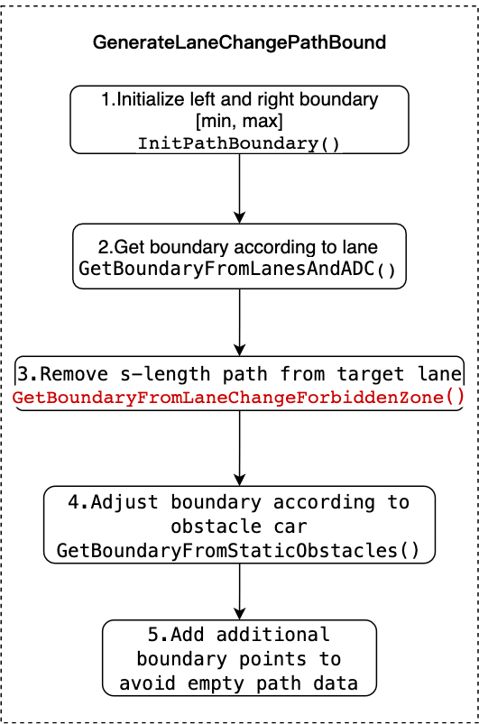
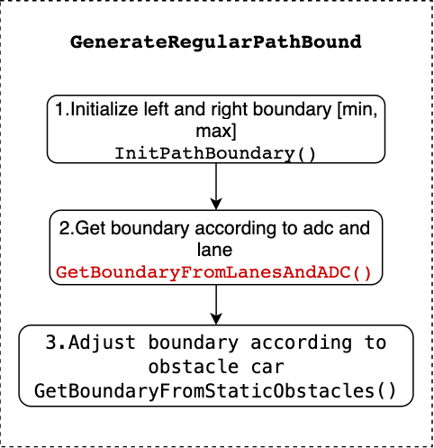

# Path Bounds Decider

### *Contents*

- [Introduction](#introduction)
- [Where is the code](#where-is-the-code)
  + [Class relationships](#class-relationships)
  + [Data of path bounds decider](#data-of-path-bounds-decider)
- [Code Reading](#code-reading)
- [Algorithm Detail](#algorithm-detail)
  + [1.fallback](#fallback)
  + [2.pull over](#pull-over)
  + [3.lane change](#lane-change)
  + [4.regular](#regular)

# Introduction

`Path bounds decider` is the task of planning module,which belongs to decider.

The overall flow chart of the planning module:


The overall flow chart is illustrated with [lane follow](https://github.com/ApolloAuto/apollo/blob/r6.0.0/modules/planning/conf/scenario/lane_follow_config.pb.txt) scenario as an example. Here only describes the main process, does not contain all details. The main function of tasks is located in the `Process` method.

Firstly, the entrance function of `PlanningComponent` is [Proc](https://github.com/ApolloAuto/apollo/blob/r6.0.0/modules/planning/planning_component.cc#L118).

Secondly, in `OnLanePlanning` excute [RunOnce](https://github.com/ApolloAuto/apollo/blob/r6.0.0/modules/planning/on_lane_planning.cc#L205). Excute traffic rules in `RunOnce` first, and run method [Plan](https://github.com/ApolloAuto/apollo/blob/r6.0.0/modules/planning/on_lane_planning.cc#L487) to acquire trajectory.

Thirdly, run method [Plan](https://github.com/ApolloAuto/apollo/blob/r6.0.0/modules/planning/planner/public_road/public_road_planner.cc#L33) in PublicRoadPlanner. The [Update](https://github.com/ApolloAuto/apollo/blob/r6.0.0/modules/planning/scenarios/scenario_manager.cc#L798) method of `ScenarioManager` chooses proper scenario according to scenario_type.

Fourthly, execute [Process](https://github.com/ApolloAuto/apollo/blob/r6.0.0/modules/planning/scenarios/scenario.cc#L66) method when lane follow scenario is chosen. And then, in `LaneFollowStage`, run [Process](https://github.com/ApolloAuto/apollo/blob/r6.0.0/modules/planning/scenarios/lane_follow/lane_follow_stage.cc#L93) method. In the method of [PlanOnReferenceLine](https://github.com/ApolloAuto/apollo/blob/r6.0.0/modules/planning/scenarios/lane_follow/lane_follow_stage.cc#L153), run all tasks of `LaneFollowStage`. Run the task by calling [Excute](https://github.com/ApolloAuto/apollo/blob/r6.0.0/modules/planning/scenarios/lane_follow/lane_follow_stage.cc#L167). In excute method, call task's [Process](https://github.com/ApolloAuto/apollo/blob/r6.0.0/modules/planning/tasks/deciders/decider.cc#L37) method. In the last subgraph, TaskType is not specific class name, which represents all type of tasks. The dotted arrow indicates that all tasks are executed in the order of vector in `LaneFollowStage`.

Lastly, tasks' main function is in `Process` method.

# Where is the code

This section describes path bounds decider task.

Please refer to the codes [Apollo r6.0.0 path_bounds_decider](https://github.com/ApolloAuto/apollo/tree/r6.0.0/modules/planning/tasks/deciders/path_bounds_decider).

## Class relationships



### （1）Class Inheritance Relationships

① `PathBoundsDecider` class inherits `Decider` class, and implements the `Process` method. The main function of path bounds decider is in `process` method.
```C++
// modules/planning/tasks/deciders/path_bounds_decider/path_bounds_decider.h
class PathBoundsDecider : public Decider {
... };
```

② `Decider` class inherits `Task` class, implements `Excute` method, It is mainly to assign values to two variables: `frame` and `reference_line_info`, and calls **Process** method.
```C++
// modules/planning/tasks/deciders/decider.h
class Decider : public Task {
... };

// modules/planning/tasks/deciders/decider.cc
apollo::common::Status Decider::Execute(
    Frame* frame, ReferenceLineInfo* reference_line_info) {
  Task::Execute(frame, reference_line_info);
  return Process(frame, reference_line_info);
}

apollo::common::Status Decider::Execute(Frame* frame) {
  Task::Execute(frame);
  return Process(frame);
}
```

③ `Task` class defines variables of protected type.
```C++
// modules/planning/tasks/task.h
class Task {
 public:
  // virtual method, mainly assigned values to frame and reference_line_info.
  virtual common::Status Execute(Frame* frame,
                                 ReferenceLineInfo* reference_line_info);
  virtual common::Status Execute(Frame* frame);

 protected:
  // frame and reference_line_info
  Frame* frame_ = nullptr;
  ReferenceLineInfo* reference_line_info_ = nullptr;

  // setting and name
  TaskConfig config_;
  std::string name_;
... };
```

### (2) Methods Call

Mainly describes how task is created and called in stage.

① `TaskFactory` class,register all task,include decider,optimizer and other(E2E). Factory pattern
```C++
// modules/planning/tasks/task_factory.h
class TaskFactory {
 public:
  // static
  static void Init(...);    // in Init,register all tasks.
  static std::unique_ptr<Task> CreateTask(...);    // create the task object,return a pointer pionting to this object.
... };
```

② creation and execution of task in stage.

- creation: create task in contruction function fo stage, and put pointer in task_ and task_list_.
- execution: in specific stage, over write Process method.Call Process methods,then call ExecuteTask*,and call Process of task last.

```C++
// modules/planning/scenarios/stage.h
class Stage {
 // in construction method, create task according to stage setting.
 Stage(const ScenarioConfig::StageConfig& config,
        const std::shared_ptr<DependencyInjector>& injector);
 public:

 // pure virtual function.
 virtual StageStatus Process(
      const common::TrajectoryPoint& planning_init_point, Frame* frame) = 0;
 protected:
  // three methods,each method calls Execute method,and then calls Process method in Excute method.
  bool ExecuteTaskOnReferenceLine(
      const common::TrajectoryPoint& planning_start_point, Frame* frame);

  bool ExecuteTaskOnReferenceLineForOnlineLearning(
      const common::TrajectoryPoint& planning_start_point, Frame* frame);

  bool ExecuteTaskOnOpenSpace(Frame* frame);

 protected:
  // map of task,key is TaskType,value is the pointer of Task.
  std::map<TaskConfig::TaskType, std::unique_ptr<Task>> tasks_;
  // vector of task
  std::vector<Task*> task_list_;
  // stage setting
  ScenarioConfig::StageConfig config_;
...};
```

## Data of path bounds decider

Input,output,data and settings of `PathBoundsDecider` class.

### (1) Input and Output

① Input: `frame` and `reference_line_info`

- **frame**

frame contains all data of planning.

```C++
// modules/planning/common/frame.h
class Frame {
 private:
  static DrivingAction pad_msg_driving_action_;
  uint32_t sequence_num_ = 0;

  /* Local_view is a struct,contains the following information
  // modules/planning/common/local_view.h
  struct LocalView {
    std::shared_ptr<prediction::PredictionObstacles> prediction_obstacles;
    std::shared_ptr<canbus::Chassis> chassis;
    std::shared_ptr<localization::LocalizationEstimate> localization_estimate;
    std::shared_ptr<perception::TrafficLightDetection> traffic_light;
    std::shared_ptr<routing::RoutingResponse> routing;
    std::shared_ptr<relative_map::MapMsg> relative_map;
    std::shared_ptr<PadMessage> pad_msg;
    std::shared_ptr<storytelling::Stories> stories;
  };
  */
  LocalView local_view_;
  // hd-map
  const hdmap::HDMap *hdmap_ = nullptr;
  common::TrajectoryPoint planning_start_point_;
  // vehicle state
  // modules/common/vehicle_state/proto/vehicle_state.proto
  common::VehicleState vehicle_state_;
  // reference line info
  std::list<ReferenceLineInfo> reference_line_info_;

  bool is_near_destination_ = false;

  /**
   * the reference line info that the vehicle finally choose to drive on
   **/
  const ReferenceLineInfo *drive_reference_line_info_ = nullptr;

  ThreadSafeIndexedObstacles obstacles_;

  std::unordered_map<std::string, const perception::TrafficLight *>
      traffic_lights_;

  // current frame published trajectory
  ADCTrajectory current_frame_planned_trajectory_;

  // current frame path for future possible speed fallback
  DiscretizedPath current_frame_planned_path_;

  const ReferenceLineProvider *reference_line_provider_ = nullptr;

  OpenSpaceInfo open_space_info_;

  std::vector<routing::LaneWaypoint> future_route_waypoints_;

  common::monitor::MonitorLogBuffer monitor_logger_buffer_;
};
```

- **reference_line_info**

reference_line_info contains all information of reference_line.

```C++
// modules/planning/common/reference_line_info.h
class ReferenceLineInfo {
 ...
 private:
  static std::unordered_map<std::string, bool> junction_right_of_way_map_;
  const common::VehicleState vehicle_state_;  // vehicle state
  const common::TrajectoryPoint adc_planning_point_;  // TrajectoryPoint定义在modules/common/proto/pnc_point.proto中

  /* reference line, located in the center of the path.
  class ReferenceLine {
  ...
  private:
  struct SpeedLimit {
    double start_s = 0.0;
    double end_s = 0.0;
    double speed_limit = 0.0;  // unit m/s
    ...};
  
  // This speed limit overrides the lane speed limit
  std::vector<SpeedLimit> speed_limit_;
  std::vector<ReferencePoint> reference_points_;  // ReferencePoint contains (k, dk, x, y, heading, s, l)
  hdmap::Path map_path_;
  uint32_t priority_ = 0;
  };
  */
  ReferenceLine reference_line_;

  /**
   * @brief this is the number that measures the goodness of this reference
   * line. The lower the better.
   */
  // cost variable
  double cost_ = 0.0;

  bool is_drivable_ = true;
  // PathDecision contains all obstacles' decision of one path: lateral(Nudge, Ignore) and longitudinal(Stop, Yield, Follow, Overtake, Ignore).
  PathDecision path_decision_;
  // pointer
  Obstacle* blocking_obstacle_;

  /* path bounds.
    // modules/planning/common/path_boundary.h
    class PathBoundary {
    ...
      private:
     double start_s_ = 0.0;
     double delta_s_ = 0.0;
     std::vector<std::pair<double, double>> boundary_;
     std::string label_ = "regular";
     std::string blocking_obstacle_id_ = "";
  };
  */
  std::vector<PathBoundary> candidate_path_boundaries_;
  // PathData class,contains mutual transformation of XY coordinate and SL coordinate.
  std::vector<PathData> candidate_path_data_;

  PathData path_data_;
  PathData fallback_path_data_;
  SpeedData speed_data_;

  DiscretizedTrajectory discretized_trajectory_;

  RSSInfo rss_info_;

  /**
   * @brief SL boundary of stitching point (starting point of plan trajectory)
   * relative to the reference line
   */
  SLBoundary adc_sl_boundary_;
... };
```
② Output:
```C++
Status PathBoundsDecider::Process(
    Frame* const frame, ReferenceLineInfo* const reference_line_info)
```

`Process` method, save results to `reference_line_info`.

### (2) parameters setting

```C++
// modules/planning/tasks/deciders/path_bounds_decider/path_bounds_decider.cc
// distance of s direction
constexpr double kPathBoundsDeciderHorizon = 100.0;
// resolution of s direction
constexpr double kPathBoundsDeciderResolution = 0.5;

// Lane width
constexpr double kDefaultLaneWidth = 5.0;
// Road width
constexpr double kDefaultRoadWidth = 20.0;

// TODO(all): Update extra tail point base on vehicle speed.
constexpr int kNumExtraTailBoundPoint = 20;
constexpr double kPulloverLonSearchCoeff = 1.5;
constexpr double kPulloverLatSearchCoeff = 1.25;
```

### （3）data
```C++
// modules/planning/tasks/deciders/path_bounds_decider/path_bounds_decider.cc
namespace {
// PathBoundPoint contains: (s, l_min, l_max).
using PathBoundPoint = std::tuple<double, double, double>;
// PathBound contains a vector of PathBoundPoints.
using PathBound = std::vector<PathBoundPoint>;
// ObstacleEdge contains: (is_start_s, s, l_min, l_max, obstacle_id).
using ObstacleEdge = std::tuple<int, double, double, double, std::string>;
}
```

# Code Reading

Fig.2 is path bounds decider diagram.


In the **Process** method,the path boundary is calculated ini four scenario:fallback,pull-over,lane-change,regular.

The regular scenario can be divided into three types:LEFT_BORROW,NO_BORROW,RIGHT_BORROW.

The path boundary of fallback scenario will be generated,the other three scenarios all depend on if conditions.

# Algorithm Detail

## fallback



The generation process of fallback scenario is shown in the figure above.
Fallback scenario uses ADC and static information,and mainly calls two functions.

- InitPathBoundary
```C++
bool PathBoundsDecider::InitPathBoundary(
  ...
  // Starting from ADC's current position, increment until the horizon, and
  // set lateral bounds to be infinite at every spot.
  for (double curr_s = adc_frenet_s_;
       curr_s < std::fmin(adc_frenet_s_ +
                              std::fmax(kPathBoundsDeciderHorizon,
                                        reference_line_info.GetCruiseSpeed() *
                                            FLAGS_trajectory_time_length),
                          reference_line.Length());
       curr_s += kPathBoundsDeciderResolution) {
    path_bound->emplace_back(curr_s, std::numeric_limits<double>::lowest(),
                             std::numeric_limits<double>::max());
  }
...}
```

- GetBoundaryFromLanesAndADC
```C++
// TODO(jiacheng): this function is to be retired soon.
bool PathBoundsDecider::GetBoundaryFromLanesAndADC(
  ...
  for (size_t i = 0; i < path_bound->size(); ++i) {
    double curr_s = std::get<0>((*path_bound)[i]);
    // 1. Get the current lane width at current point.
    if (!reference_line.GetLaneWidth(curr_s, &curr_lane_left_width,
                                     &curr_lane_right_width)) {
      AWARN << "Failed to get lane width at s = " << curr_s;
      curr_lane_left_width = past_lane_left_width;
      curr_lane_right_width = past_lane_right_width;
    } else {...}

    // 2. Get the neighbor lane widths at the current point.
    double curr_neighbor_lane_width = 0.0;
    if (CheckLaneBoundaryType(reference_line_info, curr_s, lane_borrow_info)) {
      hdmap::Id neighbor_lane_id;
      if (lane_borrow_info == LaneBorrowInfo::LEFT_BORROW) {
        // left borrow
        ...
      } else if (lane_borrow_info == LaneBorrowInfo::RIGHT_BORROW) {
        // right borrow
        ...
      }
    }

    // 3.Compute proper boundary according to lane width,adc's position and speed.
    static constexpr double kMaxLateralAccelerations = 1.5;
    double offset_to_map = 0.0;
    reference_line.GetOffsetToMap(curr_s, &offset_to_map);

    double ADC_speed_buffer = (adc_frenet_ld_ > 0 ? 1.0 : -1.0) *
                              adc_frenet_ld_ * adc_frenet_ld_ /
                              kMaxLateralAccelerations / 2.0;
    // If the left lane if borrowed,the left boundary will become the left lane's boundary.
    double curr_left_bound_lane =
        curr_lane_left_width + (lane_borrow_info == LaneBorrowInfo::LEFT_BORROW
                                    ? curr_neighbor_lane_width
                                    : 0.0);
    double curr_right_bound_lane =
        -curr_lane_right_width -
        (lane_borrow_info == LaneBorrowInfo::RIGHT_BORROW
             ? curr_neighbor_lane_width
             : 0.0);

    double curr_left_bound = 0.0;  // left boundary
    double curr_right_bound = 0.0;  // right boundary
    // compute left and right boundary
    if (config_.path_bounds_decider_config()
            .is_extend_lane_bounds_to_include_adc() ||
        is_fallback_lanechange) {
      // extend path bounds to include ADC in fallback or change lane path
      // bounds.
      double curr_left_bound_adc =
          std::fmax(adc_l_to_lane_center_,
                    adc_l_to_lane_center_ + ADC_speed_buffer) +
          GetBufferBetweenADCCenterAndEdge() + ADC_buffer;
      curr_left_bound =
          std::fmax(curr_left_bound_lane, curr_left_bound_adc) - offset_to_map;

      double curr_right_bound_adc =
          std::fmin(adc_l_to_lane_center_,
                    adc_l_to_lane_center_ + ADC_speed_buffer) -
          GetBufferBetweenADCCenterAndEdge() - ADC_buffer;
      curr_right_bound =
          std::fmin(curr_right_bound_lane, curr_right_bound_adc) -
          offset_to_map;
    } else {
      curr_left_bound = curr_left_bound_lane - offset_to_map;
      curr_right_bound = curr_right_bound_lane - offset_to_map;
    }

    // 4.Update boundaries.
    if (!UpdatePathBoundaryWithBuffer(i, curr_left_bound, curr_right_bound,
                                      path_bound, is_left_lane_boundary,
                                      is_right_lane_boundary)) {
      path_blocked_idx = static_cast<int>(i);
    }
... }
```

## pull over



### （1）GetBoundaryFromRoads
Different from `GetBoundaryFromLanesAndADC`,`GetBoundaryFromRoads`method compute boundary according to lane info:
- reference line info
- lane point
    + boundary
    + update

### （2）GetBoundaryFromStaticObstacles

Adjust the boundary according to obstacle cars:

- Compute obstacle cars coordinates in frenet coordinate.
- S direction scan line sort:
    + focus on obstacles within the boundary
    + focus on obstacles in front of the ADC
    + break obstacles into two boundaries:start and end
- Obstacle ID
    + true if the adc can pass from left,otherwise false
- Check the obstacle on the path point by ponit
    + according to new obstacles
    + according to the existing obstacles

### （3）SearchPullOverPosition

The process of searching the pull over position:
- According to pull_over_status.pull_over_type() determines whether to search forward(the first point at beginning of pull over) or backward(the last point at the end of pull over).
- Two layers of loop.The outer loop controls the search index idx, and inner loop controls the furture index.(forward idx+1, backward idx-1).
- According to the index of inner and outer loops, decide whether the search space meets the requirements of width and length,and decide whether it can be pulled over.

Code:
```C++
bool PathBoundsDecider::SearchPullOverPosition(
    const Frame& frame, const ReferenceLineInfo& reference_line_info,
    const std::vector<std::tuple<double, double, double>>& path_bound,
    std::tuple<double, double, double, int>* const pull_over_configuration) {
  const auto& pull_over_status =
      injector_->planning_context()->planning_status().pull_over();

  bool search_backward = false;  // search FORWARD by default

  double pull_over_s = 0.0;
  if (pull_over_status.pull_over_type() ==
      PullOverStatus::EMERGENCY_PULL_OVER) {...}

  int idx = 0;
  if (search_backward) {
    // backward search
    idx = static_cast<int>(path_bound.size()) - 1;
    while (idx >= 0 && std::get<0>(path_bound[idx]) > pull_over_s) {
      --idx;
    }
  } else {
    // forward search
    while (idx < static_cast<int>(path_bound.size()) &&
           std::get<0>(path_bound[idx]) < pull_over_s) {
      ++idx;
    }
  }
  
  // find a feasible location for pull over,determine the width and length.
  const double pull_over_space_length =
      kPulloverLonSearchCoeff *
          VehicleConfigHelper::GetConfig().vehicle_param().length() -
      FLAGS_obstacle_lon_start_buffer - FLAGS_obstacle_lon_end_buffer;
  const double pull_over_space_width =
      (kPulloverLatSearchCoeff - 1.0) *
      VehicleConfigHelper::GetConfig().vehicle_param().width();
  const double adc_half_width =
      VehicleConfigHelper::GetConfig().vehicle_param().width() / 2.0;

  // 2. Find a window that is close to road-edge.
  bool has_a_feasible_window = false;
  while ((search_backward && idx >= 0 &&
          std::get<0>(path_bound[idx]) - std::get<0>(path_bound.front()) >
              pull_over_space_length) ||
         (!search_backward && idx < static_cast<int>(path_bound.size()) &&
          std::get<0>(path_bound.back()) - std::get<0>(path_bound[idx]) >
              pull_over_space_length)) {

    while ((search_backward && j >= 0 &&
            std::get<0>(path_bound[idx]) - std::get<0>(path_bound[j]) <
                pull_over_space_length) ||
           (!search_backward && j < static_cast<int>(path_bound.size()) &&
            std::get<0>(path_bound[j]) - std::get<0>(path_bound[idx]) <
                pull_over_space_length)) {...}
    
    // find feasible region
    if (is_feasible_window) {
    ...
    break;}
    ...}  // outer while
...
}
```

## lane change



Code:

```C++
Status PathBoundsDecider::GenerateLaneChangePathBound(
    const ReferenceLineInfo& reference_line_info,
    std::vector<std::tuple<double, double, double>>* const path_bound) {
  // 1.Initialize
  if (!InitPathBoundary(reference_line_info, path_bound)) {...}


  // 2. decide path boundary according to adc and lane info.
  std::string dummy_borrow_lane_type;
  if (!GetBoundaryFromLanesAndADC(reference_line_info,
                                  LaneBorrowInfo::NO_BORROW, 0.1, path_bound,
                                  &dummy_borrow_lane_type, true)) {...}
 

  // 3. Remove the S-length of target lane out of the path-bound.
  GetBoundaryFromLaneChangeForbiddenZone(reference_line_info, path_bound);


  // adjust the boundary according to static obstacle.
  if (!GetBoundaryFromStaticObstacles(reference_line_info.path_decision(),
                                      path_bound, &blocking_obstacle_id)) {...}
  ...
}
```

`GetBoundaryFromLaneChangeForbiddenZone` method import for lane change
- If can change lane in current position, change lane directly.
- If there is a lane change starting point,use it directly.
- Check the boundary of the point before lane change one by one,and change the value of the boundary(return if it hass passed the lane change point).

```C++
void PathBoundsDecider::GetBoundaryFromLaneChangeForbiddenZone(
    const ReferenceLineInfo& reference_line_info, PathBound* const path_bound) {


  // 1.change directly in current position
  auto* lane_change_status = injector_->planning_context()
                                 ->mutable_planning_status()
                                 ->mutable_change_lane();
  if (lane_change_status->is_clear_to_change_lane()) {
    ADEBUG << "Current position is clear to change lane. No need prep s.";
    lane_change_status->set_exist_lane_change_start_position(false);
    return;
  }


  // 2.if there is the lane-change start point,use it directly,otherwise find another one.
  double lane_change_start_s = 0.0;
  if (lane_change_status->exist_lane_change_start_position()) {
    common::SLPoint point_sl;
    reference_line.XYToSL(lane_change_status->lane_change_start_position(),
                          &point_sl);
    lane_change_start_s = point_sl.s();
  } else {
    // TODO(jiacheng): train ML model to learn this.
    // set starting point in front of adc.
    lane_change_start_s = FLAGS_lane_change_prepare_length + adc_frenet_s_;

    // Update the decided lane_change_start_s into planning-context.
    common::SLPoint lane_change_start_sl;
    lane_change_start_sl.set_s(lane_change_start_s);
    lane_change_start_sl.set_l(0.0);
    common::math::Vec2d lane_change_start_xy;
    reference_line.SLToXY(lane_change_start_sl, &lane_change_start_xy);
    lane_change_status->set_exist_lane_change_start_position(true);
    lane_change_status->mutable_lane_change_start_position()->set_x(
        lane_change_start_xy.x());
    lane_change_status->mutable_lane_change_start_position()->set_y(
        lane_change_start_xy.y());
  }

  // Remove the target lane out of the path-boundary, up to the decided S.
  for (size_t i = 0; i < path_bound->size(); ++i) {
    double curr_s = std::get<0>((*path_bound)[i]);
    if (curr_s > lane_change_start_s) {
      break;
    }
    double curr_lane_left_width = 0.0;
    double curr_lane_right_width = 0.0;
    double offset_to_map = 0.0;
    reference_line.GetOffsetToMap(curr_s, &offset_to_map);
    if (reference_line.GetLaneWidth(curr_s, &curr_lane_left_width,
                                    &curr_lane_right_width)) {
      double offset_to_lane_center = 0.0;
      reference_line.GetOffsetToMap(curr_s, &offset_to_lane_center);
      curr_lane_left_width += offset_to_lane_center;
      curr_lane_right_width -= offset_to_lane_center;
    }
    curr_lane_left_width -= offset_to_map;
    curr_lane_right_width += offset_to_map;

    std::get<1>((*path_bound)[i]) =
        adc_frenet_l_ > curr_lane_left_width
            ? curr_lane_left_width + GetBufferBetweenADCCenterAndEdge()
            : std::get<1>((*path_bound)[i]);
    std::get<1>((*path_bound)[i]) =
        std::fmin(std::get<1>((*path_bound)[i]), adc_frenet_l_ - 0.1);
    std::get<2>((*path_bound)[i]) =
        adc_frenet_l_ < -curr_lane_right_width
            ? -curr_lane_right_width - GetBufferBetweenADCCenterAndEdge()
            : std::get<2>((*path_bound)[i]);
    std::get<2>((*path_bound)[i]) =
        std::fmax(std::get<2>((*path_bound)[i]), adc_frenet_l_ + 0.1);
  }
}
```

## regular



Code:

```C++
Status PathBoundsDecider::GenerateRegularPathBound(
    const ReferenceLineInfo& reference_line_info,
    const LaneBorrowInfo& lane_borrow_info, PathBound* const path_bound,
    std::string* const blocking_obstacle_id,
    std::string* const borrow_lane_type) {
  // 1.Initialize
  if (!InitPathBoundary(reference_line_info, path_bound)) {...}


  // 2.Decide the boundary according to adc and lane info.
  if (!GetBoundaryFromLanesAndADC(reference_line_info, lane_borrow_info, 0.1,
                                  path_bound, borrow_lane_type)) {...}
  // PathBoundsDebugString(*path_bound);

  // 3.Adjust boundary according to obstacles.
  if (!GetBoundaryFromStaticObstacles(reference_line_info.path_decision(),
                                      path_bound, blocking_obstacle_id)) {...}
  ...
}
```

The process is basically similar to the above.There are three types of lane borrow.

```C++
  enum class LaneBorrowInfo {
    LEFT_BORROW,
    NO_BORROW,
    RIGHT_BORROW,
  };
```
