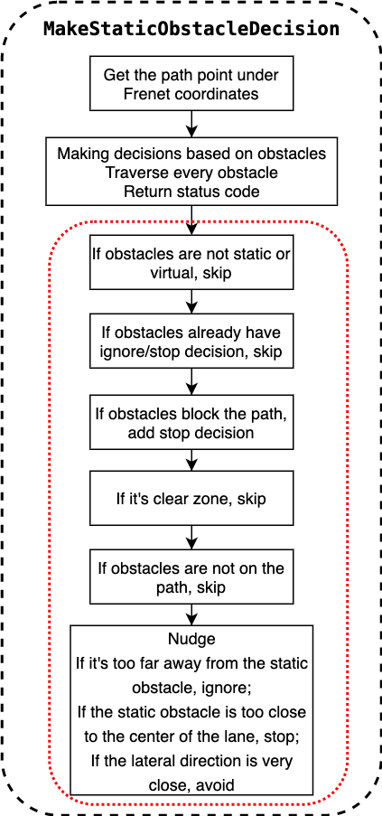

# Path Decider

### *Contents*

- [Introduction](#introduction)
- [Where is the code](#where-is-the-code)
- [Code Reading](#code-reading)
- [Algorithm Detail](#algorithm-detail)

# Introduction

`Path decider` is the task of planning module,belongs to `decider`.

The overall flow chart of the planning module:


The overall flow chart is illustrated with [lane follow](https://github.com/ApolloAuto/apollo/blob/r6.0.0/modules/planning/conf/scenario/lane_follow_config.pb.txt) scenario as an example.The main function of tasks is located in `Process` method.

The specific running process of Fig.1 can be referred to [path_bounds_decider]().

# Where is the code

We get best path in `path assessment decider `task,the function of `path decider` is to make ego car decision according to static obstacles.

The codes of `path decider` is [Apollo r6.0.0 path_decider](https://github.com/ApolloAuto/apollo/tree/r6.0.0/modules/planning/tasks/deciders/path_decider).

- Input

`Status PathDecider::Process(const ReferenceLineInfo *reference_line_info, const PathData &path_data,
 PathDecision *const path_decision)`

- Output

Results of path decider save in `path_decision`.

# Code Reading

The overall diagram of `path decider` is as follow:



The `Process` method calls `MakeObjectDecision` method.And the `MakeObjectDecision` method calls `MakeStaticObstacleDecision` method.

The main function of path decider is located in `MakeStaticObstacleDecision` method.

```C++
Status PathDecider::Process(const ReferenceLineInfo *reference_line_info,
                            const PathData &path_data,
                            PathDecision *const path_decision) {
  // skip path_decider if reused path
  if (FLAGS_enable_skip_path_tasks && reference_line_info->path_reusable()) {
    return Status::OK();
  }

  std::string blocking_obstacle_id;
  if (reference_line_info->GetBlockingObstacle() != nullptr) {
    blocking_obstacle_id = reference_line_info->GetBlockingObstacle()->Id();
  }
  // MakeObjectDecision
  if (!MakeObjectDecision(path_data, blocking_obstacle_id, path_decision)) {
    const std::string msg = "Failed to make decision based on tunnel";
    AERROR << msg;
    return Status(ErrorCode::PLANNING_ERROR, msg);
  }
  return Status::OK();
}

bool PathDecider::MakeObjectDecision(const PathData &path_data,
                                     const std::string &blocking_obstacle_id,
                                     PathDecision *const path_decision) {
  // path decider's main function is located in MakeStaticObstacleDecision
  if (!MakeStaticObstacleDecision(path_data, blocking_obstacle_id,
                                  path_decision)) {
    AERROR << "Failed to make decisions for static obstacles";
    return false;
  }
  return true;
}
```

# Algorithm Detail

According to the above flow chart of path decider,codes analysis is carried out.

- Get coordinates in frenet coordinate system

```C++
  ... ...
  // 1.get path point under frenet coordinate
  const auto &frenet_path = path_data.frenet_frame_path();
  if (frenet_path.empty()) {
    AERROR << "Path is empty.";
    return false;
  }
  ... ...
```

- Make decision according to obstacles

```C++
  ... ...
  // 2.Traverse every obstacle and make decision
  for (const auto *obstacle : path_decision->obstacles().Items()) {
    const std::string &obstacle_id = obstacle->Id();
    const std::string obstacle_type_name =
        PerceptionObstacle_Type_Name(obstacle->Perception().type());
    ADEBUG << "obstacle_id[<< " << obstacle_id << "] type["
           << obstacle_type_name << "]";
    ... ...
```

The red box in the figure above is the main content of the loop body.Its main function is to make decision for each obstacle.

- Skip if the obstacle is not static or virtual

```C++
    // 2.1 if the obstacle is not static or virtual,skip
    if (!obstacle->IsStatic() || obstacle->IsVirtual()) {    // (stop fence)
      continue;
    }
```

- Skip if the obstacle has an ignore/stop decision

```C++
    // 2.2 if the obstacle has an ignore/stop decision,skip
    if (obstacle->HasLongitudinalDecision() &&
        obstacle->LongitudinalDecision().has_ignore() &&
        obstacle->HasLateralDecision() &&
        obstacle->LateralDecision().has_ignore()) {
      continue;
    }
    if (obstacle->HasLongitudinalDecision() &&
        obstacle->LongitudinalDecision().has_stop()) {
      // STOP decision
      continue;
    }
```

- Add stop decision if the obstacle blocks the path

```C++
    // 2.3 Add stop decision if the obstacle blocks the path
    if (obstacle->Id() == blocking_obstacle_id &&
        !injector_->planning_context()
             ->planning_status()
             .path_decider()
             .is_in_path_lane_borrow_scenario()) {
      // Add stop decision
      ADEBUG << "Blocking obstacle = " << blocking_obstacle_id;
      ObjectDecisionType object_decision;
      *object_decision.mutable_stop() = GenerateObjectStopDecision(*obstacle);
      path_decision->AddLongitudinalDecision("PathDecider/blocking_obstacle",
                                             obstacle->Id(), object_decision);
      continue;
    }
```

- Skip it is clear-zone

```C++
    // 2.4 Skip it is clear-zone
    if (obstacle->reference_line_st_boundary().boundary_type() ==
        STBoundary::BoundaryType::KEEP_CLEAR) {
      continue;
    }
```

- Skip if the obstacle is not on the lane

```C++
    // 2.5 Skip if the obstacle is not on the lane
    ObjectDecisionType object_decision;
    object_decision.mutable_ignore();
    const auto &sl_boundary = obstacle->PerceptionSLBoundary();
    if (sl_boundary.end_s() < frenet_path.front().s() ||
        sl_boundary.start_s() > frenet_path.back().s()) {
      path_decision->AddLongitudinalDecision("PathDecider/not-in-s",
                                             obstacle->Id(), object_decision);
      path_decision->AddLateralDecision("PathDecider/not-in-s", obstacle->Id(),
                                        object_decision);
      continue;
    }
```

- nudge judgement

```C++
    // 2.6 nudge judgement,ignore if the static obstacle is too far.
    //     Stop if the static obstacle is too far from lane center.
    //     Avoid it if the lateral direction is very close.
    if (curr_l - lateral_radius > sl_boundary.end_l() ||
        curr_l + lateral_radius < sl_boundary.start_l()) {
      // 1. IGNORE if laterally too far away.
      path_decision->AddLateralDecision("PathDecider/not-in-l", obstacle->Id(),
                                        object_decision);
    } else if (sl_boundary.end_l() >= curr_l - min_nudge_l &&
               sl_boundary.start_l() <= curr_l + min_nudge_l) {
      // 2. STOP if laterally too overlapping.
      *object_decision.mutable_stop() = GenerateObjectStopDecision(*obstacle);

      if (path_decision->MergeWithMainStop(
              object_decision.stop(), obstacle->Id(),
              reference_line_info_->reference_line(),
              reference_line_info_->AdcSlBoundary())) {
        path_decision->AddLongitudinalDecision("PathDecider/nearest-stop",
                                               obstacle->Id(), object_decision);
      } else {
        ObjectDecisionType object_decision;
        object_decision.mutable_ignore();
        path_decision->AddLongitudinalDecision("PathDecider/not-nearest-stop",
                                               obstacle->Id(), object_decision);
      }
    } else {
      // 3. NUDGE if laterally very close.
      if (sl_boundary.end_l() < curr_l - min_nudge_l) {  // &&
        // sl_boundary.end_l() > curr_l - min_nudge_l - 0.3) {
        // LEFT_NUDGE
        ObjectNudge *object_nudge_ptr = object_decision.mutable_nudge();
        object_nudge_ptr->set_type(ObjectNudge::LEFT_NUDGE);
        object_nudge_ptr->set_distance_l(
            config_.path_decider_config().static_obstacle_buffer());
        path_decision->AddLateralDecision("PathDecider/left-nudge",
                                          obstacle->Id(), object_decision);
      } else if (sl_boundary.start_l() > curr_l + min_nudge_l) {  // &&
        // sl_boundary.start_l() < curr_l + min_nudge_l + 0.3) {
        // RIGHT_NUDGE
        ObjectNudge *object_nudge_ptr = object_decision.mutable_nudge();
        object_nudge_ptr->set_type(ObjectNudge::RIGHT_NUDGE);
        object_nudge_ptr->set_distance_l(
            -config_.path_decider_config().static_obstacle_buffer());
        path_decision->AddLateralDecision("PathDecider/right-nudge",
                                          obstacle->Id(), object_decision);
      }
    }
```
