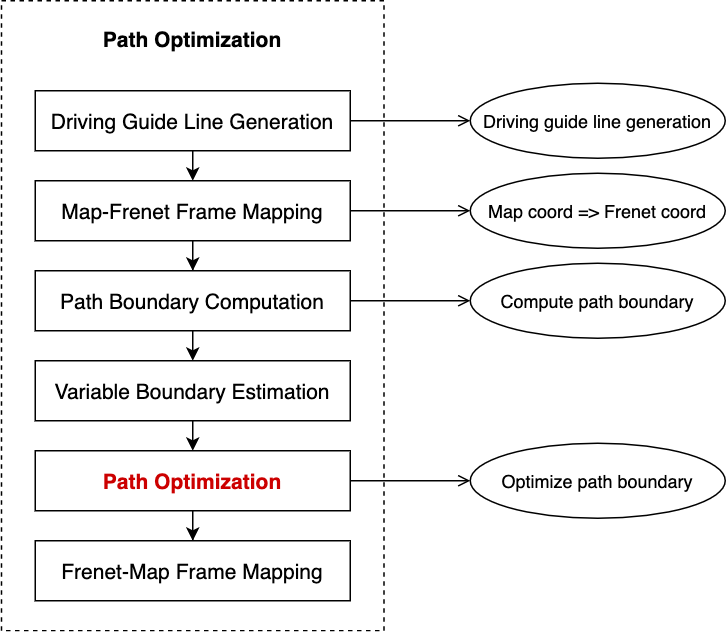
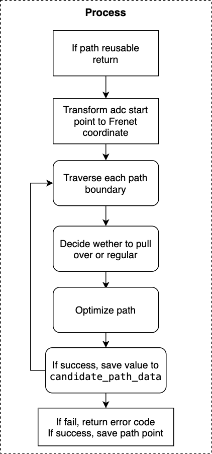
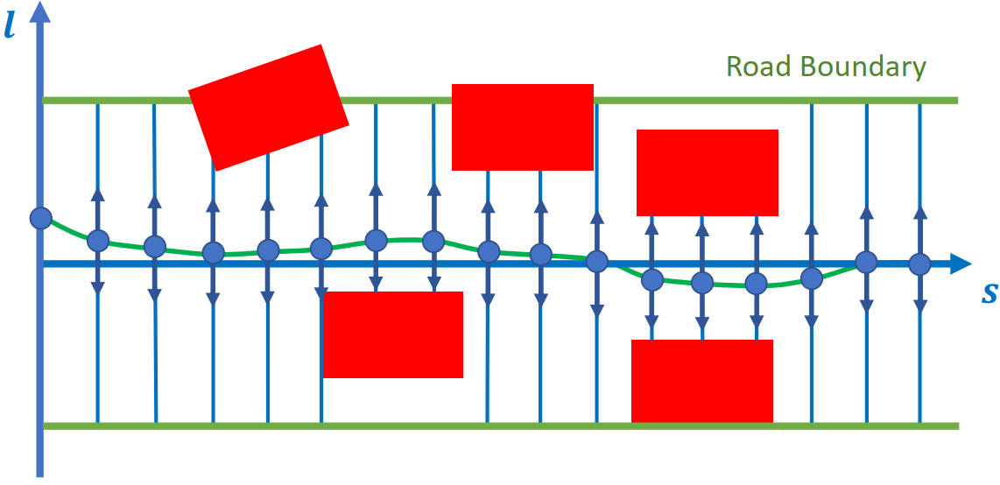

# Piecewise Jerk Path Optimizer

_**Tip**: to read the equations in the document, you are recommended to use Chrome with [a plugin](https://chrome.google.com/webstore/detail/tex-all-the-things/cbimabofgmfdkicghcadidpemeenbffn) or copy the latex equation to [an online editor](http://www.hostmath.com/)_

### *Contents*

- [Introduction](#introduction)
- [Where is the code](#where-is-the-code)
- [Code Reading](#code-reading)
- [Algorithm Detail](#algorithm-detail)

# Introduction

`Piecewise jerk path optimizer` is the task of planning module,belongs to `optimizer`.

The overall flow chart of the planning module:


The overall flow chart is illustrated with [lane follow](https://github.com/ApolloAuto/apollo/blob/r6.0.0/modules/planning/conf/scenario/lane_follow_config.pb.txt) scenario as an example.The main function of tasks is located in `Process` method.

The specific running process of Fig.1 can be referred to [path_bounds_decider]().


The flow chart of `piecewise jerk path optimizer` is as follow:




# Where is the code

This section of `piecewise jerk path optimizer` describes codes.

Please refer to [Apollo r6.0.0 piecewise_jerk_path_optimization](https://github.com/ApolloAuto/apollo/tree/r6.0.0/modules/planning/tasks/optimizers/piecewise_jerk_path)

- Input
`PiecewiseJerkPathOptimizer::Process(
    const SpeedData& speed_data, const ReferenceLine& reference_line,
    const common::TrajectoryPoint& init_point, const bool path_reusable,
    PathData* const final_path_data)`

Include reference line and start point,etc.

- Output

The `OptimizePath` method gets the optimal path,include $opt\_l, opt\_dl, opt\_ddl$.In `Process`method,results save into reference_line_info_ of the task base class.

# Code Reading

The diagram of `piecewise jerk path optimizer` is as follow:



- Return if reuse path

```C++
common::Status PiecewiseJerkPathOptimizer::Process(
    const SpeedData& speed_data, const ReferenceLine& reference_line,
    const common::TrajectoryPoint& init_point, const bool path_reusable,
    PathData* const final_path_data) {
  // Skip if reuse path
  if (FLAGS_enable_skip_path_tasks && path_reusable) {
    return Status::OK();
  }
  ... ...
```

- Transform start point of adc to frenet coordinate system
```C++
  ... ...
  const auto init_frenet_state =
      reference_line.ToFrenetFrame(planning_start_point);

  // choose lane_change_path_config for lane-change
  // otherwise,choose default_path_config
  const auto& config = reference_line_info_->IsChangeLanePath()
                           ? config_.piecewise_jerk_path_optimizer_config()
                                 .lane_change_path_config()
                           : config_.piecewise_jerk_path_optimizer_config()
                                 .default_path_config();
  ... ...
```

- Traverse the boundary of each path

```C++
  ... ...
  const auto& path_boundaries =
      reference_line_info_->GetCandidatePathBoundaries();
  ADEBUG << "There are " << path_boundaries.size() << " path boundaries.";
  const auto& reference_path_data = reference_line_info_->path_data();

  std::vector<PathData> candidate_path_data;
  // traverse each path boundary
  for (const auto& path_boundary : path_boundaries) {
    size_t path_boundary_size = path_boundary.boundary().size();
  ... ...
```

- Decider whether to pull over or regular

① decider whether it is pull over

```C++
    ... ...
    if (!FLAGS_enable_force_pull_over_open_space_parking_test) {
      // pull over scenario
      const auto& pull_over_status =
          injector_->planning_context()->planning_status().pull_over();
      if (pull_over_status.has_position() &&
          pull_over_status.position().has_x() &&
          pull_over_status.position().has_y() &&
          path_boundary.label().find("pullover") != std::string::npos) {
        common::SLPoint pull_over_sl;
        reference_line.XYToSL(pull_over_status.position(), &pull_over_sl);
        end_state[0] = pull_over_sl.l();
      }
    }
    ... ...
```

② Decide whether it is regular

```C++
    ... ...
    if (path_boundary.label().find("regular") != std::string::npos &&
        reference_path_data.is_valid_path_reference()) {
      ADEBUG << "path label is: " << path_boundary.label();
      // when reference road is ready
      for (size_t i = 0; i < path_reference_size; ++i) {
        common::SLPoint path_reference_sl;
        reference_line.XYToSL(
            common::util::PointFactory::ToPointENU(
                reference_path_data.path_reference().at(i).x(),
                reference_path_data.path_reference().at(i).y()),
            &path_reference_sl);
        path_reference_l[i] = path_reference_sl.l();
      }
      end_state[0] = path_reference_l.back();
      path_data.set_is_optimized_towards_trajectory_reference(true);
      is_valid_path_reference = true;
    }
    ... ...
```

- Optimizer path

```C++
    ... ...
    // setting parameters 
    const auto& veh_param =
        common::VehicleConfigHelper::GetConfig().vehicle_param();
    const double lat_acc_bound =
        std::tan(veh_param.max_steer_angle() / veh_param.steer_ratio()) /
        veh_param.wheel_base();
    std::vector<std::pair<double, double>> ddl_bounds;
    for (size_t i = 0; i < path_boundary_size; ++i) {
      double s = static_cast<double>(i) * path_boundary.delta_s() +
                 path_boundary.start_s();
      double kappa = reference_line.GetNearestReferencePoint(s).kappa();
      ddl_bounds.emplace_back(-lat_acc_bound - kappa, lat_acc_bound - kappa);
    }
    // path optimize method
    bool res_opt = OptimizePath(
        init_frenet_state.second, end_state, std::move(path_reference_l),
        path_reference_size, path_boundary.delta_s(), is_valid_path_reference,
        path_boundary.boundary(), ddl_bounds, w, max_iter, &opt_l, &opt_dl,
        &opt_ddl);
    ... ...
```

Optimize process:
1).Define piecewise_jerk_problem variable
2).Set variable
&emsp; a.weights
&emsp; b.distance,speed and acceleration boundaries of D direction
&emsp; c.Maximum angular speed
&emsp; d.jerk bound
3).Optimize algorithm
4).Acquire results

- Save results to candidate_path_data if success

```C++
    ... ...
    if (res_opt) {
      for (size_t i = 0; i < path_boundary_size; i += 4) {
        ADEBUG << "for s[" << static_cast<double>(i) * path_boundary.delta_s()
               << "], l = " << opt_l[i] << ", dl = " << opt_dl[i];
      }
      auto frenet_frame_path =
          ToPiecewiseJerkPath(opt_l, opt_dl, opt_ddl, path_boundary.delta_s(),
                              path_boundary.start_s());

      path_data.SetReferenceLine(&reference_line);
      path_data.SetFrenetPath(std::move(frenet_frame_path));
      if (FLAGS_use_front_axe_center_in_path_planning) {
        auto discretized_path = DiscretizedPath(
            ConvertPathPointRefFromFrontAxeToRearAxe(path_data));
        path_data.SetDiscretizedPath(discretized_path);
      }
      path_data.set_path_label(path_boundary.label());
      path_data.set_blocking_obstacle_id(path_boundary.blocking_obstacle_id());
      candidate_path_data.push_back(std::move(path_data));
    }
    ... ...
```

- Fail,return error code.Sucess,save path points.

```C++
  ... ...
  if (candidate_path_data.empty()) {
    return Status(ErrorCode::PLANNING_ERROR,
                  "Path Optimizer failed to generate path");
  }
  reference_line_info_->SetCandidatePathData(std::move(candidate_path_data));
  return Status::OK();
  ... ...
```

# Algorithm Detail

The algorithm of `Piecewise jerk path optimizer` is introduced in this paper [Optimal Vehicle Path Planning Using Quadratic Optimization for Baidu Apollo Open Platform
](https://ieeexplore.ieee.org/document/9304787)



Optimization algorithm:
- Generate the path boundary according to guide line and obstacle
- The guide is sampled at equal intervals in the s direction
- Optimize discrete points iteratively for each s direction $𝑙, 𝑙^{'}, 𝑙^{''}$ 

## Build mathematical model

### (1) trajectory smoothing


$$
min \sum_{k=1}^{n-2} ||2P_k - P_{k-1} + P_{k+1}||_2^2 +\\
\sum_{k=0}^{n-1} ||2P_k - P_{k-ref}||_2^2 +\\
\sum_{k=0}^{n-2} ||P_{k+1} - P_k||_2^2
$$

subject to:
$$
P_k \in B, for: k = 0,...,n-1 \\
||2P_k - P_{k-1} - P_{k+1}||_2 < \frac{d_{ref}^2}{R_{min}} \\
for: k=1,...,n-2 
$$

Among them:
- $P_k$ is $(x_k, y_k)$
- $P_{k\_ref}$ is the original point of routing
- $B$ is the boundary of $P_k$ in $P_{k\_ref}$
- $\frac{d_{ref}^2}{R_{min}}$ is the constrain of maximum curvature

### (2) Optimization target

$$
\tilde{f}(l(s)) = w_l * \sum_{i=0}^{n-1} l_i^2 + w_{l^{'}} * \sum_{i=0}^{n-1} l_i^{'2} + w_{l^{''}} * \sum_{i=0}^{n-1} l_i^{''2} +\\
w_{l^{'''}} * \sum_{i=0}^{n-2}(\frac{l_{i+1}^{''} - l_i^{''}}{\Delta s})^2 +\\
w_{obs} * \sum_{i=0}^{n-1}(l_i - 0.5*(l_{min}^i + l_{max}^i))^2
$$

### （3）Constrain conditions

- Continuity constraints

$$
l_{i+1}^{'''} = l_i^{''} + \int_0^{\Delta{s}} l_{i\rightarrow{i+1}}^{'''} ds = l_i^{''} + l_{i\rightarrow{i+1}}^{'''} * \Delta{s} \\
l_{i+1}^{'} = l_i^{'} + \int_0^{\Delta{s}}l^{''}(s)ds = l_i^{'} + l_i^{''}*\Delta{s} + \frac{1}{2} * l_{i\rightarrow{i+1}}^{'''} * \Delta{s^2} \\
l_{i+1} = l_i + \int_0^{\Delta{s}}l^{'}(s)ds \\
= l_i + l_i^{'}*\Delta(s^2) + \frac{1}{6}*l_{i\rightarrow{i+1}}*\Delta{s^3}
$$

- Safty constrains

The points of $l$ should be within the boundary.

$$
l(s) \in l_B(s), \forall{s} \in [0, s_{max}]
$$

- Curverture constrains

The turning angle of ego car shall not exceed the maximum turning angle.

$$
tan(\alpha_{max})*k_r*l - tan(\alpha_{max}) + |k_r|*L \leqslant 0
$$

The optimization algorithm is adopted [OSQP](https://osqp.org/).
