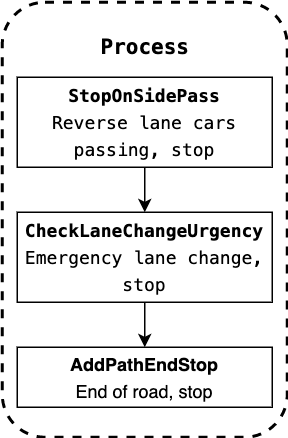
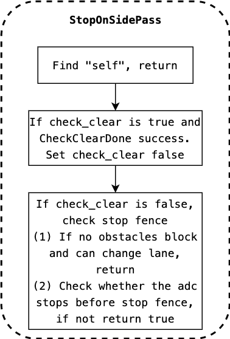
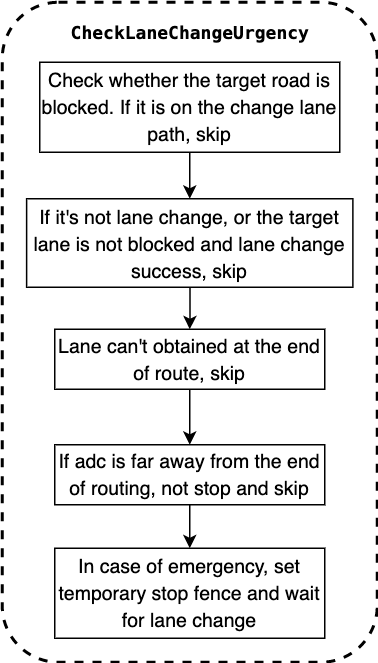
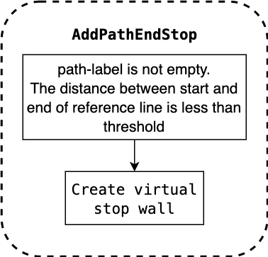

# Rule Based Stop Decider

### *Contents*

- [Introduction](#introduction)
- [Where is the code](#where-is-the-code)
- [Code Reading](#code-reading)
- [Algorithm Detail](#algorithm-detail)

# Introduction

`Rule based stop decider` is the task of planning module,belongs to `decider`.

The overall flow chart of the planning module:


The overall flow chart is illustrated with [lane follow](https://github.com/ApolloAuto/apollo/blob/r6.0.0/modules/planning/conf/scenario/lane_follow_config.pb.txt) scenario as an example.The main function of tasks is located in `Process` method.

The specific running process of Fig.1 can be referred to [path_bounds_decider]().


# Where is the code

`Rule based stop decider` sets stop signs according to some rules.

`Rule based stop decider` codes [Apollo r6.0.0 rule_based_stop_decider](https://github.com/ApolloAuto/apollo/tree/r6.0.0/modules/planning/tasks/deciders/rule_based_stop_decider).

- Input

`apollo::common::Status RuleBasedStopDecider::Process(Frame *const frame, ReferenceLineInfo *const reference_line_info)`

The input is `frame` and `reference_line_info`,specific information can refer to [path_bounds_decider]().

- Output

Results save in reference_line_info.


# Code Reading

The flow chart of the codes is as follow:



Code structure:

```C++
apollo::common::Status RuleBasedStopDecider::Process(
    Frame *const frame, ReferenceLineInfo *const reference_line_info) {
  // 1. Rule_based stop for side pass onto reverse lane
  StopOnSidePass(frame, reference_line_info);

  // 2. Rule_based stop for urgent lane change
  if (FLAGS_enable_lane_change_urgency_checking) {
    CheckLaneChangeUrgency(frame);
  }

  // 3. Rule_based stop at path end position
  AddPathEndStop(frame, reference_line_info);

  return Status::OK();
}
```

# Algorithm Detail

Analyze each part of the total process in the diagram above. 

- Stop on side pass



Codes:

```C++
void RuleBasedStopDecider::StopOnSidePass(
    Frame *const frame, ReferenceLineInfo *const reference_line_info) {
  static bool check_clear;    // default is false
  static common::PathPoint change_lane_stop_path_point;

  // get path_data
  const PathData &path_data = reference_line_info->path_data();
  double stop_s_on_pathdata = 0.0;

  // 1. find "self",return directly
  if (path_data.path_label().find("self") != std::string::npos) {
    check_clear = false;
    change_lane_stop_path_point.Clear();
    return;
  }

  // 2. If check_clear is true and CheckClearDone successes.Set check_clear to false
  if (check_clear &&
      CheckClearDone(*reference_line_info, change_lane_stop_path_point)) {
    check_clear = false;
  }

  // 3.If check_clear is false,check stop fence
  if (!check_clear &&
      CheckSidePassStop(path_data, *reference_line_info, &stop_s_on_pathdata)) {
    // 3.1 If the obstacle is not blocked and the lane can be changed,return directly
    if (!LaneChangeDecider::IsPerceptionBlocked(
            *reference_line_info,
            rule_based_stop_decider_config_.search_beam_length(),
            rule_based_stop_decider_config_.search_beam_radius_intensity(),
            rule_based_stop_decider_config_.search_range(),
            rule_based_stop_decider_config_.is_block_angle_threshold()) &&
        LaneChangeDecider::IsClearToChangeLane(reference_line_info)) {
      return;
    }
    // 3.2 Check whether the adc stops before the stop fence,if not return true
    if (!CheckADCStop(path_data, *reference_line_info, stop_s_on_pathdata)) {
      // Set the stop fence,execute 'check_clear = true' if success
      if (!BuildSidePassStopFence(path_data, stop_s_on_pathdata,
                                  &change_lane_stop_path_point, frame,
                                  reference_line_info)) {
        AERROR << "Set side pass stop fail";
      }
    } else {
      if (LaneChangeDecider::IsClearToChangeLane(reference_line_info)) {
        check_clear = true;
      }
    }
  }
}
```

- Check lane change Urgency



Check the emergency lane change,the code is as follows:

```C++
void RuleBasedStopDecider::CheckLaneChangeUrgency(Frame *const frame) {
  // check every reference_line_info
  for (auto &reference_line_info : *frame->mutable_reference_line_info()) {

    // 1. Check whether the target road is blocked.Skip if it is on the lane change path.
    if (reference_line_info.IsChangeLanePath()) {
      is_clear_to_change_lane_ =
          LaneChangeDecider::IsClearToChangeLane(&reference_line_info);
      is_change_lane_planning_succeed_ =
          reference_line_info.Cost() < kStraightForwardLineCost;
      continue;
    }

    // 2.If it is not lane change scenario and lane change is successful,skip.
    if (frame->reference_line_info().size() <= 1 ||
        (is_clear_to_change_lane_ && is_change_lane_planning_succeed_)) {
      continue;
    }
    // When the target lane is blocked in change-lane case, check the urgency
    // Get the end point of current routing
    const auto &route_end_waypoint =
        reference_line_info.Lanes().RouteEndWaypoint();

    // 3.Skip if it cannot obtain lane at the end of routing.
    if (!route_end_waypoint.lane) {
      continue;
    }
    auto point = route_end_waypoint.lane->GetSmoothPoint(route_end_waypoint.s);
    auto *reference_line = reference_line_info.mutable_reference_line();
    common::SLPoint sl_point;

    // mapping points of reference line to the frenet coordinate system.
    if (reference_line->XYToSL(point, &sl_point) &&
        reference_line->IsOnLane(sl_point)) {
      // Check the distance from ADC to the end point of current routing
      double distance_to_passage_end =
          sl_point.s() - reference_line_info.AdcSlBoundary().end_s();

      // 4. If the adc is far away from the end of routing,it does not need to stop and skip.
      if (distance_to_passage_end >
          rule_based_stop_decider_config_.approach_distance_for_lane_change()) {
        continue;
      }

      // 5.In case of emergency,set temporary stop fence and wait for lane change.
      const std::string stop_wall_id = "lane_change_stop";
      std::vector<std::string> wait_for_obstacles;
      util::BuildStopDecision(
          stop_wall_id, sl_point.s(),
          rule_based_stop_decider_config_.urgent_distance_for_lane_change(),
          StopReasonCode::STOP_REASON_LANE_CHANGE_URGENCY, wait_for_obstacles,
          "RuleBasedStopDecider", frame, &reference_line_info);
    }
  }
}
```

- Add path end stop



Add stop fence at the end of lane.

```C++
void RuleBasedStopDecider::AddPathEndStop(
    Frame *const frame, ReferenceLineInfo *const reference_line_info) {
  if (!reference_line_info->path_data().path_label().empty() &&
      reference_line_info->path_data().frenet_frame_path().back().s() -
              reference_line_info->path_data().frenet_frame_path().front().s() <
          FLAGS_short_path_length_threshold) {
    const std::string stop_wall_id =
        PATH_END_VO_ID_PREFIX + reference_line_info->path_data().path_label();
    std::vector<std::string> wait_for_obstacles;

    // Build stop fence
    util::BuildStopDecision(
        stop_wall_id,
        reference_line_info->path_data().frenet_frame_path().back().s() - 5.0,
        0.0, StopReasonCode::STOP_REASON_REFERENCE_END, wait_for_obstacles,
        "RuleBasedStopDecider", frame, reference_line_info);
  }
}
```
