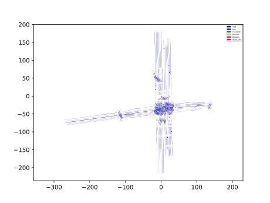

# VECTORNET_LSTM_EVALUATOR

# Introduction

Vectornet lstm evaluator is is based on a GNN encoding network taking environments and traffic agents as nodes. Comparing with semantic map CNN model, it has less parameters to learn and better performance. 

# Where is the code

Please refer the online inference [vectornet lstm evaluator](https://github.com/ApolloAuto/apollo/modules/prediction/evaluator/vehicle/vectornet_evaluator.h).
