### ESD CAN尝试
Apollo官方推荐的can卡为ESD CAN-PCIe/402，官方网站为[https://esd.eu/en/products/can-pci402](https://esd.eu/en/products/can-pci402)。
在TX2上试用的can卡型号为ESD CAN-PCIe/402-1-LP，展示图为：

  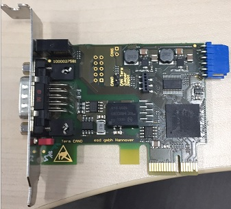

该型号通过PCIe插槽和TX2通讯，TX2上的PCIe插槽的展示图为：

  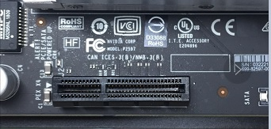

经过验证，该型号的can卡的驱动并不支持arm64，所以无法使用该型号的can卡作为TX2和canbus通讯的接口。

### TX2已经验证的can通讯方法的硬件接入方案。
参考TX2的[Techinical Reference Manual(TRM)](https://developer.nvidia.com/embedded/downloads#?tx=$product,jetson_tx2)，
章节35中对can控制器的介绍，TX2默认支持2个can控制器，分别标记为can0和can1。并且TX2需要外接can接收器才能和canbus进行通讯。
TX2提供了6个pins用于输入输出信号：

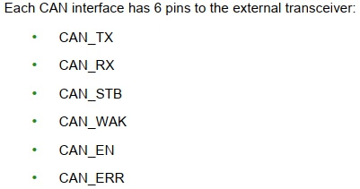

其中CAN_RX和CAN_TX分别用于输入和输出can信号。

关于上图中标识的CAN_RX和CAN_TX，我们需要在TX2裸露的板子上找到对应的引脚。
根据TX2官方提供的TX2技术文档[Jetson TX1-TX2 Developer Kit Carrier Board Design Files ](https://developer.nvidia.com/embedded/downloads#?tx=$product,jetson_tx2)，
其中文档P2597_C02_OrCAD_schematics.pdf第16页中有对CAN_RX和CAN_TX引脚的标注，该引脚隐藏在标号为J26的排序中：

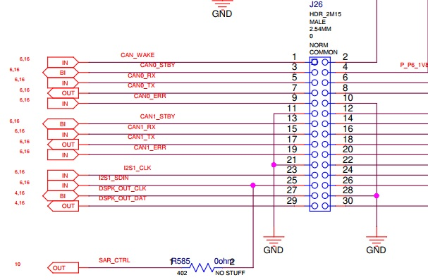

从上图中可知，引脚5,7分别对应于CAN_RX和CAN_TX。

既然已经找到了CAN_RX和CAN_TX的引脚，我们需要再考虑如何将信号发送到canbus上。

根据ESD CAN技术文档对canbus接口的描述：

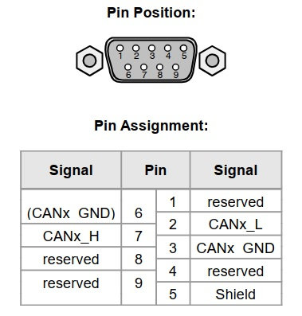

引脚2和7分别对应于L和H信号。而将CAN_RX和CAN_TX转换为L和H信号的任务将由can接收器来完成。

下图展示了在TX2社区中已经验证的can接收器SN65HVD230：

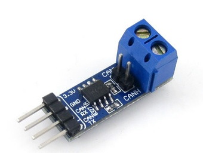

可以看到，can接收器的一端接CAN_RX和CAN_TX，另外一端接H和L。那么使用[杜邦线](https://baike.baidu.com/item/%E6%9D%9C%E9%82%A6%E7%BA%BF)将TX2、can接收器和canbus接口连接在一起
就可以实现TX2和canbus的通讯了。

关于J26排线在TX2的具体展示，及引脚的编号，我们在下图中看一看：

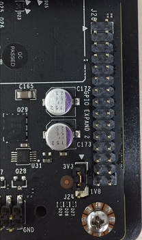

根据确认（猜测），其中箭头指向的是编号1。

首先我们需要将TX2和can接收器连接。
在TX2一端：

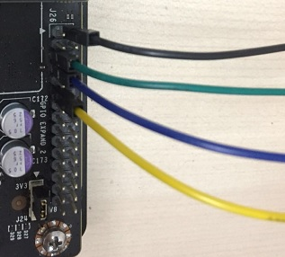

对比TX2技术文档提供的J26引脚介绍和上图可知，黑线连接了3V3电源线(pin2)，绿色连接了CAN0_RX(pin5)，蓝色连接了CAN0_TX(pin7)，黄色连接了GND地线(pin11)。

在can接收器一端：

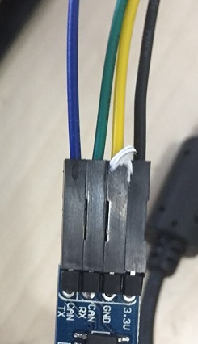

黑线连接了3V3电源线，绿色连接了CAN_RX，蓝色连接了CAN_TX，黄色连接了GND地线。

在can接收器的另一端：

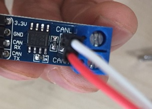

可以看到，白色连接了L，红色连接了H。

在can连接线一端的接口：

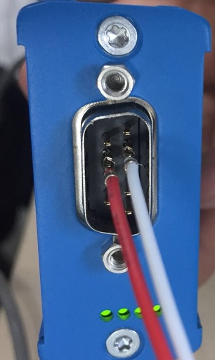

上图我们连接的是ESD CAN-USB/2的接口，连接任意的一个can连接线的接口都是一样的。从上图可知白线连接了L，红线连接了H。

### TX2上can设备的设定

使用Jetpack3.2刷机的设备已经默认支持了mttcan协议，所以我们不需要重新编译内核开启mttcan协议。但是仍然需要几个简单的操作才能启用can。

TX2支持2个can控制器，分别为can0和can1。我们只用到can0，所以下面的命令都是针对can0的操作。

`$ sudo modprobe can`

`$ sudo modprobe can_raw`

`$ sudo modprobe mttcan`

执行指令`ifconfig -a`能够看到can0和can1设备信息。

此时can0和can1还是不能使用的，因为还没设置波特率和启动设备。

在`dev_start.sh`脚本中有对can0设置波特率和启动设备的指令，可以参考一下。

用如下指令设置：

`$ sudo ip link set can0 type can bitrate 500000`

`$ sudo ip link set up can0`

上述指令设置can0的波特率为500K，并且启动设备。

可以使用如下指令查看can0的状态：

`$ ip --details link show can0`

状态应该显示为`ERROR-ACTIVE`。可以尝试测试一下can0能否发送数据了。

安装`can-utils`

`$ sudo apt-get install can-utils`

通过can0发送一个数据

`$ cansend can0 123#abcd`

检测can0发送的数据
将ESD CAN-USB/2通过USB接口连接到windows，安装官方提供的SDK，提供有一个测试软件canreal，启动canreal后就可以检测该设备上接收到的数据。正常情况下，canreal上能够显示刚刚can0发送的数据。这表示can0的通讯时OK的。

备注：通过任意其他的CAN-USB设备，比如PEAK CAN也可以进行测试。

### 测试apollo的canbus模块

在上述介绍的步骤都完成后，可以进入docker环境，并启动dreamview。

此时，dreamview会显示canbus的状态为OK。启动canbus（参考配置文件`canbus_conf.pb.txt`将brand修改为`SOCKET_CAN_RAW`）。同样，在canreal上会不断的显示出canbus发送的数据（值都为0）：

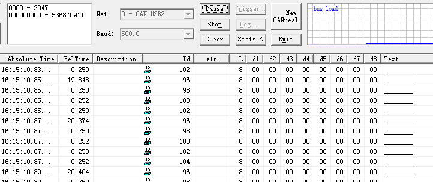

同样也可以测试通过CAN-USB发送数据，测试canbus模块是否能够接收数据。使用工具canreal，在下方填写发送数据的ID和值，点击发送。在canbus模块中，以下断点的形式可以检测到canbus模块组成接收到了数据。此处不再用图片展示结果。

### 与车辆（MKZ）的通讯
在完成canbus模块和CAN-USB的测试后，我们可以认为canbus模块和车辆的通讯也是没有问题的。
具体的测试步骤比较简单:

1. 通过can接口和车辆进行连接

2. 启动dreamview和canbus模块后，在`Tasks`面板的`Module Dealy`项目中能够看到canbus消息的不断刷新，这证明TX2能够正常接收到车辆的canbus消息

同样可以使用gdb调试canbus模块的方式确定是否接收到车辆的数据。

至于向车辆发送命令，可以直接通过启动自动驾驶模式的方法测试或者使用apollo官方提供的teleop工具。
