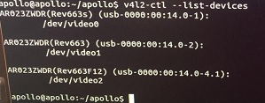
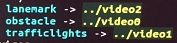

TX2上车验证阶段可以简单分为几个步骤：
* 硬件接口确认
* 硬件调试
  * camera调试
  * IMU&GPS调试
* 调试和验证

以下会以金瑞祺项目为例介绍各个阶段的工作，修改内容，验证方法等。

## 硬件接口确认

金瑞祺项目的目标是制作低成本的低速园区自动驾驶方案。`localization`采用`RTK`定位模式。`perception`模块只采用`camera`。
所以需要的硬件包括：摄像头、IMU、GPS。

在TX2和MKZ车辆的联调中，使用的硬件设备全部为apollo官方推荐的型号，请参考：
[https://github.com/ApolloAuto/apollo/tree/master/docs/specs](https://github.com/ApolloAuto/apollo/tree/master/docs/specs)
网址下对Navigation和Camera的信息介绍。

如果开发者使用了非官方推荐型号的硬件设备，可能需要额外的配置才能启用设备，关于这方面的资料请参考文档[how_to_use_reduced_or_non_official_recommendation_hardware.md](https://github.com/DongAi/docs4apollo/blob/master/docs/tx2/how_to_use_reduced_or_non_official_recommendation_hardware.md)

根据硬件的选型我们可以确认，3个摄像头使用3个USB接口，IMU&GPS使用一个USB接口，那么3-4个USB接口就可以满足金瑞祺项目的需求。
金瑞祺项目不使用can口与辆车通讯。关于can口的相关知识请参考文档[how to make can work on TX2](http://icode.baidu.com/repos/baidu/baidu/Apollo_Tx2/blob/master:docs/tx2/how_to_make_can_work_on_TX2.md’)

## 硬件调试
### camera调试
在camera安装并通过USB接口和TX2链接后，需要通过一定的设置才能识别成功。
首先检查在/dev文件夹下是否生成`video*`文件，该文件为ubuntu加载的摄像头设备文件。
执行指令`v4l2-ctl --list-devices`查看所有摄像头设备的信息。TX2默认自带了一个摄像头，并标记为`video0`。

上图中展示的摄像头信息是apollo官方推荐的摄像头型号，如果使用了非官方推荐的摄像头，输出的信息会不同。

然后分别执行如下步骤配置摄像头：

a) 进入文件夹`apollo/docker/setup_host/`

b) 执行脚本`setup_host.sh`

c) 执行`sudo service udev restart`

上述指令执行完毕后，在`/dev`文件夹下会生成`camera`文件夹，`camera`文件夹下包含了三个软链接文件`lanemark`,`obstacle`和`trafficlights`，分别指向`video*`设备文件。

创建这三个链接文件的规则为`apollo/docker/setup_host/etc/udev/rules.d/99-webcam.rules`。
该文件中配置了摄像头设备的信息，摄像头型号不同，rules文件中配置的信息也会不同。所以如果使用了非apollo官方推荐的摄像头，则可以通过如下指令查询摄像头设备的信息：

`udevadm info -a -p $(udevadm info -q path -n /dev/video0)`

根据上述指令的输出对应的修改rules文件即可。

另外，需要使用指令`./apolllo.sh build_usbcam`编译camera的启动程序。

为了确保camera的正常启动，另外需要对`modules/calibration/data/mkz_example/camera_params`文件夹和`modules/drivers/usb_cam/launch`文件夹
下的launch文件进行修改，这部分内容会在其他文档中介绍。需要注意的一点是，在dreamview界面选定车型后，launch的配置文件会从`modules/calibration/data/mkz_example/camera_params`
复制到`modules/drivers/usb_cam/launch`，其中的同名文件会被覆盖。

上述步骤完成后，启动dreamview，在`Module Controller`面板中启动`Camera`，左侧`Hardware`项目栏中`CameraL`和`CameraS`状态变为OK，表示启动成功。
在`Tasks`面板中的`Others`项目栏中，启动`Camera Sensor`，则面板的左上角会出现一个小窗体显示摄像头的实时图像。

### IMU&GPS调试
将IMU和GPS连接，GPS输入口通过USB接口和TX2链接后，在`/dev`文件夹会生成`ttyUSB0`,`ttyUSB1`和`ttyUSB2`文件。以apollo官方推荐的GPS型号为例，需要另外安装
GPS的驱动，驱动下载地址为[https://www.novatel.com/support/info/documents/809](https://www.novatel.com/support/info/documents/809)

配置设备的方法和camera类似，依次执行以下的步骤：

a) 进入文件夹`apollo/docker/setup_host/`

b) 执行脚本`setup_host.sh`

c) 执行`sudo service udev restart`

正常情况下，在`/dev`文件夹下会生成`novatel*`软链接文件，分别指向于三个ttyUSB文件。但是在TX2上需要对rules文件做一定的修改才能产生预期的效果。
GPS配置的rules文件为`99-usbtty.rules`。其中`DRIVERS`项的配置在TX2上不适配。
通过指令`udevadm info -a -p $(udevadm info -q path -n /dev/ttyUSB0)`查询GPS设备在TX2上的信息，可以得知`DRIVERS`信息为`ngpsser`，那么将rules文件中
`DRIVERS`项的值全部修改为`ngpsser`，再次执行`sudo service udev restart`即可。

完成GPS的配置后，还需要配置GPS的基站信息。基站信息的配置文件为`modules/calibration/data/mkz_example/gnss_params/gnss_conf.pb.txt`

完成上述配置后，启动dreamview，在`Module Controller`面板中启动`GPS`，左侧`Hardware`项目栏中`GPS`状态变为OK，表示启动成功。
为了验证定位是否正确，可以启动`Localization`（需要配置为`RTK`模式），主窗体中会显示道路和车辆在道路上的位置。

## 调试和验证
在金瑞祺项目的上车调试过程中，需要启动的模块有`GPS`,`Camera`,`Control`,`Guardian`,`Localization`,`Perception`,`Planning`,`Prediction`,`Routing`。
其中因为采用了低成本的方案，所以`Perception`并没有使用`Module Controller`面板中的按钮启动，而是使用脚本`./script/perception_lowcost.sh`启动。
下面会介绍在实现`RTK`模式定位，`Perception`正常检测到障碍物的过程中对配置文件的修改。

修改`modules/localization/conf/localization_config.pb.txt`文件，将`localization_type`项的值改为`RTK`。

`Perception`模块的配置文件有如下的修改：

a) `perception_lowcost.conf`文件中`fusion_publish_sensor`修改为camera`

b) `perception_lowcost.conf`文件中`dag_config_path`指定为`dag_streaming_lowcost.config`
