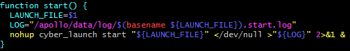
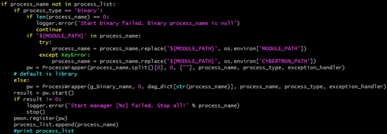
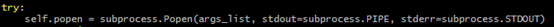
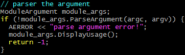
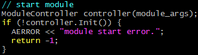
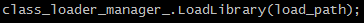
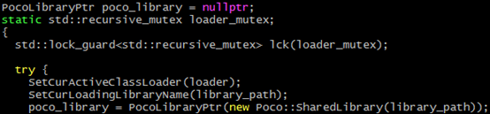
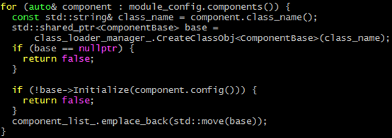
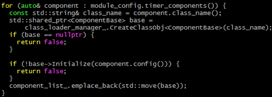
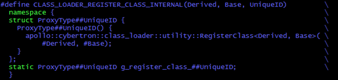

### cybertron和子模块启动
注意事项：`cybertron`支持多个模块在一个进程，多个进程的模式。在下述内容中我们默认所有模块启动在一个进程中的模式，进程名为apollo

通用的启动方式为`cyber_launch start launch/xxx.launch`
该命令分别调用了如下脚本：
`scripts/cyber_launch.sh`

 
注意事项：根据目前miaojinghao老师提供的cybertron版本，在每个模块的目前下如`perception`，`planning`，`canbus`等下面存在`launch`和`dag`文件夹和对应的文件，但是却不存在包含所有模块可以统一启动所有模块的launch文件。后续会进行验证

`framework/cybertron/tools/cyber_launch/cyber_launch`
该脚本是一个python脚本
在函数`def start(launch_file = ''):`中，遍历`launch`文件中配置的`process_name`，依次启动process：

 

在类`ProcessWrapper`的`start`函数中，启动process的方法为：

 
 
以`planning`模块为例，函数参数`args_list`的值为：
`mainboard -ddag/planning.dag -papollo`
python的`Popen`函数的功能是已一定的参数启动一个子进程，此处的子进程为`mainboard`，后面的参数都为子进程`mianboard`的参数。而`mainboard`是`apollo`工程编译出的模块，即为`cybertron`进程的启动模块。下面将进入C++代码层面。

注意事项：根据上面的代码，假设我们希望`planning`和`perception`启动在同一个进程`apollo`中，且配置在同一个`launch`文件中，那么在`cyber_launch`脚本发出的启动命令依次为：
`mainboard -d……/dag/perception.dag -papollo`
`manboard -d……/dag/planning.dag -papollo`
那么是启动了一个`mainboard`进程吗？根据使用一个简单的程序测试，`Popen`每次的执行都会启动一个新的进程。那么是否也会启动多个`mainboard`进程呢？这是一个目前的疑问，后续我们需要验证一下。我们记这个问题为P1吧。

`mainboard`模块的主函数是`frameword/cybertron/mainboard/mainboard.cc`

首先解析参数：

 
 
启动参数中，将process的名字存储在变量`process_name_`中，`dag`文件地址存储在变量
`dag_conf_list_`中

然后创建`ModuleController`对象并初始化：

 
 
依次调用了`ModuleController`类的`Init`，`LoadAll`，`LoadModule`函数。
`LoadModule`函数的前半部分先获取`dag`模块`so`文件的路径，然后执行如下函数加载`so`文件：

 
 
调用者是`class_loader::ClassLoaderManager`对象。

在`LoadLibrary`函数中，构造了一个`ClassLoader`对象，并将`so`文件的路径作为构造函数的参数。
`ClassLoader`是一个干干净净没继承也没被别人集成的类，在`apollo`工程中好像很少见。

在`ClassLoader`的构造函数中调用到`ClassLoader::LoadLibrary`，然后再调用到`utility::LoadLibrary`，并将`so`文件的路径和`ClassLoader`对象的指针作为参数。

加载`so`文件的方法为`Poco::SharedLibrary`：（PocoLibrary课下多研究研究）

 
 
注意事项：加载`so`文件会做什么呢？这是一个非常值得思考的问题。虽然不像启动一个进程一样从主函数开始执行指令，但是加载`so`文件时依然会申请静态对象，静态数据的内存，并根据情况将指令加载到内存中。所以在加载`so`成功时会构造所有的`static`类型的对象，这是一个很关键的一步。
我们暂时记这个步骤为A，假设`so`文件已经加载成功了，并回到`ModuleController`类的`LoadModule`函数。

`LoadModule`函数会根据`dag`文件的配置构造子`Component`对象：

 
 
同时还有`Time_Component`的子对象：

 

当我们稍微深挖一下`CreateClassObj`如何构造对象时可能发现可能缺少了某个步骤，导致子`Component`无法找到。
这就是在上面提高的步骤A中的关键一步。
在`cybertron`的从入门到发疯的文档中也有说明：

 
 
宏定义的内容如下：

 
 
上述代码定义的`static`对象在加载`so`文件时被构造，调用构造函数时调用了`RegisterClass`函数。注册子`Component`的工作就在这里面完成了。

再次回到`ModuleController`类的`LoadModule`函数，构造在`dag`文件中配置的每一个子`Component`对象后，调用`Initialize`函数初始化，到这儿`cybertron`和子模块都启动了。

突然明白了一件事，`cybertron`是以`Component`管理的各个模块，本文开头提到的所有模块在一个进程中的模式，只需要配置一个`launch`文件，`process_name`配置为`apollo`，在对应的`dag`文件中配置上每一个模块的`Component`就可以了。如果区分进程，则配置多个`launch`文件，相对应的`dag`文件中配置每个进程需要管理的模块`Component`就可以了。这回答了问题P1。且上文中某个步骤描述不准确，但是不改了，毕竟这是学习的必经步骤。

顺序图为：

 

### 模块调度
未完待续

### 消息通讯
未完待续

