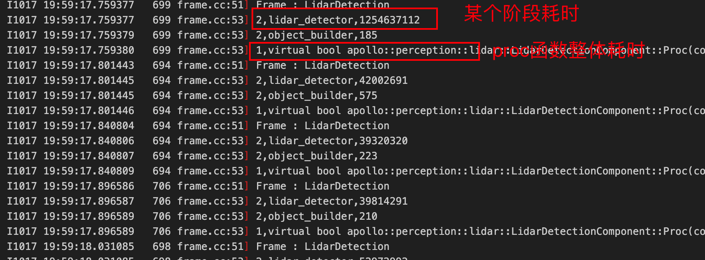
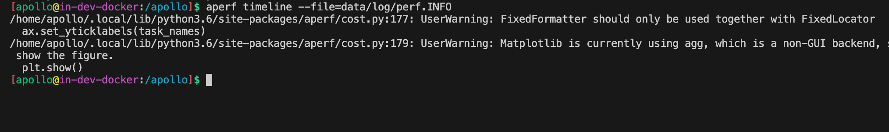
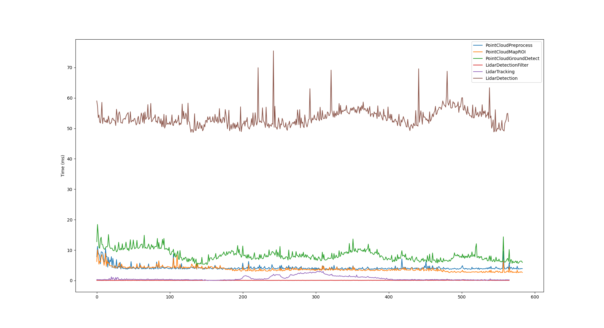

## perf性能日志增加

 **目的** ：包管理模式或者源码方式下使用cyber中的perf工具统计每个阶段的程序耗时，方便进行性能分析，定位问题。

讲述下述demo（包管理模式）如何使用perf工具。

如果用户下载了lidar_detection包：

1、在需要统计程序耗时的cc文件中引入头文件

```plain
#include "cyber/profiler/profiler.h"
```

2、BUILD文件中增加下述代码

```plain
load("//tools/platform:build_defs.bzl", "if_profiler")
```

注意：需要在对应添加perf代码的cc文件BUILD对应的apollo_component或apollo_cc_library中增加copts选项if_profiler()

例如：在lidar_detection_component.cc文件中增加了性能统计代码，需要在apollo_component中增加copts选项开关copts = PERCEPTION_COPTS + if_profiler()

```plain
apollo_component(
    name = "liblidar_detection_component.so",
    srcs = ["lidar_detection_component.cc"],
    hdrs = ["lidar_detection_component.h"],
    copts = PERCEPTION_COPTS + if_profiler(),
    linkopts = ["-lleveldb"],
    deps = [
        "//cyber",
        ":apollo_perception_lidar_detection",
        "//modules/perception/common/onboard:apollo_perception_common_onboard",
        "//modules/perception/lidar_detection/proto:lidar_detection_component_config_cc_proto",
    ],
)
```

3、增加统计时间函数调用代码

- 统计某个函数整体运行时间使用  PERF_FUNCION()，统计函数进入至析构释放的总体耗时

```plain
bool LidarDetectionComponent::Proc(
    const std::shared_ptr<LidarFrameMessage>& message) {
  PERF_FUNCION()
  // internal proc
  bool status = InternalProc(message);
  if (status) {
    writer_->Write(message);
    AINFO << "Send Lidar detection output message.";
  }
  return status;
}
```

- 统计一段程序的耗时使用PERF_BLOCK（自定义log名称）和PERF_BLOCK_END，统计期间的耗时

```plain
  PERF_BLOCK("lidar_detector")
  LidarDetectorOptions detection_options;
  if (!detector_->Detect(detection_options, in_message->lidar_frame_.get())) {
    AERROR << "Lidar detector detect error!";
    return false;
  }
  PERF_BLOCK_END
```

4、增加完相应代码后执行传参编译--define ENABLE_PROFILER=true打开perf开关，默认是关闭状态

```plain
buildtool build -p modules/perception/lidar_detection --gpu --opt -a "--define ENABLE_PROFILER=true"
```

5、查看log日志

日志会存放在/apollo_workspace/data/log路径下，会产生一个perf.INFO日志，里面存储了相关性能耗时日志。



## aperf工具使用

安装aperf

```plain
pip3 install modules/tools/aperf/
```

注意：如果遇见下属情况，执行sudo apt-get install python3-tk



画出所有模块的耗时

```plain
aperf cost --file=data/perf.INFO
```



绘制所有模块的时间线

```plain
aperf timeline --file=data/perf.INFO
```

