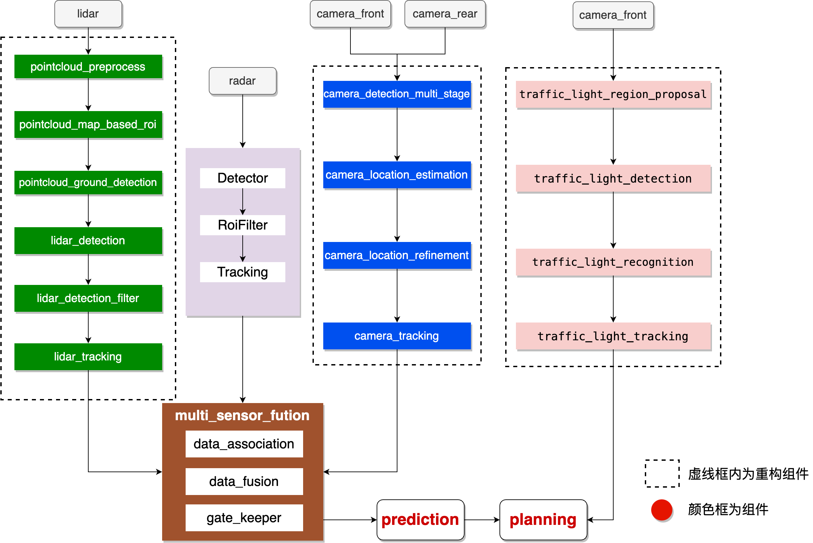
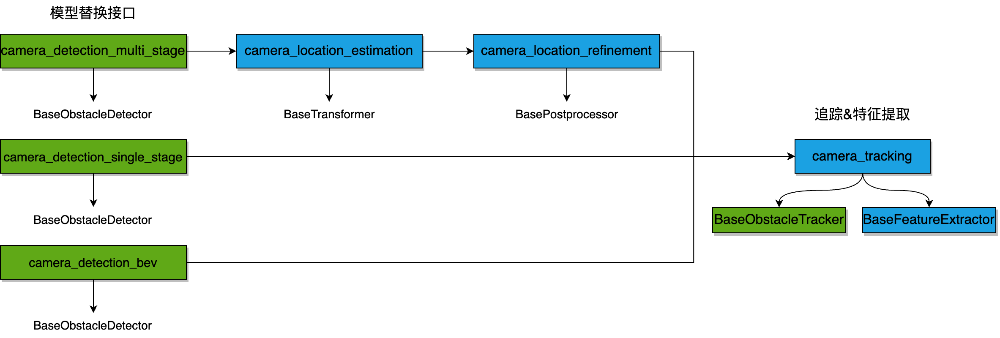

## 功能概述

### 功能概述

Perception 模块在自动驾驶系统中扮演着至关重要的角色，感知各个子模块的功能是通过 lidar、radar 和camera 3 种传感器实现的，每种传感器分别都执行了目标识别和追踪的任务，最后通过 fusion 对传感器的数据做融合；除此之外，还通过camera实现了车道线识别和红绿灯检测的功能，每个传感器执行的任务流程大概相似：预处理，识别，过滤，追踪。

在自动驾驶系统中，感知模块主要负责识别车辆周围的障碍物以及交通标识等，因此感知算法的好坏直接关系到自动驾驶的安全性，如何更快的迭代开发感知算法就成为了关键。在 Apollo alpha 中，对感知模块进行了组件化重构，提供了多种开发模式。当现有功能完全适用于用户的开发需求，可以不需要开发代码，通过修改组件配置或者模型参数实现场景的功能需求；组件开发，当用户的场景需要引入新的需求和其他组件共同完成作业任务，比如增加激光雷达背景分割功能，只需在满足上下游消息通道订阅发布的同时完成相应开发即可；插件开发，例如激光雷达目标检测障碍物过滤组件中我们提供了两种过滤插件方法，如不能满足用户的需求，可以根据提供的插件开发文档进行相应过滤插件开发，通过插件开发方式，开发者可以更加专注于算法本身，而不需要过多关注框架的实现。

### 运行流程

Apollo 自动驾驶平台是以高精地图和定位模块作为核心。其他的模块都是以这两个模块为基础。感知模块识别自动驾驶汽车周围的环境，对环境信息和车内信息的采集、处理与分析，也即环境感知，它是智能车辆自主行驶的基础和前提。感知的结果会传递给后面的模块进行使用。

### 框架设计

原有的感知框架，lidar、camera、radar、fusion 四部分内容定义在四个模块中。Lidar 和 camera 每个模块内部功能复杂，学习成本较高。感知框架拆分后，模块依赖关系清晰。Lidar 和 camera 的感知流程分为多个模块，依赖关系呈线性状态；radar 和 fusion 的功能在单个模块内，功能如框图所示。感知新框架下，lidar 和 camera 相比之前每个模块功能更加轻量化，更有利于二次开发。每个组件都可以单独启动调试。

### 功能列表

Apollo 根据功能对模块做了进一步的划分，使得每个组件的功能更加聚焦，方便按需选择对应的模块进行优化升级，下面是整体的目录说明：

| 组件                            | 功能概述                                                                                                                                                                                                                         |
|:-----------------------------:|:----------------------------------------------------------------------------------------------------------------------------------------------------------------------------------------------------------------------------:|
| camera_detection_multi_stage  | 相机2D物体检测模块是基于yolo开发的多任务模型，可以同时数十种维度信息。 该模块完成图像数据预处理、检测、结果后处理等操作。                                                                                                                                                             |
| camera_detection_single_stage | 相机3D物体检测模块包括caddn和smoke两个模型，可以同时输出2d和3d信息。 该模块完成图像数据预处理、检测、结果后处理等操作。 该模块可以将结果直接传输到camera_tracking组件。                                                                                                                         |
| camera_detection_bev          | BEV物体检测模块是在paddlepaddle框架下使用Nuscenes数据集训练的多摄像头transformer模型，可以完成多个摄像头数据的推理以获得障碍物目标。                                                                                                                                          |
| camera_detection_occupancy    | BEV+OCC检测模块是在pytorch框架下使用Nuscenes数据集训练的多摄像头transformer模型，可以完成bev障碍物检测和占据栅格检测。                                                                                                                                                |
| camera_location_estimation    | 当前模块能够根据网络预测的2D目标框信息、3D观察角度信息、3D尺寸信息和相机内部参数，计算出目标在相机坐标系中的旋转角度，然后结合障碍物尺寸模板， 该模块求解目标3dbbox，并将坐标转换为世界坐标系。                                                                                                                       |
| camera_location_refinement    | 对前一阶段检测到的障碍物进行后处理。 主要通过将地平面拟合到相机平面来计算调谐目标与相机的相对位置和高度。                                                                                                                                                                        |
| camera_motion_service         | 该模块提供当前运动估计。                                                                                                                                                                                                                 |
| camera_overlap_filter         | 相机重叠过滤模块用于融合多个相机的检测结果。                                                                                                                                                                                                       |
| camera_tracking               | 相机跟踪模块的功能是利用omt障碍物跟踪器对摄像头检测到的障碍物进行处理，并输出跟踪到的障碍物以供后续的多传感器融合。                                                                                                                                                                  |
| lane_detection                | 车道检测模块通过摄像头传感器检测车道线。 车道线可以用作其他模块的辅助。                                                                                                                                                                                         |
| lidar_detection               | 基于点云进行3D物体检测，并输出检测到的物体的位置、大小和方向。 Apollo提供了4种激光雷达检测模型：centerpoint、maskpillars、pointpillars、cnnseg。                                                                                                                            |
| lidar_detection_filter        | 根据对象属性、车道线、ROI 等过滤前景和背景对象。                                                                                                                                                                                                   |
| lidar_tracking                | 跟踪模块用于跟踪障碍物的运动轨迹，更新障碍物的运动状态和几何形状，并分配跟踪id。                                                                                                                                                                                    |
| multi_sensor_fusion           | 多传感器融合模块融合Lidar、Camera、Radar多个传感器的输出结果，使检测结果更加可靠。该模块采用后处理技术，采用的算法是概率融合。                                                                                                                                                      |
| pointcloud_ground_detection   | 点云地面检测，检测地面点，并保存所有非地面点的索引。                                                                                                                                                                                                   |
| pointcloud_map_based_roi      | 过滤 ROI 之外的点云。 感兴趣区域 (ROI) 指定可行驶区域，包括从高精地图检索到的路面和路口。 HDMap ROI 过滤器处理 ROI 外部的lidar点，去除背景物体，例如道路周围的建筑物和树木。 剩下的就是ROI中的点云以供后续处理。 给定 HDMap，每个 LiDAR 点的隶属关系指示它是在 ROI 内部还是外部。 每个 LiDAR 点都可以通过汽车周围区域的 2D 量化查找表 (LUT) 进行查询。            |
| pointcloud_preprocess         | 点云预处理模块对驱动程序输出的点云数据进行预处理。 删除超值点、太远的点、扫描到自身车辆上的点、太高的点。                                                                                                                                                                        |
| radar_detection               | 雷达检测模块通过雷达传感器检测并跟踪障碍物，然后将其发送到多传感器融合模块。                                                                                                                                                                                       |
| traffic_light_detection       | 经过预处理阶段的前面的投影后，在图片上得到了一个投影框，但是得到的投影框并不完全可靠，所以根据投影的信号光位置计算出一个较大的感兴趣区域（Region of Interest ROI）为 用过的。 确定信号量的确切边界框。 信号光检测（Detect）是一种传统的卷积神经网络检测任务，接收带有ROI信息的图像作为输入数据，并依次输出边界框。                                                   |
| traffic_light_recognition     | 交通灯识别模块的目的是识别交通灯的颜色。 该任务是使用传统的卷积神经网络完成的。 识别模块的输入是带有ROI信息和一组边界框信息的图像作为输入数据，输出是四维向量。 ，分别表示每个边界框为黑色、红色、黄色和绿色的概率，当且仅当概率足够大时，概率最高的类别将被识别为信号灯的状态。 否则信号量状态设置为Unknown，表示状态未确定。                                                       |
| traffic_light_region_proposal | 该模块用于查询定位并绘制信号灯信息，根据信号灯在图像平面上的投影来选择用于检测交通灯的摄像机，最后保存摄像机选择结果。                                                                                                                                                                  |
| traffic_light_tracking        | 在识别阶段，由于遮挡或红绿灯闪烁等原因，输出状态可能不是真实状态，因此应对相应结果进行修正。                                                                                                                                                                               |
| common                        | 公共库                                                                                                                                                                                                                          |
| msg_adapter                   | msg适配器模块用于在感知模块内部转发消息。 内部消息的通道名称通常有一个内部字段“inner”。 这些消息仅在线程之间传递，而不是在进程之间传递，因此用户无法使用“cyber_monitor”来查看它们。 因为这些消息一般都比较大，比如图像、点云数据，为了避免复制、序列化和反序列化，我们采用直接传递对象的方法，所以这些消息只能在线程内传递。 为了方便调试，可以使用msg适配器模块转发消息，这样就可以通过cyber_monitor查看。 |
| tools                         | 一些离线调试工具，包含lidar、camera和trafficlight                                                                                                                                                                                         |

## 模块概述

目前 Apollo 采用组件的方式按需使用，同时为了方便扩展，例如更换模型，采用插件的方式来添加新的模型。

- 绿色代表用户经常需要替换的部分，需要开发新算法或功能，基于原有的框架只需要替换自己想要替换的部分，不需要关注消息流转和框架。

- 蓝色代表用户不需要经常替换的部分，模块集成了所有算法，功能是一个整体，直接通过配置修改功能，如果想要替换可以重新写一个组件。

### lidar 检测流程

激光雷达检测用于 3D 目标检测，它的输入是激光雷达点云，输出为检测到的物体的类型和坐标。开发者关注较多的是pointcloud_map_based_roi、lidar_detection 和 lidar_detection_filter 三个组件。其中 pointcloud_map_based_roi 会涉及相关的 roi 过滤规则，lidar_detection 组件是目标检测过程中模型部署相关内容，Apollo 和 paddle3D 已经打通模型训练部署至 apollo 全流程，后续课程实践也会涉及该方面内容。Apollo lidar 感知模块提供 4 种目标检测模型，开发者可以根据配置文件，选择不同的检测器，来验证检测效果。通过最新的算法插件，开发者更加专注于算法本身，而不需要过多关注框架的实现。lidar_detection_filter 组件为检测障碍物过滤相关功能。激光雷达跟踪用于追踪上面检测到的 3D 目标对象，它的输入是激光雷达点云检测结果，输出为跟踪到对象的 ID。

### camera 检测流程

camera 检测流程中，开发者的关注重心在 camera_detection_multi_stage、camera_detection_single_stage 以及 camera_tracking 组件，其中 camera_detection_multi_stage 和 camera_detection_single_stage 组件设计 2D、3D 模型部署、预处理等功能，开发者可以针对性的替换模型和开发相关功能，camera_tracking 中功能整体性较强，开发者可以针对相应的追踪策略修改组件中的配置项。camera_detection_multi_stage 检测流程输出的是 2D boundingbox，相比于 camera_detection_single_stage 组件直接输出3d检测结果，多了将 2D 信息转换成 3D 障碍物信息的过程。

### fusion 流程

多传感器融合模块对多个传感器的检测结果做融合。它的输入是 lidar、camera、radar 检测目标结果，输出是融合后的结果。其中列举几个重要基类的作用：BaseFusionSystem 相当于融合模块的入口，会初始化 ProbabilisticFusion 概率融合算法，BaseTracker 更新追踪到的轨迹状态，BaseGatekeeper用于判断是否发布追踪到的障碍物到最终通道中。

多传感器融合组件功能详细功能框图如下所示：

### radar 检测流程

radar_detection 是一个完整的功能组件，其中包含预处理、检测、追踪以及相应过滤功能。

### trafficlight检测流程

红绿灯检测流程开发者关注 traffic_light_detection 和 traffic_light_recognition 这两个组件，分别对应红绿灯检测和识别功能的模型部署等。

## 开放资源

### record下载

目前提供可以直接下载的 record 包有以下 2 种。

| Record name       | Verification                                            | Vehicle configuration      | Map            | Size   | Download address                                                         |
| ----------------- | ------------------------------------------------------- | -------------------------- | -------------- | ------ | ------------------------------------------------------------------------ |
| bev_test.tar.xz   | bev_detection                                           | Apollo Perception Test Bev | default        | 1.93GB | https://apollo-pkg-beta.cdn.bcebos.com/perception_record/bev_test.tar.xz |
| sensor_rgb.tar.xz | camera_detection、lidar_detection、trafficlight_detection | Perception Test V1         | Sunnyvale Loop | 4.4GB  | https://apollo-system.bj.bcebos.com/dataset/6.0_edu/sensor_rgb.tar.xz    |

当然 Apollo 还提供了数据集转 record 的工具，方便开发者把开源数据集的数据转成 record 在 Apollo 中进行测试。工具的名称为adataset，支持的数据集有 KITTI、nusense。

### 模型下载

Apollo 提供预训练好的模型，用户可以通过 amodel 工具来下载和管理模型。开发者可以通过该工具下载安装模型仓库中的模型，展示系统中已经安装的模型和模型的详细信息。通过对模型进行标准化和模型管理工具，开发者可以非常方便的安装部署训练好的模型，并且管理这些模型，实现模型部署效率提升。

例如：要安装模型：

查看当前系统中有哪些模型：

当前已经支持模型下载地址：

| Model                 | Model type               | Model download address                                                                                                                                                                                                                                                                                     |
| --------------------- | ------------------------ | ---------------------------------------------------------------------------------------------------------------------------------------------------------------------------------------------------------------------------------------------------------------------------------------------------------- |
| petrv1                | BEV_detection            | https://apollo-pkg-beta.cdn.bcebos.com/perception_model/petrv1.zip                                                                                                                                                                                                                                         |
| horizontal_torch      | Trafficlight_recognition | https://apollo-pkg-beta.cdn.bcebos.com/perception_model/horizontal_torch.zip                                                                                                                                                                                                                               |
| quadrate_torch        | Trafficlight_recognition | https://apollo-pkg-beta.cdn.bcebos.com/perception_model/quadrate_torch.zip                                                                                                                                                                                                                                 |
| vertical_torch        | Trafficlight_recognition | https://apollo-pkg-beta.cdn.bcebos.com/perception_model/vertical_torch.zip                                                                                                                                                                                                                                 |
| horizontal_caffe      | Trafficlight_recognition | https://apollo-pkg-beta.cdn.bcebos.com/perception_model/horizontal_caffe.zip                                                                                                                                                                                                                               |
| quadrate_caffe        | Trafficlight_recognition | https://apollo-pkg-beta.cdn.bcebos.com/perception_model/quadrate_caffe.zip                                                                                                                                                                                                                                 |
| vertical_caffe        | Trafficlight_recognition | https://apollo-pkg-beta.cdn.bcebos.com/perception_model/vertical_caffe.zip                                                                                                                                                                                                                                 |
| tl_detection_caffe    | Trafficlight_detection   | https://apollo-pkg-beta.cdn.bcebos.com/perception_model/tl_detection_caffe.zip                                                                                                                                                                                                                             |
| denseline_caffe       | lane_detection           | https://apollo-pkg-beta.cdn.bcebos.com/perception_model/denseline_caffe.zip                                                                                                                                                                                                                                |
| darkSCNN_caffe        | lane_detection           | https://apollo-pkg-beta.cdn.bcebos.com/perception_model/darkSCNN_caffe.zip                                                                                                                                                                                                                                 |
| cnnseg16_caffe        | lidar_3d_segmentation    | https://apollo-pkg-beta.cdn.bcebos.com/perception_model/cnnseg16_caffe.zip                                                                                                                                                                                                                                 |
| cnnseg64_caffe        | lidar_3d_segmentation    | https://apollo-pkg-beta.cdn.bcebos.com/perception_model/cnnseg64_caffe.zip                                                                                                                                                                                                                                 |
| cnnseg128_caffe       | lidar_3d_segmentation    | https://apollo-pkg-beta.cdn.bcebos.com/perception_model/cnnseg128_caffe.zip                                                                                                                                                                                                                                |
| center_point_paddle   | lidar_3d_detection       | https://apollo-pkg-beta.cdn.bcebos.com/perception_model/center_point_paddle.zip                                                                                                                                                                                                                            |
| mask_pillars_torch    | lidar_3d_detection       | https://apollo-pkg-beta.cdn.bcebos.com/perception_model/mask_pillars_torch_v2.zip                                                                                                                                                                                                                          |
| point_pillars_torch   | lidar_3d_detection       | https://apollo-pkg-beta.cdn.bcebos.com/perception_model/point_pillars_torch_v2.zip                                                                                                                                                                                                                         |
| yolox3d_onnx          | camera_detection         | https://apollo-pkg-beta.cdn.bcebos.com/perception_model/yolox3d_onnx.zip                                                                                                                                                                                                                                   |
| caddn_paddle          | camera_detection         | https://apollo-pkg-beta.cdn.bcebos.com/perception_model/caddn_paddle.zip                                                                                                                                                                                                                                   |
| 3d-r4-half_caffe      | camera_detection         | https://apollo-pkg-beta.cdn.bcebos.com/perception_model/3d-r4-half_caffe.zip                                                                                                                                                                                                                               |
| point_pillars_radar4d | radar_detection          | https://apollo-pkg-beta.cdn.bcebos.com/perception_model/point_pillars_radar4d_torch.zip                                                                                                                                                                                                                    |
| smoke_torch           | camera_detection         | [https://apollo-pkg-beta.cdn.bcebos.com/perception_model/smoke_torch.zip](https://apollo-perception.bj.bcebos.com/core_model/smoke_torch.zip?authorization=bce-auth-v1/e3384375161a482d8fa77e1ef2d32e05/2023-10-27T11%3A04%3A22Z/-1/host/b9aed27fd7480add4225a7fe8f83b3f81aecde39035b057837ef3ff9ccc93055) |
