## 1. Introduction

In recent years, vision-only + BEV based object detection and occupancy prediction tasks have become research hotspots in autonomous driving. The BEVFormer network proposed in 2022 uses surround-view images as input and employs Transformer architecture to generate BEV features, completing object detection tasks. The occupancy prediction task expresses the real world by predicting 3D voxel grids, as shown in the following figure, where voxels represent occupied positions and different colors represent different semantic classes. Occupancy prediction can effectively handle irregular obstacles in autonomous driving, thus receiving extensive research.

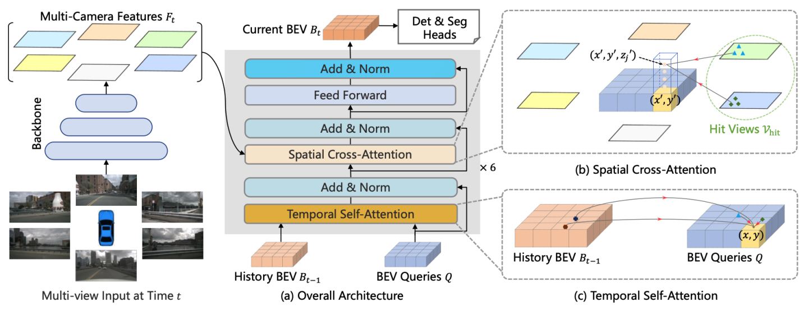

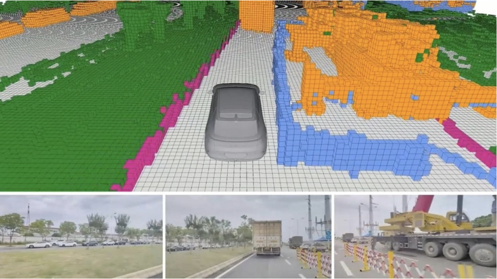

Apollo 11.0 upgrades the vision-only model Apollo-vision-Net with the following features:

1. 【 Advanced 】Introduces the mainstream perception paradigm of vision BEV object detection + OCC occupancy network into the Apollo open-source framework, enhancing OCC visualization on the web:
    * No need to run outside the local container environment. Connect to the server via SSH, and as long as the network is accessible, you can directly view OCC results through the web interface.
    * Added OCC element display function, providing richer scene information visualization.
2. 【 Enhanced Performance 】Optimized based on industry-classic models, achieving performance surpassing classical models. Object detection mAP improves by _6.74%_ compared to bevformer (2022 ECCV), and OCC mIoU improves by _2.39%_ compared to OccNet (2023 ICCV). Added model evaluation visualization comparison function: supports outputting comparison charts of model evaluation results, allowing users to flexibly select and compare evaluation results from different models or different training stages.
3. 【 High Efficiency 】Model shares backbone, multi-task joint training optimization, achieving _5Hz_ inference frame rate on a single _Jetson Orin_ platform, achieving 1+1>2 effect in both performance and efficiency.
4. 【 Easy-to-Use 】Out-of-the-box engineering deployment: Provides complete BEV perception solution, deployed based on Baidu Baige AI computing platform, offering one-stop development process including model development, model training, model conversion and model export. Simultaneously, compatible with Wenxin large-model-driven programming assistant Comate, providing developers with code generation, unit testing, comment generation and intelligent Q&A support:
    * Model Training: [Apollo-BEV-Train](https://console.bce.baidu.com/aihc/quickStart/detail?templateId=3928100)
    * Model Export: [Apollo-BEV-Model-Export](https://console.bce.baidu.com/aihc/quickStart/detail?templateId=5599233)
    * Seamless Model Deployment to Apollo Environment: [Apollo-Model-Deployment](https://console.bce.baidu.com/aihc/quickStart/detail?templateId=9770074)

## 2. Apollo-vision-Net Introduction

### Network Architecture

The overall network architecture of Apollo-vision-Net is as follows:

- Input surround-view images, extract image features through image backbone
- Transformer encoder part
  - Use temporal self-attention to fuse current frame BEV queries and historical frame BEV queries
  - Use spatial cross-attention to fuse BEV queries and image features
  - Output BEV queries after 6 encoder layers
- Detection head: Takes BEV queries as input, uses GroupDETR network for object detection
- OCC head: Upsamples BEV queries, then expands height-direction features, finally uses linear layer to predict each voxel's category information

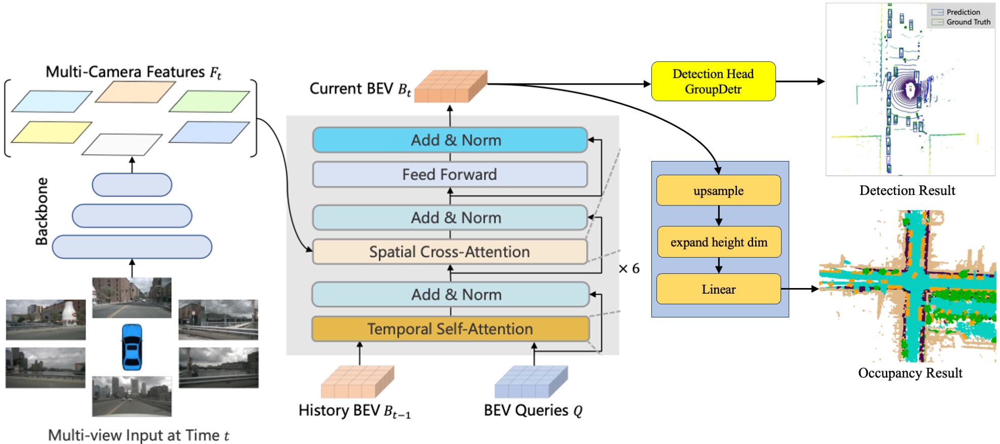

We have optimized Apollo-vision-Net as follows, significantly improving object detection, occupancy prediction scores and model performance:

- Image backbone: Replace ResNet-50 with DLA-34 pre-trained on depth estimation data (Toyota DDAD15M), reducing model complexity while improving performance
- Image neck: Replace single-scale FPN network with SecondFPN network, improving overall model performance
- Detection head: Replace DETR with GroupDETR, significantly improving object detection performance without increasing time consumption
- OCC head: Use low-resolution BEV queries (50×50) in Transformer encoder part, then upsample to high resolution (200×200) in OCC head, greatly improving model performance
- OCC loss: Increase OCC focal loss weight from 1.0 to 10.0, introduce affinity loss and lovasz-softmax loss, significantly improving OCC detection performance

### Quantitative Results

On the Nuscenes dataset, Apollo-vision-Net object detection mAP score surpasses bevformer-tiny (2022 ECCV) by _6.74%_, and surpasses OccNet-R50 (2023 ICCV) by _2.39%_

|                            | Object Detection mAP (val dataset) | Occupancy Prediction mIoU (OpenOcc val dataset) |
|:--------------------------:|:---------------------:|:------------------------------:|
| bevformer-tiny (2022 ECCV) | 25.2%                 | -                              |
| OccNet-R50 (2023 ICCV)     | -                     | 19.48%                         |
| Apollo-vision-Net (ours)   | 31.94% (↑ 6.74%)      | 21.87% (↑ 2.39%)               |

### Qualitative Results

#### Nuscenes Dataset Results

<table>
  <tr>
    <th colspan="3">Images</th>
    <th colspan="1">Object Detection Results</th>
    <th colspan="1">OCC Results</th>
  </tr>
  <tr>
    <td>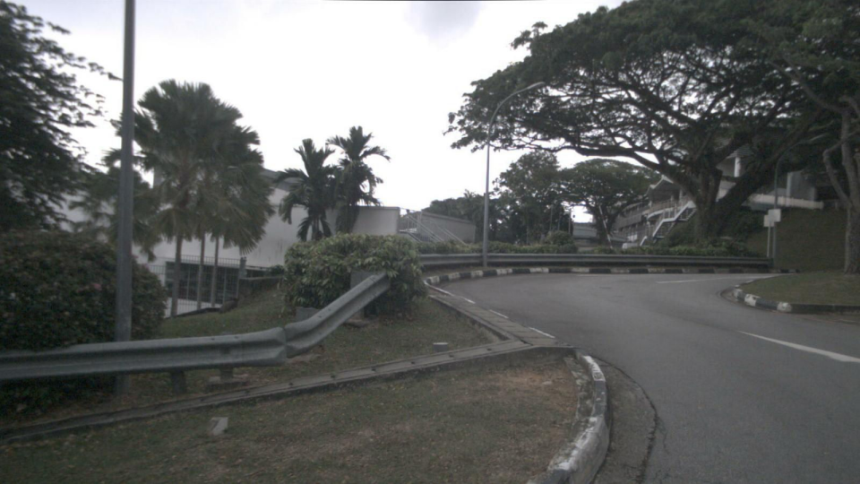</td>
    <td>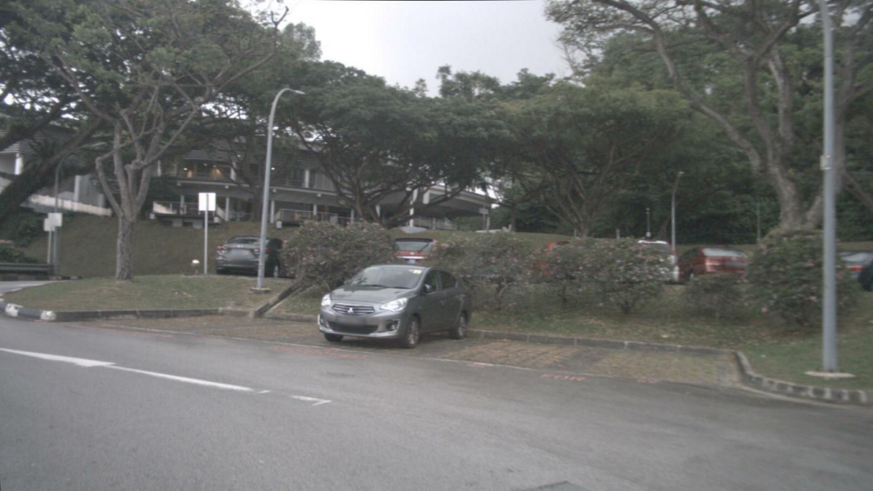</td>
    <td>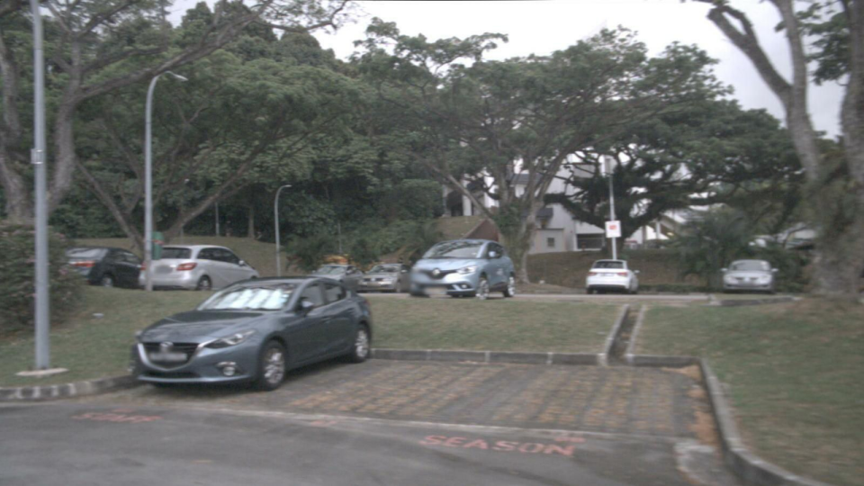</td>
    <td rowspan=2>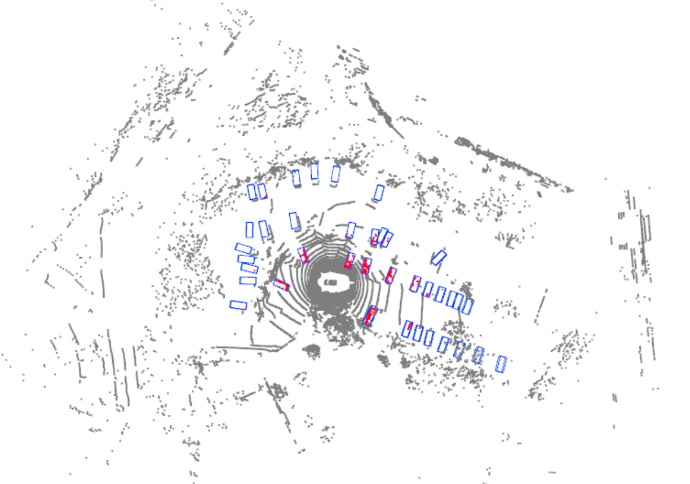</td>
    <td rowspan=2>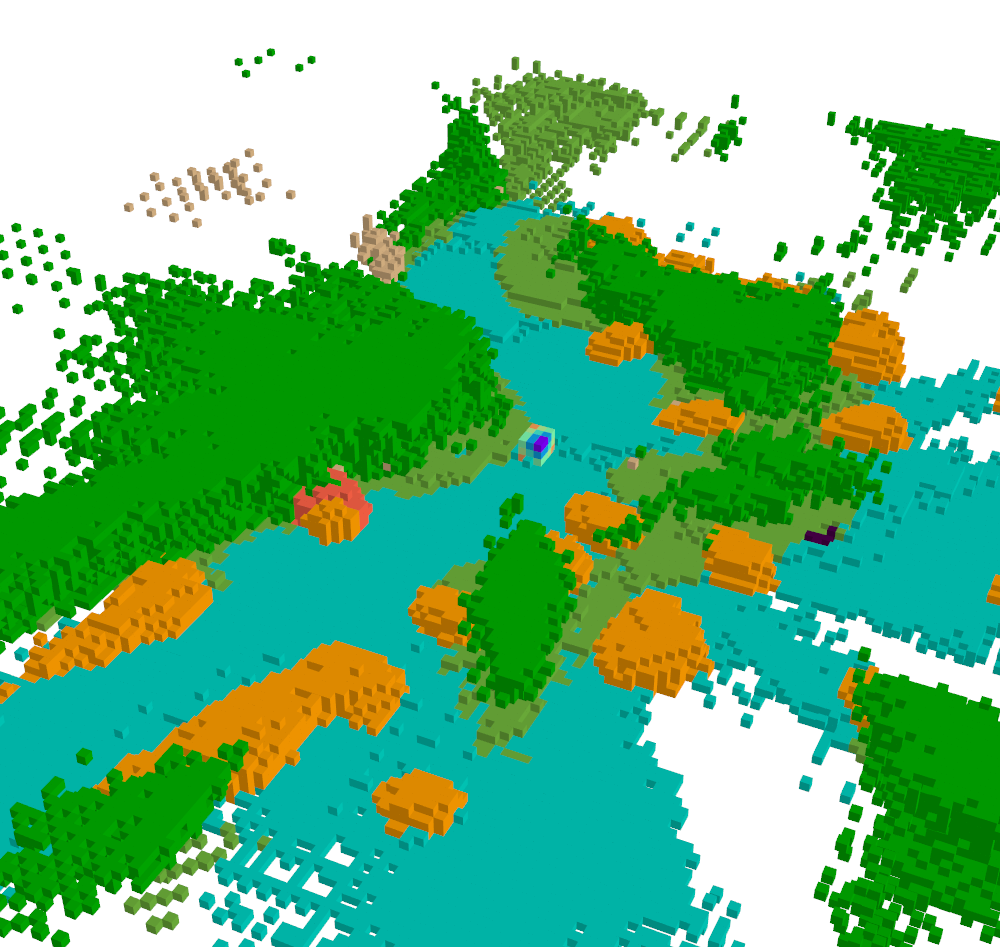</td>
  </tr>
  <tr>
    <td></td>
    <td>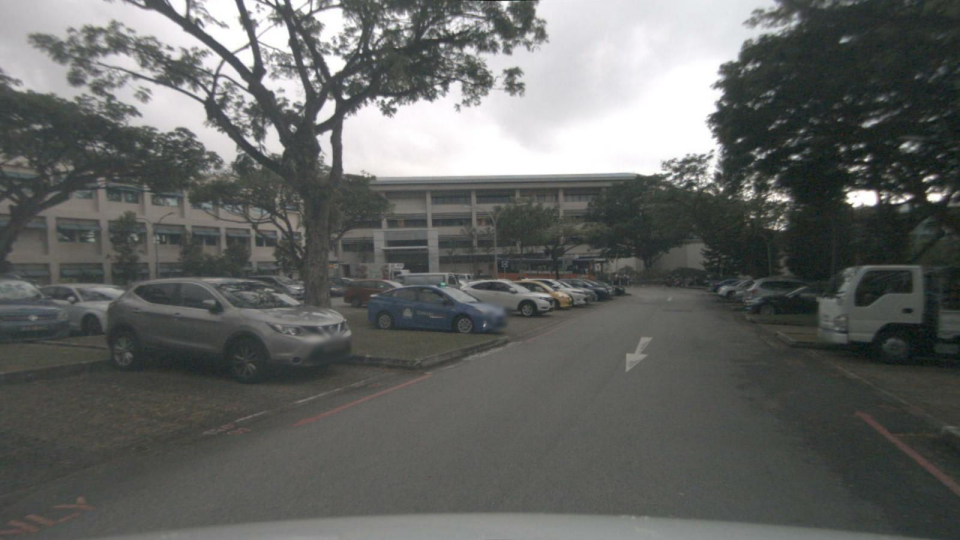</td>
    <td>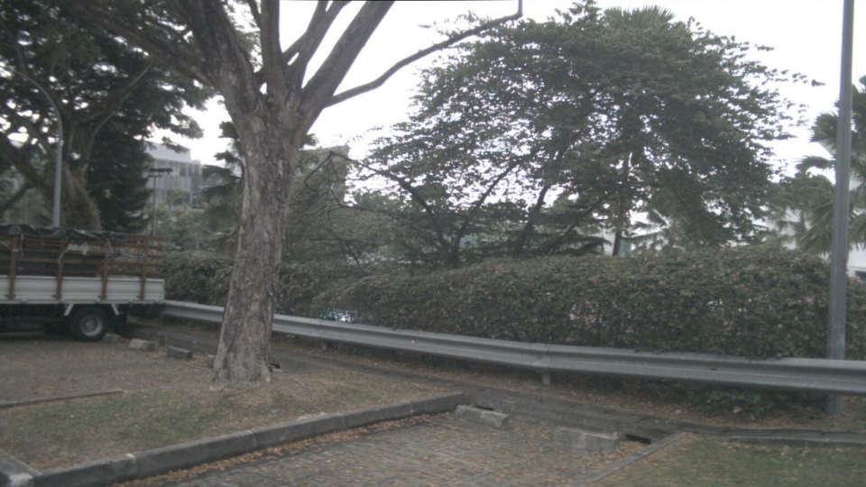</td>
  </tr>
</table>

#### Baidu Autonomous Driving Dataset Results

To further verify effectiveness, we trained Apollo-vision-Net using Baidu autonomous driving data while improving OCC resolution (0.5m×0.5m×0.5m → 0.2m×0.2m×0.2m). Apollo-vision-Net can provide accurate object detection and OCC detection in complex urban road scenarios.

[Results](https://apollo-docs.cdn.bcebos.com/apollo/perception-vision-obj-detection-occ-prediction-video-1.mp4)

## 3. Running Vision-Only Model in Apollo

### Operation Process

#### Enter Source Code Environment

First install Apollo environment according to the tutorial, then enter the container

```bash
bash docker/scripts/dev_start.sh
bash docker/scripts/dev_into.sh
```

Default ONNX files are located in modules/perception/data/models/bev_occ/

Build

```bash
bash apollo.sh build_opt_gpu
```

Open Dreamview

```bash
bash scripts/bootstrap.sh start_plus
```

#### Enter Package Management Environment

Enter container

```bash
aem start
aem enter
```

Install package

```bash
buildtool build --gpu -p park-generic --opt
```

Open Dreamview

```bash
aem bootstrap start --plus
```

#### Play Records

Download nuscenes records through the following links:

| id                               | link                                                                                                                                                                                                                                                                 |
|:--------------------------------:|:--------------------------------------------------------------------------------------------------------------------------------------------------------------------------------------------------------------------------------------------------------------------:|
| 6f83169d067343658251f72e1dd17dbc | http://apollo-perception.bj.bcebos.com/nuscenes_occ_records/6f83169d067343658251f72e1dd17dbc.record?authorization=bce-auth-v1%2FALTAKr8RyUUttStVHwGaOsvJyP%2F2024-12-02T08%3A12%3A56Z%2F-1%2Fhost%2F15500778f03ba45f19e6a7818b3af88952a739cbd53761f166d8bd542347821b |
| 2fc3753772e241f2ab2cd16a784cc680 | http://apollo-perception.bj.bcebos.com/nuscenes_occ_records/2fc3753772e241f2ab2cd16a784cc680.record?authorization=bce-auth-v1%2FALTAKr8RyUUttStVHwGaOsvJyP%2F2024-12-02T08%3A11%3A30Z%2F-1%2Fhost%2Fb7b99869a804ed08c7f6804d8b724e15aebc3e1c13fde45b18b61e459b1b7ae5 |
| bebf5f5b2a674631ab5c88fd1aa9e87a | http://apollo-perception.bj.bcebos.com/nuscenes_occ_records/bebf5f5b2a674631ab5c88fd1aa9e87a.record?authorization=bce-auth-v1%2FALTAKr8RyUUttStVHwGaOsvJyP%2F2024-12-02T08%3A13%3A18Z%2F-1%2Fhost%2F1c25a91e913f512b8f188dc6e54bd07ffcbb301e1be2d92a3cc7b686e1456d80 |

Select vehicle model - Nuscenes Occ (Use `aem profile use nuscenes_occ` in package management environment to select vehicle type)

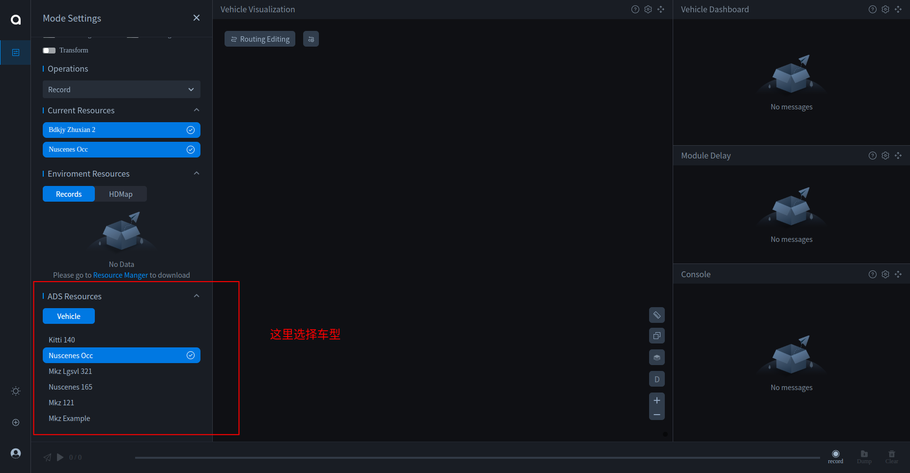

Start transform DAG file

```bash
mainboard -d /apollo/modules/transform/dag/static_transform.dag
```

Start DAG file

```bash
mainboard -d /apollo/modules/perception/camera_detection_occupancy/dag/camera_detection_occupancy_nus.dag
```

Wait for model serialization. When the terminal shows the following log, serialization is complete and you can proceed to the next steps

```bash
bevformer model init success from apollo_bevnet.onnx
```

Play record package

```bash
cyber_recorder play -f fcbccedd61424f1b85dcbf8f897f9754.record
```

Then you can see object detection results on DV


#### Visualize OCC Results

To view OCC results, follow these steps:

Set save_occ_result to true in occ_det_nus.pb.txt configuration file, and set saved path occ_save_path (default is data/occ_results)

Run the launch file, OCC results will be automatically saved in occ_save_path

Setup visualization environment outside the container

```bash
conda create -n occ_vis python=3.7 -y
conda activate occ
pip install numpy
pip install mayavi
```

Set occ_path in modules/perception/camera_detection_occupancy/tools/occ_vis.py to occ_save_path

Run visualization script

```bash
python modules/perception/camera_detection_occupancy/tools/occ_vis.py
```

OCC results will be displayed

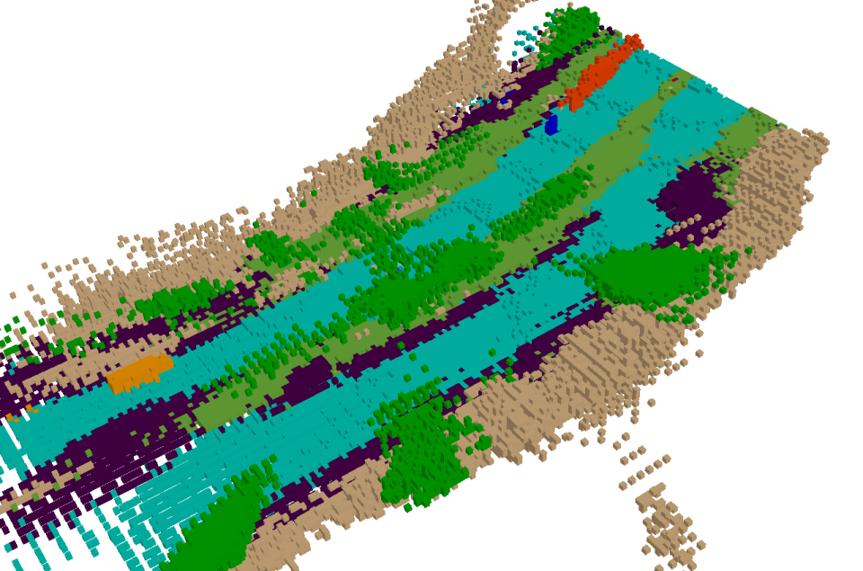

#### Parameter Introduction

<table>
  <thead>
    <tr>
      <th>Parameter</th>
      <th>Description</th>
      <th>Default Value</th>
    </tr>
  </thead>
  <tbody>
    <tr>
      <td>name</td>
      <td>Model name</td>
      <td>apollo_bevnet_onnx</td>
    </tr>
    <tr>
      <td>version</td>
      <td>Version</td>
      <td>-</td>
    </tr>
    <tr>
      <td>dataset</td>
      <td>Dataset</td>
      <td>nuScenes</td>
    </tr>
    <tr>
      <td>task_type</td>
      <td>Task type</td>
      <td>Detection3D</td>
    </tr>
    <tr>
      <td>sensor_type</td>
      <td>Sensor type</td>
      <td>Camera</td>
    </tr>
    <tr>
      <td>framework</td>
      <td>Framework</td>
      <td>Onnx</td>
    </tr>
    <tr>
      <td>proto_file weight_file</td>
      <td>ONNX file name</td>
      <td>apollo_bevnet.onnx</td>
    </tr>
    <tr>
      <td>inputs</td>
      <td>Model input names and shapes</td>
      <td>
        <pre>
          <code>
            inputs {
              name: "image"
              shape: 1
              shape: 6
              shape: 3
              shape: 480
              shape: 800
            }
            inputs {
              name: "prev_bev"
              shape: 2500
              shape: 1
              shape: 256
            }
            inputs {
              name: "use_prev_bev"
              shape: 1
            }
            inputs {
              name: "can_bus"
              shape: 18
            }
            inputs {
              name: "lidar2img"
              shape: 1
              shape: 6
              shape: 4
              shape: 4
            }
            inputs {
              name: "no_pad_image_shape"
              shape: 2
            }
          </code>
        </pre>
      </td>
    </tr>
    <tr>
      <td>outputs</td>
      <td>Model output names and shapes</td>
      <td>
        <pre>
          <code>
            outputs {
              name: "bev_embed"
              shape: 2500
              shape: 1
              shape: 256
            }
            outputs {
              name: "outputs_classes"
              shape: 6
              shape: 1
              shape: 900
              shape: 10
            }
            outputs {
              name: "outputs_coords"
              shape: 6
              shape: 1
              shape: 900
              shape: 8
            }
            outputs {
              name: "outputs_occupancy"
              shape: 1
              shape: 640000
              shape: 16
            }
          </code>
        </pre>
      </td>
    </tr>
    <tr>
      <td>class_names</td>
      <td>Object detection classes</td>
      <td>
        <pre>
          <code>
            class_names: "car"
            class_names: "truck"
            class_names: "construction_vehicle"
            class_names: "bus"
            class_names: "trailer"
            class_names: "barrier"
            class_names: "motorcycle"
            class_names: "bicycle"
            class_names: "pedestrian"
            class_names: "traffic_cone"
          </code>
        </pre>
    </tr>
    <tr>
      <td>resize</td>
      <td>Input image size</td>
      <td>
        <pre>
          <code>
            {
              width: 800
              height: 480
            }
          </code>
        </pre>
      </td>
    </tr>
    <tr>
      <td>normalize</td>
      <td>Image normalization parameters</td>
      <td>
        <pre>
          <code>
            {
              mean: 103.530
              mean: 116.280
              mean: 123.675
              std: 57.375
              std: 57.120
              std: 58.395
            }
          </code>
        </pre>
      </td>
    </tr>
    <tr>
      <td>score_threshold</td>
      <td>Object detection confidence threshold</td>
      <td>0.3</td>
    </tr>
    <tr>
      <td>img_scale</td>
      <td>Image scale ratio</td>
      <td>0.5</td>
    </tr>
    <tr>
      <td>no_pad_image_width no_pad_image_height</td>
      <td>Image size before padding</td>
      <td>450 800</td>
    </tr>
    <tr>
      <td>
        occ_xmin<br>
        occ_xmax<br>
        occ_ymin<br>
        occ_ymax<br>
        occ_zmin<br>
        occ_zmax
      </td>
      <td>OCC detection range</td>
      <td>
        <pre>
          <code>
            occ_xmin: -50
            occ_xmax: 50
            occ_ymin: -50
            occ_ymax: 50
            occ_zmin: -5.0
            occ_zmax: 3.0
          </code>
        </pre>
      </td>
    </tr>
    <tr>
      <td>voxel_size</td>
      <td>OCC voxel size</td>
      <td>0.5</td>
    </tr>
    <tr>
      <td>location_dist_threshold</td>
      <td>Distance difference threshold between consecutive frames</td>
      <td>10.0</td>
    </tr>
    <tr>
      <td>save_occ_result</td>
      <td>Whether to save OCC results</td>
      <td>false</td>
    </tr>
    <tr>
      <td>occ_save_path</td>
      <td>OCC results save path</td>
      <td>"data/occ_results"</td>
    </tr>
    <tr>
      <td>occ_threshold</td>
      <td>OCC threshold, voxels below threshold are considered empty</td>
      <td>0.25</td>
    </tr>
  </tbody>
</table>

## 4. Model Training Tutorial

This section introduces how to train Apollo vision-only model using nuscenes dataset

### Environment Setup

Create conda virtual environment

```bash
conda create -n occ python=3.7 -y
conda activate occ
```

Install pytorch following the [official tutorial](https://pytorch.org/)

```bash
conda install pytorch==1.10.0 torchvision==0.11.0 torchaudio==0.10.0 cudatoolkit=10.2 -c pytorch
```

Install mmcv-full

```bash
pip install mmcv-full==1.4.1
```

Install mmdet and mmsegmentation

```bash
pip install mmdet==2.19.0
pip install mmsegmentation==0.20.0
```

Install mmdetection3d

```bash
git clone https://github.com/open-mmlab/mmdetection3d.git
cd mmdetection3d
git checkout v0.18.1 # Other versions may not be compatible.
python setup.py develop
```

Install timm

```bash
pip install timm
```

Download code

```bash
git clone https://github.com/ApolloAuto/Apollo-Vision-Net
```

### Data Download

Download Nuscenes V1.0 dataset from [Nuscenes official website](https://www.nuscenes.org/download), file organization structure is as follows

```text
├── data/
│   ├── can_bus/
│   ├── nuscenes/
│   │   ├── maps/
│   │   ├── samples/
│   │   ├── sweeps/
│   │   ├── v1.0-test
│   │   ├── v1.0-trainval
```

Generate 3D object detection pkl files data/nuscenes/nuscenes_infos_temporal_{train,val}.pkl

```bash
python tools/create_data.py nuscenes --root-path ./data/nuscenes --out-dir ./data/nuscenes --extra-tag nuscenes --version v1.0 --canbus ./data
```

Prepare 3D Occupancy data, dataset details refer to [Scene as Occupancy](https://arxiv.org/abs/2306.02851)

Download data and place in data folder

| Version             | voxel size | Google Drive                                                                                    | Baidu Cloud                                                           | Size |
|:-------------------:|:----------:|:-----------------------------------------------------------------------------------------------:|:---------------------------------------------------------------------:|:----:|
| occ_gt_release_v1_0 | 0.5m       | [train_val](https://drive.google.com/file/d/1Ds7NY475sS13A9KErr-MHlOBEY1oFi76/view?usp=sharing) | [train_val](https://pan.baidu.com/s/1O4iCdY7DOWts9KAIuRNT2A?pwd=hgk2) | ~15G |

Extract files

```bash
tar -zxvf occ_gt_release_v1_0.tar.gz
```

File format is as follows

```text
├── data/
│   ├── occ_gt_release_v1_0/
│   │   ├── train/
│   │   ├── val/
│   │   ├── occ_gt_train.json
│   │   ├── occ_gt_val.json
```

Merge object detection and occupancy pkl files, generate data/occ_gt_release_v1_0/nuscenes_infos_temporal_{train,val}_occ_gt.pkl, download links for new pkl files are provided below

```bash
python tools/create_data_with_occ.py
```

| Version             | Google Drive                                                                                                                                                                           | Baidu Cloud                                                                                                                        |
|:-------------------:|:--------------------------------------------------------------------------------------------------------------------------------------------------------------------------------------:|:----------------------------------------------------------------------------------------------------------------------------------:|
| occ_gt_release_v1_0 | [train](https://drive.google.com/file/d/1iaJk40ieqoYDd_VjZALDbnRJHGpQ3Ybx/view?usp=sharing)\|[val](https://drive.google.com/file/d/1lE9h8t5dFVdZ9dBg01jTg7GeiAWIeytZ/view?usp=sharing) | [train](https://pan.baidu.com/s/1vzFGs6g9g7f_08QrItfVGw?pwd=djsh)\|[val](https://pan.baidu.com/s/1flOglbPh5BDb0i8QfpcIbQ?pwd=ntys) |

Final file organization structure is as follows

```text
├── data/
│   ├── can_bus/
│   ├── nuscenes/
│   │   ├── maps/
│   │   ├── samples/
│   │   ├── sweeps/
│   │   ├── v1.0-test
│   │   ├── v1.0-trainval
│   │   ├── nuscenes_infos_temporal_train.pkl
│   │   ├── nuscenes_infos_temporal_val.pkl
│   ├── occ_gt_release_v1_0/
│   │   ├── train/
│   │   ├── val/
│   │   ├── occ_gt_train.json
│   │   ├── occ_gt_val.json
│   │   ├── nuscenes_infos_temporal_train_occ_gt.pkl
│   │   ├── nuscenes_infos_temporal_val_occ_gt.pkl
```

### Model Training

Training command

```bash
./tools/dist_train.sh ./projects/configs/bevformer/bev_tiny_det_occ_apollo.py 8
```

### Model Evaluation

```bash
./tools/dist_test.sh ./projects/configs/bevformer/bev_tiny_det_occ_apollo.py ./path/to/ckpts.pth 4
```

### Visualization

Install mayavi according to the [tutorial](https://docs.enthought.com/mayavi/mayavi/installation.html)

Visualize OCC results

```bash
python tools/occ_visualization/visualize_occ_gt.py
```

## 5. Model Deployment Tutorial

This section introduces how to export trained models to ONNX format and deploy to Apollo project

### Environment Setup

Create conda virtual environment

```bash
conda create -n apollo-onnx python=3.7 -y
conda activate apollo-onnx
```

Download code

```bash
git clone https://github.com/ApolloAuto/Apollo-Vision-Net-Deployment.git
cd Apollo-Vision-Net-Deployment
PROJECT_DIR=$(pwd)
```

Prepare nuScenes dataset

```bash
cd ${PROJECT_DIR}/data
ln -s /path/to/nuscenes nuscenes
ln -s /path/to/can_bus can_bus
```

File organization is as follows

```text
${PROJECT_DIR}/data/.
├── can_bus
│   ├── scene-0001_meta.json
│   ├── scene-0001_ms_imu.json
│   ├── scene-0001_pose.json
│   └── ...
└── nuscenes
    ├── maps
    ├── samples
    ├── sweeps
    └── v1.0-trainval
```

Install `CUDA-11.6/cuDNN-8.6.0/TensorRT-8.5.1.7`

Install PyTorch and TorchVision

```bash
pip install torch==1.12.1+cu116 torchvision==0.13.1+cu116 torchaudio==0.12.1+cu116 --extra-index-url https://download.pytorch.org/whl/cu116
```

Install MMCV-full

```bash
git clone https://github.com/open-mmlab/mmcv.git
cd mmcv
git checkout v1.5.0
pip install -r requirements/optional.txt
MMCV_WITH_OPS=1 pip install -e .
```

Install MMDetection

```bash
git clone https://github.com/open-mmlab/mmdetection.git
cd mmdetection
git checkout v2.25.1
pip install -v -e .# "-v" means verbose, or more output# "-e" means installing a project in editable mode,# thus any local modifications made to the code will take effect without reinstallation.
```

Install MMDeploy

```bash
git clone git@github.com:open-mmlab/mmdeploy.git
cd mmdeploy
git checkout v0.10.0

git clone git@github.com:NVIDIA/cub.git third_party/cub
cd third_party/cub
git checkout c3cceac115

# go back to third_party directory and git clone pybind11cd ..
git clone git@github.com:pybind/pybind11.git pybind11
cd pybind11
git checkout 70a58c5
```

Compile Tensorrt (ensure cmake version >= 3.14.0 gcc version >= 7)

```bash
export MMDEPLOY_DIR=/the/root/path/of/MMDeploy
export TENSORRT_DIR=/the/path/of/tensorrt
export CUDNN_DIR=/the/path/of/cuda

export LD_LIBRARY_PATH=$TENSORRT_DIR/lib:$LD_LIBRARY_PATH
export LD_LIBRARY_PATH=$CUDNN_DIR/lib64:$LD_LIBRARY_PATH
cd ${MMDEPLOY_DIR}
mkdir -p build
cd build
cmake -DCMAKE_CXX_COMPILER=g++-7 -DMMDEPLOY_TARGET_BACKENDS=trt -DTENSORRT_DIR=${TENSORRT_DIR} -DCUDNN_DIR=${CUDNN_DIR} ..
make -j$(nproc)
make install
```

Install MMDeploy

```bash
cd ${MMDEPLOY_DIR}
pip install -v -e .# "-v" means verbose, or more output# "-e" means installing a project in editable mode,# thus any local modifications made to the code will take effect without reinstallation.
```

Install dependencies

```bash
cd ${PROJECT_DIR}
pip install -r requirements.txt
```

【Optional】Install Custom TensorRT Plugins (CUDA>=11.4, SM version>=7.5)

```bash
cd ${PROJECT_DIR}/TensorRT/build
cmake .. -DCMAKE_TENSORRT_PATH=/path/to/TensorRT
make -j$(nproc)
make install
```

Build and install MMDetection3D operators

```bash
cd ${PROJECT_DIR}/third_party/bev_mmdet3d
python setup.py build develop
```

### Generate ONNX File

Run the following command, provide pth file to generate ONNX file

```bash
python tools/pth2onnx.py configs/apollo_bev/bev_tiny_det_occ_apollo_trt.py path_pth --opset_version 13 --cuda
```

### Apollo Deployment

Install Apollo environment according to the tutorial, then enter container

```bash
bash docker/scripts/dev_into.sh
```

To replace with your own trained ONNX file, need to replace the ONNX file in the directory

```bash
sudo rm -rf modules/perception/data/models/apollo_bevnet_onnx/*
sudo cp your-own-onnx modules/perception/data/models/apollo_bevnet_onnx/
```

Then follow the tutorial in Section 3 to run the vision-only model