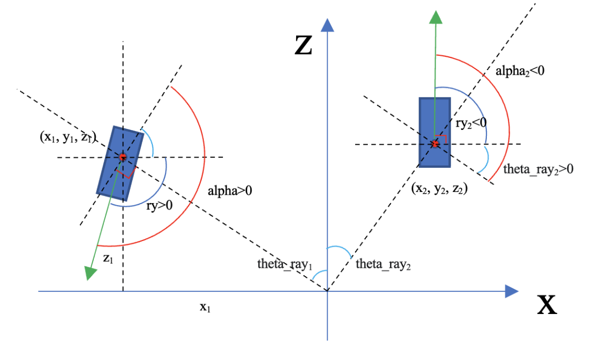

自Apollo9.0起，为大家带来单目两阶段视觉检测器 yolox+yolo3d，相比于历史版本中的单目视觉 yolo 模型，本次在实现思路、训练代码、模型部署方面做了不少探索与优化工作。为了能让大家基于该框架更快更好地进行算法的二次开发，本文将以 yolox 模型为例子，向用户介绍如何在新版本 Apollo 中新增一款视觉检测模型进行 2D 目标检测任务。

## 本文主要内容

1. 训练数据准备

2. 训练代码修改及模型迭代

3. 感知组件介绍

4. 模型部署及前后处理模块的实现

5. 效果调试

> 说明：本文涉及内容均在 ubuntu18.0 + nvidia3090 环境下开发，当前 Apollo 可支持 10、20、30、40 系列显卡，有关硬件选型、显卡驱动安装等内容请自行检索。

## 1. 训练数据准备

### 数据集介绍

KITTI 数据集由德国卡尔斯鲁厄理工学院和丰田工业大学芝加哥分校联合赞助的用于自动驾驶领域研究的数据集，该数据集提供了光流、物体检测、深度估计等多种任务的Benchmark。后续 Apollo 开源出的训练代码都会以开源数据为基础训练数据，后续用户适配自己的数据即可快速迭代。

### KITTI数据下载

我们提供了基于 KITTI 数据的可训练代码，训练时涉及数据转化的部分我们也提供了相关转化工具帮助大家快速适配，尽可能减少开发者在后续开发过程中的繁琐操作。

[KITTI数据官网链接](https://www.cvlibs.net/datasets/kitti/)，下载视觉相关数据并解压。


我们一般把数据存放为下列形式，也是平时大家常用的一般形式：

```bash
├── data
│   └── KITTI
│       ├── calib       # 标定文件
│       ├── images_2    # 图片数据
│       └── labels_2    # 标注数据
```

### 数据集疑难点解析

#### 坐标系

在 KITTI 数据集中，视觉数据坐标系为"右下前"，也就是 x 轴正方向向右，y 轴正方向向下，z 轴正方向向前。如果是自己标注的数据，需要注意要将坐标由 lidar 坐标系转化到 camera 坐标系下。


#### 目标类别

KITTI 数据中常见 8 种数据类别为：Car、Van、Truck、Pedestrian、Person_sitting、Cyclist、Tram、Misc ，后续开发者可根据自主数据进行标签修改。

#### 数据标注格式

KITTI 类型数据如下所示，一个目标的标注结果用 15 个数值来描述：

```bash
Car 0.00 0 1.85 387.63 181.54 423.81 203.12 1.67 1.87 3.69 -16.53 2.39 58.49 1.57
```

| 数据类型       | 含义                                                  | kitti索引 | kitti位置 |
|:----------:|:---------------------------------------------------:| ------- |:-------:|
| type       | 目标类型                                                | 0       | 1       |
| truncated  | 截断程度，指处于图像边缘的目标因拍摄补全导致的像素缺失                         | 1       | 2       |
| occluded   | 遮挡程度，指多个障碍物因在直线方面上存在重叠导致的遮挡                         | 2       | 3       |
| alpha      | 观测角度：车辆所在位置到相机中心连线与x轴夹角【目标在主车的什么方向】【正前方为-PI/2，向右为0】 | 3       | 4       |
| 3dbox-h    | 高                                                   | 8       | 9       |
| 3dbox-w    | 宽                                                   | 9       | 10      |
| 3dbox-l    | 长                                                   | 10      | 11      |
| location-x | 中心点位置x，车身向右为正                                       | 11      | 12      |
| location-y | y，车身向下为正【平面假设可认为0】                                  | 12      | 13      |
| location-z | z，车身向前为正                                            | 13      | 14      |
| ry         | 旋转角度：目标车辆朝向与主车x轴方向的夹角【目标在朝哪里走】【正前方为-PI/2，向右为0】      | 14      | 15      |

其中，对于 ry 及 alpha 两个角度的理解可参考如下图所示解析：

ry 描述的是"目标车辆朝向与主车x轴方向的夹角"，也就是说在主车直线行驶过程中，左右两侧正直行驶的车辆他们的ry是相同的值 -PI/2。贴一个鸟瞰图感受一下，左侧 1 车为向左后行驶，alpha>0 且 alpha 绝对值大于 ry；右侧 2 号车向正前方行驶，alpha<0 且 alpha 绝对值大于 ry，思考一下这是为什么？



## 2. 视觉感知组件介绍

视觉感知当前包含三种算法组件：camera_detection_bev、camera_detection_multi_stage 以及 camera_detection_single_stage。

### 感知组件概览

当前感知模块组件如下列所示：

| 组件名称                          | 含义                         |
| ----------------------------- | -------------------------- |
| camera_detection_bev          | 感知bev算法检测器                 |
| camera_detection_multi_stage  | 感知端到端算法检测器                 |
| camera_detection_single_stage | 感知多阶段算法检测器                 |
| camera_detection_occupancy    | 感知bev+occ算法检测器             |
| camera_location_estimation    | 相机检测对象的姿态和位置信息             |
| camera_location_refinement    | 调优相机检测对象的姿态和位置信息           |
| camera_tracking               | 基于camera feature的目标特征匹配跟踪  |
| msg_adapter【通用模块】             | 将感知输出消息转化后发送到cyber_monitor |

### 感知组件启动

我们通过下列路径下launch文件启动 yolox3d 算法：

```bash
modules/perception/launch/perception_camera_multi_stage.launch
```

该 launch 文件中包含了该算法所有需要执行的任务步骤，以 dag 形式呈现：

```bash
# 将camera检测结果输出到 /apollo/perception/obstacles中，用于检测结果消息转化及发布
<dag_conf>/apollo/modules/perception/msg_adapter/dag/msg_adapter.dag</dag_conf>
# yolox3d两阶段检测
<dag_conf>/apollo/modules/perception/camera_detection_multi_stage/dag/camera_detection_multi_stage_yolox3d.dag</dag_conf>
# 基于几何方法的深度估计
<dag_conf>/apollo/modules/perception/camera_location_estimation/dag/camera_location_estimation.dag</dag_conf>
<dag_conf>/apollo/modules/perception/camera_location_refinement/dag/camera_location_refinement.dag</dag_conf>
# 基于camera feature的目标特征匹配跟踪
<dag_conf>/apollo/modules/perception/camera_tracking/dag/camera_tracking.dag</dag_conf>
```

对于开发者来说，如果你研究的是 2D 视觉算法，想要在 2D 检测上基于自由数据进一步调优检测效果，可以在 perception_camera_multi_stage 组件中替换 yolox 模型来进行自主迭代；如果你研究的是 3D 端到端感知算法，可以在 camera_detection_single_stage 组件中进行开发，如 SMOKE 等现有算法。

### 添加一个新2D目标检测算法

camera_detection_multi_stage组件如下所示，如果要添加一个新的检测算法，/conf、/dag、/data、/detector 几个文件夹是需要修改的，你可以参考 yolox3d 的实现方式仿照着修改：


```bash
├── camera_detection_multi_stage // camera detect 2d module
    ├── conf                     // module configuration files
    ├── dag                      // dag files
    ├── data                     // model params
    ├── detector                 // main part for detector
    │   ├── yolox3d              // Yolox3dObstacleDetector
    │   └── ...                  // You can use your own detector！
    ├── interface                // function interface folder
    ├── proto                    // proto files
    ├── camera_detection_multi_stage_component.cc // component interface
    ├── camera_detection_multi_stage_component.h
    ├── cyberfile.xml            // package management profile
    ├── README.md
    └── BUILD
```

对应文件夹作用简单概括如下：

| 组件名称      | 含义                                 |
| --------- | ---------------------------------- |
| /dag      | 设置conf文件路径                         |
| /conf     | 设置camera_name、检测算法名称、配置文件、图片消息输入通道 |
| /data     | 检测算法所有使用到的参数配置信息，可在proto中修改        |
| /detector | 检测算法前后处理及推理实现                      |

## 3. 训练代码修改及模型迭代

### 感知多阶段任务介绍

多阶段任务流程如下所示，stage1 跟 stage2 分别使用两个模型完成。在第一阶段中我们通过一个 2D 检测模型框出前景目标人与车，然后在 stage2 中单独对这两个目标进行 3D 姿态回归。下面我将以 stage1 任务为例，介绍如何新增一款视觉检测模型进行 2D 目标检测任务。


### 模型选型

2D 目标检测算法如今已经发展地特别成熟，2023 年比较亮眼的如 yolov8、RT-DETR 等赚足了开发者的眼球。这些算法在目标检测效果及部署后模型推理实时性上都做了较多优化。然而考虑到 apollo 代码本身开源协议的要求，我们在单目视觉多阶段任务 camera_detection_multi_stage 中最终选用了 yolox 算法，该算法通过路测数据训练后也有不错的效果，此处便以 yolox 模型举例说明。


让我们通过训练 yolox 模型来添加一个新检测器到这一组件中吧！

### 代码下载

适配 Apollo 的 yolox 训练代码可在 [ApolloAuto开源仓库](https://github.com/ApolloAuto) 中找到：

```bash
git clone https://github.com/ApolloAuto/apollo-model-yolox.git
```

### 训练代码修改

因为本身 Apollo 在 camera_tracking 组件中需要获取卷积后的部分特征图用于后续 tracking 模块，所以我们需要对原 yolox 代码进行一定修改，使其在模型推理时能输出网络的一部分中间结果，相关修改内容可以在下列文件中找到：

- yolox/models/darknet.py 中前向传播时返回 outputs["dark2"] feature map

- yolox/models/yolo_pafpn.py 中前向传播时返回 apollo_feature

- yolox/models/yolox.py 中前向传播时同时返回 apollo_feature

修改后 yolox-s 模型输入输出维度可视化如下：


### 模型迭代训练

当前开源训练代码适配了自主标注数据，适配 KITTI 数据的方法可以参考 [README 文档](https://github.com/ApolloAuto/apollo-model-yolox/blob/main/README.md)。

具体来说以下部分需要进行修改：

- change [yolox_voc_s](https://github.com/ApolloAuto/apollo-model-yolox/blob/main/exps/example/yolox_voc/yolox_voc_s.py) file configs.
  
  - class number: 8 to 6.
  
  - data_dir=os.path.join(get_yolox_datadir(), "CUSTOMER") change CUSTOMER to KITTI folder.

- change [voc_classes.py](https://github.com/ApolloAuto/apollo-model-yolox/blob/main/yolox/data/datasets/voc_classes.py) to KITTI class.

- modify [yolox_voc_s.py](https://github.com/ApolloAuto/apollo-model-yolox/blob/main/exps/example/yolox_voc/yolox_voc_s.py) todo items.

- modify [voc.py](https://github.com/ApolloAuto/apollo-model-yolox/blob/main/yolox/data/datasets/voc.py) line 119 change jpg to png.
  
  - self.\_imgpath = os.path.join("%s", "JPEGImages", "%s.jpg") # change jpg to png.

修改完毕后执行下列指令进行训练：

单卡 batchsize16 进行训练：

```bash
python3 tools/train.py -f exps/example/yolox_voc/yolox_voc_s.py -d 0 -b 16
```

### 模型导出

为了让大家更加方便地部署模型，Apollo 添加了 ONNX 模型推理框架，对于非 transformer 类型的模型来说，当前 Apollo 镜像中 tensorrt 能够直接序列化出模型推理引擎，自主编写plugin进行模型序列化的方法我们后续会以 bevformer 类型模型为例为大家讲解。

回到我们的训练代码，yolox 在训练代码 tools 路径有模型导出工具 export_onnx.py，模型导出后使用 Netron 工具可视化 yolox-s 模型如下，可以看到 yolox原网络输出结果『predict』以及 apollo_feature 特征数据『feature』成功导出：


使用 trtexec 序列化一下看是否可解析：

```bash
trtexec --onnx=yolox3d_onnx_model_2d.onnx --explicitBatch --saveEngine=yolo2d_test.engine
```


说明模型可直接使用 tensorrt7.2 版本直接进行序列化，不存在不支持的算子，可直接部署使用。

## 4. 模型部署及前后处理模块的实现

模型部署是最为重要的一环，如何将一个onnx类型模型真正地在检测模块中使用起来是最为关键的一步，我们将使用上面训练代码导出的onnx模型来进行推理。

### 感知算法参数配置

我们在使用时，推理框架可选择 Onnx、PyTorch；在输出结果上尺寸与导出模型需要是一一对应的关系；其他超参数配置可根据代码需要酌情添加。

模型配置文件路径：modules/perception/camera_detection_multi_stage/data/yolox3d.pb.txt。


### 创建算法组件：Yolox3DObstacleDetector

通过继承 BaseObstacleDetector 基类新添加一个自己的检测器 Yolox3DObstacleDetector。在这一检测器中我们必须要实现两个函数：

- Init() // 初始化函数加载了 /data 中配置参数，调用 ONNX 推理框架初始化模型输入输出 blob 地址，

- Detect() // 维护CameraFrame数据，对接收到的图片进行预处理、模型推理、数据后处理，把障碍物信息添加到frame->detected_objects中。

### 完善算法初始化函数：Init()

这里 config_file、model_info 分别对应 /conf 文件路径及 /data 文件路径中的模型配置参数，都填写正确后会调用推理框架初始化函数初始化推理框架。此处我们选择 ONNX 框架，其他模型也可选择 PyTorch 框架~

```bash
if (!InitNetwork(model_info, model_path)) {
AERROR << "Init network failed!";
return false;
}
net_->Infer();
```

### 完善检测算法接口: Detect()

在`modules/perception/camera_detection_multi_stage/camera_detection_multi_stage_component.cc`中通过该接口调用整个算法，所以整体 2D 及 3D 检测 pipline 需要在此函数中完成。


- 包含数据预处理

- 模型推理

- 结果后处理

### 图片预处理: Preprocess()

数据在送入网络推理之前需要保证进入网络的数据与训练代码中保持一致，yolox 数据预处理部分如下，我们仿照下面内容完成 c++ 图片预处理即可：

```bash
def preproc(img, input_size, swap=(2, 0, 1)):
    if len(img.shape) == 3:
        padded_img = np.ones((input_size[0], input_size[1], 3), dtype=np.uint8) * 114
    else:
        padded_img = np.ones(input_size, dtype=np.uint8) * 114
    r = min(input_size[0] / img.shape[0], input_size[1] / img.shape[1])
    resized_img = cv2.resize(
        img,
        (int(img.shape[1] * r), int(img.shape[0] * r)),
        interpolation=cv2.INTER_LINEAR,
    ).astype(np.uint8)
    padded_img[: int(img.shape[0] * r), : int(img.shape[1] * r)] = resized_img

    padded_img = padded_img.transpose(swap)
    padded_img = np.ascontiguousarray(padded_img, dtype=np.float32)
    return padded_img, r
```


### 图片后处理 postprocess()

yolo 系列后处理部分大同小异，此处可以参考 YOLOX 给出的部署示例代码进行实现，路径在训练代码中：demo/TensorRT/cpp/yolox.cpp。

## 5. 感知离线效果调试

offline_camera_detection 是离线测试感知检测算法的小工具，可用于方便调试检测算法正确性。

- 路径：modules/perception/tools/offline_camera_detection/offline_camera_detection.cc
- 配置：修改检测算法


设置好检测算法后执行以下指令即可完成对下列图片的识别【示例】

```bash
./apollo/bazel-bin/modules/perception/tools/offline_camera_detection/offline_camera_detection
```


