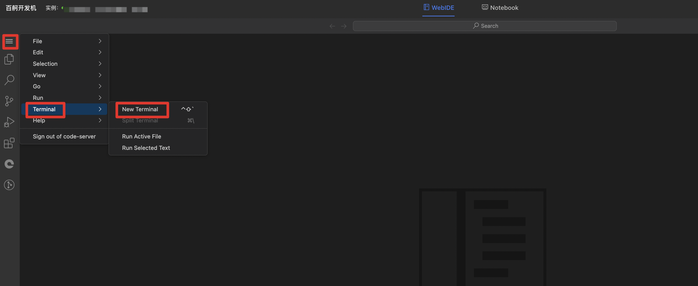

# 使用说明
## 创建与登录开发机
根据部署环境要求成功创建开发机后，点击登录开发机，进入开发机webIDE，并打开VScode中的terminal


* 代码保存路径：/root/Apollo-Vision-Net-Deployment
* 数据默认挂载路径：/mnt/pfs/nuscenes_data/bev_data/nuscenes

## 数据集挂载
开发机内数据集挂载(建议与Apollo-BEV-Train开发机pfs磁盘共用，不共用需要重新处理数据集)
```
cd ~/Apollo-Vision-Net-Deployment/data

# 创建符号链接（注意使用正确的 -s 参数）
ln -s /mnt/pfs/nuscenes_data/bev_data/nuscenes nuscenes
ln -s /mnt/pfs/nuscenes_data/bev_data/occ_gt_release_v1_0 occ_gt_release_v1_0
ln -s /mnt/pfs/nuscenes_data/bev_data/can_bus can_bus
```


## 模型导出
### 生成onnx文件
运行下面的命令，提供pth文件，生成onnx文件

```
cd ~/Apollo-Vision-Net-Deployment/ 
python tools/pth2onnx.py configs/apollo_bev/bev_tiny_det_occ_apollo_trt.py bos路径/epoch_*.pth --opset_version 13 --cuda
#使用4090卡导出onnx模型需要去掉--cuda参数
```