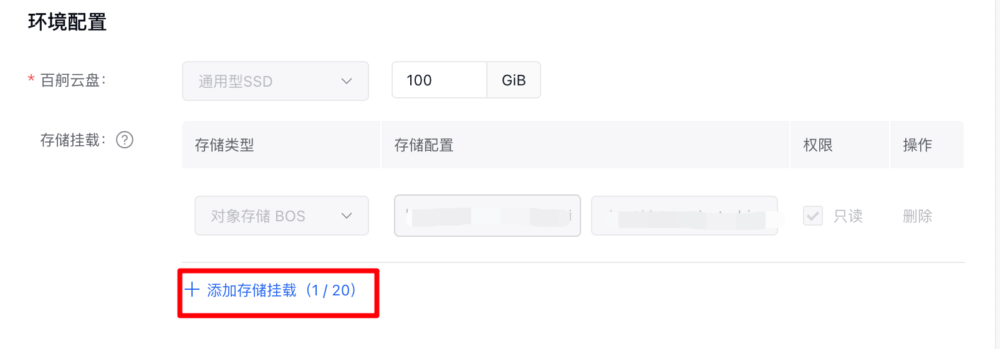

## 使用说明

### 创建与登录开发机

根据部署环境要求成功创建开发机后：
点击登录开发机，进入开发机webIDE，打开VScode中的terminal

代码保存路径：`/root/Apollo-Vision-Net`
数据默认挂载路径：`/mnt/dataset/nuscenes_data`

### 数据集处理

#### 存储挂载配置

**基础配置：**
默认在BOS挂载Nuscenes数据集


挂载PFS或CFS

在创建或更新开发机时，在存储挂载配置中选择集群对应的 PFS 或 CFS 存储，并设置自定义挂载路径（示例路径：/mnt/pfs/nuscenes_data）可以在创建或者更新开发机配置时，选择存储挂载，选择集群对应的PFS或者CFS，可自定义挂载路径



#### 数据集迁移

```bash
# 创建数据集目录结构
cd /mnt/pfs/nuscenes_data
mkdir -p bev_data/nuscenes

# 从BOS迁移数据集至PFS文件
cp -rv bos挂载路径/apollo_nuscenes_bev_data/nuscenes/* /mnt/pfs/nuscenes_data/bev_data/nuscenes/
cp -rv bos挂载路径/apollo_nuscenes_bev_data/can_bus/* /mnt/pfs/nuscenes_data/bev_data/
cp -rv bos挂载路径/apollo_nuscenes_bev_data/occ_gt_release_v1_0/* /mnt/pfs/nuscenes_data/bev_data/
```

#### 数据集解压与整理

**Nuscenes数据集处理：**
```bash
cd /mnt/pfs/nuscenes_data/bev_data/nuscenes
bash tar_files.sh  # 运行指令解压数据集
```

**解压后目录结构：**
```
nuscenes/
├── maps/                           # 地图
├── samples/                        # 数据集
├── sweeps/                         # 数据集
├── v1.0-trainval/                  # 数据集
├── tar_files.sh                    # 解压指令
├── nuscenes_infos_temporal_train_occ_gt.pkl
├── nuscenes_infos_temporal_val_occ_gt.pkl
├── v1.0-trainval01_blobs.tgz //数据集压缩包
├── v1.0-trainval02_blobs.tgz //数据集压缩包
├── v1.0-trainval03_blobs.tgz //数据集压缩包
├── v1.0-trainval04_blobs.tgz //数据集压缩包
├── v1.0-trainval05_blobs.tgz //数据集压缩包
├── v1.0-trainval06_blobs.tgz //数据集压缩包
├── v1.0-trainval07_blobs.tgz //数据集压缩包
├── v1.0-trainval08_blobs.tgz //数据集压缩包
├── v1.0-trainval09_blobs.tgz //数据集压缩包
└── v1.0-trainval10_blobs.tgz //数据集压缩包
```

**occ_gt_release_v1_0数据集处理：**
解压occ_gt_release_v1_0压缩包
```bash
cd /mnt/pfs/nuscenes_data/bev_data
tar -zxvf occ_gt_release_v1_0.tar.gz
```
解压后
```
occ_gt_release_v1_0
├── occ_gt_train.json
├── occ_gt_val.json
├── train
└── val
```
**复制目标检测和occupancy的pkl文件到occ_gt_release_v1_0：**
```
bash
cp /mnt/pfs/nuscenes_data/bev_data/nuscenes/*.pkl /mnt/pfs/nuscenes_data/bev_data/occ_gt_release_v1_0/
```
**最终目录结构**
```
/mnt/pfs/nuscenes_data/bev_data# tree occ_gt_release_v1_0 -L 1
occ_gt_release_v1_0
├── nuscenes_infos_temporal_train_occ_gt.pkl
├── nuscenes_infos_temporal_val_occ_gt.pkl
├── occ_gt_train.json
├── occ_gt_val.json
├── train
└── val
```

**CAN-Bus数据处理：**
```bash
cd /mnt/pfs/nuscenes_data/bev_data
tar -zxvf can_bus.tar.gz
```
**数据集结构规范**
```
├── data/
│   ├── can_bus/
│   ├── nuscenes/
│   │   ├── maps/
│   │   ├── samples/
│   │   ├── sweeps/
│   │   ├── v1.0-test
│   │   ├── v1.0-trainval
│   │   ├── nuscenes_infos_temporal_train.pkl
│   │   ├── nuscenes_infos_temporal_val.pkl
│   ├── occ_gt_release_v1_0/
│   │   ├── train/
│   │   ├── val/
│   │   ├── occ_gt_train.json
│   │   ├── occ_gt_val.json
│   │   ├── nuscenes_infos_temporal_train_occ_gt.pkl
│   │   ├── nuscenes_infos_temporal_val_occ_gt.pkl
```
#### 数据集挂载
开发机内数据集挂载：
```bash
cd ~/Apollo-Vision-Net/data

# 创建符号链接
ln -s /mnt/pfs/nuscenes_data/bev_data/nuscenes nuscenes
ln -s /mnt/pfs/nuscenes_data/bev_data/occ_gt_release_v1_0 occ_gt_release_v1_0
ln -s /mnt/pfs/nuscenes_data/bev_data/can_bus can_bus
```

**最终项目结构：**
```
~/Apollo-Vision-Net/data/
├── can_bus -> /mnt/pfs/nuscenes_data/bev_data/can_bus
├── nuscenes -> /mnt/pfs/nuscenes_data/bev_data/nuscenes
└── occ_gt_release_v1_0 -> /mnt/pfs/nuscenes_data/bev_data/occ_gt_release_v1_0
```

### 训练模型

```bash
# 进入工作目录
cd ~/Apollo-Vision-Net/

# 训练模型
./tools/dist_train.sh \
  ./projects/configs/bevformer/bev_tiny_det_occ_apollo.py \  # 模型配置文件
  8  # 使用8个GPU进行分布式训练
```

**从检查点恢复训练：**
```bash
# 训练模型（从检查点恢复）
./tools/dist_train.sh \
  ./projects/configs/bevformer/bev_tiny_det_occ_apollo.py \   # 模型配置文件
  8 \                                                         # 使用8个GPU
  --resume-from work_dirs/bev_tiny_det_occ_apollo/epoch_4.pth # 从第4epoch恢复
```

### 模型评测

```bash
# 进入工作目录
cd ~/Apollo-Vision-Net/

# 启动评测脚本
./tools/dist_test.sh \
  ./projects/configs/bevformer/bev_tiny_det_occ_apollo.py \  # 模型配置文件
  work_dirs/bev_tiny_det_occ_apollo/epoch_4.pth \          # 训练好的模型权重
  4                                                        # 使用4个GPU进行测试
```
> **注意**：将训练得到的 `.pth` 模型文件在模型导出所使用的开发机上执行模型导出功能，将该文件转换为符合 Apollo 要求的 ONNX 模型文件，以用于后续Apollo系统部署验证模型效果。