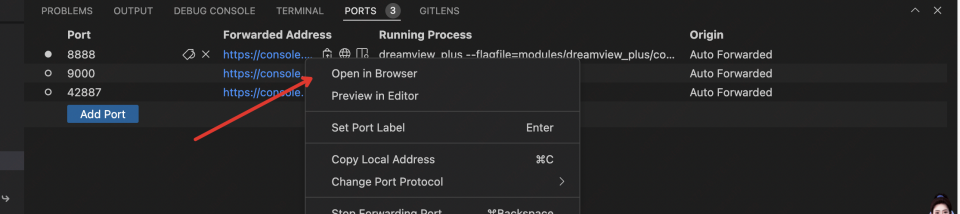
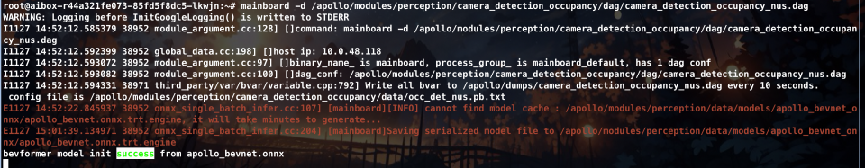
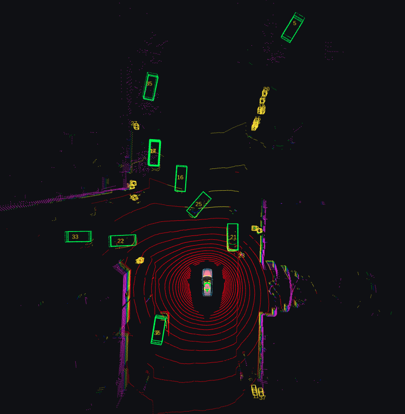
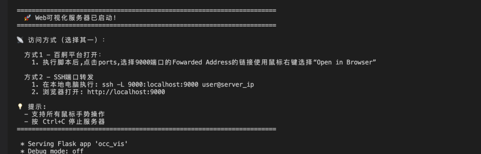
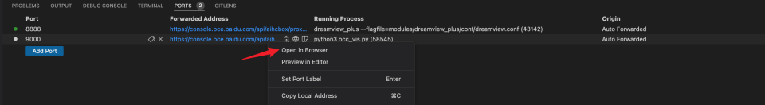
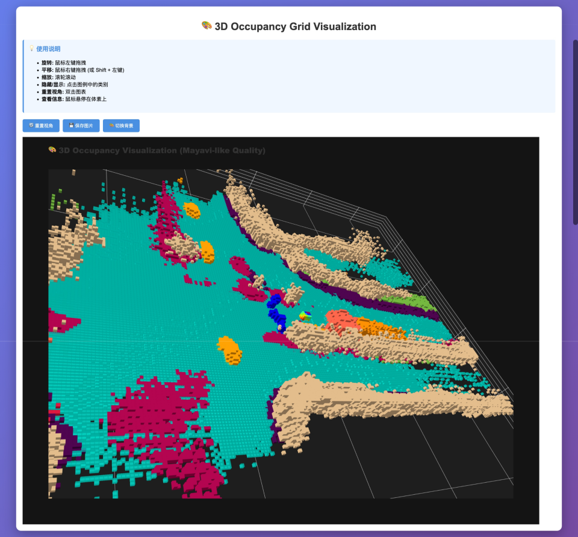
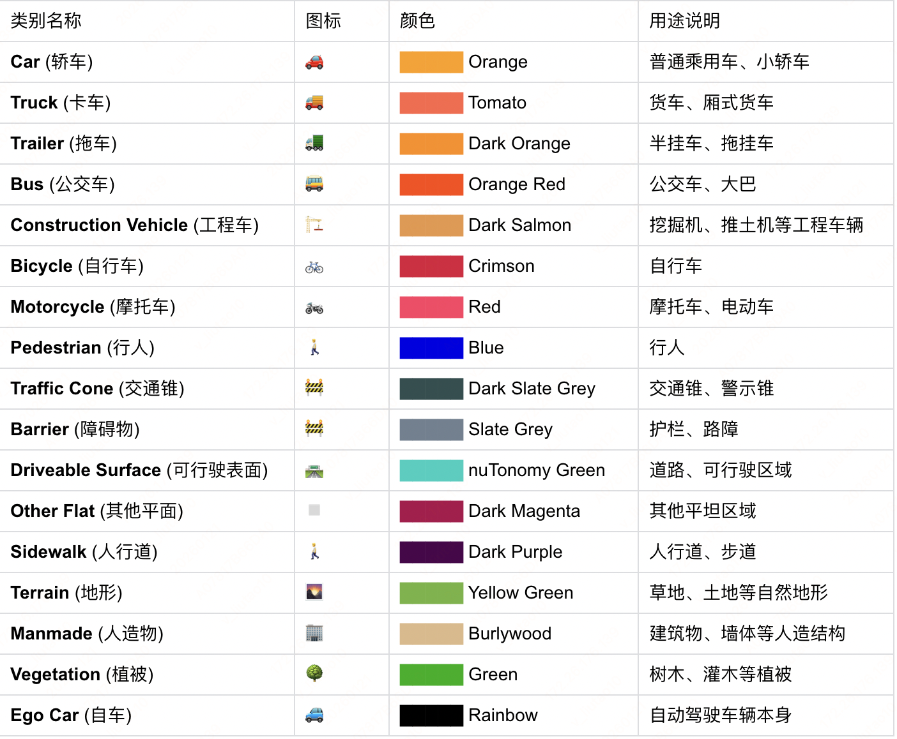

# 使用说明
## 创建与登录开发机
根据部署环境要求成功创建开发机后，点击登录开发机，进入开发机webIDE，并打开VScode中的terminal


* 代码保存路径：/apollo_workspace
* 数据默认挂载路径：/mnt/pfs/nuscenes_data/bev_data/nuscenes

## Apollo环境中替换自己训练的ONNX文件
如果要替换为自己训练的onnx文件，则需要替换掉目录下的onnx文件

```
sudo rm -rf /apollo/modules/perception/data/models/apollo_bevnet_onnx/apollo_bevnet.onnx
sudo cp your-own-onnx.onnx /apollo/modules/perception/data/models/apollo_bevnet_onnx/apollo_bevnet.onnx
```


## Apollo中运行纯视觉模型
准备record数据

通过下面链接可以下载nuscenes record：

|id|link|
|-|-|
|6f83169d067343658251f72e1dd17dbc|[http://apollo-perception.bj.bcebos.com/nuscenes_occ_records/6f83169d067343658251f72e1dd17dbc.record?authorization=bce-auth-v1%2FALTAKr8RyUUttStVHwGaOsvJyP%2F2024-12-02T08%3A12%3A56Z%2F-1%2Fhost%2F15500778f03ba45f19e6a7818b3af88952a739cbd53761f166d8bd542347821b](http://apollo-perception.bj.bcebos.com/nuscenes_occ_records/6f83169d067343658251f72e1dd17dbc.record?authorization=bce-auth-v1%2FALTAKr8RyUUttStVHwGaOsvJyP%2F2024-12-02T08%3A12%3A56Z%2F-1%2Fhost%2F15500778f03ba45f19e6a7818b3af88952a739cbd53761f166d8bd542347821b)|
|2fc3753772e241f2ab2cd16a784cc680|[http://apollo-perception.bj.bcebos.com/nuscenes_occ_records/2fc3753772e241f2ab2cd16a784cc680.record?authorization=bce-auth-v1%2FALTAKr8RyUUttStVHwGaOsvJyP%2F2024-12-02T08%3A11%3A30Z%2F-1%2Fhost%2Fb7b99869a804ed08c7f6804d8b724e15aebc3e1c13fde45b18b61e459b1b7ae5](http://apollo-perception.bj.bcebos.com/nuscenes_occ_records/2fc3753772e241f2ab2cd16a784cc680.record?authorization=bce-auth-v1%2FALTAKr8RyUUttStVHwGaOsvJyP%2F2024-12-02T08%3A11%3A30Z%2F-1%2Fhost%2Fb7b99869a804ed08c7f6804d8b724e15aebc3e1c13fde45b18b61e459b1b7ae5)|
|bebf5f5b2a674631ab5c88fd1aa9e87a|[http://apollo-perception.bj.bcebos.com/nuscenes_occ_records/bebf5f5b2a674631ab5c88fd1aa9e87a.record?authorization=bce-auth-v1%2FALTAKr8RyUUttStVHwGaOsvJyP%2F2024-12-02T08%3A13%3A18Z%2F-1%2Fhost%2F1c25a91e913f512b8f188dc6e54bd07ffcbb301e1be2d92a3cc7b686e1456d80](http://apollo-perception.bj.bcebos.com/nuscenes_occ_records/bebf5f5b2a674631ab5c88fd1aa9e87a.record?authorization=bce-auth-v1%2FALTAKr8RyUUttStVHwGaOsvJyP%2F2024-12-02T08%3A13%3A18Z%2F-1%2Fhost%2F1c25a91e913f512b8f188dc6e54bd07ffcbb301e1be2d92a3cc7b686e1456d80)|

选择车型环境使用,应用参数

```
aem profile use nuscenes_occ
```
打开dreamview_plus

```
aem bootstrap start --plus
```
网页显示dreamview_plus方式：

```
📡 访问方式（选择其一）：

  方式1 - 百舸平台打开：
    1. 执行脚本后,点击ports,选择8888端口的Fowarded Address的链接使用鼠标右键选择“Open in Browser”

  方式2 - SSH端口转发
    1. 在本地电脑执行: ssh -L 8888:localhost:8888 -p ssh映射端口 user@server_ip
    2. 浏览器打开: http://localhost:8888
```

终端启动transform dag文件

```
mainboard -d /apollo/modules/transform/dag/static_transform.dag
```


终端启动感知 dag文件

```
mainboard -d /apollo/modules/perception/camera_detection_occupancy/dag/camera_detection_occupancy_nus.dag
```


等待模型进行序列化，当终端给出如下日志时表示序列化完成，可进行下面的步骤


打开终端播放record包

```
cyber_recorder play -f 包名.record
```
随后就可以在dreamview_plus页面上看到目标检测结果


### 可视化occ结果
如果要查看occ结果，需要进行如下的步骤：

将配置occ_det_nus.pb.txt中save_occ_result设置为true，同时设置保存路径occ_save_path（默认路径为/apollo/data/occ_results）

#### Web端OCC可视化（支持远程访问）工具使用：
```
cd /apollo_workspace/bev_tools
python3 occ_vis.py
```
**备注:**

查看其他occ文件效果

修改occ_vis.py代码

```
 #代码行数，470行
       # 检查数据文件路径
    possible_paths = [
        "/apollo/data/occ_results/1535489308.678113.bin"
    ]
```

打开网页方式：

```
📡 访问方式（选择其一）：

  方式1 - 百舸平台打开：
    1. 执行脚本后,点击ports,选择9000端口的Fowarded Address的链接使用鼠标右键选择“Open in Browser”

  方式2 - SSH端口转发
    1. 在本地电脑执行: ssh -L 9000:localhost:9000 -p ssh映射端口 user@server_ip
    2. 浏览器打开: http://localhost:9000
```


 **Web端OCC可视化功能** ，支持远程实时访问与多维度场景分析。用户可通过浏览器访问服务端口（如localhost:9000），实现跨平台、跨网络的OCC渲染，无需依赖本地显示环境。该功能完整渲染**16类场景元素**（含车辆🚗、行人🚶、植被🌳等），并为每类元素提供专属视觉标识。支持交互式视角操作（360°旋转/平移/缩放）、视角重置及截图保存（PNG格式），显著提升调试效率，实现“启动服务→实时验证模型效果”的闭环流程。



**完整颜色映射表**

